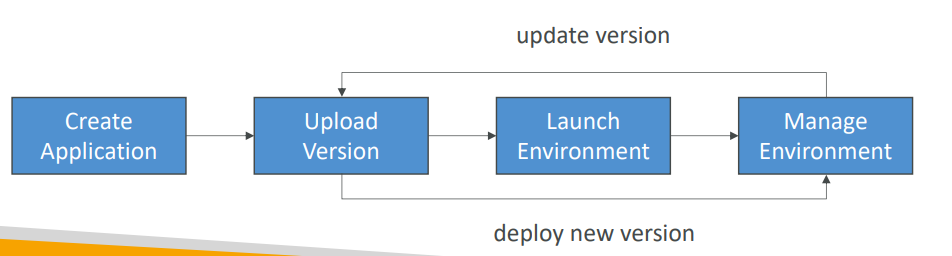
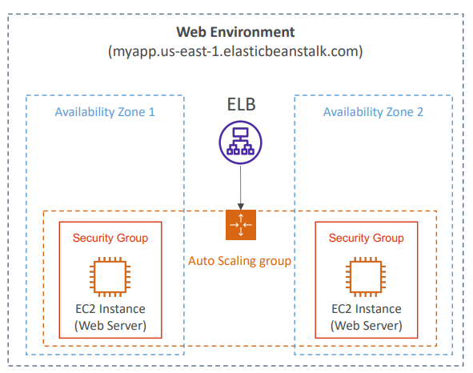
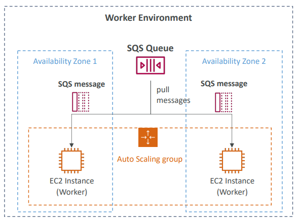
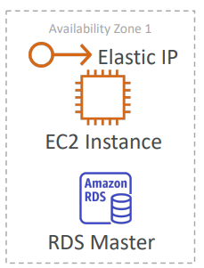
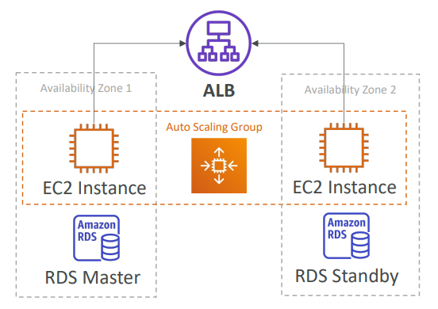
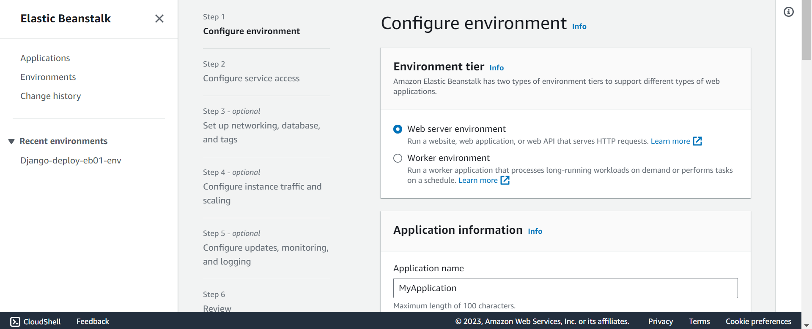
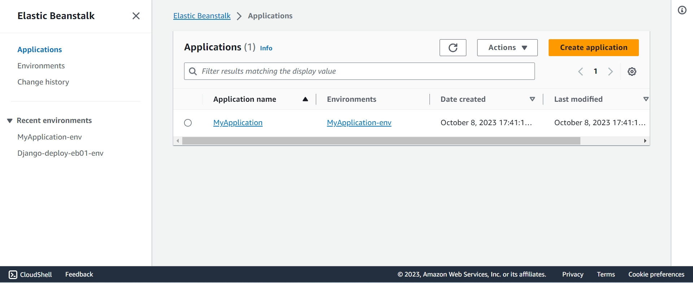

# SSA - Elastic Beanstalk

[Back](../../index.md)

- [SSA - Elastic Beanstalk](#ssa---elastic-beanstalk)
  - [`Elastic Beanstalk`](#elastic-beanstalk)
    - [Components](#components)
    - [Supported Platforms](#supported-platforms)
    - [Web Server Tier vs. Worker Tier](#web-server-tier-vs-worker-tier)
    - [Deployment Modes](#deployment-modes)
  - [Hands-on](#hands-on)

---

## `Elastic Beanstalk`

- `Elastic Beanstalk`

  - a developer centric view of **deploying** an application on AWS

- It uses all the component’s we’ve seen before: EC2, ASG, ELB, RDS, …
- Managed service
  - Automatically handles capacity provisioning, load balancing, scaling, application health monitoring, instance configuration, …
  - Just **the application code is the responsibility of the developer**
- We still have full control over the **configuration**
  - inluding AMI, Instance Type, network, database...
- Beanstalk is **free** but you **pay for the underlying instances**

---

### Components

- Application:

  - collection of Elastic Beanstalk components (environments, versions, configurations, …)

- Application Version:

  - an iteration of your application **code**

- Environment

  - Collection of AWS **resources** running an application version (only one application version at a time)

- Tiers:

  - Web **Server** Environment Tier & **Worker** Environment Tier
  - You can create multiple environments (dev, test, prod, …)

---

### Supported Platforms

- Go
- Java SE
- Java with Tomcat
- .NET Core on Linux
- .NET on Windows Server
- Node.js
- PHP
- Python
- Ruby
- Packer Builder
- Single Container Docker
- Multi-container Docker
- Preconfigured Docker
- If not supported, you can write your custom platform (advanced)

---

### Web Server Tier vs. Worker Tier

- Web Server Tier

- Worker Tier
  - Scale based on the number of SQS messages
  - Can push messages to SQS queue from another Web Server Tier

---

### Deployment Modes

- Single Instance
  - Great for dev
  - Cost less
  - Single Instance Mode will create **one EC2 instance** and **one Elastic IP**.

- High Availability with Load Balancer
  - Great for prod

---

## Hands-on

- All resources are created by `CloudFormation`, includes
  - EC2
  - Security group
  - Elastic IP
  - Auto Scaling groups

---

[TOP](#ssa---elastic-beanstalk)
