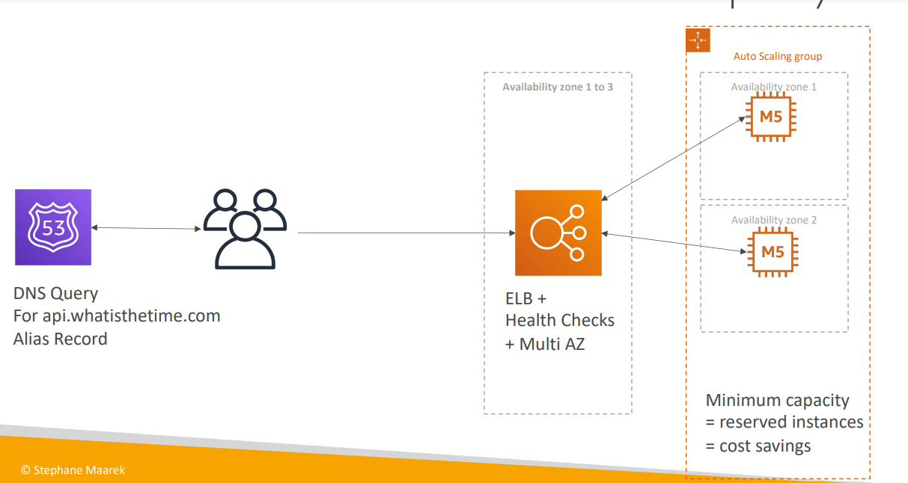
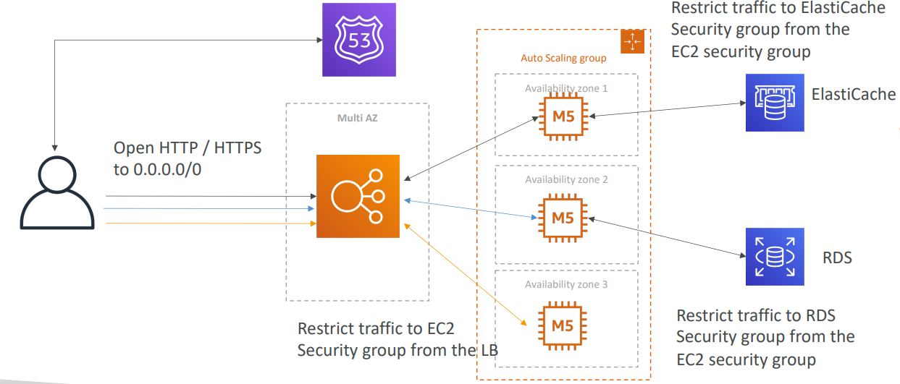
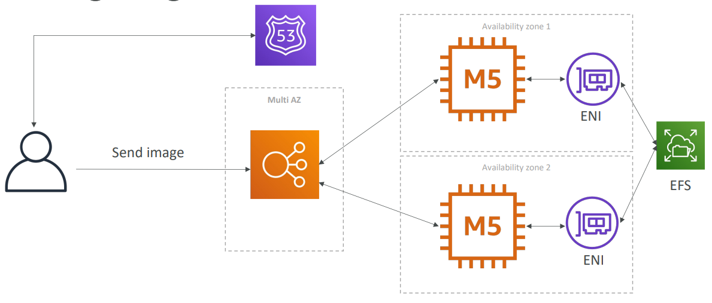
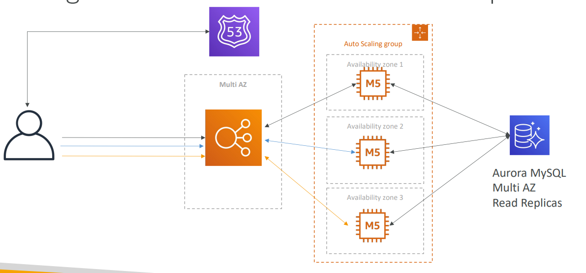

# SSA - Classic Solution Architecture

[Back](../../index.md)

- [SSA - Classic Solution Architecture](#ssa---classic-solution-architecture)
  - [WhatIsTheTime.com](#whatisthetimecom)
  - [MyClothes.com](#myclothescom)
  - [MyWordPress.com](#mywordpresscom)
  - [Instantiating Applications quickly](#instantiating-applications-quickly)

---

- 5 pillars for a well architected application:

  - costs,
  - performance,
  - reliability,
  - security,
  - operational excellence

- Considerations:
  - Public vs Private IP and EC2 instances
  - Elastic IP vs Route 53 vs Load Balancers
  - Route 53 TTL, A records and Alias Records
  - Maintaining EC2 instances manually vs Auto Scaling Groups
  - Multi AZ to survive disasters
  - ELB Health Checks
  - Security Group Rules

---

## WhatIsTheTime\.com

- Requirements

  - allows people to know what time it is
  - don’t need a database
  - want to fully scale vertically and horizontally, no downtime

- Solution:
  - Route53
    - provides users a uniform entry to the web application
  - Alias Record
    - instead of A type record, enable to set AWS resrources as target group
  - Load balancer
    - instead of Elastic IP, less cost
  - Health Checks
    - only return the healthy resources
    - failover, high availability
  - Multi AZ
    - failover, high availability
  - Auto Scalling Group
    - High Elasticity
  - Reserve instance
    - less cost.
  - Security Group
    - restrict EC2 traffic to ALB only.

---

## MyClothes.com

- Requirements
  - allows people to buy clothes online.
  - having hundreds of users at the same time
  - need to scale, maintain horizontal scalability and keep our web application as **stateless** as possible
    - When an application is **stateless**, **the server does not store data or other information about the client session**.
  - not lose their shopping cart
  - have their details (address, etc) in a database

- Application:

  - Web clients for storing cookies and making our web app stateless

- Route 53

  - single entry
  - Alias Record: top node can target AWS resources

- Load Balance

  - Multi AZ: availability
  - Health Checks

- EC2

  - auto scalling group: scalability
  - multi AZ: availability
  - Security Group: restrict traffic only to ALB

- ElasticCache:

  - store shopping cart data
  - store temporary session data, stateless
  - low lattency
  - cache data from RDS
  - instead of sticky session that might cause high demand on specific ec2.
  - Security Group: restrict traffic only to EC2

- RDS:
  - store address information
  - Read Replica: scalling read
  - Security Group: restrict traffic only to EC2
  - Multi AZ: disaster revocery

---

## MyWordPress\.com

- Requirements:
  - create a fully scalable WordPress website
  - website to access and correctly display picture uploads
  - user data, and the blog content should be stored in a MySQL database.

- Route53

  - singel DNS entry
  - Alias Record: target ALB

- Load Balancer:

  - Multi AZ: high availability
  - health checks: failover

- EC2

  - Multi AZ: disaster recovery
  - Auto Scalling Group: scalibility

- EFS:

  - store images
  - insteal of EBS, which costly and mount only one ec2
  - multiple mount ec2
  - cost less

- Aurora:
  - mysql compatible
  - multi AZ: disaster recovery
  - read replica: read preformance

---

## Instantiating Applications quickly

- When launching a full stack (EC2, EBS, RDS), it can take time to:

  - Install applications
  - Insert initial (or recovery) data
  - Configure everything
  - Launch the application

- EC2 Instances:

  - Use a **Golden AMI**:
    - Install your applications, OS **dependencies** etc.. beforehand and launch your EC2 instance from the Golden AMI
  - Bootstrap using **User Data**:
    - For **dynamic** configuration, use User Data scripts
  - **Hybrid**:
    - mix Golden AMI and User Data (Elastic Beanstalk)

- RDS Databases:

  - Restore from a **snapshot**: the database will have schemas and data ready!

- EBS Volumes:
  - Restore from a **snapshot**: the disk will already be formatted and have data!

---

[TOP](#ssa---classic-solution-architecture)
