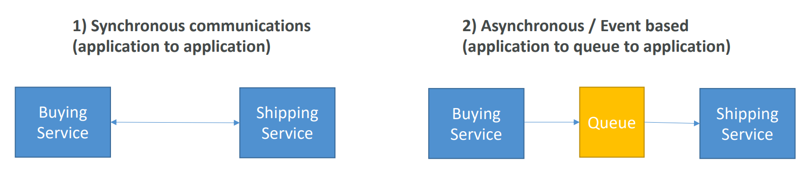

# AWS - Messaging and Integration

[Back](../../index.md)

- [AWS - Messaging and Integration](#aws---messaging-and-integration)
  - [Synchronous vs Asynchronous](#synchronous-vs-asynchronous)
  - [`SQS` vs `SNS` vs `Kinesis`](#sqs-vs-sns-vs-kinesis)

---

## Synchronous vs Asynchronous

- When we start deploying multiple applications, they will inevitably need to communicate with one another
- There are two patterns of application communication

- Synchronous between applications can be problematic if there are sudden spikes of traffic

  - What if you need to suddenly encode 1000 videos but usually it’s 10?

- In that case, it’s better to decouple your applications,

  - using `SQS`: **queue** model
  - using `SNS`: **pub/sub** model
  - using `Kinesis`: **real-time streaming** model

- These services can s**cale independently** from our application!

---

## `SQS` vs `SNS` vs `Kinesis`

- `SQS`:

  - **Consumer** **“pull** data”
  - Data is **deleted** after being consumed
  - Can have **as many workers** (consumers) as we want
  - No need to provision **throughput** (**unlimited**)
  - **Ordering** guarantees only on `FIFO` queues
  - Individual message **delay** capability

---

- `SNS`:

  - **Push** data to many subscribers
  - Up to **12**,500,000 **subscribers**
  - Data is **not persisted** (**lost if not delivered**)
  - **Pub/Sub**
  - Up to **100**,000 **topics**
  - No need to provision **throughput**
  - Integrates with `SQS` for `fan-out architecture` pattern
  - FIFO capability for `SQS FIFO`

---

- `Kinesis`:
  - Standard: **pull** data
    - 2 MB per shard
  - Enhanced-fan out: **push** data
    - 2 MB per shard per consumer
  - Possibility to **replay** data
  - Meant for **real-time** `big data`, **analytics** and `ETL`
  - **Ordering** at the **shard** level
  - Data **expires** after X days (Data store)
  - **Provisioned** mode or **ondemand** capacity mode

---

[TOP](#aws---messaging-and-integration)
