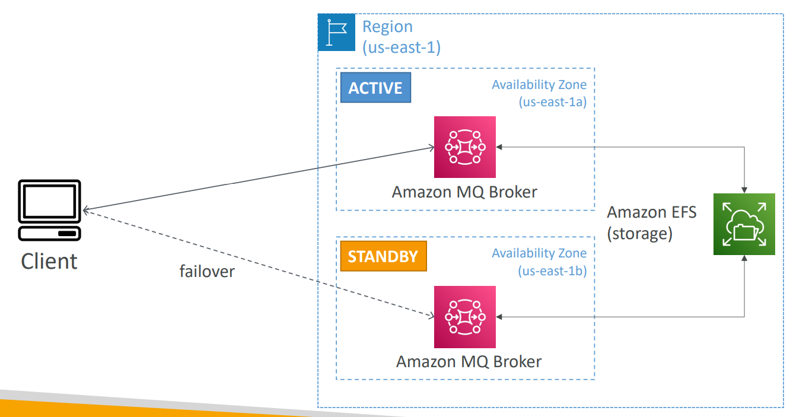

# AWS Decouple - Amazon MQ

[Back](../../index.md)

- [AWS Decouple - Amazon MQ](#aws-decouple---amazon-mq)
  - [`Amazon MQ`: On-premises, SQS+SNS](#amazon-mq-on-premises-sqssns)
    - [Hight Availability](#hight-availability)

---

## `Amazon MQ`: On-premises, SQS+SNS

- SQS, SNS are “cloud-native” services: proprietary protocols from AWS
- Traditional applications running from **on-premises** may use open **protocols** such as: `MQTT`, `AMQP`, `STOMP`, `Openwire`, `WSS`

- `Amazon MQ`

  - used to **migrate** application from **on-premises** to the cloud, instead of re-engineering the application to use `SQS` and `SNS`
  - a managed message broker service for
    - `RabbitMQ`, `ACTIVEMQ`

- Amazon MQ doesn’t “scale” as much as SQS / SNS
- Amazon MQ runs **on servers**, can run in **Multi-AZ** with **failover**
- Amazon MQ has both **queue feature** (~SQS) and **topic features** (~SNS)

---

### Hight Availability

- On-premises client talks to MQ Broker in Active Zone.
- Has standby in another zone.
- Has EFS as backup
- Once failover, EFS mount to standby.
- Client talks to standby.

---

[TOP](#aws-decouple---amazon-mq)
