# AWS - SQS

[Back](../../index.md)

- [AWS - SQS](#aws---sqs)
  - [`Amazon SQS`](#amazon-sqs)
  - [Architecture](#architecture)
    - [Producing Messages](#producing-messages)
    - [Consuming Messages](#consuming-messages)
    - [Multiple EC2 Instances Consumers](#multiple-ec2-instances-consumers)
  - [Standard Queue](#standard-queue)
    - [Hands-on](#hands-on)
  - [FIFO Queue](#fifo-queue)
    - [Grouping Message](#grouping-message)
    - [Hands-on](#hands-on-1)
  - [Security](#security)
  - [Message Visibility Timeout](#message-visibility-timeout)
  - [Long Polling](#long-polling)
  - [Use Case](#use-case)
    - [Integrate with Auto Scaling Group(ASG) 常考](#integrate-with-auto-scaling-groupasg-常考)
    - [SQS as a buffer to database writes](#sqs-as-a-buffer-to-database-writes)
    - [Decouple between application tiers 经典应用和题目](#decouple-between-application-tiers-经典应用和题目)

---

## `Amazon SQS`

- `Amazon SQS(Simple Queue Service)`

  - a web service that enables web service applications to quickly and reliably queue messages that one component in the application generates to be consumed by another component where a queue is a temporary repository for messages that are awaiting processing.

- SQS **scales automatically**.

---

## Architecture

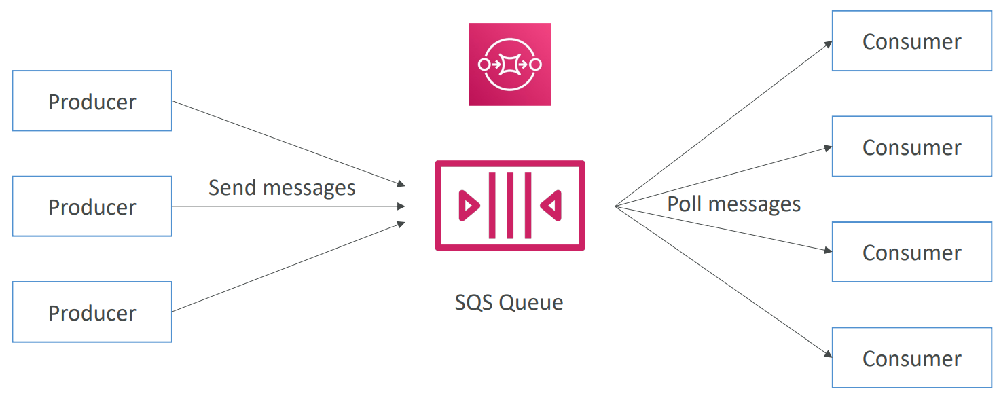

---

### Producing Messages

- **Produced** to `SQS` **using the SDK** (`SendMessage API`)
- The message is **persisted** in SQS **until a consumer deletes it**
- Message **retention**:

  - default `4` days, up to `14` days

- **Example**: send an order to be processed

  - Order id
  - Customer id
  - Any attributes you want

- SQS standard: **unlimited throughput**

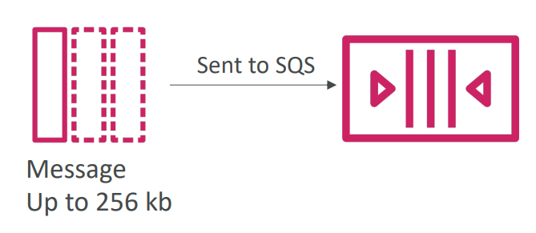

---

### Consuming Messages

- Consumers

  - running on EC2 instances,
  - servers,
  - or AWS Lambda
  - …

- **Poll** SQS for messages (receive up to `10` messages at a time)
- Process the messages

  - ie: insert the message into an RDS database

- **Delete** the messages using the `DeleteMessage API`

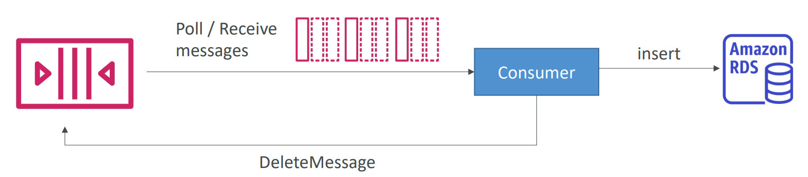

---

### Multiple EC2 Instances Consumers

- Consumers **receive and process** messages **in parallel**
- At least once delivery
  - if one of istance does not process fast enough, the message can be processed by other instance.
- Best-effort message ordering
  - 因为多个实例处理, 所以未必是完全按顺序. 较忙的实例会造成处理延迟. 但总体上是按顺序.
- Consumers delete messages after processing them
  - if not delete, other instance will process.
- We can scale consumers horizontally to improve throughput of processing
  - use EC2 ASG

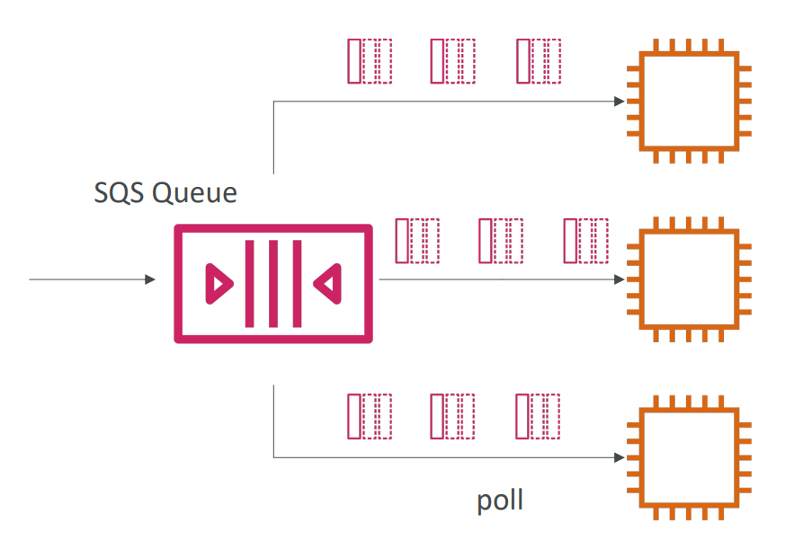

---

## Standard Queue

- Oldest offering (over 10 years old)
- **Fully managed** service, used to decouple applications

- **Attributes**:

  - **Unlimited throughput**, unlimited number of messages in queue
  - Default **retention** of messages:
    - `4` days, maximum of `14` days
  - **Low latency** (<10 ms on publish and receive)
  - Limitation of `256KB` per message sent

- Can have **duplicate messages** (at least once delivery, occasionally)
- Can have out of order messages (best effort **ordering**)

---

### Hands-on

- Create SQS

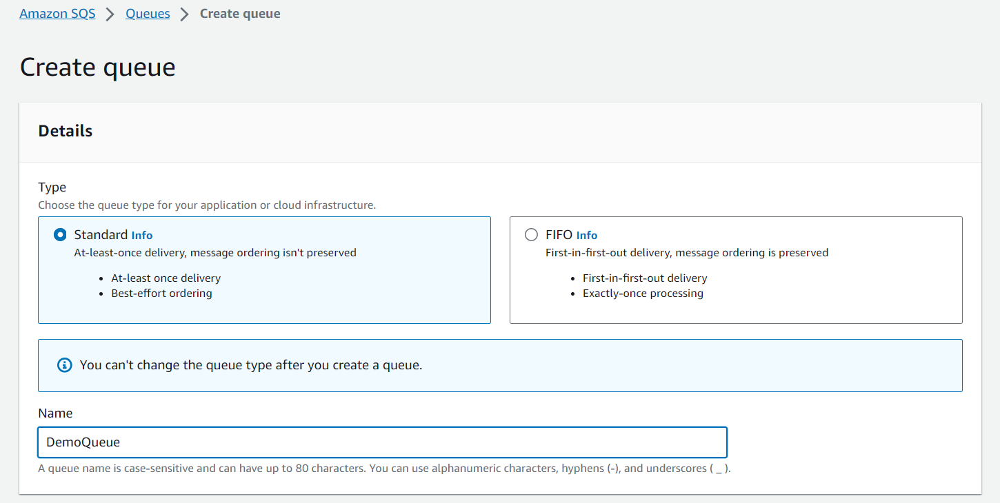

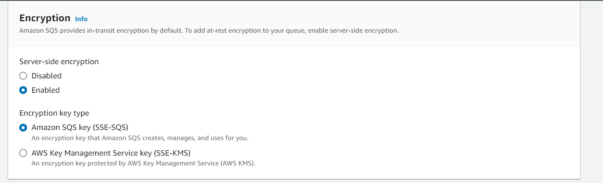

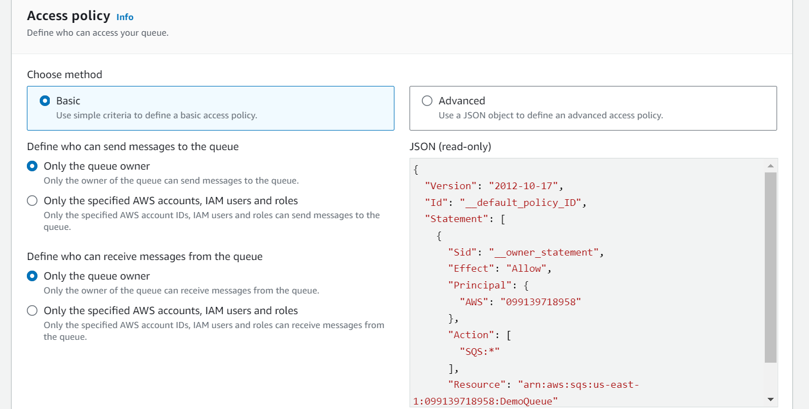

- Send and receive messages

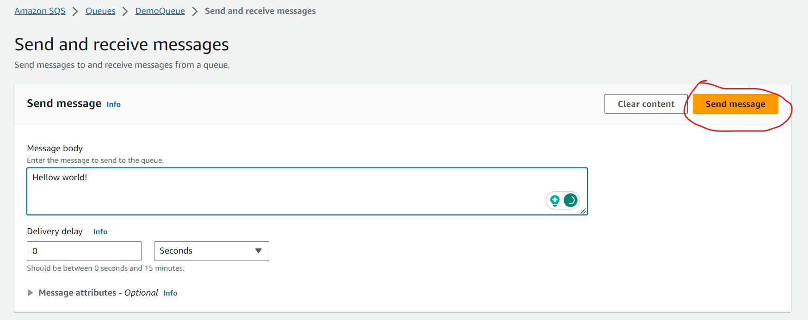

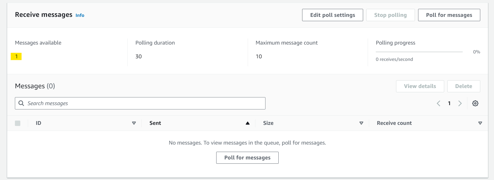

- Poll messages

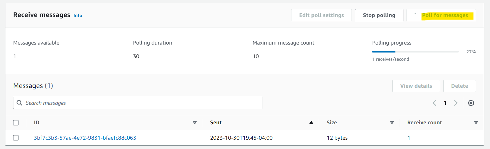

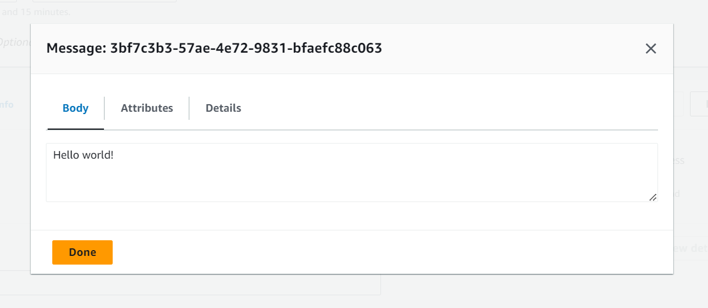

- Delete message

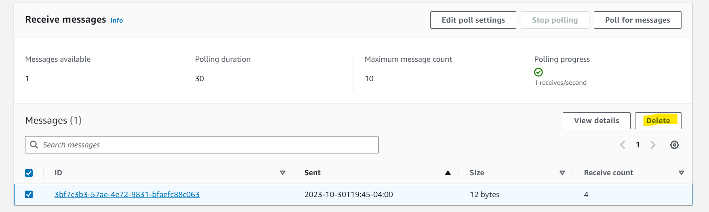

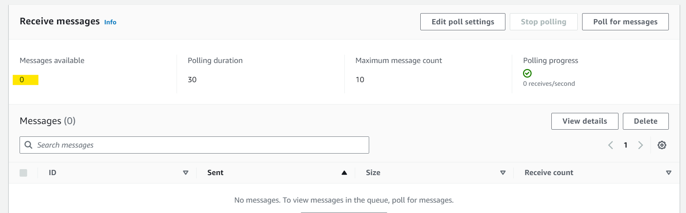

---

## FIFO Queue

- `FIFO` = First In First Out (**ordering** of messages in the queue)

- **Limited** throughput:
  - `300` msg/s without batching, `3000` msg/s with
- **Exactly-once send** capability (by **removing duplicates**)
- Messages are processed **in order** by the consumer

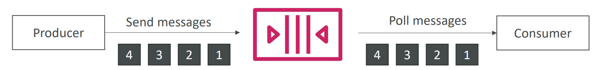

- `SQS FIFO (First-In-First-Out) Queues` have all the capabilities of the SQS Standard Queue, plus the following two features.
  - First, The **order** in which messages are sent and received a**re strictly preserved** and a message is delivered once and remains available **until a consumer process and deletes it**.
  - Second, **duplicated messages** are **not introduced** into the queue.

---

### Grouping Message

- For `SQS standard`, there is **no ordering**.
- For `SQS FIFO`, if you don’t use a `Group ID`, messages are consumed **in the order they are sent**, with only one consumer

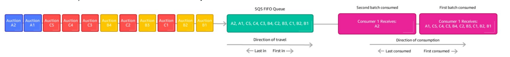

- You want to scale the number of consumers, but you want messages to be **“grouped”** when they are related to each other
- Then you use a `Group ID` (similar to `Partition Key` in `Kinesis`)

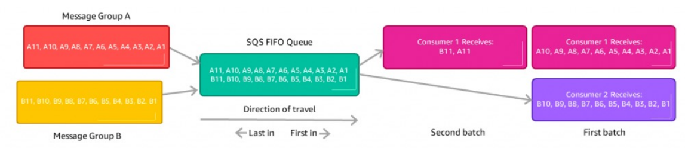

- Delete the existing standard queue and recreate it as a FIFO (First-In-First-Out) queue

- Make sure that the name of the FIFO (First-In-First-Out) queue ends with the .fifo suffix

- Make sure that the throughput for the target FIFO (First-In-First-Out) queue does not exceed 3,000 messages per second

---

### Hands-on

- Create FIFO Queue

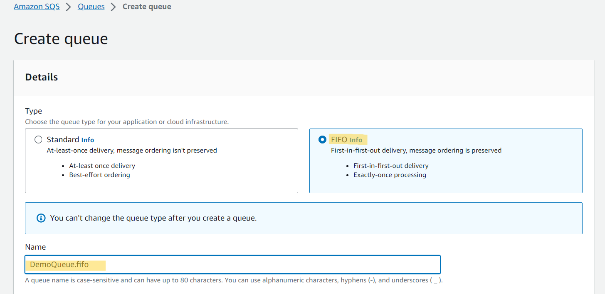

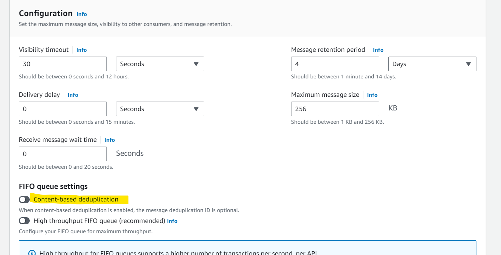

- Send message

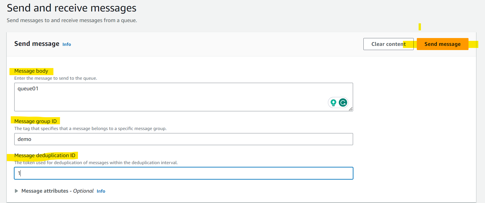

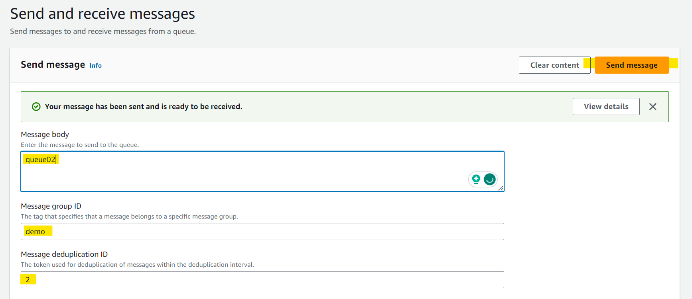

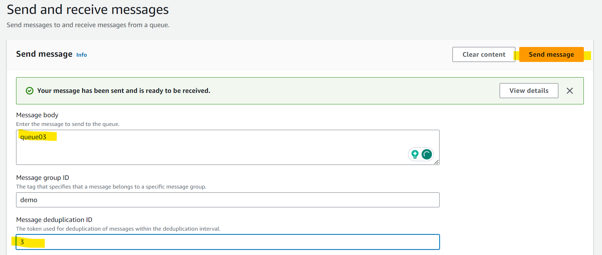

- Process message
  - Messages are in order.

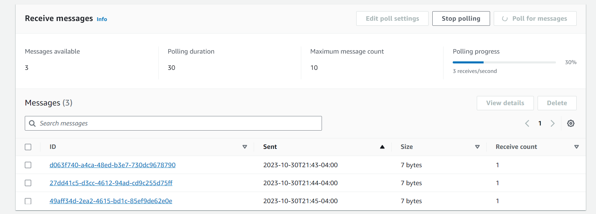

---

## Security

- **Encryption**:

  - **In-flight** encryption using `HTTPS API`
  - **At-rest** encryption using `KMS keys`
  - **Client-side** encryption the client do it themselves, if the client wants to perform encryption/decryption itself

- **Access Controls**:

  - `IAM policies` to regulate access to the `SQS API`

- **SQS Access Policies** (similar to S3 bucket policies)
  - Useful for cross-account access to SQS queues
  - Useful for allowing other services (SNS, S3…) to write to an SQS queue

---

## Message Visibility Timeout

- After a message is **polled** by a consumer, it becomes **invisible** to other consumers
- By default, the “message **visibility timeout**” is **`30` seconds**
- That means the message has 30 seconds to be processed
- **After** the message **visibility timeout** is over, the message is “visible” in SQS

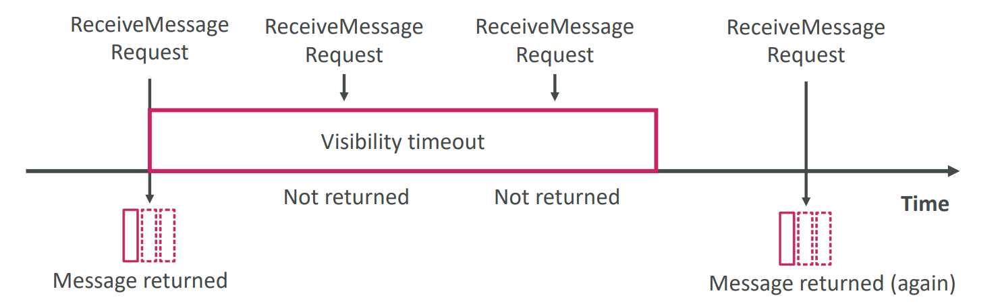

- If a message is **not processed** within the visibility timeout, it will be **processed twice**
- A consumer could call the `ChangeMessageVisibility API` to get more time
- If visibility timeout is **high** (hours), and consumer crashes, **re-processing will take time**
- If visibility timeout is **too low** (seconds), we may get **duplicates**

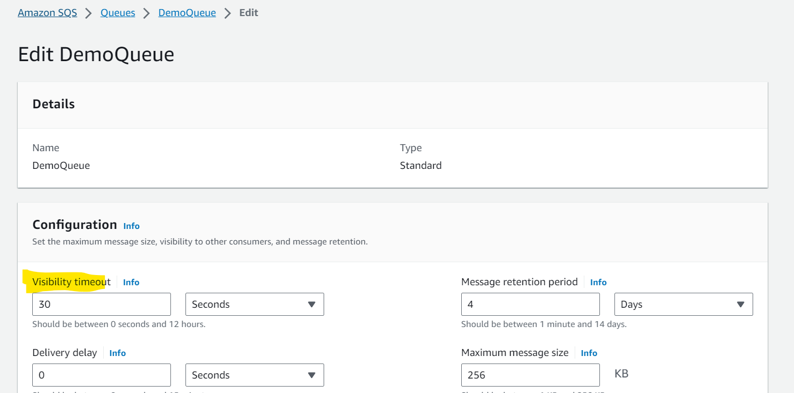

- 单一 message 多次 process 的原因:

  - process time > Visibility Timeout
  - 解决方法, 延长 Visibility Timeout.

- 考题解析:
  - `SQS Visibility Timeout` is a period of time during which Amazon SQS **prevents other consumers from receiving and processing** the message again. In Visibility Timeout, a message is hidden only after it is consumed from the queue. **Increasing** the Visibility Timeout **gives more time to the consumer to process** the message and **prevent duplicate reading of the message**. (default: 30 sec., min.: 0 sec., max.: 12 hours)

---

## Long Polling

- `Long Polling`

  - When a consumer requests messages from the queue, it can optionally **“wait” for messages to arrive if there are none** in the queue
  - **decreases the number of API calls** made to SQS while **increasing the efficiency** and **reducing latency** of your application

- The wait time can be between `1` sec to `20` sec (20 sec preferable)
- Long Polling is **preferable** to Short Polling
- Long polling can be **enabled** at the queue level or at the `API` level using `WaitTimeSeconds`

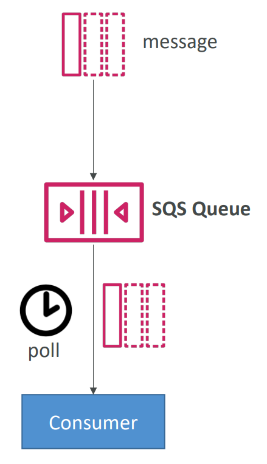

---

## Use Case

### Integrate with Auto Scaling Group(ASG) 常考

- Use `CloudWatch Metric – Queue Length(ApproximateNumberOfMessages)` to monitor SQS.
  - When reach alarm number, CloudWatch Alarm will trigger ASG.

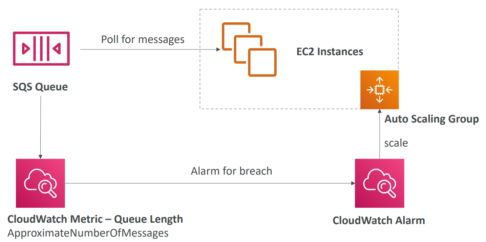

---

### SQS as a buffer to database writes

- Problem:
  - when request burst, transaction data might lose.

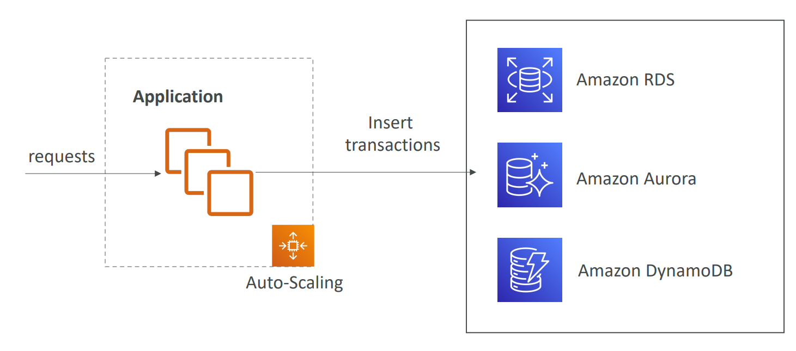

- Solution:
  - Transaction data won't lose, as sqs has unlimited throughput, unlimited number of messages in queue

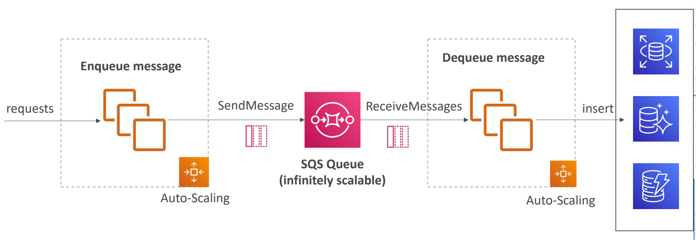

- Sample:
  - An e-commerce company is preparing for a big marketing promotion that will bring millions of transactions. Their website is hosted on EC2 instances in an Auto Scaling Group and they are using Amazon Aurora as their database. The Aurora database has a bottleneck and a lot of transactions have been failed in the last promotion they have made as they had a lot of transaction and the Aurora database wasn’t prepared to handle these too many transactions. What do you recommend to handle those transactions and prevent any failed transactions?
  - SQS buffer

---

### Decouple between application tiers 经典应用和题目

- Front end and Back end scales separately.
  - Useful for **decoupling**, a **sudden spike load**, **timeout** that needs to **scale up very fast**.

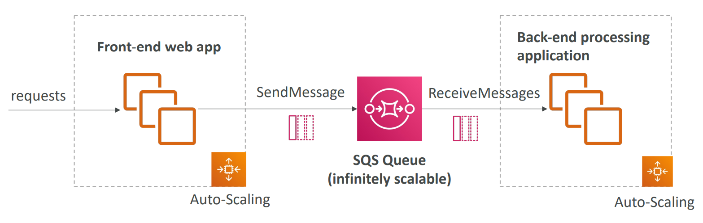

---

[TOP](#aws---sqs)
