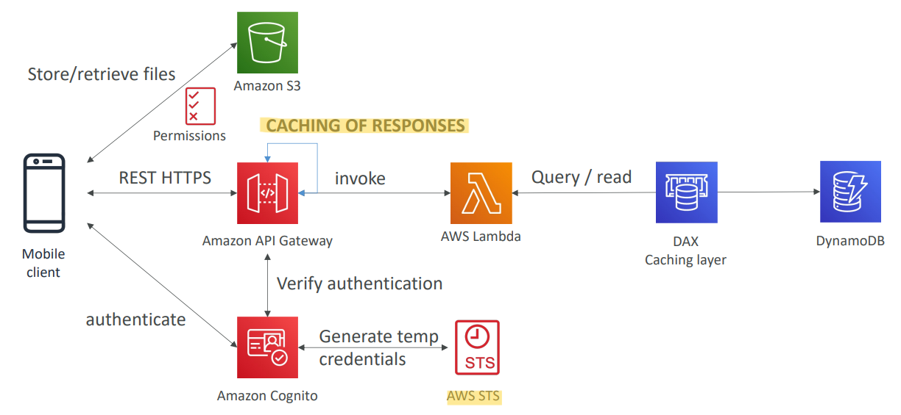
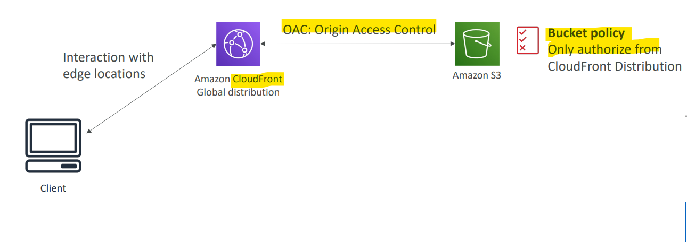
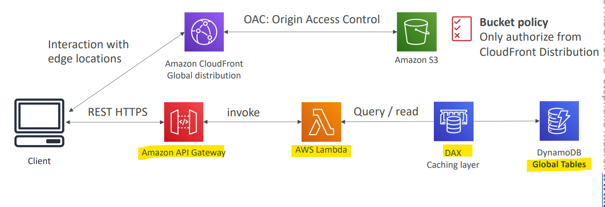
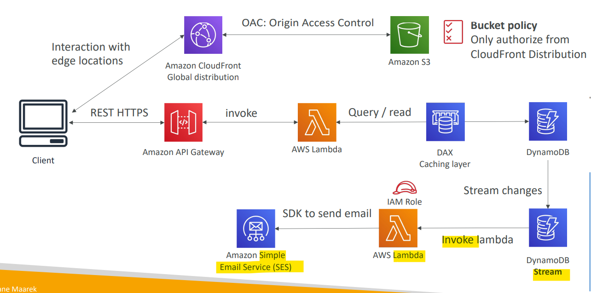
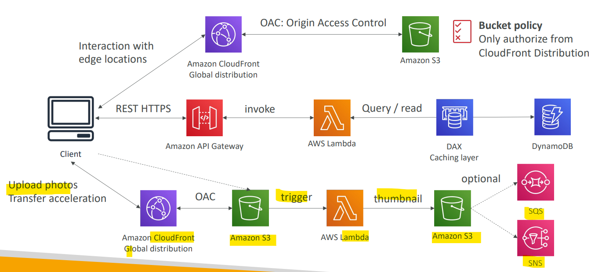
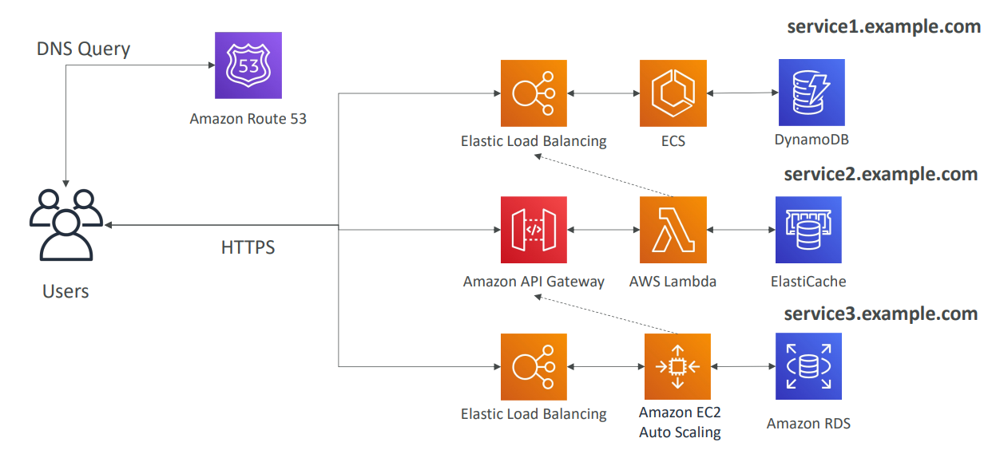
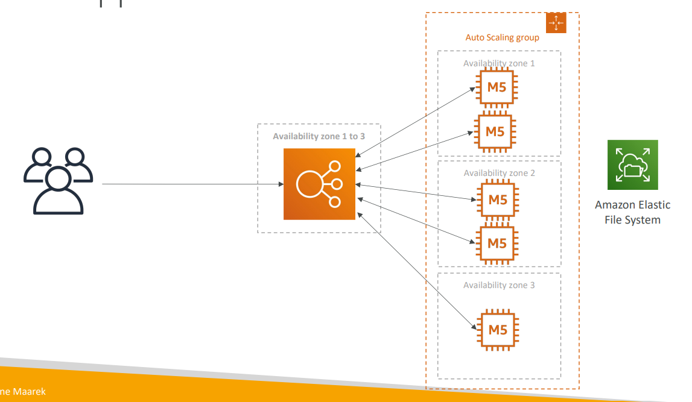
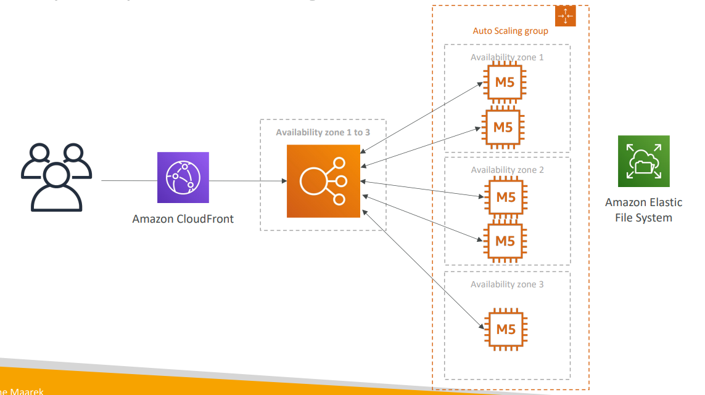

# AWS - Serverless Architectures

[Back](../../index.md)

- [AWS - Serverless Architectures](#aws---serverless-architectures)
  - [Mobile application: MyTodoList](#mobile-application-mytodolist)
  - [Serverless hosted website: MyBlog.com](#serverless-hosted-website-myblogcom)
  - [Micro Services architecture](#micro-services-architecture)
  - [Software updates offloading](#software-updates-offloading)

---

## Mobile application: MyTodoList

- Requirement: We want to create a mobile application with the following requirements
  - Expose as `REST API` with HTTPS (API Gateway)
  - Serverless architecture
  - Users should be able to directly interact with their own folder in S3 (S3)
  - Users should authenticate through a managed serverless service (Conigto)
  - The users can write and read to-dos, but they mostly read them (DAX)
  - The database should scale, and have some high read throughput (Dynamo)

- Summary:
  - Serverless REST API: HTTPS, `API Gateway`, `Lambda`, `DynamoDB`
  - Using `Cognito` to generate temporary credentials with `STS` to access S3 bucket with restricted **policy**. App users can directly access AWS resources this way. Pattern can be applied to DynamoDB, Lambda…
  - **Caching** the reads on DynamoDB using `DAX`
  - **Caching** the `REST requests` at the `API Gateway` level
  - Security for **authentication** and **authorization** with `Cognito`, `STS(Security token service)`

---

## Serverless hosted website: MyBlog\.com

- Requirement:

  - This website should **scale globally** (CloudeFront)
  - Blogs are rarely written, but **often read**
  - Some of the website is purely **static files**, the rest is a **dynamic REST API** (S3 static web host, API gateway)
  - Caching must be implement where possible (API Gateway cached response)
  - Any new users that subscribes should receive a welcome email (DynamoDB, lambda)
  - Any photo uploaded to the blog should have a thumbnail generated (S3, lambda)

- Serving static content, globally, securely

- a public serverless REST API + DynamoDB Global Tables

- Welcome email flow

- Thumbnail Generation flow

- Summary
  - We’ve seen **static content** being distributed using `CloudFront` with `S3`
  - The **REST API** was serverless, didn’t need Cognito because public
  - We leveraged a `Global DynamoDB table` to serve the data **globally**
  - (we could have used `Aurora Global Database`)
  - We enabled `DynamoDB streams` to trigger a Lambda function
  - The `lambda` function had an `IAM role `which could use `SES`
  - `SES` (Simple Email Service) was used to send **emails** in a serverless way
  - `S3` can trigger `SQS` / `SNS` / `Lambda` to **notify** of events

---

## Micro Services architecture

- Requirement:
  - Many services interact with each other directly using a `REST API`
  - Each architecture for each micro service may vary in form and shape
  - We want a micro-service architecture so we can have a leaner development lifecycle for each service

- Summary:

  - You are free to design each micro-service the way you want
  - Patterns:
    - **Synchronous patterns**: `API Gateway`, `Load Balancers`
    - **Asynchronous patterns**: `SQS`, `Kinesis`, `SNS`, `Lambda triggers (S3)`

- **Challenges** with micro-services:

  - **repeated overhead** for creating each new microservice,
  - issues with optimizing server density/**utilization**
  - complexity of running **multiple versions** of multiple microservices simultaneously
  - proliferation of **client-side code** requirements to integrate with many separate services.

- Some of the challenges are **solved** by Serverless patterns:
  - API Gateway, Lambda **scale automatically** and you pay per usage
  - You can easily **clone API**, **reproduce environments**
  - Generated **client SDK** through Swagger integration for the API Gateway

---

## Software updates offloading

- Req:

  - We have an application running on EC2, that distributes software updates once in a while
  - When a new software update is out, we get a lot of request and the content is distributed in mass over the network. It’s very costly
  - We don’t want to change our application, but want to optimize our cost and CPU, how can we do it?

- current state

- Solution

- Why CloudFront?

  - **No changes** to architecture
  - Will **cache software update files** at the edge
  - **Software update** files are not dynamic, they’re **static** (never changing)
  - Our EC2 instances aren’t serverless
  - But `CloudFront` is, and will scale for us
  - Our ASG will not scale as much, and we’ll save tremendously in EC2
  - We’ll also save in availability, network bandwidth cost, etc
  - Easy way to make an existing application more scalable and cheaper!

- 注:

  - 需求意思是 ec2 负责分发软件更新, 当新版本更新需要分发时,有巨量请求, 造成 ASG 自动 scale, 提高费用
  - 解决方法, 使用 CloudFront.
    - 软件更新是静态
    - cloudfront is serverless
    - cloudfront is auto scaling, 无需 asg, 即无需增加费用.
    - 添加 cloudfront 无需修改现架构.

- Sample:
  - You are running a photo-sharing website where your images are downloaded from all over the world. **Every month** you publish a master pack of beautiful mountain images that are **over 15 GB** in size. The content is currently hosted on an Elastic File System (EFS) file system and distributed by an Application Load Balancer and a set of EC2 instances. Each month, you are **experiencing very high traffic which increases the load** on your EC2 instances and **increases network costs.** What do you recommend to reduce EC2 load and network costs **without refactoring your website**?
  - `Amazon CloudFront` is a fast content delivery network (CDN) service that securely delivers data, videos, applications, and APIs to customers globally with low latency, high transfer speeds. **Amazon CloudFront can be used in front of an Application Load Balancer.**

---

[TOP](#aws---serverless-architectures)
