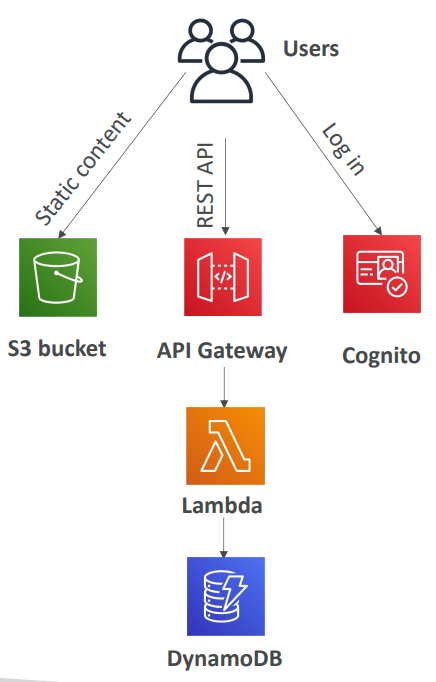
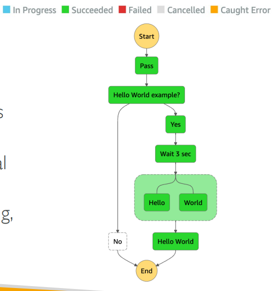

# AWS - Serverless

[Back](../../index.md)

- [AWS - Serverless](#aws---serverless)
  - [Serverless](#serverless)
  - [Serverless in AWS](#serverless-in-aws)
  - [`AWS Step Functions`](#aws-step-functions)

---

## Serverless

- `Serverless`

  - Serverless is a new paradigm in which the developers **don’t have to manage servers** anymore…
  - They just **deploy code**
  - They just **deploy… functions** !

- `Serverless` does not mean there are no servers…

  - it means you **just don’t manage / provision / see** them

- Initially... Serverless == FaaS (Function as a Service)
- Serverless was pioneered by AWS Lambda but now also includes anything that’s managed: “databases, messaging, storage, etc.”

---

## Serverless in AWS

- **Container**

  - Fargate

- **DB**

  - **SQL**: Aurora Serverless
  - **NoSQL**: DynamoDB

- **Storage**

  - Amazon S3

- **Network**

  - AWS API Gateway

- **Function**

  - AWS Lambda

- **Integrate**

  - AWS SNS & SQS
  - AWS Kinesis Data Firehose

- **Authentication**

  - AWS Cognito

- **Visual workflow**
  - Step Functions

- Sample:
  - The following AWS services have an out of the box caching feature, EXCEPT .................
    - Lambda
    - API-cache response, Dynamo-dax
  - You have a lot of static files stored in an S3 bucket that you want to **distribute globally** to your users. Which AWS service should you use?
    - Amazon `CloudFront` is a fast content delivery network `(CDN)` service that securely delivers data, videos, applications, and APIs to customers globally with low latency, high transfer speeds. This is a perfect use case for Amazon CloudFront.

---

## `AWS Step Functions`

- Build **serverless visual workflow** to orchestrate your `Lambda functions`
- Features: sequence, parallel, conditions, timeouts, error handling, …
- Can **integrate** with `EC2`, `ECS`, On-premises servers, `API Gateway`, `SQS queues`, etc …
- Possibility of implementing **human approval feature**
- Use cases:
  - order fulfillment, data processing, web applications, any workflow

- Sample:
  - Which AWS service allows you to build Serverless **workflows** using AWS services (e.g., Lambda) and **supports human approval**?
    - AWS Step Functions

---

[TOP](#aws---serverless)
