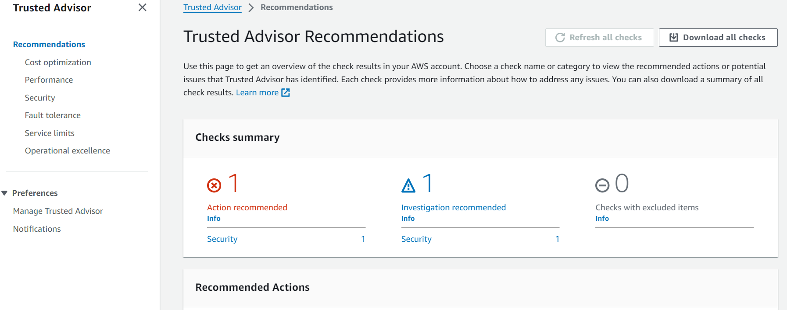
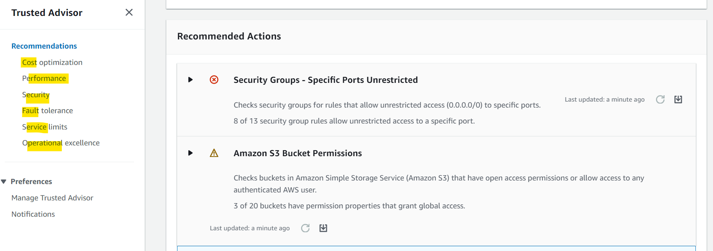

# AWS - Trusted Advisor

[Back](../../index.md)

- [AWS - Trusted Advisor](#aws---trusted-advisor)
  - [Trusted Advisor](#trusted-advisor)
    - [Support Plans (背)](#support-plans-背)

---

## Trusted Advisor

- `Trusted Advisor`

  - Analyze your AWS accounts and provides
  - high level **AWS account assessment**
    - passing or not passing

- Features:

  - No need to install anything
  - recommendation on 5 categories(背)

    - **Cost** optimization
    - **Performance**
    - **Security**
    - **Fault** tolerance
    - Service **limits**

- Sample:
  - Which AWS Service **analyzes your AWS account** and gives **recommendations** for cost optimization, performance, security, fault tolerance, and service limits?
    - Trusted Advisor
    - AWS Trusted Advisor provides recommendations that help you follow AWS best practices. It evaluates your account by using checks. These checks identify ways to optimize your AWS infrastructure, improve security and performance, reduce costs, and monitor service quotas.

---

### Support Plans (背)

- **7 CORE CHECKS** (**Basic** & **Developer** Support plan)

  - `S3` Bucket Permissions
  - `Security Groups` – Specific Ports Unrestricted
  - `IAM` Use (one IAM user minimum)
  - `MFA` on Root Account
  - `EBS` Public Snapshots
  - `RDS` Public Snapshots
  - Service **Limits**

- **FULL CHECKS** (**Business** & **Enterprise** Support plan)
  - Full Checks available on the 5 categories
  - Ability to set `CloudWatch` **alarms** when reaching **limits**
  - **Programmatic Access** using `AWS Support API`

---
