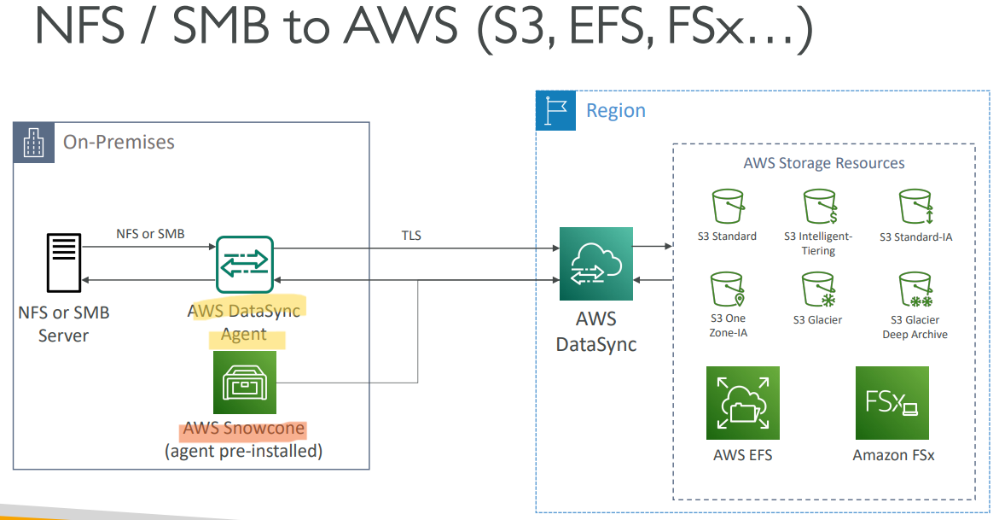
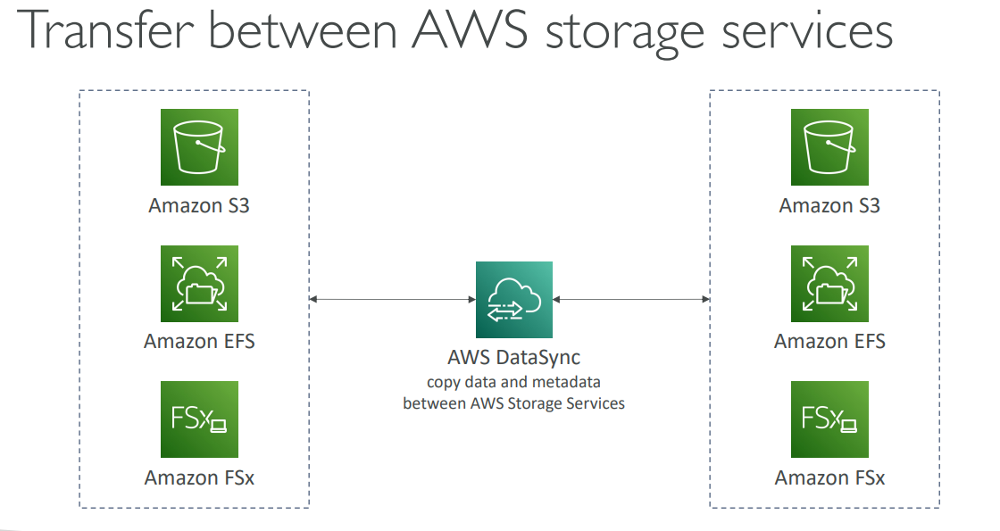

# AWS Storage - `AWS DataSync`

[Back](../index.md)

- [AWS Storage - `AWS DataSync`](#aws-storage---aws-datasync)
  - [`AWS DataSync`(多题目涉及): Data Syn](#aws-datasync多题目涉及-data-syn)

---

## `AWS DataSync`(多题目涉及): Data Syn

- `AWS DataSync`

  - A service to synchonize data.
  - Used to move large amount of data to and from(注意, 是双向的 premises<->AWS)

    - On-premises / other cloud to AWS (`NFS`, `SMB`, `HDFS`, `S3 API`…) – **needs agent**
    - AWS to AWS (different storage services) – no agent needed

- Can synchronize to:

  - Amazon `S3` (any storage classes – **including Glacier**)
  - Amazon `EFS`
  - Amazon `FSx` (Windows, Lustre, NetApp, OpenZFS...)

- Replication tasks can be **scheduled** hourly, daily, weekly(**scheduled sync, not continued sync**)
- **File permissions and metadata are preserved (NFS POSIX, SMB…)**
- One agent task can use 10 Gbps, can setup a bandwidth limit

> 注意, 该处可以是 DataSync 同步, 也可以是适用 Snowcone 同步, 因为 snowcone 预装了 dataSync

> Exame: permission and metadata can be kept between different AWS services.

- Sample:
  - A Solutions Architect is working on planning the **migration** of a startup company from on-premises to AWS. Currently, their infrastructure consists of many servers and 30 TB of data hosted on a shared **NFS** storage. He has decided to use Amazon S3 to host the data. Which AWS service can efficiently migrate the data from on-premises to S3?
  - Which AWS service is best suited to migrate a large amount of data from an `S3` bucket to an `EFS` file system?
  - You have on-premises sensitive files and documents that you want to **regularly synchronize** to AWS to keep another copy. Which AWS service can help you with that?

---

[TOP](#aws---storage-extas)
