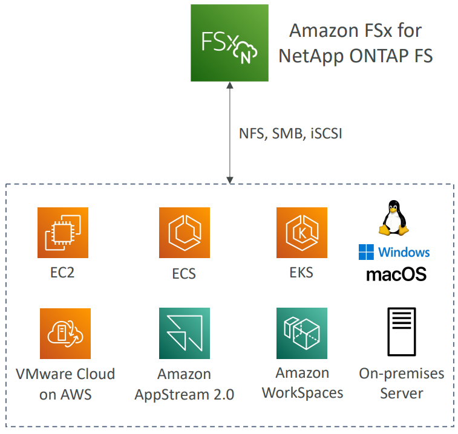
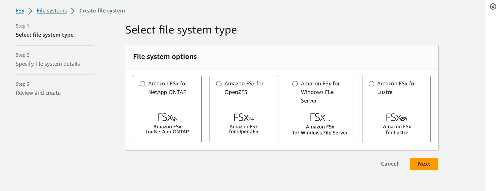
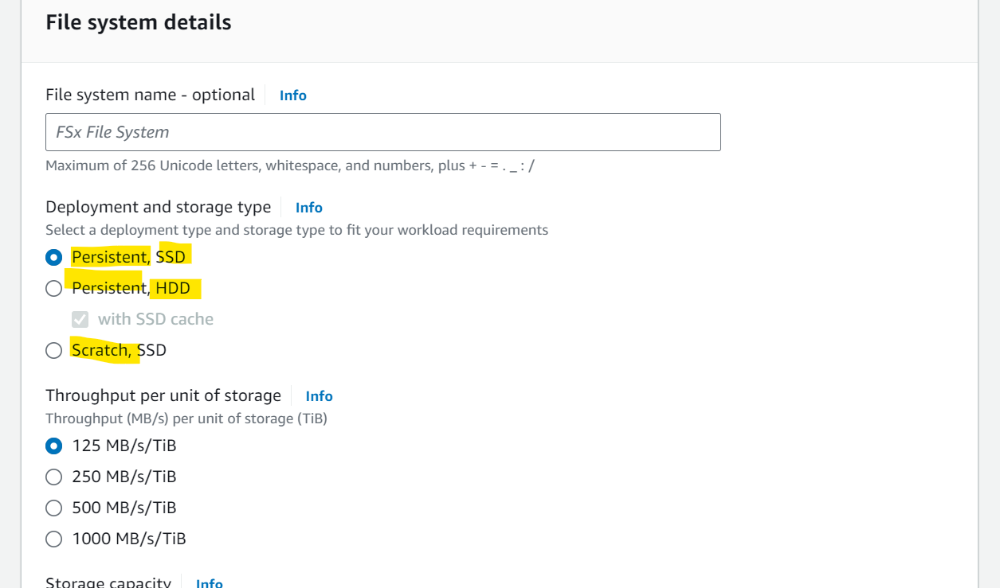
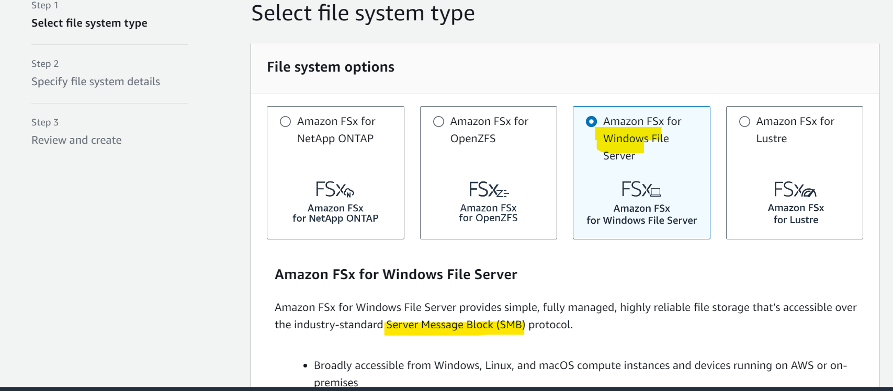
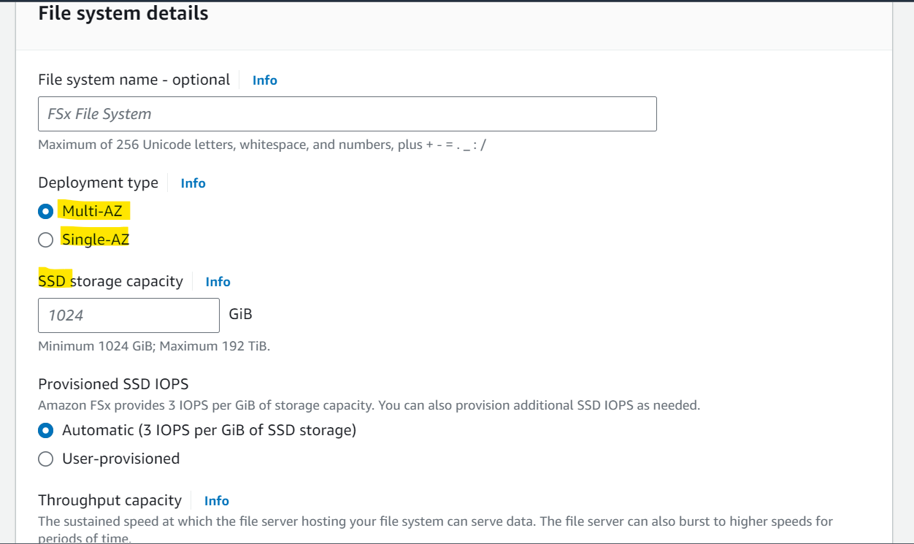
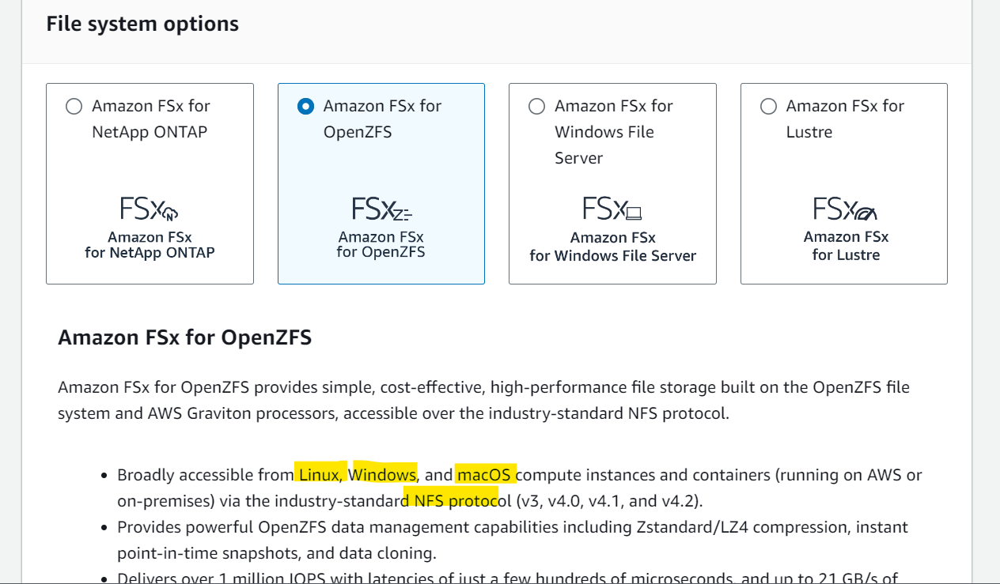
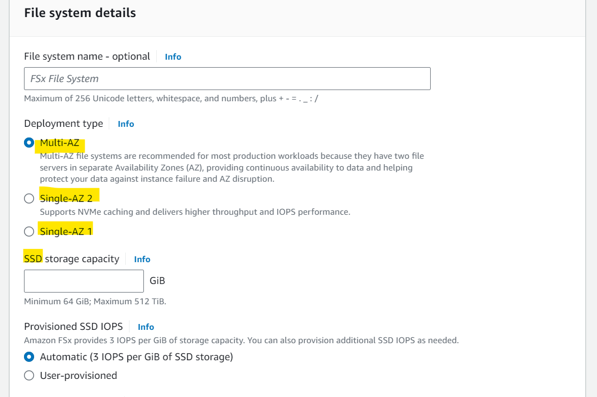
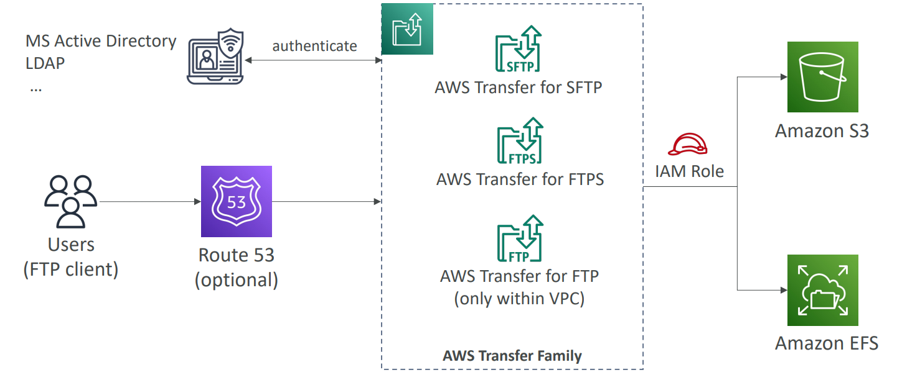
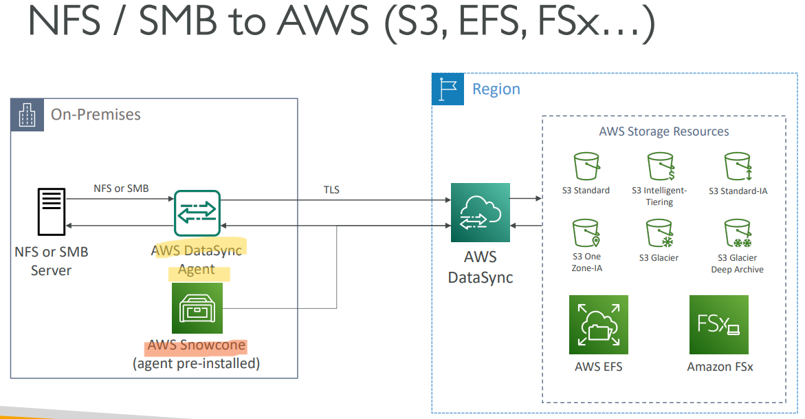

# AWS - Storage Extas

[Back](../index.md)

- [AWS - Storage Extas](#aws---storage-extas)
  - [`AWS Snow Family`](#aws-snow-family)
    - [Data Migrations with AWS Snow Family](#data-migrations-with-aws-snow-family)
    - [`Snowball Edge` (for data transfers)](#snowball-edge-for-data-transfers)
    - [`Snowcone` \& `Snowcone SSD`](#snowcone--snowcone-ssd)
    - [`Snowmobile`](#snowmobile)
    - [Snow Family for Data Migrations](#snow-family-for-data-migrations)
    - [Usage Process](#usage-process)
    - [Edge Computing](#edge-computing)
    - [OpsHub](#opshub)
    - [Solution Architecture: Snowball into Glacier](#solution-architecture-snowball-into-glacier)
    - [Hands-on](#hands-on)
  - [`Amazon FSx`: File System](#amazon-fsx-file-system)
    - [Amazon `FSx for Windows` (File Server)](#amazon-fsx-for-windows-file-server)
    - [Amazon `FSx for Lustre`](#amazon-fsx-for-lustre)
      - [FSx Lustre - File System Deployment Options](#fsx-lustre---file-system-deployment-options)
    - [Amazon `FSx for NetApp ONTAP`](#amazon-fsx-for-netapp-ontap)
    - [Amazon `FSx for OpenZFS`](#amazon-fsx-for-openzfs)
    - [Hands-on](#hands-on-1)
  - [`AWS Storage Gateway`](#aws-storage-gateway)
    - [Hybrid Cloud for Storage](#hybrid-cloud-for-storage)
    - [AWS Storage Cloud Native Options](#aws-storage-cloud-native-options)
    - [AWS Storage Gateway](#aws-storage-gateway-1)
    - [Amazon `S3 File Gateway`(Object level)](#amazon-s3-file-gatewayobject-level)
    - [Amazon `FSx File Gateway`(File level)](#amazon-fsx-file-gatewayfile-level)
    - [`Volume Gateway`(Block Level)](#volume-gatewayblock-level)
    - [`Tape Gateway`](#tape-gateway)
    - [`Hardware appliance`](#hardware-appliance)
    - [Hands-on](#hands-on-2)
  - [`AWS Transfer Family`: FTP](#aws-transfer-family-ftp)
  - [`AWS DataSync`(多题目涉及): Data Syn](#aws-datasync多题目涉及-data-syn)
  - [Summary: Storage Comparison](#summary-storage-comparison)

---

## `AWS Snow Family`

- Highly-secure, portable devices to collect and process data at the edge, and migrate data into and out of AWS

|                | Snowcone | Snowball Edge | Snowmobile |
| -------------- | -------- | ------------- | ---------- |
| Edge computing | Yes      | Yes           | Yes        |
| Data migration | Yes      | Yes           | No         |

---

### Data Migrations with AWS Snow Family

- **Challenges** of data migration:

  - Limited connectivity
  - Limited bandwidth
  - High network cost
  - Shared bandwidth (can’t maximize the line)
  - Connection stability

- `AWS Snow Family`:

  - **offline devices** to perform **data migrations**
  - through physical route, not network route.

- If it takes **more than a week** to transfer over the network, use Snowball devices!

---

### `Snowball Edge` (for data transfers)

- `Snowball Edge`

  - **Physical** data transport solution:
  - move `TBs` or `PBs` of data in or out of AWS
  - Alternative to moving data over the network (and paying network fees)

- Pay per data transfer job
- Provide **block storage** and Amazon S3-compatible object storage

- 2 flavors:
- `Snowball Edge Storage Optimized`

  - `80 TB` of HDD capacity for block volume and S3 compatible object
    storage

- `Snowball Edge Compute Optimized`

  - `42 TB` of HDD or `28TB` NVMe capacity for block volume and S3 compatible object storage

- **Use cases**:
  - large data cloud migrations,
  - DC decommission,
  - disaster recovery

---

### `Snowcone` & `Snowcone SSD`

- Small, **portable** computing, anywhere, rugged & secure, withstands harsh environments
- Light (4.5 pounds, 2.1 kg)
- Device used for **edge computing**, **storage**, and **data transfer**

- `Snowcone`

  - `8 TB` of HDD Storage

- `Snowcone SSD`

  - `14 TB` of SSD Storage

- Use `Snowcone` where `Snowball` **does not fit** (space constrained environment)
- Must provide **your own battery/cables**

- 2 ways to send back to AWS
  - Can be **sent back** to AWS offline,
  - connect it to **internet** and use `AWS DataSync` to send data

---

### `Snowmobile`

- Transfer **exabytes** of data (1 EB = 1,000 PB = 1,000,000 TBs)
- Each `Snowmobile` has 100 PB of capacity (use multiple in parallel)
- **High security**:
  - temperature controlled, GPS, 24/7 video surveillance
- Better than Snowball if you transfer **more than 10 PB**

---

### Snow Family for Data Migrations

|                  | Snowcone & Snowcone SSD           | Snowball Edge Storage Optimized | Snowmobile                  |
| ---------------- | --------------------------------- | ------------------------------- | --------------------------- |
| Storage Capacity | `8 TB` HDD, `14 TB` SSD           | `80 TB` usable                  | < `100 PB`                  |
| Migration Size   | Up to `24 TB`, online and offline | Up to **petabytes** offline     | Up to **exabytes**, offline |
| DataSync agent   | Pre-installed                     |                                 |                             |

- Sample Q:
  - You have hundreds of Terabytes that you want to migrate to AWS S3 as soon as possible. You tried to use your network bandwidth and it will take around 3 weeks to complete the upload process. What is the recommended approach to using in this situation?
    - `Snowball Edge`

---

### Usage Process

1. **Request** Snowball devices from the AWS **console** for delivery
2. **Install** the snowball **client** / `AWS OpsHub` on your servers
3. **Connect** the snowball to your servers and **copy** files using the client
4. **Ship back** the device when you’re done (goes to the right AWS facility)
5. Data will be **loaded** into an S3 bucket
6. Snowball is completely **wiped**

---

### Edge Computing

- Process data while it’s being created on an `edge location`

- `edge location`

  - A truck on the road, a ship on the sea, a mining station underground...

- These locations may have

  - Limited / no **internet access**
  - Limited / no easy access to **computing power**

- We setup a `Snowball Edge` / `Snowcone` device to do edge computing

- **Use cases** of Edge Computing:

  - Preprocess data
  - Machine learning at the edge
  - Transcoding media streams

- Eventually (if need be) we can **ship back the device** to AWS (for transferring data for example)

---

- `Snowcone` & `Snowcone SSD`(smaller)

  - 2 CPUs, 4 GB of memory, wired or wireless access
  - USB-C power using a cord or the optional battery

- `Snowball Edge – Compute Optimized`

  - 104 vCPUs, 416 GiB of RAM
  - Optional GPU (useful for video processing or machine learning)
  - 28TB NVMe or 42TB HDD usable storage
  - Storage **Clustering** available (up to 16 nodes)

- `Snowball Edge – Storage Optimized`

  - Up to 40 vCPUs, 80 GiB of RAM, 80 TB storage

- All: Can run `EC2 Instances` & AWS `Lambda` functions (using AWS IoT Greengrass)

- **Long-term deployment** options:
  - `1` and `3` years discounted pricing

---

### OpsHub

- Historically, to use Snow Family devices, you needed a CLI (Command Line Interface tool)
- Today, you can use `AWS OpsHub` (a **GUI software** you install on your computer / laptop) to manage your Snow Family Device
  - **Unlocking and configuring** single or clustered devices
  - **Transferring** files
  - Launching and managing **instances** running on Snow Family Devices
  - **Monitor** device metrics (storage capacity, active instances on your device)
  - Launch compatible **AWS services** on your devices (ex: Amazon EC2 instances, AWS DataSync, Network File System (NFS))

---

### Solution Architecture: Snowball into Glacier

- Snowball **cannot import to Glacier directly**
- You must use Amazon `S3` first, in combination with an S3 **lifecycle policy**

---

### Hands-on

---

## `Amazon FSx`: File System

- `Amazon FSx`

  - allow to launch 3rd party high-performance **file systems** on AWS as a fully managed service

- File systems:
  - FSx for `Lustre`
  - FSx for `Windows File Server`
  - FSx for `NetApp ONTAP`
  - FSx for `OpenZFS`

---

### Amazon `FSx for Windows` (File Server)

- `FSx for Windows`

  - a fully managed **Windows file system share drive**

- Features:

  - Supports `SMB` protocol & Windows `NTFS`
  - `Microsoft Active Directory` integration, ACLs, user quotas
  - **Can be mounted on Linux EC2 instances**
  - Supports `Microsoft's Distributed File System (DFS) Namespaces` (group files across multiple FS)
  - Scale up to 10s of GB/s, millions of IOPS, 100s PB of data

- Storage Options:

  - `SSD`

    - latency sensitive workloads (databases, media processing, data analytics, …)

  - `HDD`

    - broad spectrum of workloads (home directory, CMS, …)

- Can be **accessed from your on-premises** infrastructure (`VPN` or `Direct Connect`)
- Can be configured to be **Multi-AZ** (high availability)
- Data is **backed-up daily to S3**

- Sample:
  - You are planning to **migrate** your company's infrastructure from on-premises to AWS Cloud. You have an **on-premises Microsoft Windows File Server** that you want to migrate. What is the most suitable AWS service you can use?
    - `FSx for Windows`

---

### Amazon `FSx for Lustre`

- `Lustre`

  - a type of parallel **distributed** file system, **for large-scale computing**
  - The name Lustre is derived from “Linux” and “cluster

- Use case:

  - Machine Learning, `High Performance Computing (HPC)`
  - Video Processing, Financial Modeling, Electronic Design Automation

- Scales up to 100s GB/s, millions of IOPS, sub-ms latencies

- **Storage Options**:

  - `SSD`

    - **low-latency**, IOPS intensive workloads, small & random file operations

  - `HDD`
    - **throughput-intensive** workloads, large & sequential file operations

- Seamless **integration with S3**

  - Can “**read S3**” as a file system (through FSx)
  - Can **write** the output of the computations back to S3 (through FSx)

- Can be used from on-premises servers (VPN or Direct Connect)

- Sample:
  - You would like to have a **distributed** **POSIX** compliant file system that will allow you to maximize the **IOPS** in order to perform some High-Performance Computing (HPC) and genomics computational research. This file system has to easily scale to millions of IOPS. What do you recommend?
  - `FSx for Lustre`

---

#### FSx Lustre - File System Deployment Options

- **Scratch File System**

  - **Temporary** storage
  - Data is not replicated (**doesn’t persist** if file server fails)
  - High **burst** (6x faster, 200MBps per TiB)
  - Usage:
    - **short-term** processing, optimize **costs**

- **Persistent** File System

  - **Long-term storage**
  - Data is **replicated** within **same AZ**
  - Replace failed files within minutes
  - Usage:
    - long-term processing, **sensitive data**
  - Sample:
    - Which deployment option in the FSx file system provides you with long-term storage that's replicated within AZ?

---

### Amazon `FSx for NetApp ONTAP`

- Managed `NetApp ONTAP` on AWS
- File System compatible with **`NFS`, `SMB`, `iSCSI`** protocol
- Move workloads running on `ONTAP(Open Network Technology for Appliance Products)` or `NAS` to AWS

- Works with:

  - Linux
  - Windows
  - MacOS
  - VMware Cloud on AWS
  - Amazon Workspaces & AppStream 2.0
  - Amazon EC2, ECS and EKS

- Storage shrinks or grows automatically
- Snapshots, replication, low-cost, compression and data de-duplication
- **Point-in-time instantaneous cloning** (helpful for **testing** new workloads)

- Sample:
  - Amazon FSx for NetApp ONTAP is compatible with the following protocols, EXCEPT **FTP**

---

### Amazon `FSx for OpenZFS`

- Managed `OpenZFS(open-source implementation of the Zettabyte File System)` file system on AWS
- File System compatible with **`NFS`** (v3, v4, v4.1, v4.2)

- **Move workloads** running on `ZFS` to AWS

- Works with:
  - Linux
  - Windows
  - MacOS
  - VMware Cloud on AWS
  - Amazon Workspaces & AppStream 2.0
  - Amazon EC2, ECS and EKS
- Up to 1,000,000 IOPS with < 0.5ms **latency**
- Snapshots, compression and low-cost
- **Point-in-time instantaneous cloning** (helpful for **testing** new workloads)

- Sample:
  - Which AWS service is best suited when migrating from an on-premises ZFS file system to AWS?

---

### Hands-on

- Amazon FSx for Lustre

- Amazon FSx for Windows File Server

- Amazon FSx for NetApp ONTAP

- Amazon FSx for OpenZFS

---

## `AWS Storage Gateway`

### Hybrid Cloud for Storage

- AWS is pushing for `hybrid cloud`

  - Part of your infrastructure is **on the cloud**
  - Part of your infrastructure is **on-premises**

- This can be due to

  - Long cloud migrations
  - Security requirements
  - Compliance requirements
  - IT strategy

- Problem:

  - S3 is a proprietary storage technology (unlike EFS / NFS), so how do you **expose the S3 data on-premises**?

- Solution:
  - `AWS Storage Gateway`

---

### AWS Storage Cloud Native Options

---

### AWS Storage Gateway

- `AWS Storage Gateway`

  - Bridge between on-premises data and cloud data

- **Use cases**:

  - disaster recovery
  - backup & restore
  - tiered storage
  - on-premises cache & low-latency files access

- **Types of Storage Gateway**:
  - S3 File Gateway
  - FSx File Gateway
  - Volume Gateway
  - Tape Gateway

---

### Amazon `S3 File Gateway`(Object level)

- protocol

  - Configured S3 buckets are accessible using the `NFS` and `SMB` protocol

- S3

  - **Most recently used data** is **cached** in the `file gateway`
    - Supports S3 Standard, S3 Standard IA, S3 One Zone A, S3 Intelligent Tiering. (**not Glacier**)
  - Transition to `S3 Glacier` using a **Lifecycle Policy**

- authentication
  - Bucket access using `IAM` **roles** for each `File Gateway`
  - `SMB` Protocol has integration with `Active Directory (AD)` for user authentication

- Sample:
  - You have a large dataset stored in S3 that you want to access from on-premises servers using the NFS or SMB protocol. Also, you want to authenticate access to these files through on-premises Microsoft AD. What would you use?
    - `S3 File Gateway`
  - A company is running Amazon S3 File Gateway to host their data on S3 buckets and is able to mount them on-premises using SMB. The data currently is hosted on S3 Standard storage class and there is a requirement to reduce the costs for S3. So, they have decided to migrate some of those data to S3 Glacier. What is the most efficient way they can use to move the data to S3 Glacier automatically?
    - Use S3 Liftcycle Policy

---

### Amazon `FSx File Gateway`(File level)

- Native access to `Amazon FSx for Windows File Server`
- Local **cache** for **frequently accessed data**(low lattency)
- Windows native compatibility (SMB, NTFS, Active Directory...)
- Useful for **group file shares** and **home directories**

- Sample:
  - A company uses a lot of files and data which is stored in an FSx for Windows File Server storage on AWS. Those files are currently used by the resources hosted on AWS. There’s a requirement for those files to be **accessed on-premises with low latency**. Which AWS service can help you achieve this?

---

### `Volume Gateway`(Block Level)

- **Block storage** using `iSCSI` protocol backed by S3
- Backed by **`EBS` snapshots** which can help restore on-premises volumes!

- **Cached volumes:**

  - **low latency** access to **most recent data**

- **Stored volumes:**
  - entire dataset is **on premise**, scheduled **backups to S3**

---

### `Tape Gateway`

- Some companies have backup processes **using physical tapes** (!)
- With Tape Gateway, companies use the same processes but, in the cloud
- `Virtual Tape Library (VTL)` backed by Amazon `S3` and `Glacier`
- Back up data **using existing tape-based processes** (and `iSCSI` interface)
- Works with leading backup software vendors

---

### `Hardware appliance`

- Using Storage Gateway means you need **on-premises virtualization**(以上几种 gateway 都是虚拟, 本节方法是实体方法.)
- Otherwise, you can use a `Storage Gateway Hardware Appliance`
- You can buy it on amazon.com
- Works with File Gateway, Volume Gateway, Tape Gateway
- Has the required CPU, memory, network, SSD cache resources
- Helpful for daily `NFS` backups in small data centers

---

### Hands-on

- Volume Gateway

---

## `AWS Transfer Family`: FTP

- `AWS Transfer Family`

  - A fully-managed service for **file transfers into and out** of `Amazon S3` or `Amazon EFS` **using the `FTP` protocol**

- Supported **Protocols**

  - AWS Transfer for `FTP (File Transfer Protocol (FTP))`
  - AWS Transfer for `FTPS (File Transfer Protocol over SSL (FTPS))`
  - AWS Transfer for `SFTP (Secure File Transfer Protocol (SFTP))`

- Managed infrastructure, Scalable, Reliable, Highly Available (**multi-AZ**)
- Pay **per provisioned endpoint** per hour + **data transfers** in GB

- Authentication:

  - Store and manage users’ credentials within the service
  - Integrate with **existing authentication systems** (Microsoft Active Directory, LDAP, Okta, Amazon Cognito, custom)

- **Usage**:
  - sharing files, public datasets, CRM, ERP, …

- Sample:
  - A Machine Learning company is working on a set of datasets that are hosted on S3 buckets. The company decided to release those datasets to the public to be useful for others in their research, but they don’t want to configure the S3 bucket to be public. And those datasets should be exposed over the FTP protocol. What can they do to do the requirement efficiently and with the least effort?

---

## `AWS DataSync`(多题目涉及): Data Syn

- `AWS DataSync`

  - A service to synchonize data.
  - Used to move large amount of data to and from(注意, 是双向的 premises<->AWS)

    - On-premises / other cloud to AWS (`NFS`, `SMB`, `HDFS`, `S3 API`…) – **needs agent**
    - AWS to AWS (different storage services) – no agent needed

- Can synchronize to:

  - Amazon `S3` (any storage classes – **including Glacier**)
  - Amazon `EFS`
  - Amazon `FSx` (Windows, Lustre, NetApp, OpenZFS...)

- Replication tasks can be **scheduled** hourly, daily, weekly(**scheduled sync, not continued sync**)
- **File permissions and metadata are preserved (NFS POSIX, SMB…)**
- One agent task can use 10 Gbps, can setup a bandwidth limit

> 注意, 该处可以是 DataSync 同步, 也可以是适用 Snowcone 同步, 因为 snowcone 预装了 dataSync

> Exame: permission and metadata can be kept between different AWS services.

- Sample:
  - A Solutions Architect is working on planning the **migration** of a startup company from on-premises to AWS. Currently, their infrastructure consists of many servers and 30 TB of data hosted on a shared **NFS** storage. He has decided to use Amazon S3 to host the data. Which AWS service can efficiently migrate the data from on-premises to S3?
  - Which AWS service is best suited to migrate a large amount of data from an `S3` bucket to an `EFS` file system?
  - You have on-premises sensitive files and documents that you want to **regularly synchronize** to AWS to keep another copy. Which AWS service can help you with that?

---

## Summary: Storage Comparison

- `S3`:
  - **Object** Storage
- `S3 Glacier`:
  - Object **Archival**
- `EBS volumes`:
  - **Network storage** for one **EC2 instance** at a time
- `Instance Storage`:
  - **Physical** storage for your EC2 instance (**high IOPS**)
- `EFS`:
  - **Network File System** for **Linux** instances, `POSIX(Portable Operating System Interface)` filesystem
- `FSx for Windows`:
  - **Network File System** for **Windows servers**
- `FSx for Lustre`:
  - **High Performance Computing** **Linux** file system
- `FSx for NetApp ONTAP`:
  - High **OS Compatibility**
- `FSx for OpenZFS`:
  - Managed **ZFS file system**
- `Storage Gateway`: bridge storage between on-premises and AWS
  - `S3 & FSx File Gateway`
  - `Volume Gateway (cache & stored)`
  - `Tape Gateway`
- `Transfer Family`:
  - **FTP, FTPS, SFTP interface** on top of Amazon S3 or Amazon EFS
- `DataSync`:
  - **Schedule data sync** from on-premises to AWS, or AWS to AWS
- `Snowcone / Snowball / Snowmobile`:
  - to move large amount of data to the cloud, **physically**
- `Database`:
  - for specific workloads, usually with **indexing** and **querying**

---

- Types of Various Units of Memory
  - Bit
  - Nibble
  - Byte
  - Kilo Byte
  - MegaByte
  - Giga Byte
  - Tera Byte
  - Peta Byte
  - Exa Byte
  - Zetta Byte
  - Yotta Byte

---

[TOP](#aws---storage-extas)
