# AWS Storage - Amazon FSx

[Back](../index.md)

- [AWS Storage - Amazon FSx](#aws-storage---amazon-fsx)
  - [`Amazon FSx`: File System](#amazon-fsx-file-system)
    - [Amazon `FSx for Windows` (File Server)](#amazon-fsx-for-windows-file-server)
    - [Amazon `FSx for Lustre`](#amazon-fsx-for-lustre)
      - [FSx Lustre - File System Deployment Options](#fsx-lustre---file-system-deployment-options)
    - [Amazon `FSx for NetApp ONTAP`](#amazon-fsx-for-netapp-ontap)
    - [Amazon `FSx for OpenZFS`](#amazon-fsx-for-openzfs)
    - [Hands-on](#hands-on)

---

## `Amazon FSx`: File System

- `Amazon FSx`

  - allow to launch 3rd party high-performance **file systems** on AWS as a fully managed service

- File systems:
  - FSx for `Lustre`
  - FSx for `Windows File Server`
  - FSx for `NetApp ONTAP`
  - FSx for `OpenZFS`

---

### Amazon `FSx for Windows` (File Server)

- `FSx for Windows`

  - a fully managed **Windows file system share drive**

- Features:

  - Supports `SMB` protocol & Windows `NTFS`
  - `Microsoft Active Directory` integration, ACLs, user quotas
  - **Can be mounted on Linux EC2 instances**
  - Supports `Microsoft's Distributed File System (DFS) Namespaces` (group files across multiple FS)
  - Scale up to 10s of GB/s, millions of IOPS, 100s PB of data

- Storage Options:

  - `SSD`

    - latency sensitive workloads (databases, media processing, data analytics, …)

  - `HDD`

    - broad spectrum of workloads (home directory, CMS, …)

- Can be **accessed from your on-premises** infrastructure (`VPN` or `Direct Connect`)
- Can be configured to be **Multi-AZ** (high availability)
- Data is **backed-up daily to S3**

- Sample:
  - You are planning to **migrate** your company's infrastructure from on-premises to AWS Cloud. You have an **on-premises Microsoft Windows File Server** that you want to migrate. What is the most suitable AWS service you can use?
    - `FSx for Windows`

---

### Amazon `FSx for Lustre`

- `Lustre`

  - a type of parallel **distributed** file system, **for large-scale computing**
  - The name Lustre is derived from “Linux” and “cluster

- Use case:

  - Machine Learning, `High Performance Computing (HPC)`
  - Video Processing, Financial Modeling, Electronic Design Automation

- Scales up to **100s GB/s, millions of IOPS, sub-ms latencies**

- **Storage Options**:

  - `SSD`

    - **low-latency**, IOPS intensive workloads, small & random file operations

  - `HDD`
    - **throughput-intensive** workloads, large & sequential file operations

- Seamless **integration with S3**

  - Can “**read S3**” as a file system (through FSx)
  - Can **write** the output of the computations back to S3 (through FSx)

- Can be used from on-premises servers (VPN or Direct Connect)

- Sample:
  - You would like to have a **distributed** **POSIX** compliant file system that will allow you to maximize the **IOPS** in order to perform some High-Performance Computing (HPC) and genomics computational research. This file system has to easily scale to millions of IOPS. What do you recommend?
  - `FSx for Lustre`

---

#### FSx Lustre - File System Deployment Options

- **Scratch File System**

  - **Temporary** storage
  - Data is not replicated (**doesn’t persist** if file server fails)
  - High **burst** (6x faster, 200MBps per TiB)
  - Usage:
    - **short-term** processing, optimize **costs**

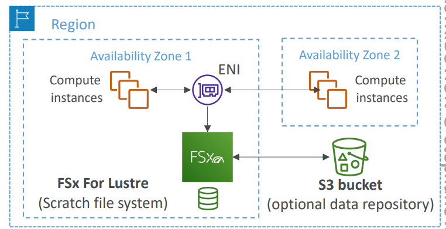

- **Persistent** File System

  - **Long-term storage**
  - Data is **replicated** within **same AZ**
  - Replace failed files within minutes
  - Usage:
    - long-term processing, **sensitive data**
  - Sample:
    - Which deployment option in the FSx file system provides you with long-term storage that's replicated within AZ?

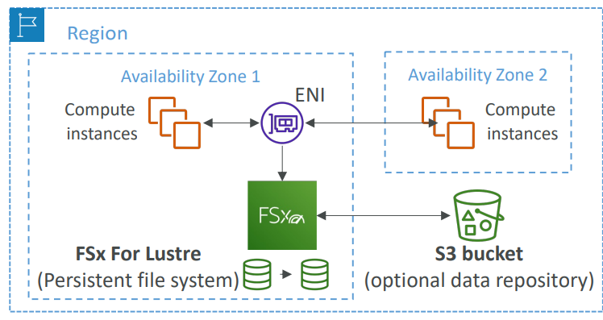

---

### Amazon `FSx for NetApp ONTAP`

- Managed `NetApp ONTAP` on AWS
- File System compatible with **`NFS`, `SMB`, `iSCSI`** protocol
- Move workloads running on `ONTAP(Open Network Technology for Appliance Products)` or `NAS` to AWS

- Works with:

  - Linux
  - Windows
  - MacOS
  - VMware Cloud on AWS
  - Amazon Workspaces & AppStream 2.0
  - Amazon EC2, ECS and EKS

- Storage shrinks or grows automatically
- Snapshots, replication, low-cost, compression and data de-duplication
- **Point-in-time instantaneous cloning** (helpful for **testing** new workloads)

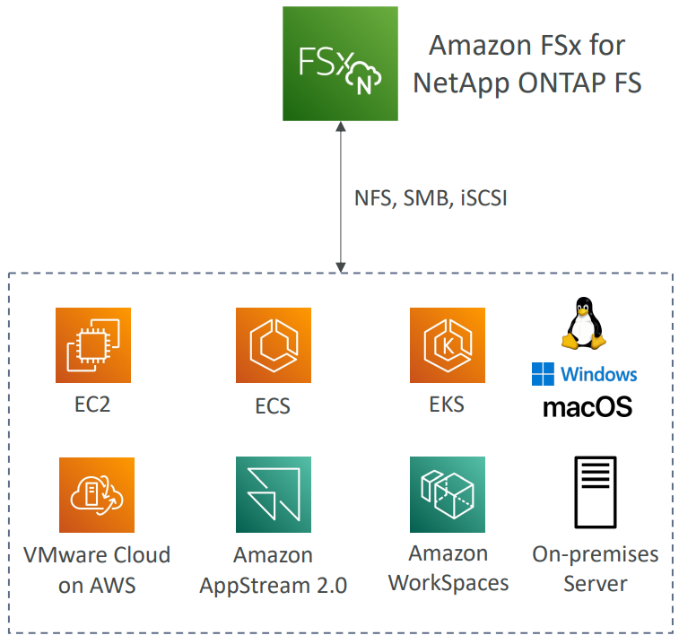

- Sample:
  - Amazon FSx for NetApp ONTAP is compatible with the following protocols, EXCEPT **FTP**

---

### Amazon `FSx for OpenZFS`

- Managed `OpenZFS(open-source implementation of the Zettabyte File System)` file system on AWS
- File System compatible with **`NFS`** (v3, v4, v4.1, v4.2)

- **Move workloads** running on `ZFS` to AWS

- Works with:
  - Linux
  - Windows
  - MacOS
  - VMware Cloud on AWS
  - Amazon Workspaces & AppStream 2.0
  - Amazon EC2, ECS and EKS
- Up to 1,000,000 IOPS with < 0.5ms **latency**
- Snapshots, compression and low-cost
- **Point-in-time instantaneous cloning** (helpful for **testing** new workloads)

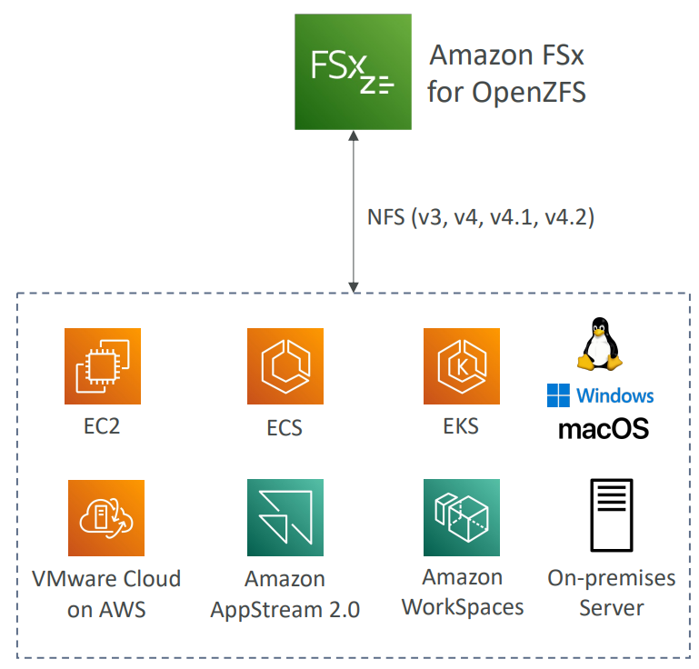

- Sample:
  - Which AWS service is best suited when migrating from an on-premises ZFS file system to AWS?

---

### Hands-on

- Amazon FSx for Lustre

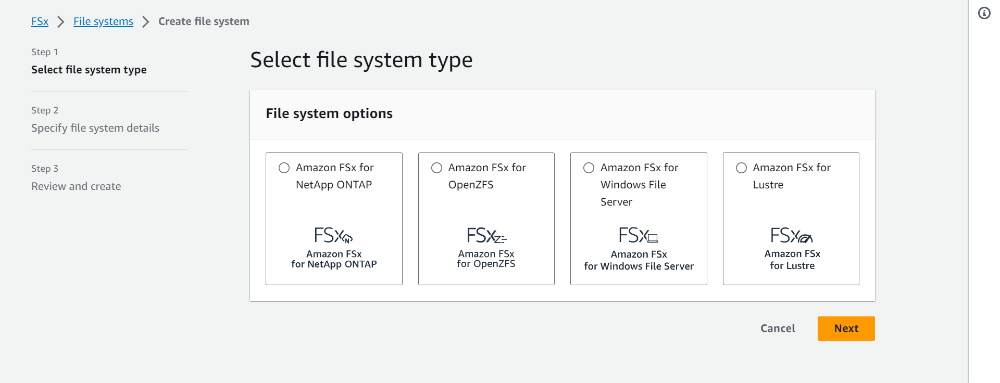

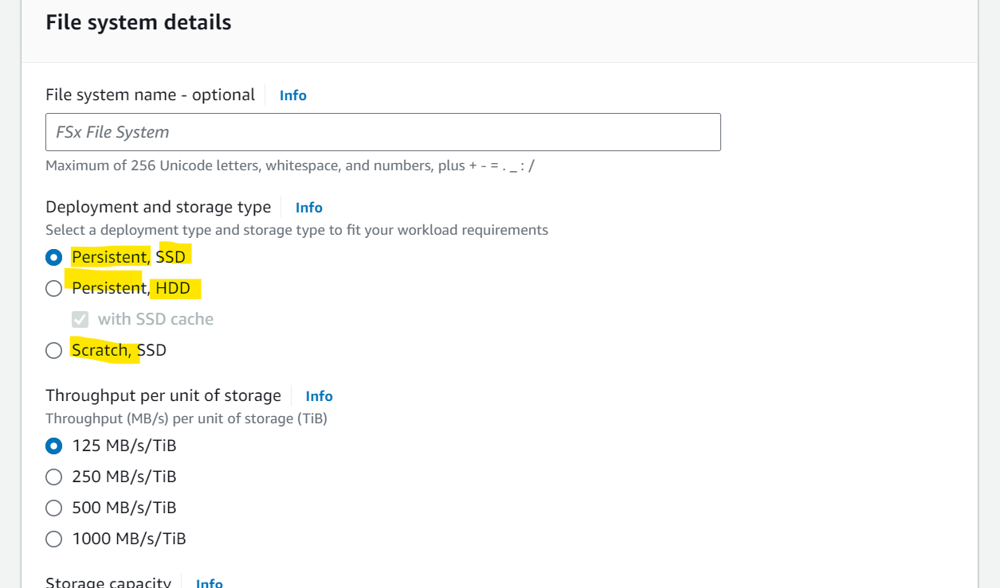

- Amazon FSx for Windows File Server

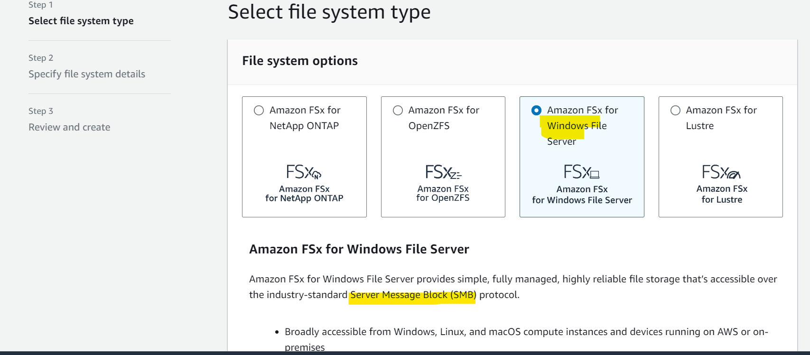

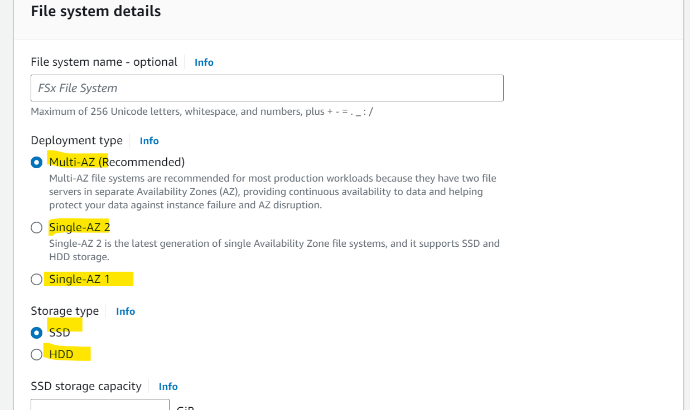

- Amazon FSx for NetApp ONTAP

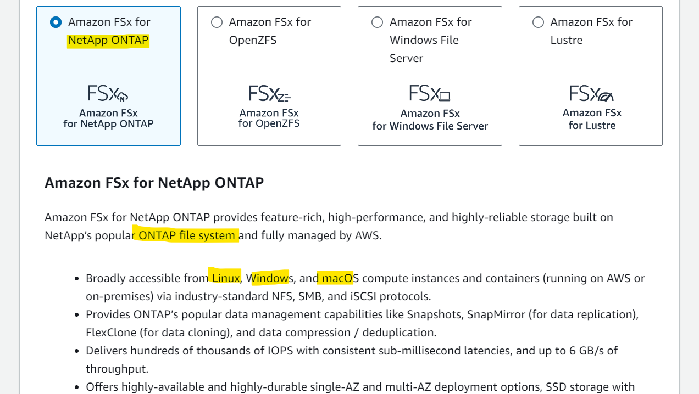

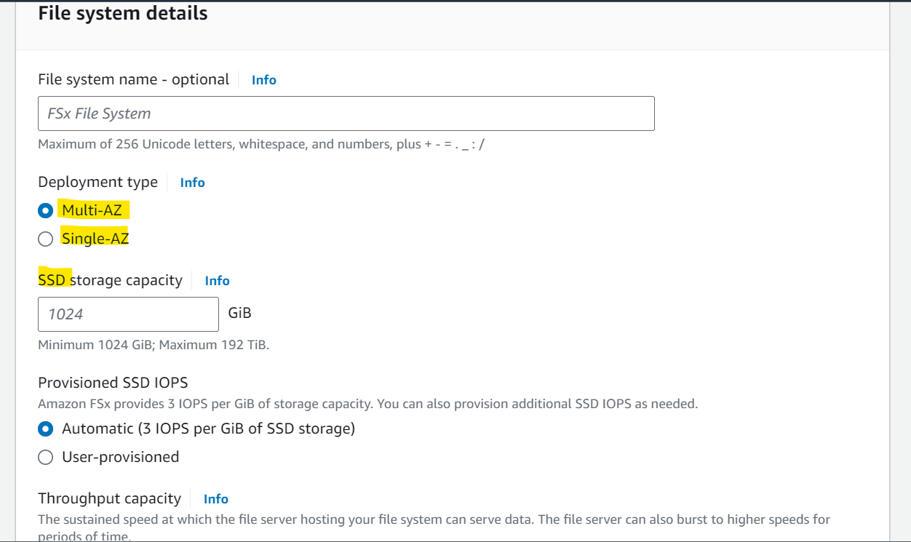

- Amazon FSx for OpenZFS

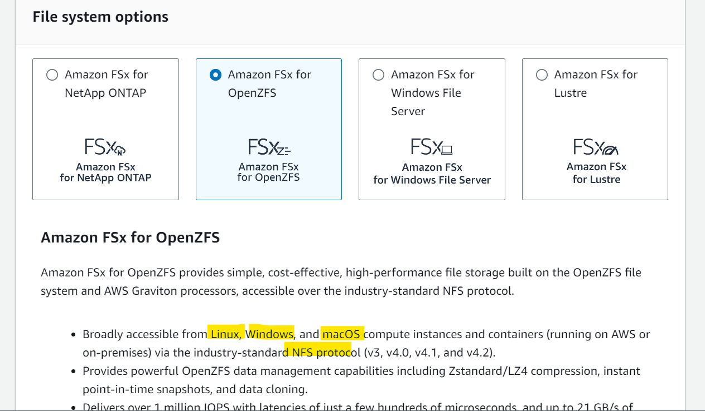

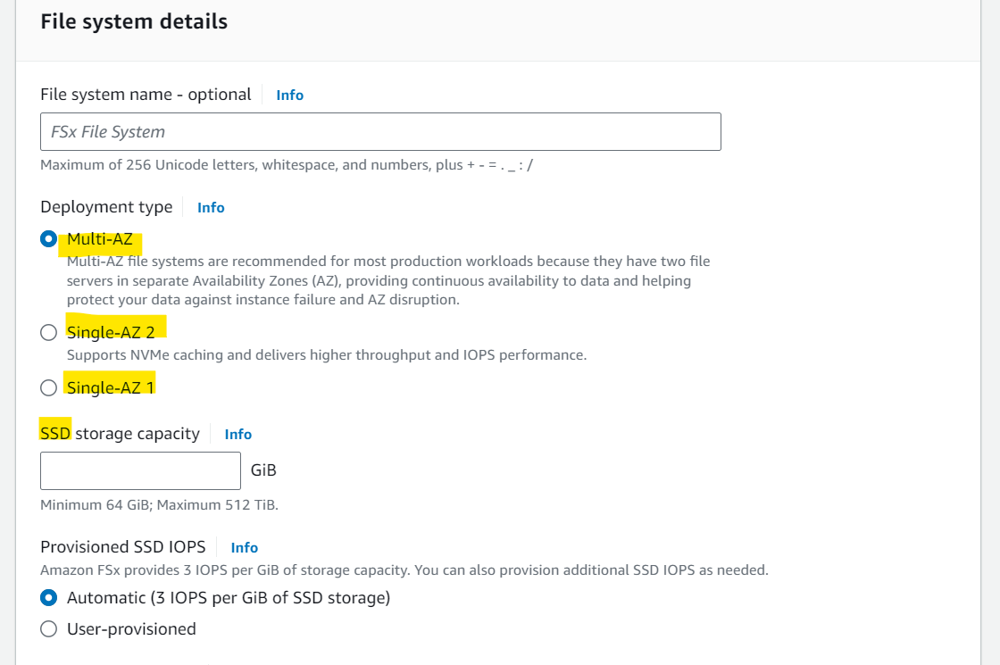

---

[TOP](#aws-storage---amazon-fsx)
