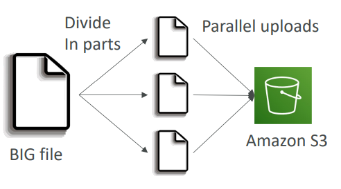

# AWS - S3

[Back](../index.md)

- [AWS - S3](#aws---s3)
  - [Amazon S3](#amazon-s3)
    - [Buckets](#buckets)
    - [Objects](#objects)
    - [Durability and Availability](#durability-and-availability)
    - [Hands-on](#hands-on)
  - [S3 Storage Classes](#s3-storage-classes)
    - [S3 Standard – General Purpose](#s3-standard--general-purpose)
    - [Infrequent Access](#infrequent-access)
    - [Glacier Storage Classes](#glacier-storage-classes)
    - [Intelligent-Tiering](#intelligent-tiering)
    - [Comparison](#comparison)
    - [Hands-on](#hands-on-1)
  - [Security](#security)
    - [Bucket Policies](#bucket-policies)
    - [Block Public Access](#block-public-access)
    - [Hands-On](#hands-on-2)
  - [Static Website Hosting](#static-website-hosting)
    - [Hands-on](#hands-on-3)
  - [Versioning](#versioning)
    - [Hands-on](#hands-on-4)
  - [Replication (CRR \& SRR)](#replication-crr--srr)
    - [Hands-on](#hands-on-5)
  - [Lifecycle Rules](#lifecycle-rules)
    - [Lifecycle Rules (Scenario 1)](#lifecycle-rules-scenario-1)
    - [Lifecycle Rules (Scenario 2)](#lifecycle-rules-scenario-2)
  - [`Storage Class Analysis`](#storage-class-analysis)
    - [Hands-on](#hands-on-6)
  - [Requester Pays](#requester-pays)
  - [Event Notifications](#event-notifications)
    - [IAM Permissions](#iam-permissions)
    - [Event Notifications with `Amazon EventBridge`](#event-notifications-with-amazon-eventbridge)
    - [Hands-on](#hands-on-7)
  - [Performance](#performance)
    - [Baseline Performance](#baseline-performance)
    - [Multi-Part upload](#multi-part-upload)
    - [S3 Transfer Acceleration](#s3-transfer-acceleration)
    - [S3 Byte-Range Fetches](#s3-byte-range-fetches)
  - [Select \& Glacier Select: filter](#select--glacier-select-filter)
  - [Batch Operations](#batch-operations)
  - [Security](#security-1)
    - [Object Encryption](#object-encryption)
      - [Encryption - `SSE-S3`](#encryption---sse-s3)
      - [Encryption – `SSE-KMS`](#encryption--sse-kms)
      - [Encryption – `SSE-C`](#encryption--sse-c)
      - [Encryption – `Client-Side Encryption`](#encryption--client-side-encryption)
    - [Encryption in transit (SSL/TLS)](#encryption-in-transit-ssltls)
      - [Hands-on](#hands-on-8)
    - [Default Encryption vs. Bucket Policies](#default-encryption-vs-bucket-policies)
    - [S3 – CORS](#s3--cors)
      - [Hands-on](#hands-on-9)
    - [MFA Delete](#mfa-delete)
    - [Access Logs](#access-logs)
      - [Hands-on](#hands-on-10)
    - [Pre-Signed URLs: Temporary Access](#pre-signed-urls-temporary-access)
      - [Hands-on](#hands-on-11)
    - [Glacier Vault Lock](#glacier-vault-lock)
    - [Object Lock (versioning must be enabled)](#object-lock-versioning-must-be-enabled)
    - [Access Points](#access-points)
    - [Object Lambda](#object-lambda)

---

## Amazon S3

- **Use cases**

  - Backup and storage
  - Disaster Recovery
  - Archive
  - Hybrid Cloud storage
  - Application hosting
  - Media hosting
  - Data lakes & big data analytics
  - Software delivery
  - Static website

---

### Buckets

- `Buckets`

  - as top level directories

- Bucket name:

  - must have a **globally unique** name (across all regions all accounts)
  - Naming convention
    - No uppercase, **No underscore**
    - 3-63 characters long
    - Not an IP
    - Must start with lowercase letter or number
    - Must NOT start with the prefix `xn--`
    - Must NOT end with the suffix `-s3alias`

- S3 looks like a global service but buckets are created in a region

  - Bucket **names** are defined in **golbal** level
  - **Buckets** are defined at the **region** level

---

### Objects

- `Objects`

  - the files stored in S3 buckets
  - Objects (files) have a **Key**

- `key`:

  - the FULL path of objects:

    - `s3://my-bucket/my_file.txt`
    - `s3://my-bucket/my_folder1/another_folder/my_file.txt`

  - There’s no concept of “directories” within buckets (although the UI will trick you to think otherwise)
  - Just keys with very long names that contain slashes (“/”)

  - composed of **prefix** + **object name**


- `Object value`

  - the content of the body
  - Max. Object Size is `5TB` (5000GB)
  - If uploading **more than 5GB**, must use **“multi-part upload”**
    - Multi-Part Upload is **recommended** as soon as the file is over `100 MB`.

- `Metadata`

  - list of text key / value pairs
  - system or user metadata

- `Tags`
  - Unicode key / value pair
  - up to `10`
  - useful for security / lifecycle
- `Version ID`
  - if versioning is enabled

---

### Durability and Availability

- **Durability:**

  - High durability (99.999999999%, 11 9’s) of objects across multiple AZ
  - If you store 10,000,000 objects with Amazon S3, you can on average expect to incur a **loss** of a single object once every 10,000 years
  - **Same** for all storage classes

- **Availability:**
  - Measures how **readily available** a service is
  - **Varies** depending on storage class
    - Example: S3 standard has 99.99% availability = not available 53 minutes a year

---

### Hands-on

- Create bucket


- Upload file


- Create folder


---

## S3 Storage Classes

### S3 Standard – General Purpose

- Used for **frequently accessed data**
- 99.99% Availability
- **Low latency** and high throughput
- Sustain 2 concurrent facility failures
- **Use Cases**:
  - Big Data analytics
  - mobile & gaming applications
  - content distribution…

---

### Infrequent Access

- For data that is **less frequently accessed**, but requires rapid access when needed
- Lower cost than S3 Standard

- **Amazon S3 Standard-Infrequent Access (S3 Standard-IA)**

  - 99.9% Availability
  - Use cases:
    - Disaster **Recovery**,
    - **backups**

- **Amazon S3 One Zone-Infrequent Access (S3 One Zone-IA)**
  - High durability (99.999999999%) in a **single AZ**;
  - data **lost** when AZ is **destroyed**
  - 99.5% Availability
  - Use Cases:
    - Storing **secondary backup** copies of on-premises data, or data you can recreate

---

### Glacier Storage Classes

- **Low-cost** object storage meant for **archiving / backup**
- Pricing: price for **storage** + object **retrieval** cost

- **Amazon S3 Glacier Instant Retrieval**

  - Millisecond retrieval, great for data **accessed once a quarter**
  - Minimum storage duration of **90 days**

- **Amazon S3 Glacier Flexible Retrieval (formerly Amazon S3 Glacier):**

  - Types:
    - Expedited (1 to 5 minutes),
    - Standard (3 to 5 hours),
    - **Bulk** (5 to 12 hours) – **free**
  - Minimum storage duration of **90 days**

- **Amazon S3 Glacier Deep Archive – for long term storage:**
  - Standard (12 hours),
  - Bulk (48 hours)
  - Minimum storage duration of **180 day**

---

### Intelligent-Tiering

- Small **monthly monitoring** and auto-tiering fee
- Moves objects **automatically** between Access Tiers based on usage

- There are **no retrieval** charges in S3 Intelligent-Tiering
  - **Frequent** Access tier (automatic): **default** tier
  - **Infrequent** Access tier (automatic): objects not accessed for **30 days**
  - **Archive Instant** Access tier (automatic): objects not accessed for **90 days**
  - **Archive** Access tier (optional): configurable from 90 days to **700+** days
  - **Deep Archive** Access tier (optional): config. from **180** days to **700+** days

---

### Comparison


---

### Hands-on

- Upload file and select storage class.


- Create lifecycle rule


---

## Security

- **User-Based**

  - **IAM Policies**
    - which API calls should be **allowed for a specific user** from IAM


- **Resource-Based**

  - **Bucket Policies**
    - bucket wide rules from the S3 console
    - allows cross account


- **Object Access Control List (ACL)**
  - finer grain (can be disabled)
- **Bucket Access Control List (ACL)**

  - less common (can be disabled)

- Note: an IAM principal **can access** an S3 object if

  - The user **IAM permissions** `ALLOW` it **OR** the **resource policy** `ALLOWS` it
  - **AND** there’s **no** explicit `DENY`
    - Explicit DENY in an IAM Policy will take precedence over an S3 bucket policy.

- **Encryption**
  - encrypt objects in Amazon S3 using encryption keys

---

### Bucket Policies

- JSON based policies

  - **Resources**:
    - buckets and objects
  - **Effect**:
    - Allow / Deny
  - **Actions**:
    - Set of API to Allow or Deny
  - **Principal**:
    - The account or user to apply the policy to


- Use S3 bucket for policy to:
  - Grant public access to the **bucket**
  - Force objects to be **encrypted at upload**
  - Grant access to **another account** (Cross Account)

---

### Block Public Access


- These settings were created to **prevent company data leaks**
- If you know your bucket should never be public, leave these on
- **Can** be set **at the account level**

---

### Hands-On

1. Disable block public access


2. Edit Bucket policy, using **Policy generator**


---

## Static Website Hosting

- S3 can **host static websites** and have them **accessible on the Internet**
- The website URL will be (depending on the region)

  - `http://bucket-name.s3-website-aws-region.amazonaws.com` OR
  - `http://bucket-name.s3-website.aws-region.amazonaws.com`

- If you get a **403 Forbidden** error, make sure the **bucket policy allows public reads**!


---

### Hands-on

- Enable Website hosting


- Upload web files

- Website


---

## Versioning

- You can version your files in Amazon S3
- It is enabled **at the bucket level**
- **Same key overwrite** will change the “version”: 1, 2, 3….

- It is best practice to version your buckets

  - Protect against unintended deletes (ability to restore a version)
  - **Easy roll back** to previous version

- Notes:
  - Any file that is **not versioned prior to** enabling versioning will have **version `null`**
  - Suspending versioning does **not delete** the previous versions


---

### Hands-on

- Enable versioining


- Upload files

- Website after updated


- Roll back version: delete


- Delete: not real delete, but create a delete marker.
  - Disable "show version"
  - Select file to delete
  - Enable show version


- Website after deleted


---

## Replication (CRR & SRR)

- `S3 Replication`
  - allows you to **replicate data** from an S3 bucket to another **in the same/different AWS Region**.
- **Must enable Versioning** in source and destination buckets
- `Cross-Region Replication (CRR)`
- `Same-Region Replication (SRR)`

- Buckets can be in **different AWS accounts**
- Copying is **asynchronous**
- Must give proper **IAM permissions** to S3

- **Use cases**:
  - CRR: compliance, lower latency access, replication across accounts
  - SRR: log aggregation, live replication between production and test accounts


- After you enable Replication, **only new objects** are replicated
- Optionally, you can **replicate existing objects** using `S3 Batch Replication`

  - Replicates existing objects and objects that failed replication

- For **DELETE operations**

  - Can **replicate delete markers** from source to target (**optional** setting)
  - Deletions with a version ID(Permenant deletion) are **not replicated** (to avoid malicious deletes)

- There is **no “chaining”** of replication
  - If bucket 1 has replication into bucket 2, which has replication into bucket 3
  - Then objects created in bucket 1 are not replicated to bucket 3

---

### Hands-on

- Create 2 buckets


- Upload file to original bucket


- Create replication rule


- Upload file in origin bucket


- Target bucket will update the new uploaded file.
  - the file before replication will not copy.


- It is optional to replicate Delete marker


- If origin bucket deletes a file permanently, this deletion will be replicated to the target bucket.

---

## Lifecycle Rules

- `Lifecycle Rules`
  - used to move objects automatically.
  - You can transition objects between storage classes
    - For **infrequently accessed** object, move them to `Standard IA`
    - For **archive objects** that you don’t need fast access to, move them to `Glacier` or `Glacier Deep Archive`


- `Transition Actions`

  - configure objects to **transition to another storage class**
  - ie:
    - Move objects to Standard IA class **60 days after** creation
    - Move to Glacier for archiving **after 6 months**

- `Expiration actions`

  - configure objects to **expire (delete)** after some time
  - ie:
    - **Access log files** can be set to delete **after a 365 days**
    - Can be used to delete **old versions** of files (if versioning is enabled)
    - Can be used to delete **incomplete Multi-Part uploads**

- Rules can be created for a certain `prefix` (example: s3://mybucket/mp3/\*)
- Rules can be created for certain **objects Tags** (example: Department: Finance)

---

### Lifecycle Rules (Scenario 1)

- Requirement:

  - Your application on EC2 creates images thumbnails after profile photos are uploaded to Amazon S3. These thumbnails can be easily recreated, and only need to be kept for 60 days. The source images should be able to be immediately retrieved for these 60 days, and afterwards, the user can wait up to 6 hours. How would you design this?

- Solution:
  - S3 source images can be on `Standard`, with a lifecycle configuration to **transition** them to `Glacier` **after** 60 days
  - S3 thumbnails can be on `One-Zone IA`, with a lifecycle configuration to **expire** them (delete them) after 60 days

---

### Lifecycle Rules (Scenario 2)

- Requirement:

  - A rule in your company states that you should be able to recover your deleted S3 objects immediately for 30 days, although this may happen rarely. After this time, and for up to 365 days, deleted objects should be recoverable within 48 hours.

- Solution:
  - **Enable S3 Versioning** in order to have object versions, so that “deleted objects” are in fact hidden by **a “delete marker” and can be recovered**
  - Transition the “noncurrent versions” of the object to `Standard IA`
  - Transition afterwards the “noncurrent versions” to `Glacier Deep Archive`

---

## `Storage Class Analysis`

- `Storage Class Analysis`
  - Help you decide when to transition objects to the right storage class
  - Recommendations for `Standard` and `Standard IA`
    - Does NOT work for `One-Zone IA` or `Glacier`
  - Report is updated daily
  - 24 to 48 hours to start seeing data analysis
  - Good first step to put together Lifecycle Rules (or improve them)!


---

### Hands-on


---

## Requester Pays

- In general, **bucket owners** pay for all Amazon S3 **storage** and **data transfer costs** associated with their bucket

- With `Requester Pays` buckets, the **requester** instead of the bucket owner **pays the cost of the request and the data download from the bucket**

- Helpful when you want to **share large datasets** with **other accounts**

- The **requester must be authenticated** in AWS (cannot be anonymous)


---

## Event Notifications

- `Event`:

  - S3:ObjectCreated, S3:ObjectRemoved, S3:ObjectRestore, S3:Replication…
  - Object name **filtering** possible (\*.jpg)
  - Can create **as many** “S3 events” as desired

- S3 event notifications typically deliver events in seconds but can sometimes take a minute or longer

- Use case:
  - generate thumbnails of images uploaded to S3


---

### IAM Permissions

- Instead of using role, defining access policy
  - SNS Resournce Policy(Publish): allow s3 bucket to send messages directly into the SNS topic.
  - SQS Resournce Policy(SendMessage): allow s3 bucket to send data directly into the SQS queue.
  - Lambda Resournce Policy(InvokeFunction): allow s3 bucket to invoke lambda function.


---

### Event Notifications with `Amazon EventBridge`

- Integration:


- Benefits:
  - **Advanced filtering options** with JSON rules (metadata, object size,
    name...)
  - **Multiple Destinations**
    - ex Step Functions, Kinesis Streams / Firehose…
  - **EventBridge Capabilities**
    - Archive, Replay Events, Reliable delivery

---

### Hands-on

- Create SQS


-


- Test in SQS


- Upload object


- SQS


---

## Performance

### Baseline Performance

- Amazon S3 automatically scales to high request rates, latency 100-200 ms
- Your application can achieve at least **3,500** `PUT/COPY/POST/DELETE` or **5,500** `GET/HEAD` requests **per second per prefix** in a bucket.

- There are **no limits** to the **number of prefixes** in a bucket.
- Example (object path => prefix):

  - bucket/**folder1/sub1**/file => /**folder1/sub1**/
  - bucket/**folder1/sub2**/file => /**folder1/sub2**/
  - bucket/**1**/file => /**1**/
  - bucket/**2**/file => /**2**/

- If you spread reads across all four prefixes **evenly**, you can achieve 22,000
  requests per second for `GET` and `HEAD`

---

### Multi-Part upload

- **recommended** for files **> 100MB**,
- **must use** for files **> 5GB**
- Can help parallelize uploads (speed up transfers)



---

### S3 Transfer Acceleration

- Increase transfer speed by transferring file to an `AWS edge location` which will **forward** the data to the S3 bucket in the **target region**

- Compatible with multi-part upload


---

### S3 Byte-Range Fetches

- **Parallelize** `GETs` by requesting specific byte ranges
- Better resilience in case of failures

- Can be used to speed up downloads


- Can be used to **retrieve only partial data** (for example the head of a file)


---

## Select & Glacier Select: filter

- Retrieve less data using `SQL` by performing **server-side filtering**
- Can filter **by rows & columns** (simple SQL statements)
- **Less** network transfer, less CPU cost client-side


---

## Batch Operations

- `Batch Operations`

  - manages retries, tracks progress, sends completion notifications, generate reports …

- Perform bulk operations on existing S3 objects with a single request, example:

  - Modify object **metadata** & **properties**
  - **Copy objects** between S3 buckets
  - **Encrypt un-encrypted objects**
  - Modify **ACLs**, **tags**
  - **Restore** objects from `S3 Glacier`
  - **Invoke Lambda function** to perform custom action on each object

- A `job` consists of

  - a `list of objects`,
  - the `action` to perform,
  - and **optional** `parameters`

- You can use
  - `S3 Inventory` to **get object list**
  - `S3 Select` to **filter** your objects


---

## Security

### Object Encryption

- You can encrypt objects in S3 buckets using one of **4 methods**

  - `Server-Side Encryption (SSE)`
    - Server-Side Encryption with `Amazon S3-Managed Keys (SSE-S3)`
      - Enabled by Default
      - Encrypts S3 objects using **keys** handled, managed, and owned by AWS
    - Server-Side Encryption with KMS Keys stored in `AWS KMS (SSE-KMS)`
      - Leverage `AWS Key Management Service (AWS KMS)` to manage **encryption keys**
    - Server-Side Encryption with `Customer-Provided Keys (SSE-C)`
      - When you want to manage **your own encryption keys**
  - `Client-Side Encryption`

- It’s important to understand which ones are for which situation for the exam

---

#### Encryption - `SSE-S3`

- Encryption using keys **handled, managed, and owned** by AWS
- Object is encrypted **server-side**
- Encryption type is `AES-256`
- Must set **header** `"x-amz-server-side-encryption": "AES256"`
- Enabled by **default** for new buckets & new objects


---

#### Encryption – `SSE-KMS`

- Encryption using keys **handled** and **managed** by `AWS KMS (Key Management Service)`
- KMS advantages:
  - user control + audit key usage using `CloudTrail`
  - have full control over the rotation policy of the encryption key.
- Object is encrypted **server side**
- Encryption keys stored in AWS.
- Must set header `"x-amz-server-side-encryption": "aws:kms"`


- **Limitation**

  - If you use SSE-KMS, you may be impacted by the **KMS limits**

    - When you **upload**, it calls the `GenerateDataKey KMS API`
    - When you **download**, it calls the `Decrypt KMS API`
    - Count towards the KMS quota per second (5500, 10000, 30000 req/s based on region)

  - If you have a very high throughput S3 bucket, encrypted by KMS, you may go into a thread link.
  - You can request a quota increase using the `Service Quotas Console`


---

#### Encryption – `SSE-C`

- Server-Side Encryption using keys fully **managed by the customer outside of AWS**
- Amazon S3 does **NOT store the encryption ke**y you provide
- `HTTPS` **must** be used
- Encryption key must **provided in HTTP headers**, for every HTTP request made


---

#### Encryption – `Client-Side Encryption`

- Use client libraries such as `Amazon S3 Client-Side Encryption Library`
- Encryption happens on the application
  - Clients must encrypt data themselves **before sending** to Amazon S3
  - Clients must decrypt data themselves when **retrieving** from Amazon S3
- **Customer fully manages** the keys and encryption cycle
  - AWS does not know your encryption keys and cannot decrypt your data.


---

### Encryption in transit (SSL/TLS)

- Encryption **in flight** is also called `SSL/TLS`
- Amazon S3 exposes two endpoints:

  - `HTTP` Endpoint – **non encrypted**
  - `HTTPS` Endpoint – **encryption** in flight

- `HTTPS` is recommended
- `HTTPS` is **mandatory** for `SSE-C`
- Most clients would use the `HTTPS` endpoint **by default**

- Deny getobject if security transport is false:


---

#### Hands-on

- Default


- The encryption of uploaded file
  - upload file
  - "Property" of the file:


- Edit encryption of uploaded file
  - create a new version of uploaded file


- Using default kms key(free)


- After encryption, a new version of file


Note: in the console, SSE-C is not available, it can be done only with CLI.

---

### Default Encryption vs. Bucket Policies

- `SSE-S3` encryption is **automatically** applied to new objects stored in S3 bucket
- **Optionally**, you can “**force encryption**” using a bucket **policy** and refuse any API call to PUT an S3 object **without encryption headers** (`SSE-KMS` or `SSE-C`)

- SSE-KMS


- SSE-C


- Note: `Bucket Policies` are evaluated **before** “Default Encryption”

---

### S3 – CORS

- `Cross-Origin Resource Sharing (CORS)`

  - defines a way for client web applications that are loaded in **one domain** to interact with resources in a **different domain**.
  - Web Browser based mechanism to **allow requests to other origins** while visiting the main origin
  - The requests won’t be fulfilled unless the **other origin allows** for the
    requests, using `CORS Headers` (example: `Access-Control-Allow-Origin`)

- `Origin` = scheme (protocol) + host (domain) + port

  - example: `https://www.example.com` (implied port is 443 for HTTPS, 80 for HTTP)
  - Same origin: `http://example.com/app1` & `http://example.com/app2`
  - Different origins: `http://www.example.com` & `http://other.example.com`


---

- **S3 – CORS**
  - If a client makes a cross-origin request on our S3 bucket, we **need to enable** the correct **CORS headers**
  - It’s a popular exam question
  - You can allow for a specific origin or for `\*` (**all origins**)


---

#### Hands-on

- Create 2 buckets
  - test bucket: upload index.html, which request extra-page.html in cors bucket
  - cors bucket: upload extra-page.html


- Before CORS
  - cannot fetch data due to cors


- Enable CORS

```json
[
  {
    "AllowedHeaders": ["Authorization"],
    "AllowedMethods": ["GET"],
    "AllowedOrigins": [
      "<url of first bucket with http://...without slash at the end>"
    ],
    "ExposeHeaders": [],
    "MaxAgeSeconds": 3000
  }
]
```


- After CORS


---

### MFA Delete

- `S3 MFA (Multi-Factor Authentication)`

  - force users to generate a code on a device (usually a mobile phone or hardware) before doing important operations on S3
  - It's an extra level of security to **prevent accidental deletions**.

- MFA will be required to:

  - **Permanently delete** an object **version**
  - **Suspend Versioning** on the bucket

- MFA won’t be required to:

  - Enable Versioning
  - List deleted versions

- To use MFA Delete, `Versioning` **must be enabled** on the bucket
- Only the **bucket owner (root account)** can enable/disable MFA Delete

- MFA is no available in concole, but in CLI.
  - When enable, no deletion is allowed.


---

### Access Logs

- For audit purpose, you may want to **log all access** to S3 buckets
- **Any request** made to S3, from any account, authorized or denied, will be logged into another S3 bucket
- That data can be analyzed using data analysis tools, such as `Athena`.
- The **target logging bucket** must be **in the same AWS region**
- The log format is at:
  - https://docs.aws.amazon.com/AmazonS3/latest/dev/LogFormat.html


---

- Warning:
  - Do not set your logging bucket to be the monitored bucket
  - It will create a **logging loop**, and your bucket will grow exponentially


---

#### Hands-on

- Create a new bucket for logging


- Configure monitored bucket
  - "Properties" > "Server access logging"


- When enable Server access logging, the policy of logging bucket will be updated.


- Open, upload, delete, and other operation in the monitored bucket.
- Wait for hours, the logging will be available.

---

### Pre-Signed URLs: Temporary Access

- generate temporary URLs to grant time-limited access to some actions in your S3 bucket.

- Generate pre-signed URLs using the **S3 Console**, AWS **CLI** or **SDK**

- URL **Expiration**

  - `S3 Console`:
    - 1 min up to 720 mins (`12 hours`)
  - `AWS CLI`
    - configure expiration with `--expires-in` parameter in seconds
    - default 3600 secs, max. 604800 secs ~ `168 hours`

- Users given a pre-signed URL **inherit the permissions** of the user that generated the URL for `GET` / `PUT`

- Examples:
  - Allow only logged-in users to download a premium video from your S3 bucket
  - Allow an ever-changing list of users to download files by generating URLs **dynamically**
  - Allow **temporarily** a user to upload a file to a precise location in your S3 bucket


---

#### Hands-on

- For object in a private bucket


---

### Glacier Vault Lock

- Adopt a `WORM (Write Once Read Many)` model

  - Create a Vault Lock Policy
  - Lock the policy for future edits (can no longer be **changed** or **deleted**)

- Helpful for **compliance** and **data retention**


---

### Object Lock (versioning must be enabled)

- Adopt a `WORM (Write Once Read Many)` model
- **Block an object version deletion** for a specified amount of time

- Two modes:

  - `Retention mode` - Compliance:
    - Object **versions** _can't be overwritten or deleted_ by any user, **including the root user**
    - Objects retention modes **can't be changed**, and retention periods **can't be shortened**
  - `Retention mode` - Governance:
    - **Most users** can't overwrite or delete an object version or alter its lock settings
    - **Some users** have special **permissions to change** the retention or **delete** the object

- **Retention Period**:

  - protect the object for **a fixed period**, it **can be extended**

- **Legal Hold**:
  - protect the object indefinitely(无限期地), **independent from retention period**
  - can be freely placed and removed using the `s3:PutObjectLegalHold` IAM permission
  - Sample Q:
    - Which of the following S3 Object Lock configuration allows you to prevent an object or its versions from being overwritten or deleted indefinitely and gives you the ability to remove it manually?
---

### Access Points

- `Access Points` **simplify security management** for S3 Buckets

- Each Access Point has:
  - its own **DNS name** (Internet Origin or VPC Origin)
  - an access point **policy** (similar to bucket policy)
    - manage security at scale


---

- VPC Origin
  - We can define the access point to be accessible **only from within the VPC**
  - You must create a `VPC Endpoint` to access the `Access Point` (`Gateway` or `Interface Endpoint`)
  - The `VPC Endpoint Policy` must allow access to the target bucket and `Access Point`


---

### Object Lambda

- Use `AWS Lambda` Functions to change the object **before it is retrieved** by the caller application
- Only one S3 bucket is needed, on top of which we create `S3 Access Point` and `S3 Object Lambda Access Points`.

- Use Cases:

  - Redacting(编辑) **personally identifiable information** for analytics or non-production environments.
  - **Converting** across data formats, such as converting XML to JSON.
  - **Resizing** and **watermarking** images on the fly using caller-specific details, such as the user who requested the object.

- Example:
  - An e-commerce company has its customers and orders data stored in an S3 bucket. The company’s CEO wants to generate a report to show the list of customers and the revenue for each customer. Customer data stored in files on the S3 bucket has sensitive information that we don’t want to expose in the report. How do you recommend the report can be created without exposing sensitive information?
  - Object Lambda to change object before retrieved.


---

[TOP](#aws---s3)
