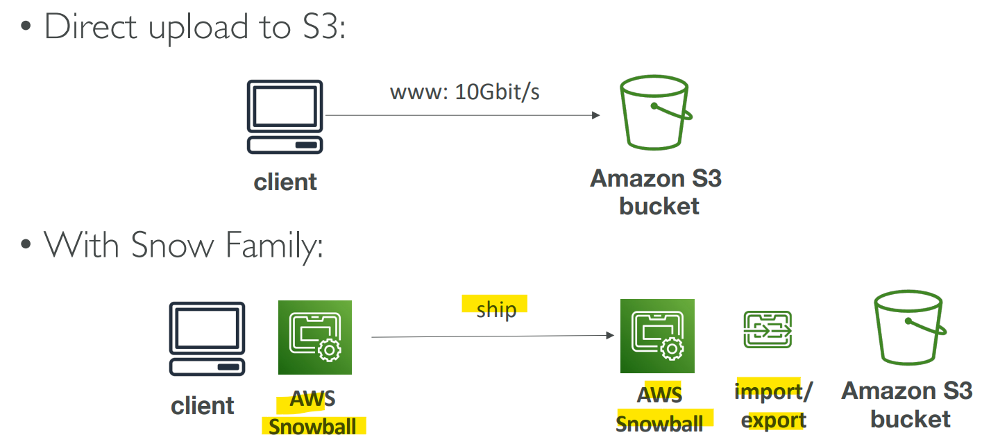
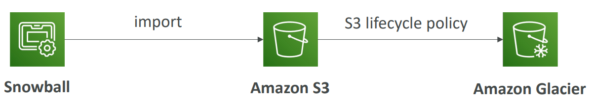
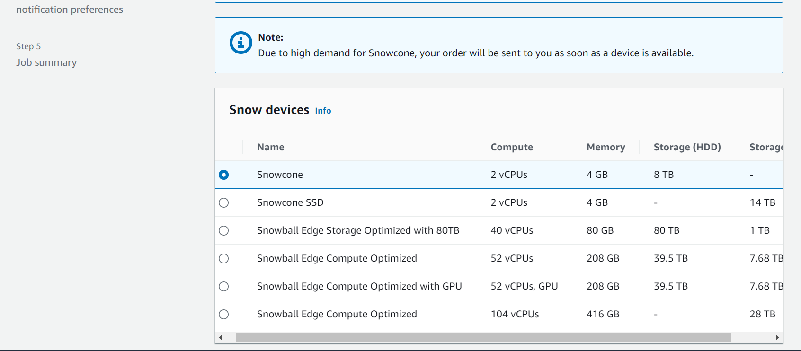

# AWS Storage - Snow Family

[Back](../index.md)

- [AWS Storage - Snow Family](#aws-storage---snow-family)
  - [`AWS Snow Family`](#aws-snow-family)
    - [Data Migrations with AWS Snow Family](#data-migrations-with-aws-snow-family)
    - [`Snowball Edge` (for data transfers)](#snowball-edge-for-data-transfers)
    - [`Snowcone` \& `Snowcone SSD`](#snowcone--snowcone-ssd)
    - [`Snowmobile`](#snowmobile)
    - [Snow Family for Data Migrations](#snow-family-for-data-migrations)
    - [Usage Process](#usage-process)
    - [Edge Computing](#edge-computing)
    - [OpsHub](#opshub)
    - [Solution Architecture: Snowball into Glacier](#solution-architecture-snowball-into-glacier)
    - [Hands-on](#hands-on)

---

## `AWS Snow Family`

- Highly-secure, portable devices to collect and process data at the edge, and migrate data into and out of AWS

|                | Snowcone | Snowball Edge | Snowmobile |
| -------------- | -------- | ------------- | ---------- |
| Edge computing | Yes      | Yes           | Yes        |
| Data migration | Yes      | Yes           | No         |

---

### Data Migrations with AWS Snow Family

- **Challenges** of data migration:

  - Limited connectivity
  - Limited bandwidth
  - High network cost
  - Shared bandwidth (can’t maximize the line)
  - Connection stability

- `AWS Snow Family`:

  - **offline devices** to perform **data migrations**
  - through physical route, not network route.

- If it takes **more than a week** to transfer over the network, use Snowball devices!

---

### `Snowball Edge` (for data transfers)

- `Snowball Edge`

  - **Physical** data transport solution:
  - move `TBs` or `PBs` of data in or out of AWS
  - Alternative to moving data over the network (and paying network fees)

- Pay per data transfer job
- Provide **block storage** and Amazon S3-compatible object storage

- 2 flavors:
- `Snowball Edge Storage Optimized`

  - `80 TB` of HDD capacity for block volume and S3 compatible object
    storage

- `Snowball Edge Compute Optimized`

  - `42 TB` of HDD or `28TB` NVMe capacity for block volume and S3 compatible object storage

- **Use cases**:
  - large data cloud migrations,
  - DC decommission,
  - disaster recovery

---

### `Snowcone` & `Snowcone SSD`

- Small, **portable** computing, anywhere, rugged & secure, withstands harsh environments
- Light (4.5 pounds, 2.1 kg)
- Device used for **edge computing**, **storage**, and **data transfer**

- `Snowcone`

  - `8 TB` of HDD Storage

- `Snowcone SSD`

  - `14 TB` of SSD Storage

- Use `Snowcone` where `Snowball` **does not fit** (space constrained environment)
- Must provide **your own battery/cables**

- 2 ways to send back to AWS
  - Can be **sent back** to AWS offline,
  - connect it to **internet** and use `AWS DataSync` to send data

---

### `Snowmobile`

- Transfer **exabytes** of data (1 EB = 1,000 PB = 1,000,000 TBs)
- Each `Snowmobile` has 100 PB of capacity (use multiple in parallel)
- **High security**:
  - temperature controlled, GPS, 24/7 video surveillance
- Better than Snowball if you transfer **more than 10 PB**

---

### Snow Family for Data Migrations

|                  | Snowcone & Snowcone SSD           | Snowball Edge Storage Optimized | Snowmobile                  |
| ---------------- | --------------------------------- | ------------------------------- | --------------------------- |
| Storage Capacity | `8 TB` HDD, `14 TB` SSD           | `80 TB` usable                  | < `100 PB`                  |
| Migration Size   | Up to `24 TB`, online and offline | Up to **petabytes** offline     | Up to **exabytes**, offline |
| DataSync agent   | Pre-installed                     |                                 |                             |

- Sample Q:
  - You have hundreds of Terabytes that you want to migrate to AWS S3 as soon as possible. You tried to use your network bandwidth and it will take around 3 weeks to complete the upload process. What is the recommended approach to using in this situation?
    - `Snowball Edge`

---

### Usage Process

1. **Request** Snowball devices from the AWS **console** for delivery
2. **Install** the snowball **client** / `AWS OpsHub` on your servers
3. **Connect** the snowball to your servers and **copy** files using the client
4. **Ship back** the device when you’re done (goes to the right AWS facility)
5. Data will be **loaded** into an S3 bucket
6. Snowball is completely **wiped**

---

### Edge Computing

- Process data while it’s being created on an `edge location`

- `edge location`

  - A truck on the road, a ship on the sea, a mining station underground...

- These locations may have

  - Limited / no **internet access**
  - Limited / no easy access to **computing power**

- We setup a `Snowball Edge` / `Snowcone` device to do edge computing

- **Use cases** of Edge Computing:

  - Preprocess data
  - Machine learning at the edge
  - Transcoding media streams

- Eventually (if need be) we can **ship back the device** to AWS (for transferring data for example)

---

- `Snowcone` & `Snowcone SSD`(smaller)

  - 2 CPUs, 4 GB of memory, wired or wireless access
  - USB-C power using a cord or the optional battery

- `Snowball Edge – Compute Optimized`

  - 104 vCPUs, 416 GiB of RAM
  - Optional GPU (useful for video processing or machine learning)
  - 28TB NVMe or 42TB HDD usable storage
  - Storage **Clustering** available (up to 16 nodes)

- `Snowball Edge – Storage Optimized`

  - Up to 40 vCPUs, 80 GiB of RAM, 80 TB storage

- All: Can run `EC2 Instances` & AWS `Lambda` functions (using AWS IoT Greengrass)

- **Long-term deployment** options:
  - `1` and `3` years discounted pricing

---

### OpsHub

- Historically, to use Snow Family devices, you needed a CLI (Command Line Interface tool)
- Today, you can use `AWS OpsHub` (a **GUI software** you install on your computer / laptop) to manage your Snow Family Device
  - **Unlocking and configuring** single or clustered devices
  - **Transferring** files
  - Launching and managing **instances** running on Snow Family Devices
  - **Monitor** device metrics (storage capacity, active instances on your device)
  - Launch compatible **AWS services** on your devices (ex: Amazon EC2 instances, AWS DataSync, Network File System (NFS))

---

### Solution Architecture: Snowball into Glacier

- Snowball **cannot import to Glacier directly**
- You must use Amazon `S3` first, in combination with an S3 **lifecycle policy**

---

### Hands-on

---

[TOP](#aws-snow-family)
