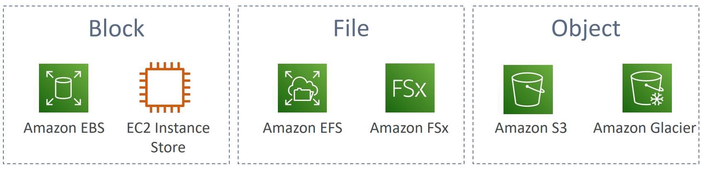
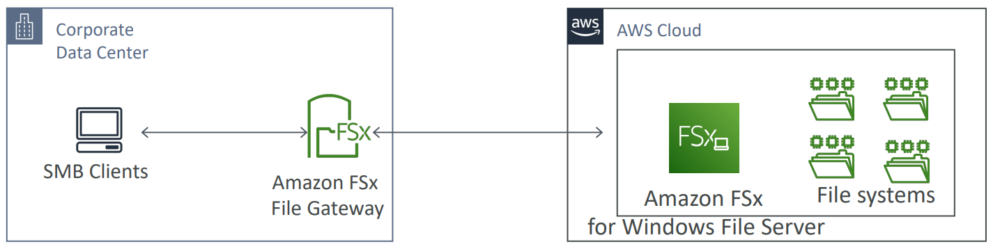
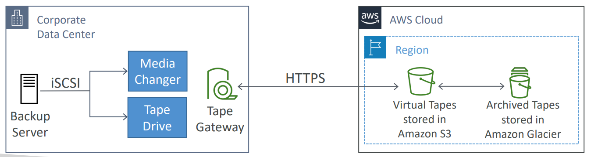
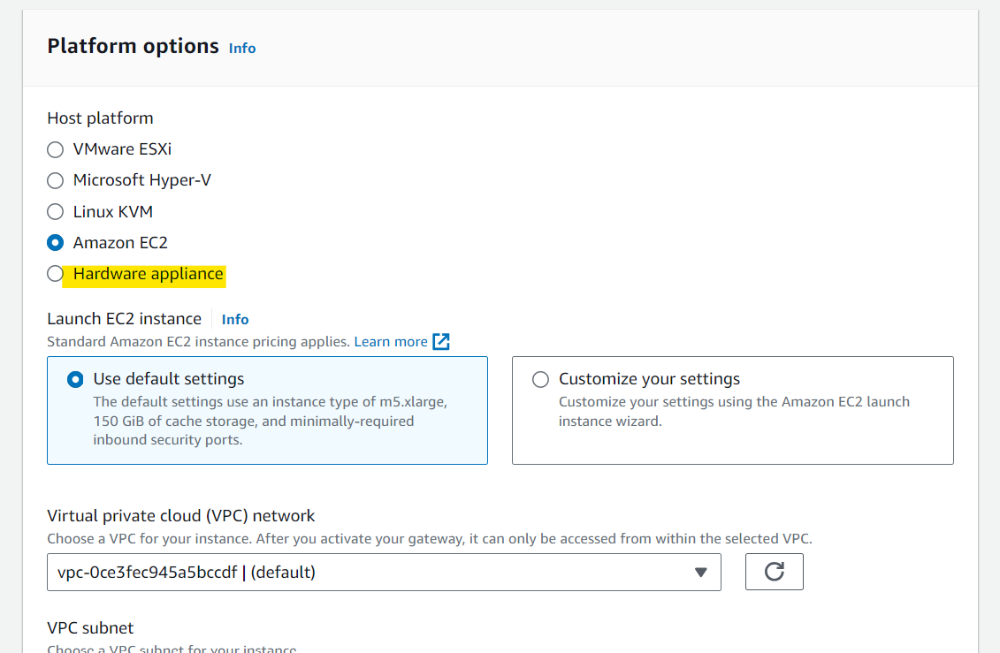
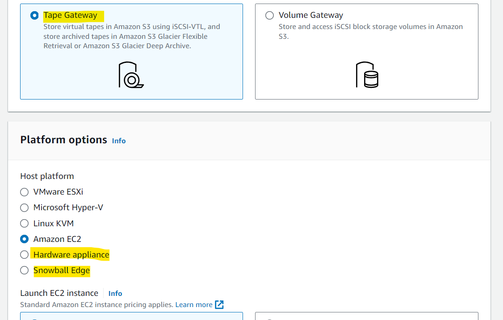

# AWS Storage - AWS Storage Gateway

[Back](../index.md)

- [AWS Storage - AWS Storage Gateway](#aws-storage---aws-storage-gateway)
  - [`AWS Storage Gateway`](#aws-storage-gateway)
    - [Hybrid Cloud for Storage](#hybrid-cloud-for-storage)
    - [AWS Storage Cloud Native Options](#aws-storage-cloud-native-options)
    - [AWS Storage Gateway](#aws-storage-gateway-1)
    - [Amazon `S3 File Gateway`(Object level)](#amazon-s3-file-gatewayobject-level)
    - [Amazon `FSx File Gateway`(File level)](#amazon-fsx-file-gatewayfile-level)
    - [`Volume Gateway`(Block Level)](#volume-gatewayblock-level)
    - [`Tape Gateway`](#tape-gateway)
    - [`Hardware appliance`](#hardware-appliance)
    - [Hands-on](#hands-on)

---

## `AWS Storage Gateway`

### Hybrid Cloud for Storage

- AWS is pushing for `hybrid cloud`

  - Part of your infrastructure is **on the cloud**
  - Part of your infrastructure is **on-premises**

- This can be due to

  - Long cloud migrations
  - Security requirements
  - Compliance requirements
  - IT strategy

- Problem:

  - S3 is a proprietary storage technology (unlike EFS / NFS), so how do you **expose the S3 data on-premises**?

- Solution:
  - `AWS Storage Gateway`

---

### AWS Storage Cloud Native Options

---

### AWS Storage Gateway

- `AWS Storage Gateway`

  - Bridge between on-premises data and cloud data

- **Use cases**:

  - disaster recovery
  - backup & restore
  - tiered storage
  - on-premises cache & low-latency files access

- **Types of Storage Gateway**:
  - S3 File Gateway
  - FSx File Gateway
  - Volume Gateway
  - Tape Gateway

---

### Amazon `S3 File Gateway`(Object level)

- protocol

  - Configured S3 buckets are accessible using the `NFS` and `SMB` protocol

- S3

  - **Most recently used data** is **cached** in the `file gateway`
    - Supports S3 Standard, S3 Standard IA, S3 One Zone A, S3 Intelligent Tiering. (**not Glacier**)
  - Transition to `S3 Glacier` using a **Lifecycle Policy**

- authentication
  - Bucket access using `IAM` **roles** for each `File Gateway`
  - `SMB` Protocol has integration with `Active Directory (AD)` for user authentication

- Sample:
  - You have a large dataset stored in S3 that you want to access from on-premises servers using the NFS or SMB protocol. Also, you want to authenticate access to these files through on-premises Microsoft AD. What would you use?
    - `S3 File Gateway`
  - A company is running Amazon S3 File Gateway to host their data on S3 buckets and is able to mount them on-premises using SMB. The data currently is hosted on S3 Standard storage class and there is a requirement to reduce the costs for S3. So, they have decided to migrate some of those data to S3 Glacier. What is the most efficient way they can use to move the data to S3 Glacier automatically?
    - Use S3 Liftcycle Policy

---

### Amazon `FSx File Gateway`(File level)

- Native access to `Amazon FSx for Windows File Server`
- Local **cache** for **frequently accessed data**(low lattency)
- Windows native compatibility (SMB, NTFS, Active Directory...)
- Useful for **group file shares** and **home directories**

- Sample:
  - A company uses a lot of files and data which is stored in an FSx for Windows File Server storage on AWS. Those files are currently used by the resources hosted on AWS. There’s a requirement for those files to be **accessed on-premises with low latency**. Which AWS service can help you achieve this?

---

### `Volume Gateway`(Block Level)

- **Block storage** using `iSCSI` protocol backed by S3
- Backed by **`EBS` snapshots** which can help restore on-premises volumes!

- **Cached volumes:**

  - **low latency** access to **most recent data**

- **Stored volumes:**
  - entire dataset is **on premise**, scheduled **backups to S3**

---

### `Tape Gateway`

- Some companies have backup processes **using physical tapes** (!)
- With Tape Gateway, companies use the same processes but, in the cloud
- `Virtual Tape Library (VTL)` backed by Amazon `S3` and `Glacier`
- Back up data **using existing tape-based processes** (and `iSCSI` interface)
- Works with leading backup software vendors

---

### `Hardware appliance`

- Using Storage Gateway means you need **on-premises virtualization**(以上几种 gateway 都是虚拟, 本节方法是实体方法.)
- Otherwise, you can use a `Storage Gateway Hardware Appliance`
- You can buy it on amazon.com
- Works with File Gateway, Volume Gateway, Tape Gateway
- Has the required CPU, memory, network, SSD cache resources
- Helpful for daily `NFS` backups in small data centers

---

### Hands-on

- Volume Gateway

---
