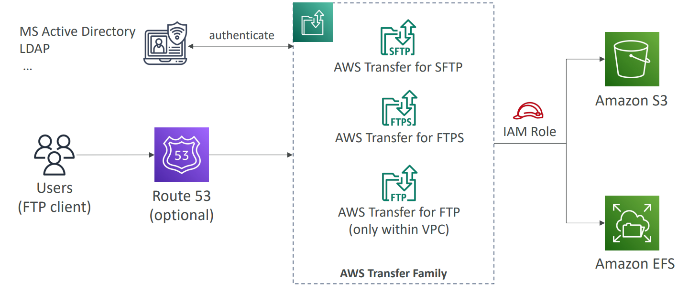

# AWS Storage - AWS Transfer Family

[Back](../index.md)

- [AWS Storage - AWS Transfer Family](#aws-storage---aws-transfer-family)
  - [`AWS Transfer Family`: FTP](#aws-transfer-family-ftp)

---

## `AWS Transfer Family`: FTP

- `AWS Transfer Family`

  - A fully-managed service for **file transfers into and out** of `Amazon S3` or `Amazon EFS` **using the `FTP` protocol**

- Supported **Protocols**

  - AWS Transfer for `FTP (File Transfer Protocol (FTP))`
  - AWS Transfer for `FTPS (File Transfer Protocol over SSL (FTPS))`
  - AWS Transfer for `SFTP (Secure File Transfer Protocol (SFTP))`

- Managed infrastructure, Scalable, Reliable, Highly Available (**multi-AZ**)
- Pay **per provisioned endpoint** per hour + **data transfers** in GB

- Authentication:

  - Store and manage users’ credentials within the service
  - Integrate with **existing authentication systems** (Microsoft Active Directory, LDAP, Okta, Amazon Cognito, custom)

- **Usage**:
  - sharing files, public datasets, CRM, ERP, …

- Sample:
  - A Machine Learning company is working on a set of datasets that are hosted on S3 buckets. The company decided to release those datasets to the public to be useful for others in their research, but they don’t want to configure the S3 bucket to be public. And those datasets should be exposed over the FTP protocol. What can they do to do the requirement efficiently and with the least effort?

---

[TOP](#aws-storage---aws-transfer-family)
