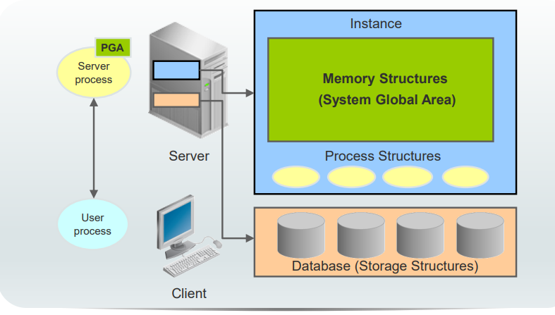
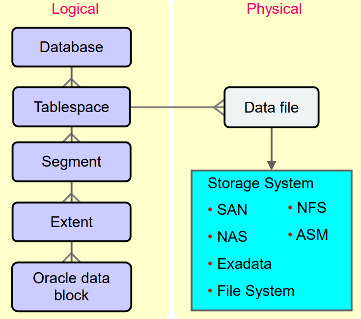
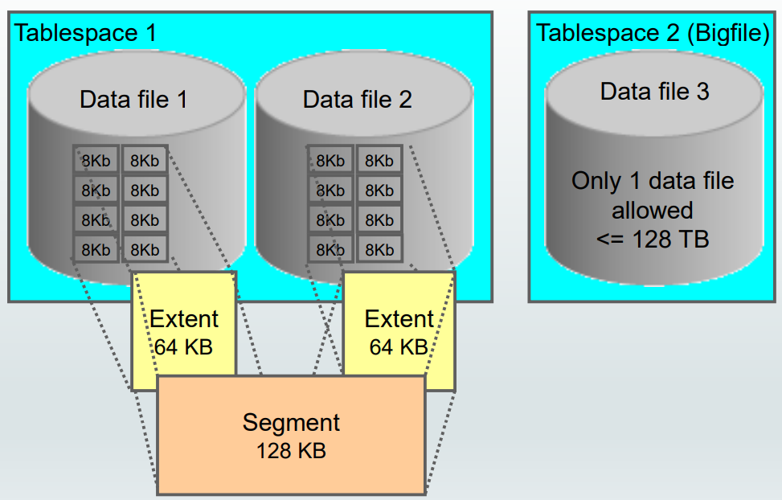
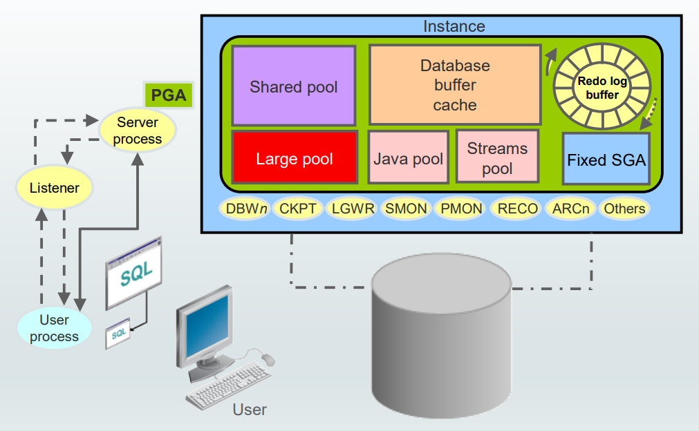

# DBA - Architecture

[Back](../index.md)

- [DBA - Architecture](#dba---architecture)
  - [Architecture Overview](#architecture-overview)
  - [Logical and Physical Database Structures](#logical-and-physical-database-structures)
  - [Default Tablespaces](#default-tablespaces)
  - [Interacting with an Oracle Database: Memory, Processes, and Storage](#interacting-with-an-oracle-database-memory-processes-and-storage)

---

## Architecture Overview

- **Three major structures** in Oracle Database **server architecture**:

  - memory structures
  - process structures
  - storage structures.

- A basic `Oracle database system` consists of

  - **an Oracle database**

    - The `database` consists of both

      - `physical structures`
      - `logical structures`.

    - Because the `physical` and `logical` structures are **separate**, the `physical storage` of data can be managed **without affecting access** to `logical storage structures`.

  - **a database instance.**

    - The `instance` consists of

      - `memory structures`

        - Every time an instance is started, a **shared memory area** called the `System Global Area (SGA)` is allocated,

      - `background processes` associated with that instance.
        - Every time an instance is started the **background processes** are started.
        - Processes are **jobs** that work in the memory of computers.
        - A process is defined as a “thread of control” or a mechanism in an operating system that can run a series of steps.

    - After starting a database instance, the Oracle **software associates the instance with a specific database**. This is called **mounting** the database.
    - The database is then ready to be **opened**, which makes it **accessible to authorized users**.

---

- Summary:

- **Architecture**:

  - memory structure
  - process structure
  - storage structure

- **DB System**:
  - **db**
    - physical storage structure
    - logical storage structure
  - **isntance**
    - memory structures: memory area
      - SGA: shared
      - PGA: nonshared
    - background processes

---

## Logical and Physical Database Structures

- The database has logical structures and physical structures.

- `Databases`

  - Each `database` is logically divided into two or more `tablespaces`.

- `Tablespaces`

  - A `database` is divided into **logical storage** units called `tablespaces`, which **group** related logical structures or data files together.
    - For example, tablespaces commonly group all of an application’s `segments` to simplify some administrative operations.

- `Data Files`

- One or more `data files` are explicitly created for each `tablespace` to physically **store the data of all** `segments` in a tablespace.
- If it is a `TEMPORARY tablespace`, it has a **temporary file** instead of a data file.
- A tablespace’s **data file** can be **physically stored** on any supported storage technology.

- `bigfile tablespaces`

  - You can also create `bigfile tablespaces`, which have **only one file** that is often very large. The
    file may be of any size up to the maximum that the row ID architecture permits.
  - The maximum size of the **single data file** or **temp file** is **128 terabytes (TB)** for a tablespace with 32 K blocks and **32 TB** for a tablespace with 8 K blocks.
  - Traditional smallfile tablespaces (which are the default) may contain **multiple** `data files`, but the files cannot be as large.

- `segments`

  - Segments exist in a tablespace.
  - store subsets of database **objects**
    - such as tables and indexes
  - `Segments` are collections of `extents`.
    - Each `segment` contains one or more `extents`.
    - Standard 128 k

- `extent`

  - `Extents` are collections of `data blocks`.
  - An extent consists of **contiguous data blocks**, which means that **each extent** can exist **only in one data file**.

- `Data Blocks`

  - `Data blocks` are mapped to **disk blocks**.
  - the smallest unit of I/O in the database.
  - At the finest level of granularity, an Oracle database’s **data is stored in `data blocks`**.
  - One `data block` corresponds to a specific number of bytes of **physical space** on the disk.
  - A `data block` size is specified for each tablespace when it is created.
  - A `database` uses and allocates **free database space** in Oracle data blocks.
  - Each row has unique **row id**.

- The **size of the data block** can be set at the time of database creation.

  - The default size of **8 KB** is adequate for most databases.
  - The maximum block size depends on your OS.
  - The minimum Oracle block size is **2 KB**; it should rarely (if ever) be used.
    - If your database supports a **data warehouse** application that has large tables and indexes, a **larger block size** may be beneficial.
    - If your database supports a **transactional application** in which reads and writes are random, specifying a **smaller block size** may be beneficial.

- When the database **requests** a set of `data blocks` from the operating system (OS), the **OS** **maps** this to an actual file system or disk block on the storage device.

  - Because of this, you _do not need to know the physical address_ of any of the data in your database.
  - This also means that a data file can be striped or mirrored on **several disks**.

---

## Default Tablespaces

| Tablespace | Description                                                            |
| ---------- | ---------------------------------------------------------------------- |
| `SYSTEM`   | used for core functionality.                                           |
| `SYSAUX`   | helps reduce the load on the `SYSTEM` tablespace.                      |
| `TEMP`     | contains schema objects only for a session's duration.                 |
| `UNDO`     | stores the data needed to roll back, or undo, changes to the database. |
| `USERS`    | stores user objects and data.                                          |

- `SYSTEM`:

  - **mandatory, must be online**
  - stores the `data dictionary` (metadata that describes the objects in the database) and tables that contain **administrative information** about the database.
    - All this information is contained in the `SYS` schema and can be **accessed only** by the `SYS user` or other administrative users with the required privilege.

- `SYSAUX`:

  - **mandatory, must be online**
  - an auxiliary tablespace to the SYSTEM tablespace and helps **reduce the load** on the SYSTEM tablespace.

- `TEMP`:

  - contains **schema objects** only for a **session's duration**.
  - Objects in **temporary tablespaces** are **stored** in temp files.
  - Your temporary tablespace is used when you execute a SQL statement that requires the creation of temporary segments (such as a _large sort_ or _the creation of an index_).
  - Just as each user is assigned a default tablespace for storing created data objects, **each user** is **assigned a temporary tablespace**.

- `UNDO`:

  - stores the data needed to **roll back, or undo, changes** to the database.

- `USERS`:
  - stores **user objects and data**.
  - If **no default tablespace is specified** when a user is created, then the USERS tablespace is the default tablespace for all objects created by that user.
  - For the **SYS and SYSTEM users**, the default permanent tablespace is `SYSTEM`.

---

- Each Oracle database **must contain** a `SYSTEM` tablespace and a `SYSAUX` tablespace.

  - They are **automatically created** when the **database** is created.

- bigfile tbsp

  - The system default is to create a smallfile tablespace. You can also create bigfile tablespaces, which enable the Oracle database to manage ultralarge files.

- Accesibility

  - A tablespace can be **online (accessible)** or **offline (not accessible)**.
  - The `SYSTEM` tablespace is **always online** when the database is open. It stores tables that support the core functionality of the database, such as the data dictionary tables.
  - The SYSAUX tablespace stores many database components and **must be online** for the correct functioning of all database components.
    - Note: The `SYSAUX` tablespace may be **taken offline** to perform **tablespace recovery**, whereas this is not possible for the SYSTEM tablespace.
  - Neither of them may be made read-only.

- Application's data

  - The `SYSTEM` and `SYSAUX` tablespaces are not recommended for storing an application’s data.
  - Additional tablespaces can be created for this purpose.

---

## Interacting with an Oracle Database: Memory, Processes, and Storage

- Example:
  - It illustrates an Oracle database configuration in which the user and associated server process are on separate computers, connected through a network.

1. An `instance` has **started** on a node where Oracle Database is installed, often called the `host` or `database server`.
2. A user starts an application spawning a `user process`. The application attempts to **establish a connection** to the server. (The connection may be local, client/server, or a three-tier connection from a middle tier.)
3. The server runs a `listener` that has the appropriate Oracle Net Services handler. The `listener` **detects the connection request** from the application and **creates** a dedicated `server process` on behalf of the user process.
4. The user runs a DML-type SQL statement and **commits the transaction**. For example, the user changes the address of a customer in a table and commits the change.
5. The `server process` receives the statement and checks the `shared pool` (an SGA component) for any shared SQL area that contains an identical SQL statement.
   1. If a shared SQL area is **found**, the server process checks the user’s access privileges to the requested data, and the
      existing shared SQL area is used to process the statement.
   2. If a shared SQL area is **not found**, a new shared SQL area is allocated for the statement so that it can be parsed and processed.
6. The `server process` retrieves any necessary data values, either from the actual data file (table) or from values stored in the `database buffer cache`.
7. The `server process` **modifies data** in the SGA. Because the transaction is committed, the `Log Writer process (LGWR)` immediately records the transaction in the `redo log file`. The `Database Writer process (DBWn)` writes modified blocks permanently to disk when it is efficient to do so.

---

[TOP](#dba---architecture)
