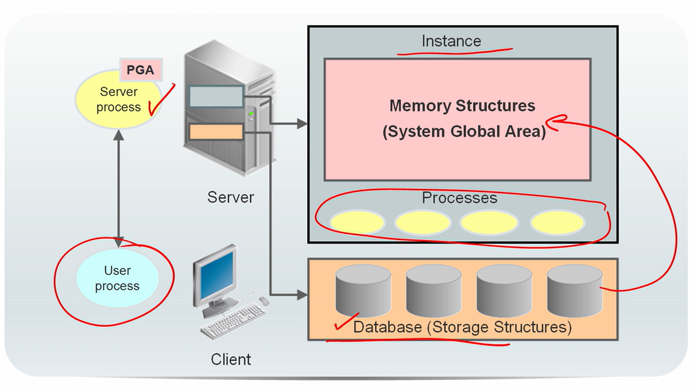
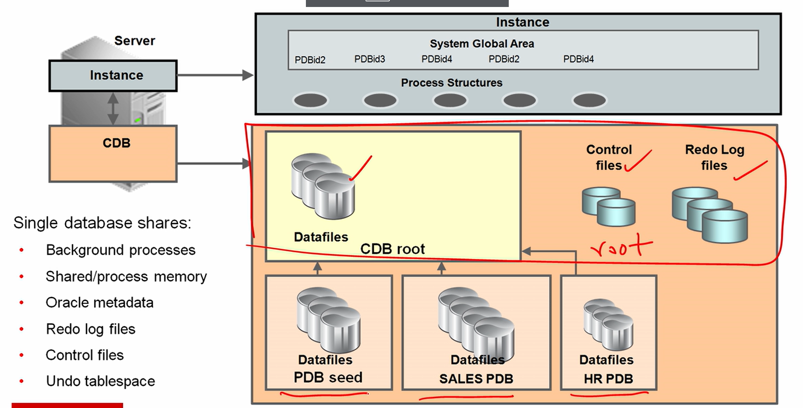
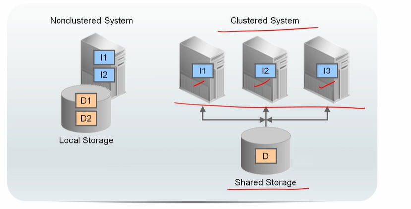

# DBA 1 - Architectural Components

[Back](../index.md)

- [DBA 1 - Architectural Components](#dba-1---architectural-components)
  - [Database Architecture](#database-architecture)
  - [Container Database Architecture](#container-database-architecture)
  - [Single instacne architecture db VS Multiple instance database architecture](#single-instacne-architecture-db-vs-multiple-instance-database-architecture)
  - [Oracle Database sharding](#oracle-database-sharding)

---

## Database Architecture

- Major structures in **Oracle Database server architecture**:

  - `memory structures`
  - `processes`
  - `storage structures`.

- An Oracle Database consists of **at least**:

  - **one database instance**

    - The database instance handles memory and processes

      - `memory structures` / `System Global Area (SGA)`

        - The data in data files are read into a logical format, then placed in the shared SGA, and served to user.
        - a shared memory that multiple connections can share the same blocks, same type of execution, and same data. Thus, the countinuous I/O is not needed.

      - `Processes`
        - jobs that work in the memory of computer
        - a bunch of background processes to maintain the consistency between memory structures and storage structures.

  - **one database**:

    - `storage structure`
    - The database consists of **physical files** called `data files`, and can be a `non-container database` or a `multitenant container database`.
    - used to maintain a **structural method**, maintain **consistency of transaction management** , and all of the **physical data files** where the data is stored in.

  - An Oracle Database also uses several database system files during its operation.

- **When an instance is started,**

  - allocates **SGA**
  - starts **background processes**
  - associates the instance with a specific database. (**mount** the database)
    - **mount mode** is the open mode when an instance first associated with a specific database at startup.
  - ready to be opened and accessible to authorized users.

- In terms of User-Server

  - User invoke client software and get a process started on the **client process (user process)**
  - User process connects to the database instance, via a **listener**
  - The database instance will be assigned a **server process** and a piece of **private memory**.
    - The client's requests can then happen and be _performed by that server process within that private memory_.

- `listener`

  - a database server process.
  - It receives client requests, establishes a connection to the database instance, and then hands over the client connection to the server process.
  - The listener can run locally on the database server or run remotely.
  - Typical Oracle RAC environments are run remotely.

---

## Container Database Architecture

- `Container`:

  - A logical collection of data or metadata within the multitenant architecture.

- `system container` includes

  - **root CDB**
  - **all PDBs** in the CDB.

- `Container database(CDB)` / `Multitenant Container Database`

  - includes control files, redo log files, and main database file.
  - considered as **root**
  - **only has Oracle metadata**.
    - cannot put any user data in it.

- `Pluggable Database`

  - A portable collection of schemas, schema objects, and nonschema objects.
  - a database created for a particular application.
  - All application-related data will be placeed within the pluggable databases.
  - created from that **PDB seed**, which is a **template**, and then get customized and the structures that are needed created.
    - And then we load the data into that pluggable database.

- This way, each application has its own separate structure and files. So two different applications do not use the same file.

  - **Each PDB has a one-to-one relationship with an application.**
  - Their backups are not mixed.

- Containers in a CDB:

  - CDB root container (aka root)
  - System container (includes the root and all PDBs)
  - Application containers.
  - Root PDB
  - User-created PDBs

- All pluggable db share:

  - background processes
  - Shared memory management structures
  - Some of the Oracle metadata

- Benefits of a CDB:

  - avoid redundancy of backgroud proecesses, memory allocation, and Oracle metadata inseveral dta dictionaries.
  - When applications need to bbe patched or upgraded, the maintenance operation is performed only once on the CDB.

- Variable names:
  - **root container**: `CDB$ROOT`
    - contains data files to store metadata and common users
  - **seed PDB**: `PDB$SEED`

---

## Single instacne architecture db VS Multiple instance database architecture

- `single-instance database architecture`

  - consists of **one database instance** and **one database**.
  - can accessed **only on one single instance**.
    - When the single instance crashes, no connection can be created.
  - A one-to-one relationship exists between the database and the database instance.
  - **Multiple single-instance databases** can be installed on the same server machine.
    - There are separate database instances for each database. This configuration is useful to run different versions of Oracle Database on the same machine.

- `Oracle Real Application Clusters (Oracle RAC) database architecture`
  - consists of **multiple instances** that run on separate server machines.
  - combines multiple hosts
  - All of them share the **same database**.
  - The cluster of server machines appear as a single server on one end, and end users and applications on the other end. This configuration is designed for **high availability**, scalability, and high-end performance.

---

## Oracle Database sharding

- `Sharding`

  - a data tier architecture where data is **horizontally** partitioned across independent databases.
  - Each database is called `shard`.
  - a shared-nothing database architecture.
    - do not share physical resources.

- `Sharded database(SDB)`

  - All shards make up a single logical database

- `Oracle Database sharding`

  - a solution for big data
  - If application is big, can divide them up into pieces using **partitioning**, where each partition can then be accessed and serve a particular client operation.

- And these Oracle databases work in parallel underneath. They are invisible to the client.
- Clients go to a **central connection location** managed by the `sharded director`. And the request was then sent to these sharded databases to be fulfilled.

  - Up to 48 SDB.

- `Horizontal partitioning`
  - involves spliting a database table across shards.
  - Each shard contains the table with the same columns but a different subset of rows.
  - Each partition of **logical table (sharded table)** resides in a specific shard.

---

[TOP](#dba-1---architectural-components)
