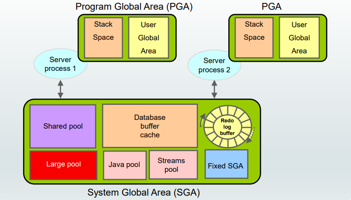
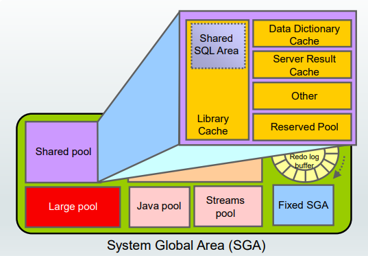
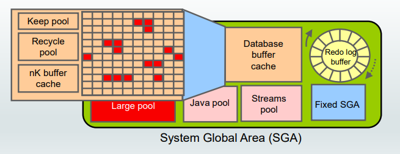
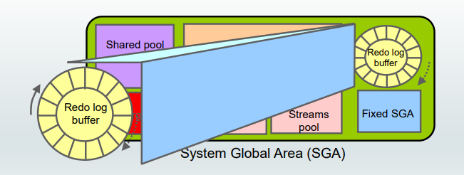
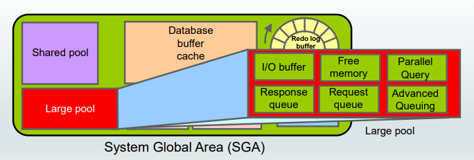
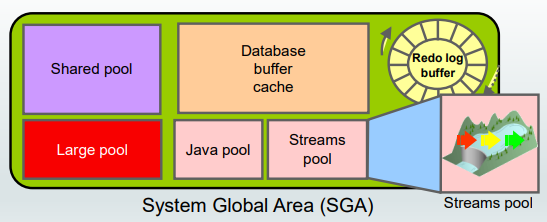
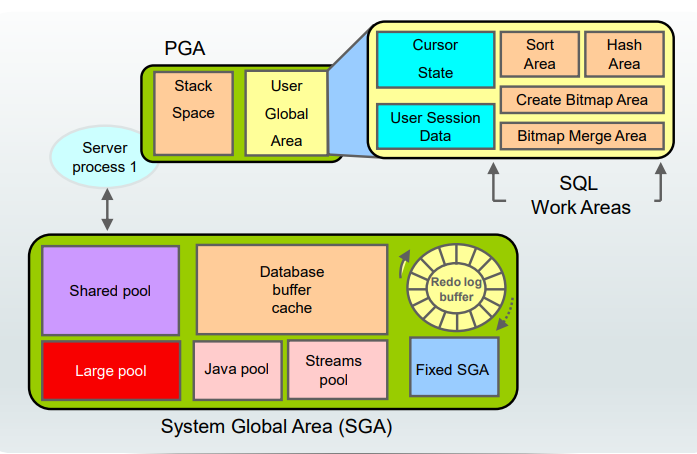
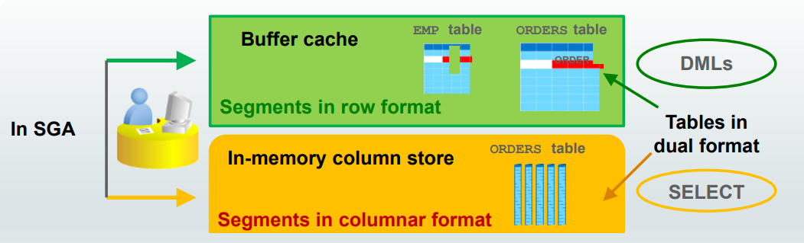
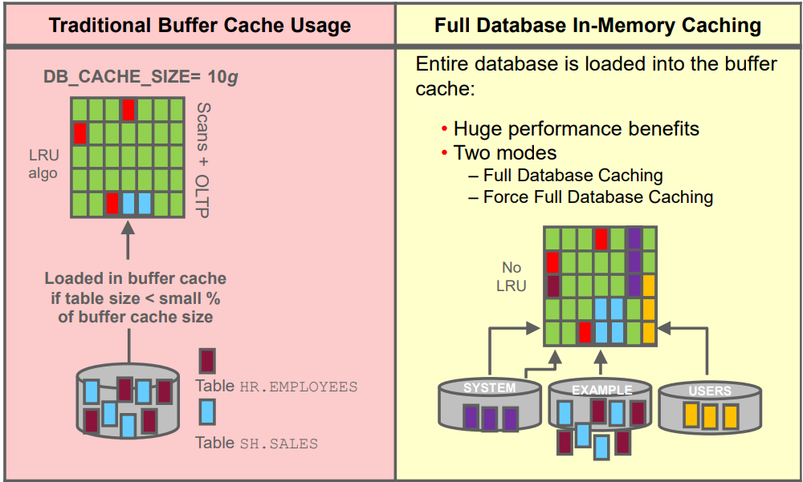

# DBA - Architecture: Memory Stucture

[Back](../index.md)

- [DBA - Architecture: Memory Stucture](#dba---architecture-memory-stucture)
  - [Memory Structures](#memory-structures)
  - [System Global Area (SGA)](#system-global-area-sga)
    - [SGA: Shared pool](#sga-shared-pool)
    - [SGA: Database Buffer Cache](#sga-database-buffer-cache)
    - [SGA: Redo Log Buffer](#sga-redo-log-buffer)
    - [SGA: Large Pool](#sga-large-pool)
    - [SGA: Java Pool](#sga-java-pool)
    - [SGA:Streams Pool](#sgastreams-pool)
  - [PGA](#pga)
  - [In-Memory Column Store](#in-memory-column-store)
    - [Summary](#summary)

---

## Memory Structures

- Oracle Database creates and uses memory structures for various purposes.

  - For example, memory stores program code being run, data that is shared among users, and private data areas for each connected user.

- Two **basic memory structures** are associated with an instance:

  - `System Global Area (SGA)`

  - `Program Global Area (PGA)`

---

## System Global Area (SGA)

- `System Global Area (SGA)`:

  - Group of shared memory structures, known as SGA components, which _contains data and control information_ for one Oracle Database **instance**.
  - The SGA is **shared by** all _server_ and _background processes_.
  - Examples of data stored in the SGA include **cached data blocks** and **shared SQL areas**.

---

### SGA: Shared pool

- `shared pool`

  - portion of the SGA
  - contains
    - the **library cache**: data dict
      - Shared SQL area
    - the **data dictionary cache**: data dict(row)
    - the **server result cache** containing the SQL query result cache and the PL/SQL function result cache, buffers for parallel execution messages, and control structures.

- `data dictionary`

  - a collection of **database tables and views** containing **reference information** about the database, its structures, and its users.
  - Oracle Database accesses the data dictionary frequently during SQL statement parsing.
    - This access is essential to the **continuing operation** of Oracle Database.

- The `data dictionary` is accessed so often by Oracle Database that **two special locations** in memory are designated to hold dictionary data.

  - One area is called the `data dictionary cache`, also known as the `row cache` because it holds data as rows instead of buffers (buffers hold entire blocks of data).
  - The other area in memory that holds dictionary data is the `library cache`.

- All Oracle Database user processes **share** these two caches for access to data dictionary information.

- Oracle Database represents each SQL statement that it runs with a shared SQL area (as well as a private SQL area kept in the PGA). Oracle Database recognizes when two users are executing the **same SQL statement** and **reuses** the `shared SQL area` for those users.

---

### SGA: Database Buffer Cache

- `database buffer cache`

  - the portion of the SGA
  - holds **block images read from data files** or constructed dynamically to satisfy the read consistency model.
  - All users who are concurrently connected to the instance **share** access to the database buffer cache.

- The first time an Oracle Database user process requires a particular piece of data, it searches for the data in the database buffer cache.

  - If the process finds the data **already in the cache** (a `cache hit`), it can read the data directly from memory.
  - If the process **cannot find the data in the cache** (a `cache miss`), it must **copy** the data block from a data file on disk into a buffer in the cache **before** accessing the data.
  - Accessing data through a `cache hit` is **faster** than accessing data through a `cache miss`.

- The buffers in the cache are managed by a complex algorithm that uses a combination of `least recently used (LRU)` lists and touch count.

  - The LRU helps to ensure that the **most recently used blocks tend to stay in memor**y to minimize disk access.

- The `keep buffer pool` and the `recycle buffer pool` are used for specialized **buffer pool tuning**.

- `keep buffer pool`
  - designed to **retain buffers in memory longer** than the LRU would normally retain them.
- `recycle buffer pool`

  - designed to **flush buffers from memory faster** than the LRU normally would.

- Additional `buffer caches` can be configured to hold blocks of a **size** that is different from the default block size.

---

### SGA: Redo Log Buffer

- `redo log buffer`

  - a **circular buffer** in the SGA that holds **information about changes** made to the database.
  - This information is stored in `redo entries`.

- `Redo entries`

  - contain the **information necessary to reconstruct (or redo) changes** that are made to the database by `DML`, `DDL`, or **internal operations**.
  - used for database **recovery**, if necessary.

- As the server process **makes changes** to the buffer cache, redo entries are generated and **written to the redo log buffer** in the SGA. The redo entries take up continuous, sequential space in the buffer.

- Process
  - The **`log writer` background process** **writes** the `redo log buffer` to the active `redo log file` (or group of files) on disk.

---

### SGA: Large Pool

- `Large Pool`

  - Provides large **memory allocations** for:
    - **Session memory** for the _shared server_ and the Oracle _XA interface_ (used where transactions interact with multiple databases)
    - **I/O server processes**
    - Oracle Database **backup and restore operations**
    - **Parallel Query operations**
    - **Advanced Queuing memory table storage**

- By allocating session memory from the large pool for shared server, Oracle XA, or parallel query buffers, Oracle Database can use the shared pool primarily for **caching shared SQL** and** avoid the performance overhead** that is caused by shrinking the shared SQL cache.

- In addition, the memory for Oracle Database backup and restore operations, for I/O server processes and for parallel buffers, is allocated in buffers of a few hundred kilobytes. The large pool is better able to satisfy such large memory requests than the shared pool.

- The large pool is not managed by a `least recently used (LRU)` list.

---

### SGA: Java Pool

- `Java pool memory`

  - used to store all session-specific **Java code and data** in the `Java Virtual Machine (JVM)`.
  - used in different ways, depending on the **mode** in which Oracle Database is running.

---

### SGA:Streams Pool

- Streams pool memory is used **exclusively by Oracle Streams** to:

  - Store **buffered queue messages**
  - Provide memory for **Oracle Streams processes**

- `Streams pool`
  - used **exclusively** by `Oracle Streams`.
  - stores **buffered queue messages** and provides **memory** for `Oracle Streams` capture processes and apply processes.
- Unless you specifically configure it, the size of the Streams pool starts at **zero**.
- The pool size **grows dynamically** as needed when Oracle Streams is used.

---

## PGA

- `Program Global Area (PGA)`

  - a **private memory region** containing data and control information **for a server process**.
  - A PGA is **nonshared memory** created by Oracle Database _when a server or background process is started_.

    - 一对一: process <-> PGA
      - Access to the PGA is **exclusive to the server process**.
      - Each server process and background process has **its own PGA**.

  - Each `server process` has a **distinct** `PGA`.
    - Access to it is **exclusive** to that server process, and it is **read only** by Oracle code acting on behalf of it.
    - It is **not available for developer’s code**.

- Every PGA **contains stack space**.
- In a **dedicated** server environment, **each user** connecting to the database instance has **a separate server process**. For this type of connection, the PGA contains **a subdivision of memory** known as the `User Global Area (UGA)`.

  - The `UGA` is composed of:

    - **Cursor area** for storing runtime information on cursors
    - **User session data storage area** for control information about a session
    - **SQL working areas** for processing SQL statements consisting of:
      - **A sort area** for functions that order data such as `ORDER BY` and `GROUP BY`
      - **A hash area** for performing **hash joins** of tables
      - **A create bitmap area** used in **bitmap index creation** common to data warehouses
      - **A bitmap merge area** used for **resolving bitmap index** plan execution

  - In a **shared** server environment, multiple client users **share** the server process.
    - In this model, the UGA is moved into the `SGA` (`shared pool` or `large pool` if configured), leaving the PGA with **only stack space**.

---

- Summary:

- Server Process <-> PGA
- read only: not available for developer’s code

- Dedicated PGA:

  - stack space
  - UGA
    - Cursor
    - Session
    - SQL
      - sort
      - hash
      - create bitmap
      - bitmap area

- Shared PGA:
  - stack space

---

## In-Memory Column Store

- `In-Memory Column Store`

  - enables objects (tables, partitions, and other types) to be **stored in memory in a new format** known as the `columnar format`.

- `columnar format`

  - enables scans, joins, and aggregates to **perform much faster** than the traditional on-disk format, thus providing fast **reporting** and **DML performance** for both `OLTP` and `DW` environments.
  - useful for analytic applications that operate on few columns **returning many rows** rather than for OLTP that operates on few rows returning many columns.
  - The DBA must define the **segments** that are to be populated into the in-memory column store (IM column store), such as hot tables, partitions, and, more precisely, the more frequently accessed columns.

- When a segment, such as a table or a partition, is populated into the `IM column store`, the on-disk format segment is automatically **converted into a columnar format** and optionally compressed.

  - The columnar format is a **pure in-memory format**.
  - There is **no columnar format storage on disk**. It **never** causes **additional writes** to disk and therefore does not require any logging or undo space.
  - All data is stored on **disk** in the **traditional row format**.

---

- The in-memory columnar format **does not replace the on-disk or buffer cache format**. It is a **consistent copy** of a table or of some columns of a table converted to the new columnar format that is **independent of the disk format** and only available in memory.

  - Because of this independence, applications are able to transparently use this option without any changes.

- Moreover, the columnar format of a segment is a **transaction-consistent copy** of the segment either **on disk** or **in the buffer cache**. Transaction consistency between the two pools is maintained.

---

- For the data to be converted into the new columnar format, a **new pool** is requested in the `SGA`. The pool is the `IM column store`.
  - If sufficient space is allocated for the `IM column store`, a query that **accesses objects** that are candidates to be populated into the IM column store performs much faster.
  - The improved performance allows **ad hoc analytic queries** to be **executed directly on the real-time transaction data** without impacting the existing workload.
  - A **lack of IM column store space** does not prevent statements from executing against tables that could have been populated into the IM column store.

---

---

### Summary

| portion of the SGA      | Process             | File            | Desc                                    |
| ----------------------- | ------------------- | --------------- | --------------------------------------- |
| `Shared pool`           |                     |                 | data dict,sql statement                 |
| `Database Buffer Cache` | `DBWn`              | `data file`     | holds block images read from data files |
| `Redo Log Buffer`       | `LGWR`              | `redo log file` | holds information about changes         |
| `Large Pool`            |                     |                 | Session, IO, Query, queue               |
| `Java Pool`             |                     |                 | JVM                                     |
| `Streams Pool`          | `Streams processes` |                 | Queue messages                          |

---

[TOP](#dba---architecture-memory-stucture)
