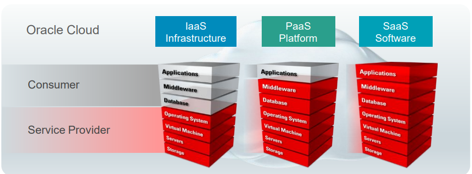

# DBA - Introduction

[Back](../index.md)

- [DBA - Introduction](#dba---introduction)
  - [Oracle Database](#oracle-database)
  - [On-Premises Editions](#on-premises-editions)
    - [Personal Edition](#personal-edition)
    - [Standard Edition 2](#standard-edition-2)
    - [Oracle Database Enterprise Edition (EE)](#oracle-database-enterprise-edition-ee)
  - [Oracle Database Options](#oracle-database-options)
  - [Oracle Management Packs](#oracle-management-packs)
  - [Oracle Cloud](#oracle-cloud)
  - [Oracle Database Cloud Service Editions](#oracle-database-cloud-service-editions)
  - [Oracle SQL and PL/SQL](#oracle-sql-and-plsql)

---

## Oracle Database

- `Oracle Database`

  - a `relational database management system` (`RDBMS`).
  - enables you to **store, organize, and retrieve** data for your applications.

- `Oracle Database 18c`
  - First annual release of Oracle Database
  - Oracle will **deliver annual releases** and **quarterly updates** of Oracle Database.
  - `Quarterly Release Updates` (`RUs`) and `Release Update Revisions` (`RURs`) will be delivered

---

## On-Premises Editions

### Personal Edition

- `Oracle Database Personal Edition (PE)`

  - supports **single-user development** and **deployment environments** that require full compatibility with Oracle Database Standard Edition One, Oracle Database Standard Edition, and Oracle Database Enterprise Edition.
  - includes all the **components** that are included with Enterprise Edition, as well as all the options that are available with Enterprise Edition.
  - available on **Windows platforms only**.
  - The **Management Packs** are not included in Personal Edition.
  - Note: You **cannot** use the Oracle `Real Application Clusters` (`RAC`) option with Personal Edition

---

### Standard Edition 2

- `Oracle Database Standard Edition` delivers the unprecedented ease of use, power, and performance of Standard Edition One, with support for larger machines and clustering of services with Oracle RAC.

  - Oracle Real Application Clusters (Oracle RAC) is **not included** in the Standard Edition of releases before Oracle Database 10g, nor is it an available option with those earlier releases.

- `Oracle Database Standard Edition One` delivers unprecedented ease of use, power, and performance for workgroup, department-level, and web applications.

  - From single-server environments for small business to highly distributed branch environments, Oracle Database Standard Edition One includes all the facilities necessary to build business-critical applications.

- `Oracle Database Standard Edition 2 (SE2)`
  - Before SE2, there is SE (Standard Edition) and SE1 (Standard Edition1).
  - `SE2` supports `Oracle Real Application Clusters (RAC)`.
  - SE2 supports **single tenant** but lacks the following features, options, and tools:
    - Parallel execution
    - Oracle Data Guard
    - Enterprise Manager Cloud Control
    - Management packs
  - SE2 supports the **multitenant architecture**, but with **one pluggable database (PDB) only**.
  - SE2 lacks the following features:
    - Flashback Database (and all other Flashback features), tablespace point-in-time recovery, online table redefinition, Query Results Cache, Database Resource Manager
    - Options such as In-Memory Database Cache, Oracle Partitioning, and Oracle Database Vault
    - All management packs such as Oracle Tuning Pack
  - SE2 cannot be used with Oracle Enterprise Manager Cloud Contro

---

### Oracle Database Enterprise Edition (EE)

---

## Oracle Database Options

- The table lists the separately **licensed options** that are available for use with Oracle Database. You **must be licensed** for an option in order to use any of its features.

| Option                                          | Description                                                                                                                                                                                               |
| ----------------------------------------------- | --------------------------------------------------------------------------------------------------------------------------------------------------------------------------------------------------------- |
| Oracle `Active Data Guard`                      | Increases performance, availability, data protection, and return on investment wherever Data Guard is used for **real-time data protection** and availability                                             |
| Oracle `Advanced Analytics`                     | Empowers data and business **analysts** to extract knowledge, discover new insights, and make predictions—working directly with large data volumes                                                        |
| Oracle `Advanced Compression`                   | Provides comprehensive **data compression** and `Information Lifecycle Management (ILM)` capabilities for all types of data                                                                               |
| Oracle `Advanced Security`                      | Helps you **protect sensitive information** and comply with privacy and compliance regulations by enabling database **encryption** and data redaction                                                     |
| Oracle `Database In-Memory`                     | Enables any existing Oracle Database–compatible application to automatically and transparently take advantage of columnar **in-memory processing**, without additional programming or application changes |
| Oracle `Database Vault`                         | Enables you to **control** when, where, and by whom the database and application data can be **accessed**                                                                                                 |
| Oracle `Label Security`                         | Provides sophisticated and flexible security based on row labels for **fine-grained access control**                                                                                                      |
| Oracle `Multitenant`                            | Enables an Oracle database to function as a **multitenant container database (CDB)** that includes one or more pluggable databases (PDBs)                                                                 |
| Oracle `On-Line Analytical Processing (OLAP)`   | A full-featured **OLAP server** embedded in Oracle Database Enterprise Edition                                                                                                                            |
| Oracle `Partitioning`                           | Adds significant manageability, availability, and **performance** capabilities to large underlying database tables and indexes                                                                            |
| Oracle `Real Application Clusters (Oracle RAC)` | A database computing environment that harnesses the processing power of **multiple interconnected computers using clustering technology**                                                                 |
| Oracle `Real Application Testing`               | Comprises a suite of features that help **protect** database applications from the **undesirable impact** of routine changes                                                                              |
| Oracle `Spatial and Graph`                      | Includes advanced features for **spatial data** and analysis and for physical, network, and social graph applications                                                                                     |

---

## Oracle Management Packs

- The table lists the separately licensed packs that are available for use with Oracle Database.

| Pack                                                            | Description                                                                                                                                                                       |
| --------------------------------------------------------------- | --------------------------------------------------------------------------------------------------------------------------------------------------------------------------------- |
| Oracle `Cloud Management Pack` for Oracle Database              | Helps to set up a **Database Cloud** and operate the Database as a Service model                                                                                                  |
| Oracle Data `Masking and Subsetting Pack`                       | Facilitates the **creation of production-like data** for nonproduction environments by replacing production data with fictitious yet realistic values                             |
| Oracle Database `Lifecycle Management Pack` for Oracle Database | Provides a comprehensive solution that helps database, system, and application administrators **automate the processes** required to **manage** the Oracle Database **Lifecycle** |
| Oracle `Diagnostics Pack`                                       | Provides automatic performance **diagnostic** and advanced system **monitoring** functionality                                                                                    |
| Oracle `Tuning Pack`                                            | Provides database administrators with **expert performance** management for the Oracle environment, including SQL tuning and storage optimizations                                |

---

## Oracle Cloud

- `Oracle Cloud`

  - an **enterprise cloud** for business.

- Oracle Cloud offers **self-service business applications** delivered on an integrated development and deployment platform with tools to extend services and create new services rapidly.

- **Oracle Database Cloud Service** is a `PaaS` offering.
- With Oracle Database Cloud Service, you can:
  - **Provision** a full-featured **dedicated Oracle database**
  - Use cloud tooling to **back up, patch, and manage** the database
  - Avail of the complete administration **privileges** of the server and database to manage it as you need

- `Software as a Service (SaaS)`

  - modern cloud applications from Oracle help you re-imagine your business.
  - The best-of-breed SaaS applications in Oracle Cloud are integrated with social, mobile, and analytic capabilities to help you deliver the experiences customers expect, the talent to succeed, and the performance that the market demands.

- `Platform as a Service (PaaS)`

  - helps enterprise IT and independent software vendor (ISV) developers rapidly build and deploy rich applications or extend SaaS applications by using an enterprise-grade cloud platform based on the industry’s leading database and application server.

- `Infrastructure as a Service (IaaS)`
  - a comprehensive set of integrated, subscriptionbased infrastructure services that enable businesses to run any workload in an enterprise-grade cloud that is managed, hosted, and supported by Oracle.

---

## Oracle Database Cloud Service Editions

| Edition                          | Included Options                                                                                                                                                                                                                           | Included Packs                                                                                                        |
| -------------------------------- | ------------------------------------------------------------------------------------------------------------------------------------------------------------------------------------------------------------------------------------------ | --------------------------------------------------------------------------------------------------------------------- |
| `Standard`                       | None                                                                                                                                                                                                                                       | None                                                                                                                  |
| `Enterprise`                     | None                                                                                                                                                                                                                                       | None                                                                                                                  |
| `Enterprise—High Performance`    | Advanced Analytics, Advanced Compression, Advanced Security, Database Vault, Label Security, Multitenant, OLAP, Partitioning, Real Application Testing, Spatial and Graph                                                                  | Cloud Management for Oracle Database, Database Lifecycle Management, Data Masking and Subsetting, Diagnostics, Tuning |
| `Enterprise—Extreme Performance` | Active Data Guard, Advanced Analytics, Advanced Compression, Advanced Security, Database InMemory, Database Vault, Label Security, Multitenant, OLAP, Partitioning, Real Application Clusters, Real Application Testing, Spatial and Graph | Cloud Management for Oracle Database, Database Lifecycle Management, Data Masking and Subsetting, Diagnostics, Tuning |

---

## Oracle SQL and PL/SQL

- Oracle `SQL`

  - the language you use to **perform operations on the data** in an Oracle database.

- `PL/SQL`

  - a procedural extension to Oracle SQL.
  - It enables you to control the flow of a SQL program, use variables, and write errorhandling procedures.

- `Relational Database Models`

  - used to organizes and presents the **physical data** as **logical structures**, such as tables (with columns and rows).
  - These logical structures make the data **understandable**.

- `schema`
  - a **collection of logical structures** that are owned by a database user and can include tables, views, sequences, stored procedures, synonyms, indexes, clusters, and database links.
  - In general, schemas include everything your application creates in the database.

---

[TOP](#dba---introduction)
