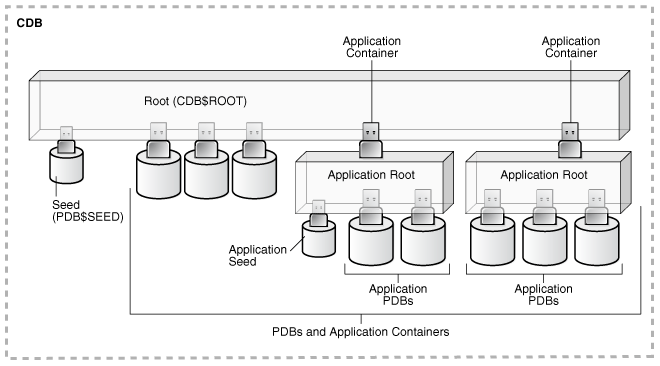

# DBA - Multitenant: CDB

[Back](#dba---multitenant-cdb)

- [DBA - Multitenant: CDB](#dba---multitenant-cdb)
  - [CDB](#cdb)
  - [The CDB Root and System Container](#the-cdb-root-and-system-container)

---

## CDB

- The multitenant architecture enables an Oracle database to function as a `multitenant container database (CDB)`.

- `Container`

  - a **collection** of schemas, objects, and related structures in a `multitenant container database (CDB)`.

- A `CDB` includes zero, one, or many customer-created `pluggable databases (PDBs)` and `application containers`.

- `application container`
  - an optional, user-created CDB component that stores data and metadata **for one or more application back ends**.
  - A CDB includes zero or more application containers.

---

- Every CDB has the following **containers**:

  - `system container`: **1**

    - includes the **root CDB** and **all PDBs** in the CDB.
    - Thus, the `system container` is the **logical container** for the CDB itself.

  - `CDB root container`: **1**

    - aka `root`
    - The root container is named `CDB$ROOT`.
    - a collection of schemas, schema objects, and nonschema objects to which **all PDBs belong**.
    - The root **stores Oracle-supplied metadata** and **common users**.

      - An example of metadata is the source code for _Oracle-supplied PL/SQL packages_.
      - A common user is _a database user known in every container_.

  - `seed PDB`: **1**

    - a **system-supplied template** that the CDB can use to create new PDBs.
    - named `PDB$SEED`.
    - You **cannot add or modify objects** in PDB$SEED.

  - `application containers`: **>=0**

    - consists of **exactly one** `application root`, and the `PDBs` plugged in to this root.
    - Whereas the system container contains the CDB root and all the PDBs within the CDB, an application container includes only the PDBs plugged into the application root.
    - **belongs to the CDB root** and no other container.

  - `PDBs` / `user-created PDBs`: **>=0**

    - **No PDBs exist at creation of the CDB.** You add PDBs based on your business requirements.
    - A PDB contains the **data** and **code** required for a specific set of features

      - For example, a PDB can support a specific application, such as a human resources or sales application.

    - belongs to **exactly zero or one application container**.
      - If a PDB belongs to an application container, then it is an `application PDB`.
        - For example, the cust1_pdb and cust2_pdb application PDBs might belong to the saas_sales_ac application container, in which case they belong to no other application containers.
        - An `application seed` is an optional **application PDB** that acts as a user-created PDB **template**, enabling you to create new application PDBs rapidly.

---

## The CDB Root and System Container

- `CDB root` / `root`

  - a collection of schemas, schema objects, and nonschema objects to which all PDBs belong.

  - Every `CDB` has **one and only one root container** named `CDB$ROOT`.

  - All `PDBs` belong to the `root`.

- `system container`

  - the CDB root
  - all PDBs that belong to this root.

- `CDB root`: system metadata + common user

  - stores the **system metadata** required to manage `PDBs`.
  - does not store user data.
  - you can create **common users and roles** for database administration.
    - A common user with the necessary privileges can switch between containers.
  - Oracle recommends that you **do not add common objects** to the root or **modify** Oracle-supplied schemas in the root.

- **Character set**
  - Oracle recommends `AL32UTF8` for the root character set.
  - PDBs with different character sets can reside in the same CDB without requiring character set conversion.

---

---

[TOP](#dba---multitenant-cdb)
