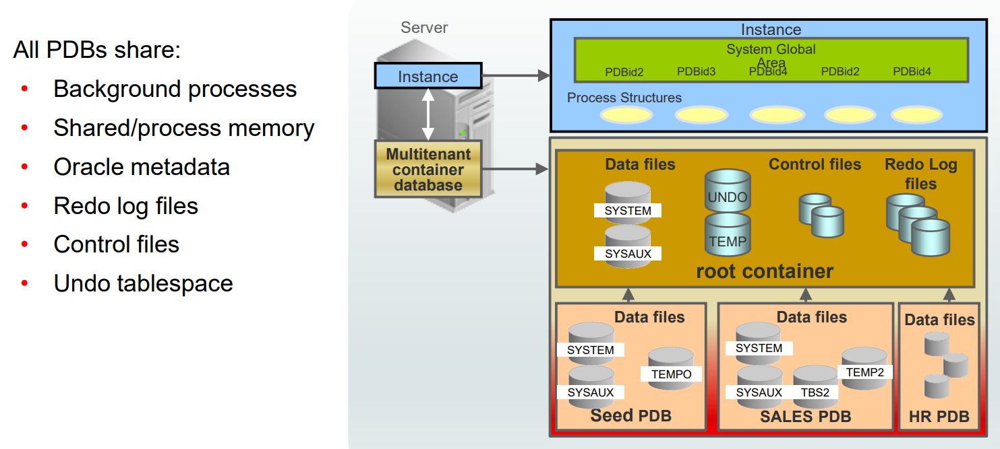

# DBA - Multitenant

[Back](../index.md)

- [DBA - Multitenant](#dba---multitenant)
  - [Multitenant architecture](#multitenant-architecture)

---

## Multitenant architecture

- `container database (CDB)`

  - But at the **physical** level, the `multitenant container database (CDB)` has a `database instance` and `database files`, just as a noncontainer database does.

- `pluggable database (PDB)`

  - a set of database schemas that appears **logically to users and applications** as a separate database.
  - It is easy to plug non-CDBs into a CDB.

- **goals** of the multitenant architecture

  - each PDB has a one-to-one relationship with an application.

  - **avoids redundancy**: All pluggable databases share the followings created by CDB:

    - Background processes
    - Memory allocation
    - Oracle metadata in several data dictionaries

  - A CDB grouping several applications has

    - one instance,
    - one set of background processes,
    - one SGA allocation
    - one data dictionary in the root container,
    - common for all PDBs

  - Each PDB maintaining its own application **data dictionary**.
  - When applications need to be patched or upgraded, the maintenance operation is performed only
    once on the CDB, and consequently, all applications are **updated at the same time**.

---

[TOP](#dba---multitenant)
