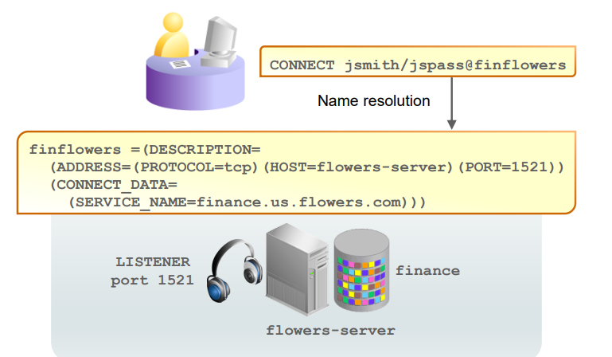

# DBA - Oracle Net Services

[Back](../index.md)

- [DBA - Oracle Net Services](#dba---oracle-net-services)
  - [Oracle Net Services](#oracle-net-services)
    - [Oracle Net Listener](#oracle-net-listener)
  - [Default Listener](#default-listener)
    - [Establishing Oracle Network Connections](#establishing-oracle-network-connections)
    - [`SERVICE_NAMES`](#service_names)
    - [Connect string](#connect-string)
    - [Example: Name Resolution Connection](#example-name-resolution-connection)
    - [Establishing a Connection](#establishing-a-connection)
  - [Service Registration](#service-registration)
    - [Dynamic Service Registration](#dynamic-service-registration)
    - [Static Service Registration](#static-service-registration)
  - [Naming Methods](#naming-methods)
    - [Easy Connect](#easy-connect)
    - [Local Naming](#local-naming)
    - [Directory Naming](#directory-naming)
  - [Oracle Net Services Components](#oracle-net-services-components)

---

## Oracle Net Services

- `Oracle Net Services`

  - enables network connections from a **client or middle-tier application** to the **Oracle server**.
  - the **interface** between the **database** and the **network communication protocols** that facilitate distributed processing and distributed databases.
  - Oracle Net Services supports communications on all major network protocols, including `TCP/IP`, `HTTP`, `FTP`, and `WebDAV`.

- `Communication protocols`

  - define the way that data is transmitted and received on a network.

- `Oracle Net`

  - a **component** of Oracle Net Services, establishes and maintains a **network session from a client application to a database server**.
  - After a network session is established, `Oracle Net` acts as the **data courier** for both the _client application_ and the _database server,_ exchanging messages between them.

- It can perform these jobs because it is located on **each computer** that needs to talk to the database server. 包括客户端
  - On the client computer, `Oracle Net` is a **background component for application** connections to the database.
  - On the database server, `Oracle Net` includes an **active process** called `Oracle Net Listener`, which is responsible for coordinating connections between the database and external applications.

---

### Oracle Net Listener

- `Oracle Net Listener` / the `listener`

  - A process that listens for **incoming client connection requests** and **manages network traffic** to the database.
  - the **gateway to the Oracle instance** for all **nonlocal user** connections.
  - An important component of Net Services.

- When a client **requests a network session** with a database, `Oracle Net Listener` (typically called the listener) receives the request.

  - If the client information **matches** the listener information, then the listener **grants a connection** to the database server.
  - When a connection is **established**, the client and database **communicate directly**.

- A **single** listener can service **multiple** `database instances` and thousands of `client` connections

- Tools to configure the listener and specify log file locations
  - `Enterprise Manager Cloud Control` or `Oracle Net Manager`.

---

## Default Listener

- During an Oracle Database installation, `Oracle Universal Installer` launches `Oracle Net Configuration Assistant` and creates **a local listener** named `LISTENER`.

  - `LISTENER` is **automatically populated** with available database services through a feature
    called **dynamic service registration**.

- `LISTENER` **listens** on the following TCP/IP **protocol** address:

```sql
ADDRESS=(PROTOCOL=tcp)(HOST=host_name)(PORT=1521)
```

- Without any configuration, you can access your database instance immediately through LISTENER.
- If the listener name is LISTENER and it cannot be resolved, a protocol address of `TCP/IP` and a port number of 1521 is assumed.

---

### Establishing Oracle Network Connections

- To make a client or middle-tier connection, Oracle Net requires the **client to know** the:

  - the `address` or `host` where the **listener resides**
  - **Port** that the listener is **monitoring**
  - the `protocol` that the listener **accepts**
  - **Name of the service** to which it wants to connect.
    - parameter name: `SERVICE_NAMES`

- `Oracle Net names resolution`

  - the process of determining this connection information.

---

### `SERVICE_NAMES`

- An Oracle **database** is represented to a client **as a service**.

  - A database **can have one or more services** associated with it.
  - Databases are identified by a service name that is specified by the `SERVICE_NAMES` parameter **in the initialization parameter file**.

  - **defaults** to the **global database name**, which is a name that **comprises the database name** (`DB_NAME` parameter value) and **the domain name** (`DB_DOMAIN` parameter value).
  - `DB_NAME` + `DB_DOMAIN`

- `connect descriptor`

  - To connect to a database service, clients use a `connect descriptor` that provides the **location of the database** and the **name of the database service**.
  - Clients can use the **connect descriptor** or a **name that resolves** to the connect descriptor (as discussed later in this lesson).

- Example:

```sh
# connect descriptor
#   enables clients to connect to a database service called finance.us.flowers.com
finflowers =  # net service name
  (DESCRIPTION=
      (ADDRESS=(PROTOCOL=tcp)(HOST=flowers-server)(PORT=1521))
      (CONNECT_DATA=(SERVICE_NAME=finance.us.flowers.com))
)
```

---

### Connect string

- Users can initiate a connection request to the Oracle database by **sending** a `connect string`.

- `connect string`

  - includes a **username** and **password**, along with a **connect identifier**.

- A `connect identifier` can be

  - the `connect descriptor` itself
  - `Name Resolution`, a name that resolves to a connect descriptor.

- The most common `connect identifiers` is a `net service name`, which is a **simple name for a service**.
- When a net service name is used, connection processing takes place by **mapping** the `net service name` to a `connect descriptor`.

  - The mapping information can be stored in one or more repositories of information and is resolved by using a _naming method_.
  - `Name Resolution` = the **method to map** `net service name` to `connect descriptor`.

---

### Example: Name Resolution Connection



- Client:

```bash
# Using connect string
# provide username, password, and a net service name(finflowers)
CONNECT jsmith/jspass@finflowers
```

- Server:

```bash
# A connect descriptor
# provide protocol, host/address, port, service name
finflowers =(
    DESCRIPTION=
      (ADDRESS=(PROTOCOL=tcp)(HOST=flowers-server)(PORT=1521))
      (CONNECT_DATA=
        (SERVICE_NAME=finance.us.flowers.com)
      )
  )
```

---

### Establishing a Connection

name resolution >> listener >> validate service name >> spawn server process >> lsnr pass initialization info server_pro >> server_pro authenticate credentials >> create user process

- After Oracle Net `names resolution` is **complete**, a **connection request** is passed from the user or middle-tier application (hereafter referred to as the `user process`) to the `listener`.

- The listener receives a `CONNECT` packet and checks whether that `CONNECT` packet is requesting a **valid** Oracle Net service name.

  - If the `service name` is **not requested** (as in the case of a `tnsping request`), the listener acknowledges the connect request and does nothing else.
  - If an **invalid** `service name` is requested, the listener transmits an **error code** to the user process.
  - If the CONNECT packet requests a **valid** `service name`, the listener **spawns a new process**, `server process` , to deal with the connection.

- The `listener` **connects** to the process and **passes** the _initialization information_, including the **address** information for the user process.

  - At this point, the listener **no longer deals with the connection**, and all work is **passed to** the `server process`.

- The `server process` checks the user’s authentication credentials (usually a password), and if the credentials are **valid**, a `user session` is **created**.

- **Dedicated server process**:
  - With the session established, the `server process` now acts as the user’s agent on the server.
  - The `server process` is responsible for:
    - **Parsing** and running any SQL statements issued through the application
    - **Checking** the `database buffer cache` for data blocks required to perform SQL statements
    - **Reading** necessary data blocks from data files on the disk into the `database buffer cache` portion of the System Global Area (SGA), if the blocks are not already present in the SGA
    - Managing all **sorting** activity.
      - The `Sort Area` is a memory area that is used to work with sorting; it is contained in a portion of memory that is associated with the `Program Global Area (PGA)`.
    - **Returning results** to the user process in such a way that the application can process the information
    - Reading **auditing** options and reporting user processes to the audit destination

---

## Service Registration

### Dynamic Service Registration

- `Dynamic Service Registration`

  - Deault method
  - allows the Oracle database to identify its available services to listeners **automatically**.

- PDB service

  - By default, `Dynamic service registration` **registers all PDB services** to the same listener.
  - If you **stop that listener**, you **stop access** to all the PDB services.

- **Benefits**

  - **Connect-time failover**:
    - Because the listener always monitors the state of the instances, service registration facilitates **automatic failover** of a client connect request **to a different instance** if one instance is down.
  - **Connection load balancing**:
    - Service registration enables the listener to **forward client connect requests to the least-loaded instance** and dispatcher or dedicated server. Service registration balances the load across the service handlers and nodes.
  - **High availability** for Oracle `Real Application Clusters` and Oracle `Data Guard`

- **Configuration** of dynamic service registration:

  - Make sure that the `INSTANCE_NAME` , `LOCAL_LISTENER`, `REMOTE_LISTENER`, and `SERVICE_NAMES` **initialization parameters** are properly configured.
  - Configure protocol addresses (end points) in the server-side `tnsnames.ora` file.

- The **Role** of the `LREG Process`

  - The `LREG process` polls the listeners to see if they're running and, if so, registers database service information to them:

    - Database `instance name`
    - Database `service names` available on the database instance (for example, ORCL.example.com and PDB1.example.com)
    - Current and maximum **load** for the `database instance`
    - `Service handlers` (dispatchers and dedicated servers) available to the database instance

  - `LREG` registers with the listeners after the database instance **mounts** the database and every `60` seconds afterward

---

### Static Service Registration

- `Static service registration`

  - a method for configuring listeners to obtain their service information **manually**.

- **Advantages** of Static Service Registration

  - Static service registration enables you to **create a listener for a particular PDB**. 专属 listener
  - Sometimes you may need the database instance up and running **without anyone being able to log in**.
    - As soon as it is started up, dynamic service registration will automatically start registering all the database services to the listener, making the database instance available to users.
  - There is also a **difference in error messages** returned between a `static listener` (which can point to a database service that is down) and a dynamic listener entry (which shows nonexistence) when the database instance is **shut down**.
    - The first case knows about the database service's existence and gives you an error message with useful information.
    - The second case has no information and can't distinguish between a typo you may have made in the service name and whether it actually even exists.

- With static registration, the listener has **no knowledge of whether its database services exist or not**.

  - It only knows that it supports them.
  - The Listener Configuration utility shows the **services status** as `UNKNOWN`.

- You can have both `static listeners` and `dynamic listeners` configured at the same time.

- General steps to configure static service registration:

  1. In `listener.ora`, define a `listener` and its `protocol` addresses.
  2. In `listener.ora`, also create a `SID_LIST_<listener name>` section that lists the `database services` for the listener.

- Required Use of Static Service Registration:
  - Use of external procedure calls
  - Use of Oracle Heterogeneous Services
  - Use of Oracle Data Guard
  - Remote database startup from a tool other than Oracle Enterprise Manager Cloud Control

---

## Naming Methods

- `Naming Methods`

  - the methos Oracle Net supports to resolve connection information

---

### Easy Connect

- `Easy connect naming`:

  - Is enabled by default
  - enables clients to connect to an Oracle Database server by u**sing a TCP/IP connect string** consisting of a **host name**, **optional port**, and **service name**
  - Requires no client-side configuration
  - Supports only TCP/IP (no SSL)

- Easy Connect `connection strings`:

  - `<username>/<password>@<hostname>:<listener port>/<service name>`

- Example:

```sh
# SERVICE_NAMES=db
# DB_DOMAIN=us.oracle.com
connect hr/hr@db.us.oracle.com
```

- Offers no support for advanced connection options such as:
  - Connect-time failover
  - Source routing
  - Load balancing

---

---

### Local Naming

- `Local naming`:

  - Requires a client-side names-resolution file
  - Supports all Oracle Net protocols
  - stores `connect descriptors` (identified by their `net service name`) in a local configuration file named `tnsnames.ora` **on the client**. 客户端
  - appropriate for organizations in which Oracle Net service configurations **do not change often**.

- One **advantage** of local naming is that the database users need to remember only a **short alias** rather than the long connect string required by Easy Connect.

- The local list of known services is stored in the following text configuration file:

  - `<oracle_home>/network/admin/tnsnames.ora`
  - path: `TNS_ADMIN` environment variable.

- Supports advanced connection options such as:

  - Connect-time failover
  - Source routing
  - Load balancing

- Example:

```sh
CONNECT hr/hr@orcl
```

---

### Directory Naming

- `Directory naming`:

  - Uses a centralized LDAP-compliant directory server
  - stores connect identifiers in a centralized directory server that is compliant with the Lightweight `Directory Access Protocol (LDAP)`.

- Requires `LDAP` with Oracle Net names resolution information loaded:

  - Oracle Internet Directory
  - Microsoft Active Directory Service

- **advantage** of directory naming:

  - the service name is available for users to connect with as soon as a new service name is **added to the LDAP directory**.
  - With local naming, the database administrator (DBA) must first distribute updated `tnsnames.ora` files containing the changed service name information before users can connect to new or modified services.

- Directory naming is appropriate for organizations in which Oracle Net service configurations **change frequently**

---

## Oracle Net Services Components

| Component                   | Description                                                                                   | File                                 |
| --------------------------- | --------------------------------------------------------------------------------------------- | ------------------------------------ |
| `Listeners`                 | A process to listen for incoming client connection requests and manage traffic to the server. | `listener.ora`                       |
| Naming methods              | A resolution method to resolve a connect identifier to a connect descriptor                   |                                      |
| `Naming (net service name)` | A simple name (connect identifier) to resolve a connect descriptor .                          | `tnsnames.ora` (local configuration) |
| Profiles                    | Parameters that specifies preferences for enabling and configuring Oracle Net features.       | `sqlnet.ora`                         |

---

[TOP](#dba---oracle-net-services)
