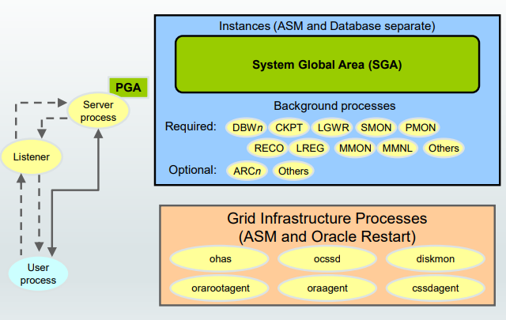
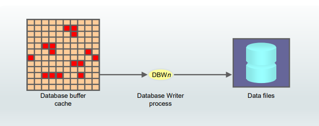
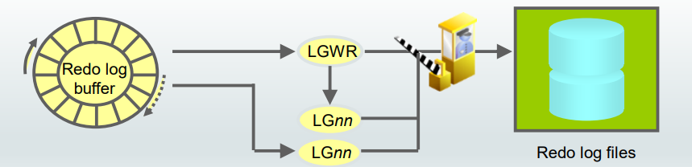
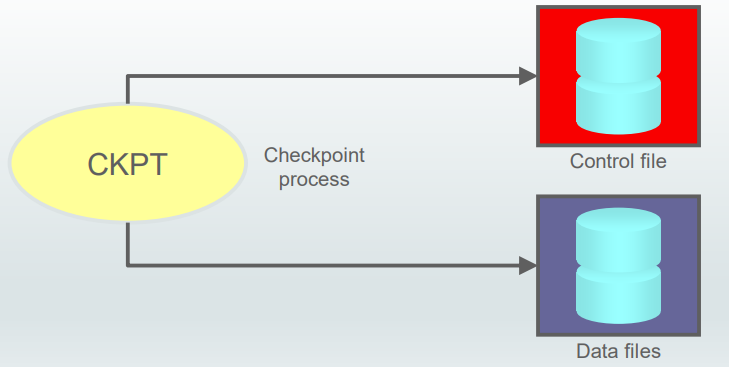
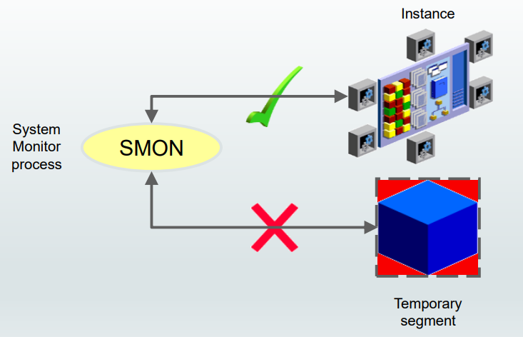
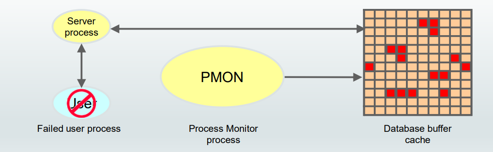
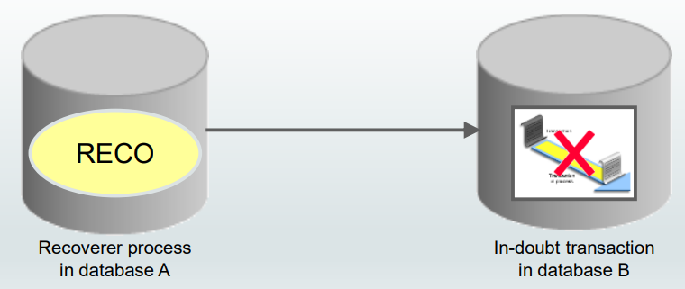
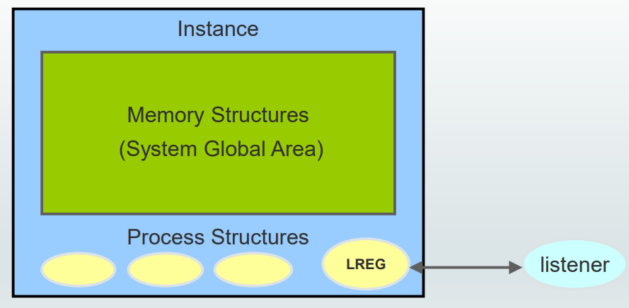
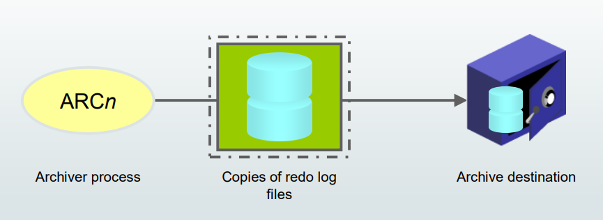

# DBA - Process Structure

[Back](../index.md)

- [DBA - Process Structure](#dba---process-structure)
  - [Processes](#processes)
  - [Background Processes](#background-processes)
    - [Database Writer Process (DBWn)](#database-writer-process-dbwn)
    - [Log Writer Process (LGWR)](#log-writer-process-lgwr)
    - [Checkpoint Process (CKPT)](#checkpoint-process-ckpt)
    - [System Monitor Process (SMON)](#system-monitor-process-smon)
    - [Process Monitor Process (PMON)](#process-monitor-process-pmon)
    - [Recoverer Process (RECO)](#recoverer-process-reco)
    - [Listener Registration Process (LREG)](#listener-registration-process-lreg)
    - [Archiver Processes (ARCn)](#archiver-processes-arcn)
  - [Summary](#summary)

---

## Processes

- `user process`

  - The `user process` represents the application or tool that connects to the Oracle database.
  - It may be on the **same machine** as the Oracle database, or it may exist on **a remote client** and use a network to reach the Oracle database.
  - The user process **first** communicates with a `listener process` that **creates a server process** in a dedicated environment.

- `server processes`

  - Oracle Database creates `server processes` to **handle the requests of user processes** connected to the instance.
  - created **on behalf of each user’s application** can perform one or more of the following:
    - **Parse and run** SQL statements issued through the application.
    - **Read** necessary data blocks from data files on disk into the **shared database buffers** of the SGA (if the blocks are not already present in the SGA).
    - **Return results** in such a way that the application can process the information.

- `Background Processes`
  - To maximize **performance and accommodate many users**, a multiprocess Oracle Database system uses some additional Oracle Database processes called `background processes`.
  - An Oracle Database instance **can** have many `background processes`.

---

## Background Processes

### Database Writer Process (DBWn)

- `Database Writer process (DBWn)`

  - **writes** the contents of **buffers to data files**.
  - responsible for writing **modified (dirty) buffers** in the `database buffer cache` to disk.

- Although one Database Writer process (DBW0) is adequate for most systems, you **can configure additional processes to improve write performance** if your system modifies data heavily. 可以设置多个写头

  - The additional processes are named `DBW1` through `DBW9`, `DBWa` through `DBWz`, and `BW36`-`BW99`. 命名
  - These additional DBWn processes are **not useful on uniprocessor systems**. 单处理器系统不适用.

- 功能:

  - **Asynchronously** while performing other processing 异步写入

    - When a buffer in the database buffer cache is **modified**, it is marked **dirty** and **added to** the head of the **checkpoint queue** that is kept in `system change number (SCN)` order. This order, therefore, **matches the order** of `redo` that is written to the `redo logs` for these changed buffers.写入 checkpoint queue, 匹配 redo logs 中的 redo 顺序.

    - When the **number of available buffers** in the buffer cache falls **below an internal threshold** (to the extent that server processes find it difficult to obtain available buffers), DBWn writes **nonfrequently used buffers** to the `data files` from the tail of the `LRU` list so that processes can **replace buffers** when they need them. 可用缓存下降到阙值后, DBWn 写入数据文件, 释放缓存.

  - To advance the checkpoint
    - DBWn also **writes from the tail** of the checkpoint queue to keep the checkpoint advancing.
    - 新的修改写入 checkpoint queue 的头, 从其尾部写入 data file, 从而推动 checkpoint 前进.

---

### Log Writer Process (LGWR)

- `Log Writer process (LGWR)`

  - responsible for redo log buffer management by **writing** the `redo log buffer entries` to a `redo log file` on disk.
  - LGWR writes **all** redo entries that have been copied into the buffer **since the last time it wrote**.

- **Writes** the `redo log buffer` to a `redo log file` on disk:写入时机

  - When a user process **commits a transaction**
  - When an **online redo log switch occurs**
  - When the redo log buffer is **one-third full** or contains **1 MB** of buffered data
  - **Before** a `DBWn process` writes modified buffers to disk
  - When **three seconds** have passed since the last write

- Serves as coordinator of `LGnn processes` and **ensures correct order** for operations that must be ordered.功能: 保证 redo 顺序.

  - `LGWR` starts and coordinates **multiple helper processes** that concurrently perform some of the work.

  - `LGWR` handles the operations that are very **fast** or must be coordinated and delegates operations to the `LGnn` that could benefit from concurrent operations, primarily **writing the redo** from the log buffer to the redo log file and **posting the completed write** to the foreground process that is waiting. LGnn 是同时 operations

  - Because `LGnn` processes work **concurrently** and certain operations must be performed **in order**,`LGWR` **forces ordering** so that even if the writes complete out of order, the posting to the **foreground** processes will be **in the correct order**.效果保证顺序

- The `redo log buffer` is a **circular** buffer. 效果: redo log buffer 可以循环
  - When `LGWR` writes `redo entries` from the redo log buffer to a `redo log file`, `server processes` can then **copy new entries over** the entries in the redo log buffer that have been written to disk.写入后可以被覆盖,从而循环缓存.
  - `LGWR` normally writes fast enough to **ensure** that **space is always available in the buffer for new entries**, even when access to the redo log is heavy. LGWR writes one **contiguous portion of the buffer** to disk. LGWR 写入很快,每次写一片缓存, 以至于能保证缓存有空间.

---

### Checkpoint Process (CKPT)

- Records checkpoint information in:
  - The Control file
  - Each data file header
- Signals `DBWn` to write blocks to disk

- `checkpoint`

  - a **data structure** that defines a `system change number (SCN)` in the `redo thread` of a database. 定义系统修改码
  - Checkpoints are **recorded** in the `control file` and in each `data file` **header**.
  - They are a **crucial element of recovery**.

- `CKPT process`

  - **update** the **headers of all** `data files` to record the **details** of the checkpoint when a checkpoint **occurs**. 用于更新数据文件头部来记录所有细节.

- `CKPT` vs `DBWn`

  - The `CKPT process` **does not write blocks to disk**; 将 scn 写入文件头部.
  - `DBWn` always performs that work. 写入磁碟

- The `SCNs` recorded in the file headers guarantee that **all changes** made to database blocks **before** that `SCN` have been written to disk. SCN 记录保证所有修改都被写入磁碟.

---

### System Monitor Process (SMON)

- `System Monitor process (SMON)`

  - performs **recovery at instance startup** if necessary.
  - responsible for **cleaning up temporary segments** that are no longer in use.
    - If any **terminated transactions** were skipped during instance recovery because of file-read or offline errors, `SMON` **recovers** them when the tablespace or file is brought back online.

- `SMON` checks **regularly** to see whether the process is needed. Other processes can **call SMON** if they detect a need for it.

---

### Process Monitor Process (PMON)

- `Process Monitor process (PMON)`

  - performs **process recovery** when a **user process fails**.
    - 1. responsible for **cleaning up** the `database buffer cache`
    - 2. **freeing resources** that the user process was using.
      - For example, it resets the status of the active transaction table, releases locks, and removes the process ID from the list of active processes.

- Monitors sessions for **idle session timeout**

  - `PMON` **periodically** **checks the status** of dispatcher and server processes and **restarts** any that have stopped running (but not any that Oracle Database has terminated intentionally).

- Like `SMON`, `PMON` **checks regularly** to see whether it is needed; it **can be called** if another process detects the need for it.

---

### Recoverer Process (RECO)

- `Recoverer process (RECO)`

  - a background **process** used with the `distributed database configuration` that **automatically resolves failures** involving **distributed transactions**. 解决分布式可疑事务

- The `RECO process` of an instance **automatically connects to other databases** involved in an _in-doubt distributed transaction_.

  - When the `RECO process` **reestablishes a connection** between involved database servers, it automatically **resolves all in-doubt transactions**, **removing** from each database’s pending transaction table any **rows** that _correspond to the resolved in-doubt transactions_.

  - If the `RECO process` **fails to connect** with a remote server, RECO automatically tries to **connect again** after a timed interval. However, RECO waits an increasing amount of time (growing exponentially) before it attempts another connection.

---

### Listener Registration Process (LREG)

- Registers information about the database instance and dispatcher processes with Oracle Net Listener

- `Listener Registration process (LREG)`

  - **registers** information about the **database instance** and **dispatcher processes** with the `Oracle Net Listener`.

- `LREG` **provides the listener** with the following information:

  - Database **services names**
  - Database **instance name**, associated with the services, and its current and maximum load
  - **Service handlers** (dispatchers and dedicated servers) available for the instance, including their _type_, _protocol addresses_, and current and maximum load

- When the instance **starts**, `LREG` attempts to connect to the listener. 当实例启动时, 会将实例信息注册在 lsnr.

  - If the listener is running, `LREG` passes information to it.
  - If the listener is **not** running, `LREG` periodically attempts to connect to it.

- It may take up to **60 seconds** for LREG to **register the database instance** with the listener after the listener has started.
  - You can use the `ALTER SYSTEM REGISTER` command to immediately initiate service registration after starting the listener.

---

### Archiver Processes (ARCn)

- `Archiver processes (ARCn)`

  - **copy** `redo log files` to a designated **storage device** after a log switch has occurred.
    - Can **collect** transaction `redo data` and **transmit** that data to standby destinations

- 设置:

  - ARCn processes are present only when the database is in `ARCHIVELOG` **mode** and **automatic archiving** is **enabled**. 条件: enable

  - The default is to have four Archiver processes.

    - If you anticipate a heavy workload for archiving (such as during bulk loading of data), you can **increase the maximum number** of Archiver processes. 多个 process

  - There can also be **multiple archive log destinations**. 多个储存点
    - It is recommended that there be at **least one** `Archiver process` for each destination.

---

## Summary

- Server process

  - Each `server process` and background process has **its own** `PGA`.
  - PGA is **exclusive** to the `server process`

- Background process

| Process                                | Memory                  | Files           | Description                  |
| -------------------------------------- | ----------------------- | --------------- | ---------------------------- |
| `Database Writer Process (DBWn)`       | `database buffer cache` |                 | Write to disk                |
| `Log Writer Process (LGWR)`            | `redo log buffer`       | `redo log file` | Write to file                |
| `Checkpoint Process (CKPT)`            |                         | `data file`     | Update header                |
| `System Monitor Process (SMON)`        |                         |                 | recovery at instance startup |
| `Process Monitor Process (PMON)`       |                         |                 | process recovery             |
| `Recoverer Process (RECO)`             |                         |                 | distributed transactions     |
| `Listener Registration Process (LREG)` |                         |                 | Register instance            |
| `Archiver Processes (ARCn)`            |                         | `redo log file` | Transmit that data           |

---

[TOP](#dba---process-structure)
