# DBA - Instance: Automatic Diagnostic Repository (ADR)

[Back](../index.md)

- [DBA - Instance: Automatic Diagnostic Repository (ADR)](#dba---instance-automatic-diagnostic-repository-adr)
  - [Automatic Diagnostic Repository (ADR)](#automatic-diagnostic-repository-adr)
  - [Lab: Query diagnostics directories](#lab-query-diagnostics-directories)
  - [Alert log](#alert-log)
    - [Lab: View Alert Log File in XML and text](#lab-view-alert-log-file-in-xml-and-text)
    - [Lab: View Alert Log using ADRCI](#lab-view-alert-log-using-adrci)
  - [Trace files](#trace-files)
    - [Purgin Mechanism](#purgin-mechanism)
    - [Lab: Configure ADR Policy](#lab-configure-adr-policy)
  - [Lab: Purg files manually in ADRCI](#lab-purg-files-manually-in-adrci)
  - [Lab: Enable DDL Logging](#lab-enable-ddl-logging)

---

## Automatic Diagnostic Repository (ADR)

- `Automatic Diagnostic Repository (ADR)`

  - a file-based repository outside the database
  - a system-wide central tracing and loggin repository

- Stores database diagnostic data such as:

  - traces
  - alert log
  - health monitor reports.

- Typical installations will have the `ADR_BASE` set to the `ORACLE_BASE`:
  - `echo $ORACLE_BASE`
  - `show parameter diagnostic_dest`

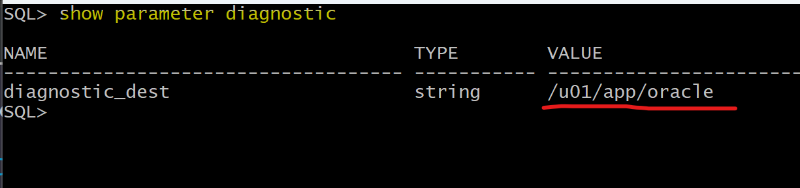

- ADR home path: `<adr_base>/diag/product_type/db_id/instance_id/`

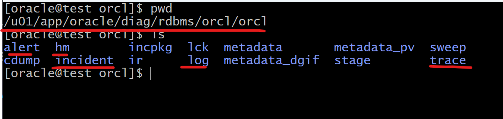

- `V$DIAG_INFO`:
  - describes the state of Automatic Diagnostic Repository (ADR)

---

## Lab: Query diagnostics directories

```sql
SELECT name, value FROM v$diag_info;
```

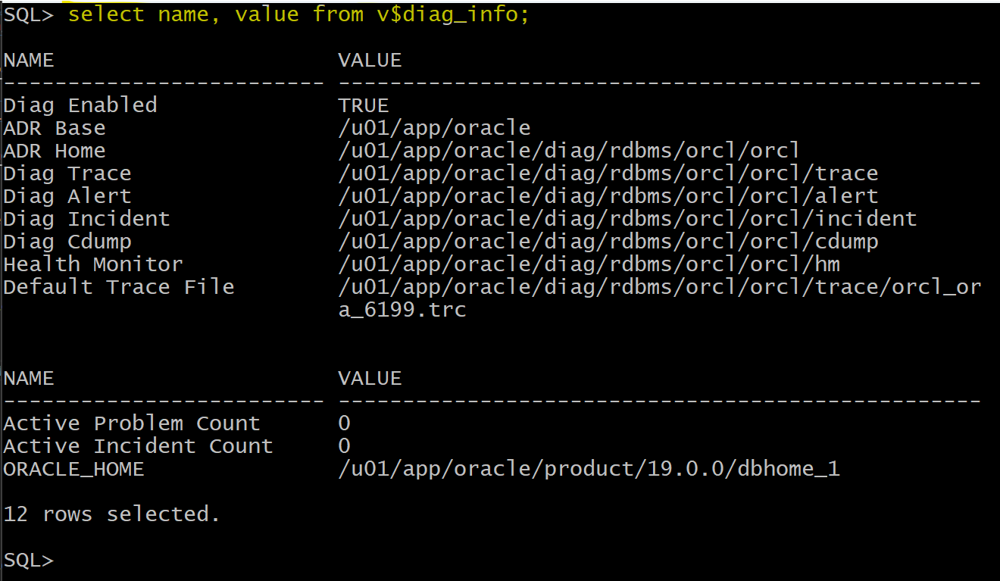

---

## Alert log

- `alert log`:

  - a **chronological log** of messages and errors

- `alert log` includes:

  - Any **non default** `initialization parameter` used at startup.
  - All **internal errors** (ORA-00600), **block corruption** errors (ORA-01578), and **deadlock** errors (ORA-00060) that occur
  - Administrative **operations**, such as some CREATE, ALTER, and DROP statements and **STARTUP**, **SHUTDOWN**, and **ARCHIVELOG** statements
  - **Messages and errors** relating to the functions of **shared server** and **dispatcher processes**.
  - Errors occurring during the **automatic refresh of a materialized view**

- can view the alert log by **text editor** or using `ADRCI`

- Importance Files:
  - `adr_home/alert/log.xml`: XML format
  - `adr_home/trace/alert_orcl.log`: text format

---

### Lab: View Alert Log File in XML and text

- change directory to ADR alert dir
- open `log.xml` file using `gedit`
  - a xml format of alert log

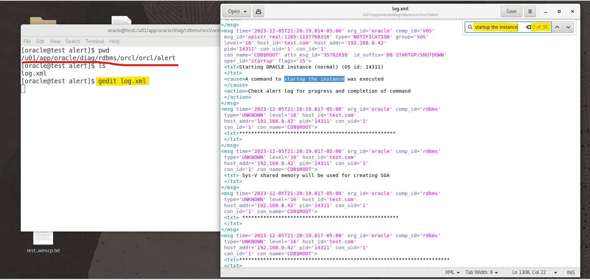

---

- change directory to ADR `trace` dir
- open `alert_orcl.log` file using `gedit`
  - a text format of alert log

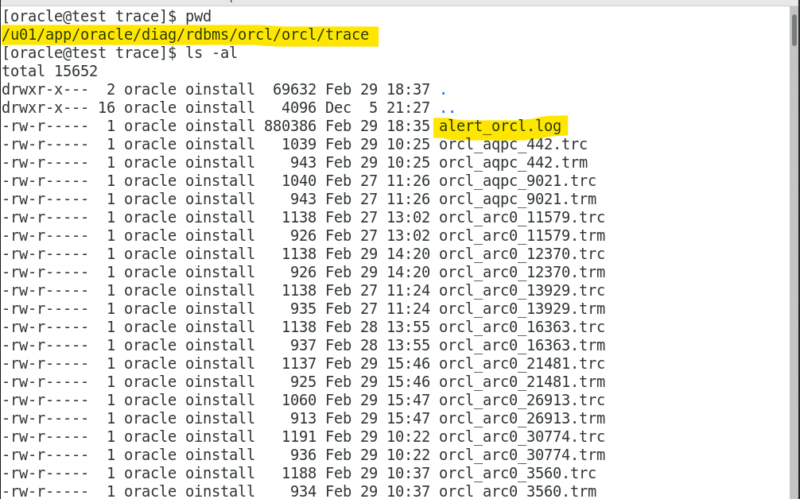

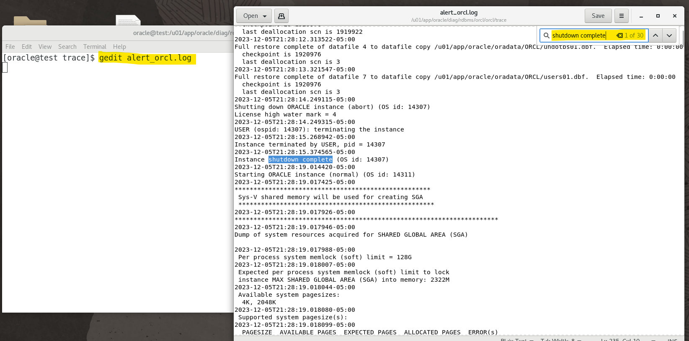

---

- trace the last time startup instance using non default parameters.

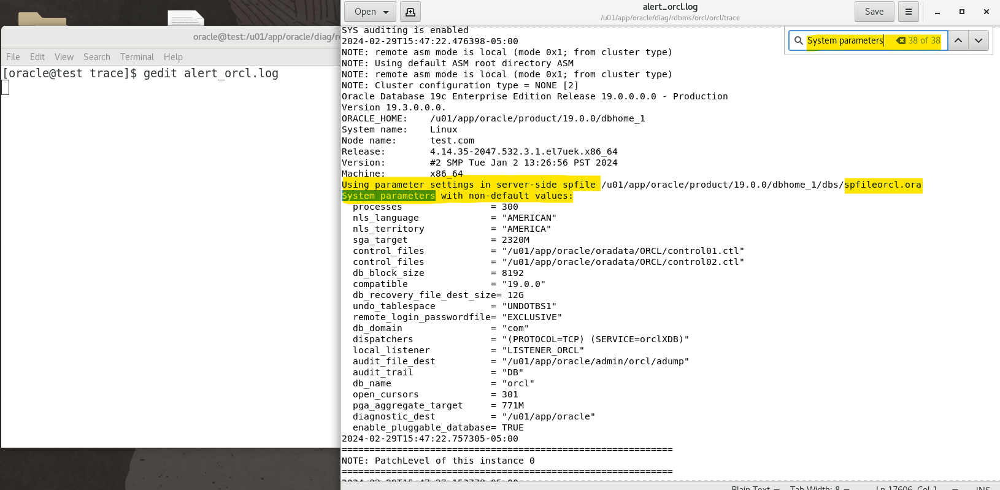

---

### Lab: View Alert Log using ADRCI

- Launch adrci

```sh
adrci
```

- in the adrci

```sh
show alert
```

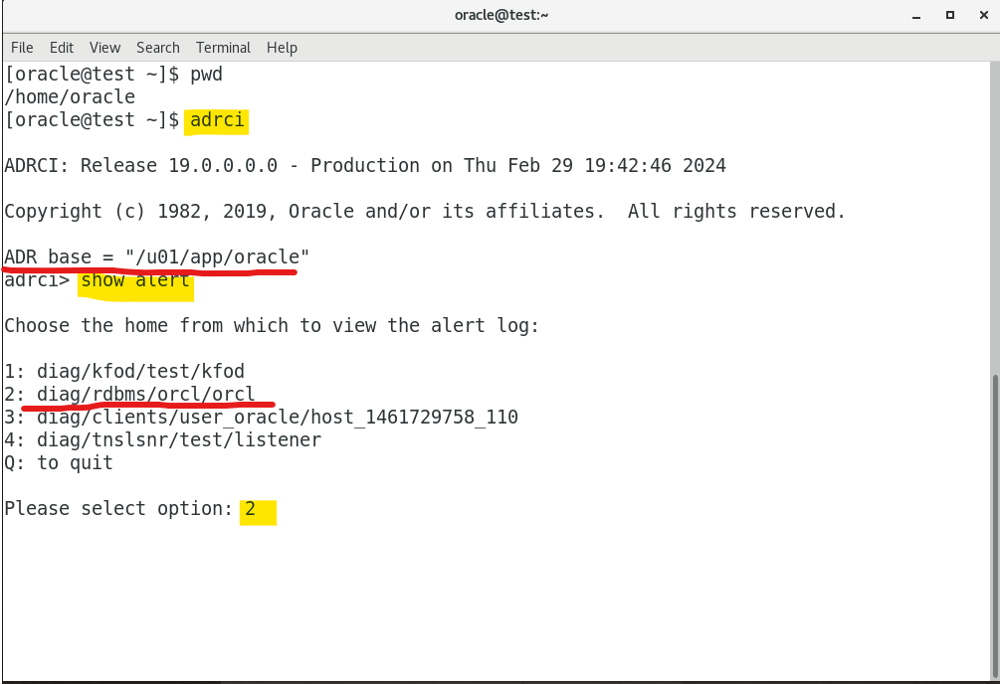

- choose log and will load log in Vim

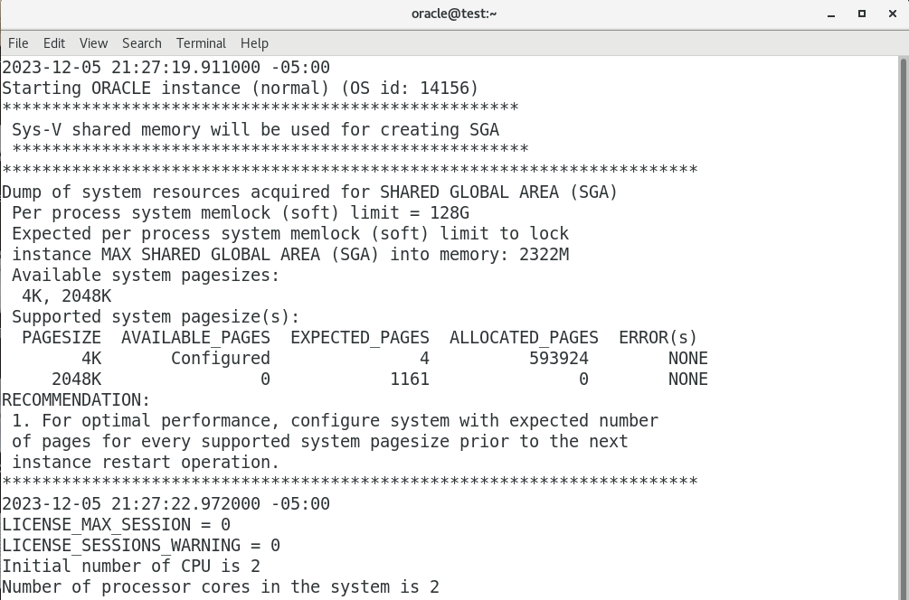

---

- Search the last time to start up an instance

  - Move to the last line and search from the bottom.

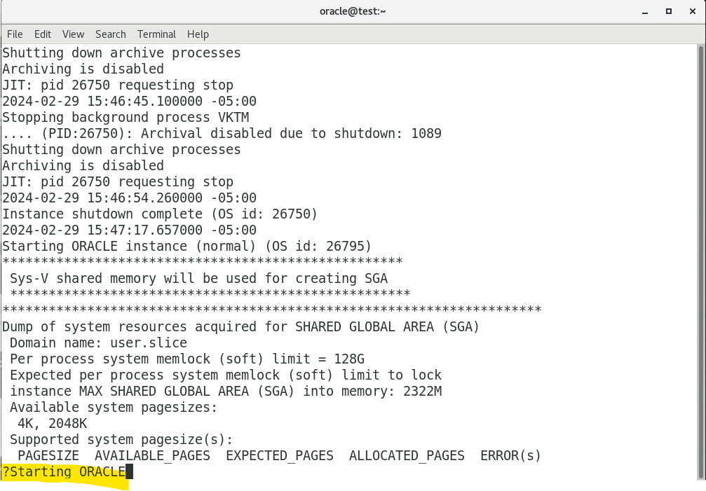

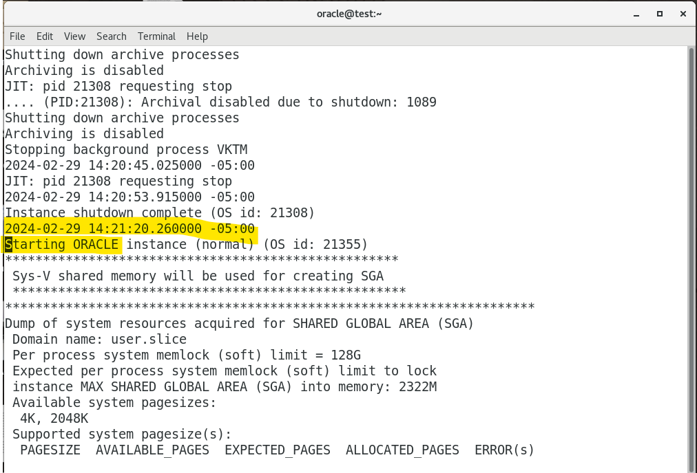

- Press n to continue searching.

---

- Search for the first time of altering database.

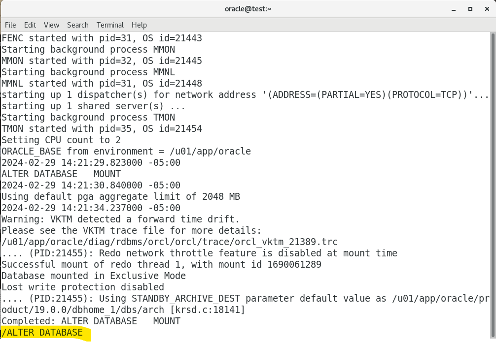

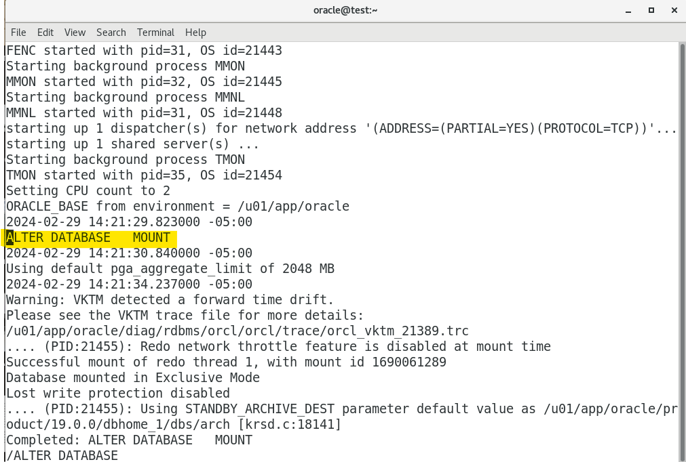

---

- exit
  - `:q`

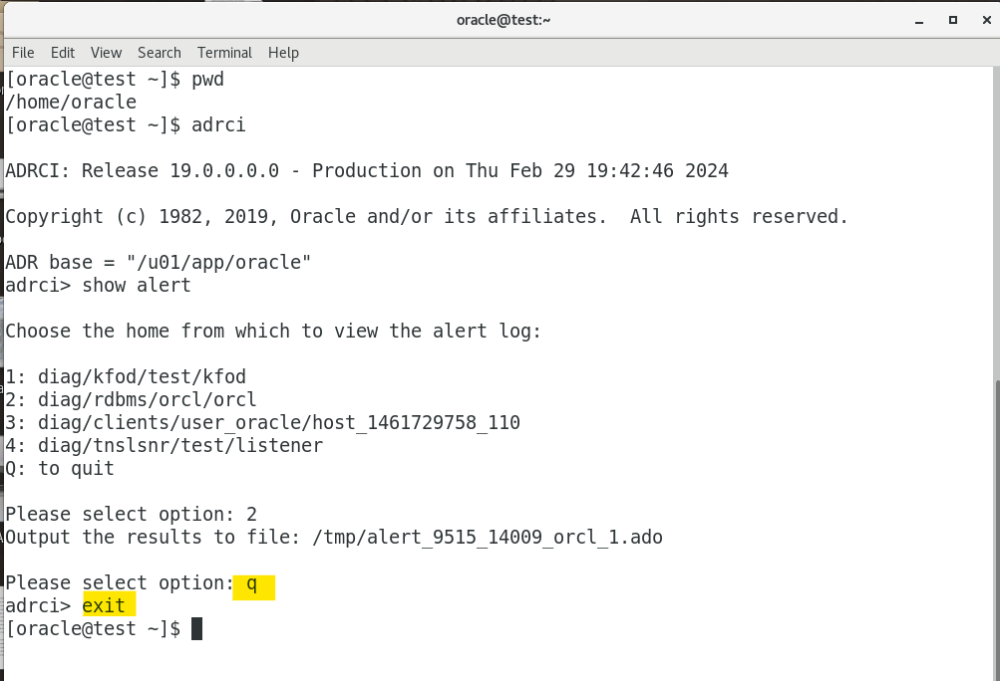

---

## Trace files

- `Trace File` contain:

  - **Error information**, contact Oracle Support Services if internal error occurs.
  - Information that can provide guidance **for tuning** applications or an instance.

- Each `server` and `background process` can write to an aasociated trace file.
  - **file name for `background process`**:
    - e.g., `orcl_dbw0_27147.trc`
  - **file name for `server process`**:
    - e.g., `orcl_ora_3341.trc`
  - **Exception**:
    - Trace files generated by `job queue process`.
- Oracle Database includes an advanced **fault diagnosability infrastrucure** for preventing, detecting, diagnosing, and resolving problems.
- **When a critical error occurs**:
  - An `incident number` is assigned to the **error**.
  - Diagnostic data for the error (such as trace files) is immediately captured and tagged with the incident number.
  - Data is stored in the `ADR`.
- ADR files can be **automatically purged** with `retention policy parameters`.自动删除.

- trace file located in `<adr_home>/trace`
- when a danger error occurs, it will move to `<adr_home>/incident`

---

### Purgin Mechanism

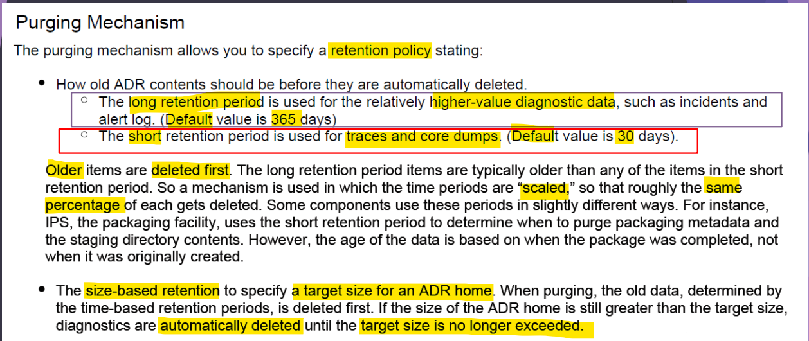

- retention period:
  - long: 365, higher-value
  - short: 30, not importance
- older first.
- Time-based + size base

---

### Lab: Configure ADR Policy

- adrci terminal
- Query the current policy

```sh
# set home path
set HOMEPATH diag/rdbms/orcl/orcl

# query the size policy for adr
select sizep_policy from adr_control_aux;

# query the short and long policy
# return the number in hours, 30days, 365 days.
select shortp_policy, longp_policy from adr_control;

```

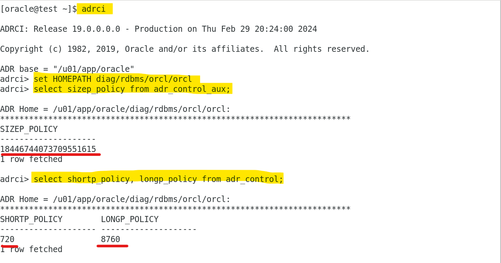

---

- Estimate the policy

```sh
# return an estimate for a size policy
estimate ( sizep_policy =200000000);

# return an estimate for a short and long policy, 8 days
estimate (shortp_policy =192, longp_policy=192);
```

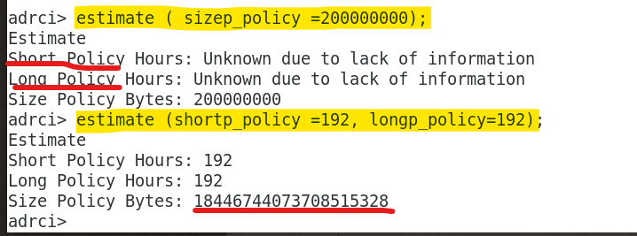

---

- update policies
  - after 8 days, all file will be deleted.

```sh
set control (SHORTP_POLICY = 192);
set control (LONGP_POLICY = 192);
set control (SIZEP_POLICY = 8559020);

select shortp_policy, longp_policy from adr_control;
select sizep_policy from adr_control_aux;
```

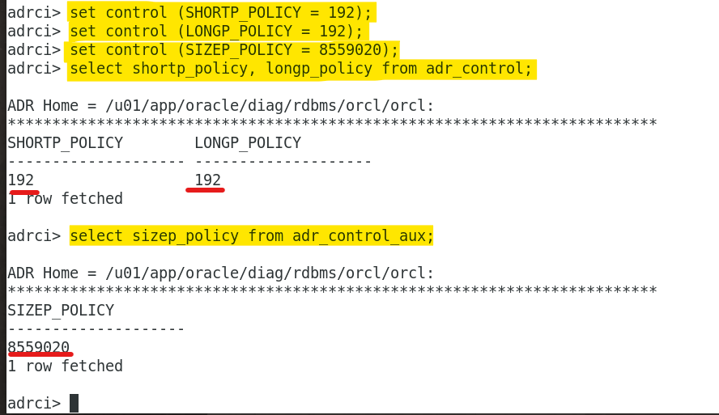

---

## Lab: Purg files manually in ADRCI

```sh
cd  /u01/app/oracle/diag/rdbms/orcl/orcl
# return the size of dir
du -hs
```

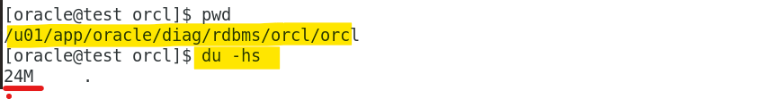

- Open adrci terminal

```sh
#[-size <bytes>]: Purge diagnostic data from the ADR home until the size of the home reaches <bytes> bytes.
purge -size 5000000     # purge until 5M
```

- Check size after purging
  - adr will try to purge until the given size.
  - the size cannot be the given size, because there might be big files or critical files cannot be removed.


---

## Lab: Enable DDL Logging

- `DDL log`

  - contains one log record for **each DDL statement** issued by the database.

- Before enabling
  - nothing in the dir `/u01/app/oracle/diag/rdbms/orcl/orcl/log/ddl`

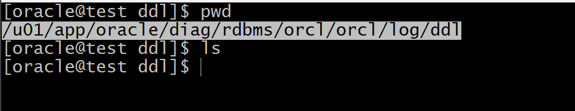

- login sqlplus
- move to pdb
- alter `enable_ddl_logging` to true for the current session

```sql
show con_name
ALTER session SET container=orclpdb;
show con_name

show parameter enable_ddl_logging;
ALTER session SET enable_ddl_logging=true;
show parameter enable_ddl_logging;
```

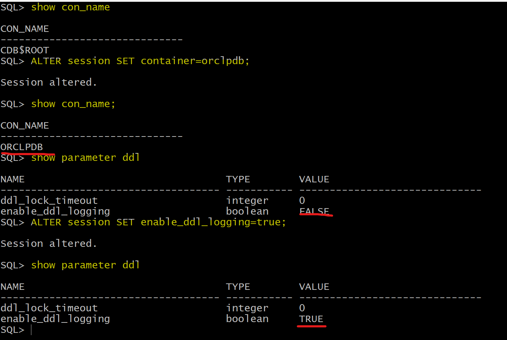

- Do some ddl
  - create a table

```sql
CREATE TABLE test ( n number);
CREATE TABLE test1 ( n number);
DROP TABLE test;
DROP TABLE test1;
```

- Check log file in ddl dir

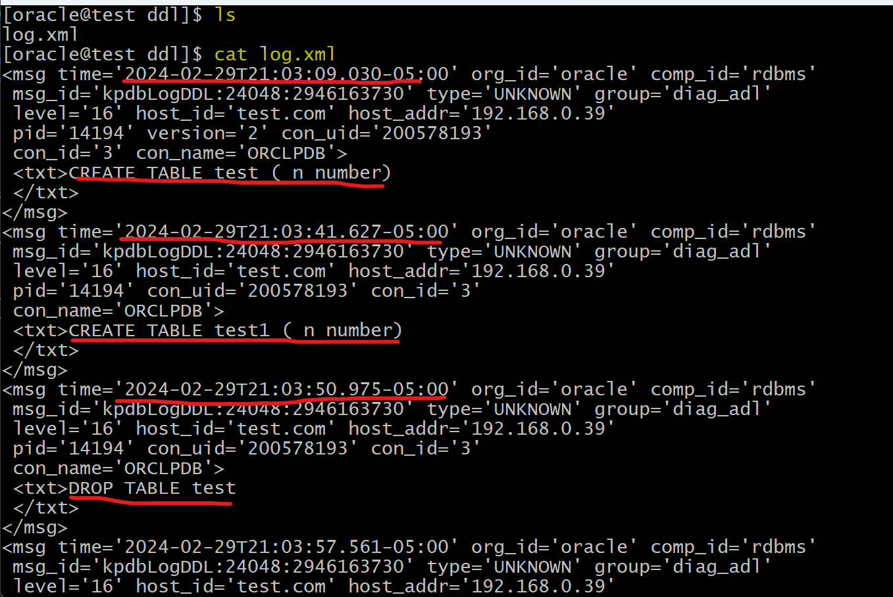

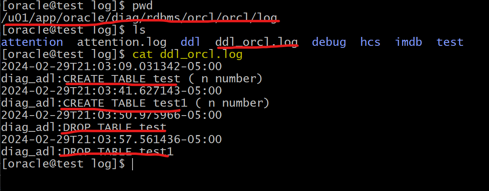
