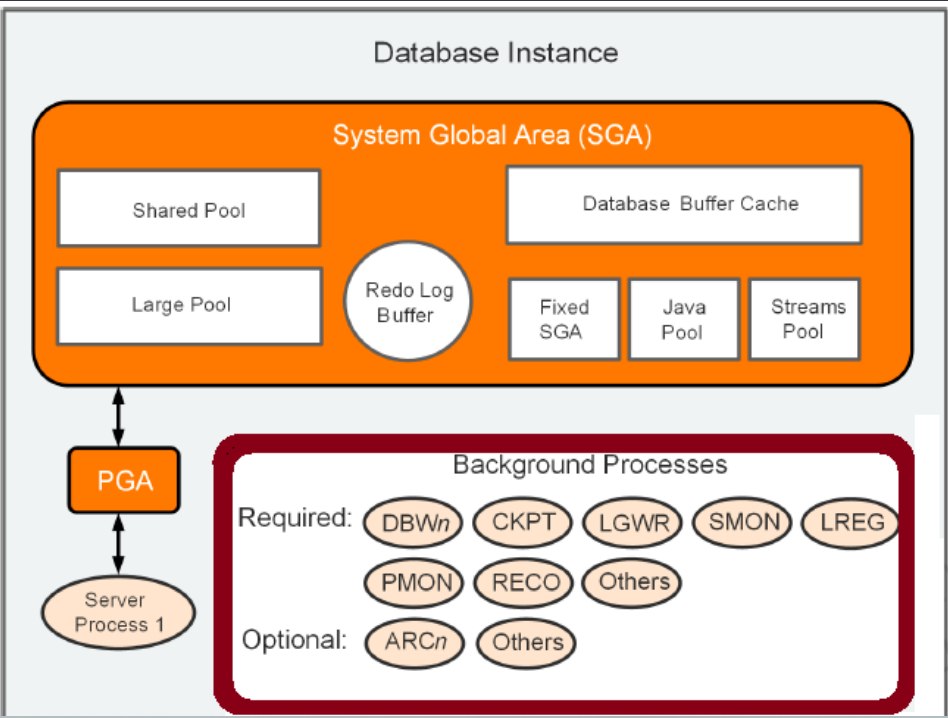
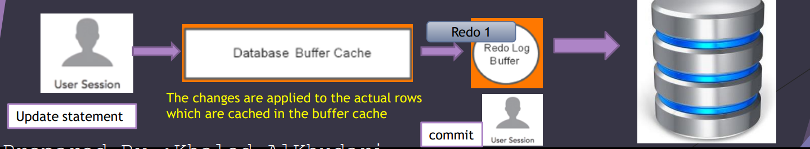

# DBA - Database Instance Structures

[Back](../index.md)

- [DBA - Database Instance Structures](#dba---database-instance-structures)
  - [Database Instance Structures](#database-instance-structures)
    - [Oracle Database Processes](#oracle-database-processes)
    - [Instance Memory Structures](#instance-memory-structures)
    - [Server processes](#server-processes)
    - [PGA:](#pga)
    - [System Global Area ( SGA )](#system-global-area--sga-)
      - [Shared Pool](#shared-pool)
      - [Database buffer cache](#database-buffer-cache)
      - [Redo Log Buffer](#redo-log-buffer)
      - [Large Pool](#large-pool)
      - [Java Pool](#java-pool)
      - [Streams Pool](#streams-pool)
      - [Fixed SGA](#fixed-sga)
  - [Method to Size SGA](#method-to-size-sga)
  - [Method to Size PGA](#method-to-size-pga)
    - [Background Processes](#background-processes)
  - [Database Files](#database-files)

---

## Database Instance Structures

- An Oracle database uses **memory structures** and **processes** to manage and access the CDB / database files.
- All memory structures **exist in the main memory** of the computers that constitute the RDBMS.

- When applications connect to a CDB or PDB, they connect to a database instance. The instance services applications by **allocating other memory** areas in addition to the SGA, and **starting other processes** in addition to background processes.

---

### Oracle Database Processes

- `process`
  - a mechanism in an operating system that can **run a series of steps**. Some operating systems use the terms `job`, `task`, or `thread`.
  - For the purposes of this topic, a `thread` is equivalent to a `process`.
- An Oracle database instance has the following types of processes:

  - `Client processes`

    - created and maintained to **run the software code** of an application program or an **Oracle tool**.
    - Most environments have separate computers for client processes.

  - `Background processes`

    - **consolidate functions** that would otherwise be handled by multiple Oracle Database programs **running for each client process**.
    - asynchronously perform **I/O and monitor** other Oracle Database processes to provide increased parallelism for better performance and reliability.

---

### Instance Memory Structures

- Oracle Database creates and uses memory structures **for program code, data shared among users, and private data areas** for each connected user.

- The following memory structures are associated with a database instance:

  - `System Global Area (SGA)`

    - a group of **shared memory structures** that _contain data_ and _control information_ **for one database instance**.
    - Examples of SGA components include the `database buffer cache` and `shared SQL areas`.
    - The SGA can contain an optional `In-Memory Column Store` (IM column store), which enables data to be populated in memory in a columnar format.

  - `Program Global Areas (PGA)`

    - a memory region that _contains data_ and _control information_ **for a server or background process**.
    - Access to the PGA is **exclusive** to the process.
    - **Each server process and background process has its own PGA**.

---

### Server processes

- `Server Processes`

  - **communicate with client processes** and interact with Oracle Database **to fulfill requests**.
  - Handle the **requests of client processes** (User sessions ) connected to the Oracle database

- Purpose:

  - **Perform the work** for the client program

    - Example: Parsing and running SQL statements , retrieving results to the client program and this mean reading database data from the database storage and loading that data into the Oracle instance buffer cache.
    - Example: one user session doing select statement ,so this mean Oracle will create SP and this SP has its own PGA
    - More users= more dedicated server processes

  - Act on behalf of client sessions
  - Each server process has **its own cache dedicated** for each connecting client. (`PGA`)

- Types of SP:

  - Oracle **dedicated** server process

    - one-to-one relation between connecting user sessions and server processes

  - Oracle **Shared** Server Processes
    - client user processes connect to a dispatcher.
    - The dispatcher can **support multiple client connections concurrently**
    - Shared server architecture eliminates the need for a dedicated server process for each connection

- Your database is **always** enabled to **allow dedicated** server processes, but you must specifically configure and **enable shared server** by setting one or more initialization parameters

---

### PGA:

- PGA:

  - **non-shared memory region** reserved **only** for the specific **user session** connected to that specific server process.

- it _contains data_ and _control information_ used by the **server processes** when _sorting_ data, _joining_ large tables together as part of a SQL statement, and so on

---

### System Global Area ( SGA )

- `System Global Area (SGA)`

  - a group of **shared memory structures** that _contain data_ and _control information_ **for one database instance**.

- Main tasks of SGA
  - Maintaining internal data structures that many processes access concurrently
  - Caching data blocks read from disk
  - Buffering redo data before writing it to the online redo log files
  - Storing SQL execution plans

---

#### Shared Pool

- The most important component of SGA
- Cache **non user Data** like `Data dictionary` (metadata: data about data)

  - e.g.: `DBA_tables`

- Shared Pool contains **sub components**

  - e.g.: Data dictionary _cache_, library _cache_ ,server result _cache_

- Store the **cached information** about each SQL statement that is executed,
  - e.g.: execution plan

---

#### Database buffer cache

- responsible for **caching database user data**.
- The buffer cache **caches frequently accessed database data** into memory.
  - Note: The buffer cache caches **blocks of data** instead of individual rows.
  - 重要概念, 不是缓存行,而是 block=8k
  - 1 block=8 kB by default
- **All users** who are concurrently connected to the database **share and access** a single database buffer cache
- The buffer cache including the _keep pool_, _recycle pool_, and others

---

#### Redo Log Buffer

- circular buffer that **hold information about changes** made to the database
- designed to **store** `redo entries`
  - small **records** that **reflect any changes** made to the database as part of transactions or database structure changes
  - DDL, DML
  - Note: `Redo entries` are used for **database recovery** when and if needed.
- the `Redo Log entries` in the **Redo Log buffer** are also **written** on a **periodic** basis to a set of files in our Oracle database storage known as `Redo logs files`

---

#### Large Pool

- contains memory used by special oracle features like:
  - **Shared** server processes
  - Parallel queries
    - e.g.:`SELECT /*+ PARALLEL(emp,4) */ * FROM emp;`
  - Database backup and recovery operations
  - I/O server processes

---

#### Java Pool

- Provides memory for oracle streams processes
- a memory for java code.

---

#### Streams Pool

- Provides memory for oracle **streams processes**

---

#### Fixed SGA

- contains general information about the **state of the database and the instance**

---

## Method to Size SGA

1. Using Automatic Shared Memory Management(ASMM)

| Parameter      | Description                                                        |
| -------------- | ------------------------------------------------------------------ |
| `SGA_TARGET`   | actual memory in use by the current SGA                            |
| `SGA_MAX_SIZE` | the largest amount of memory available for the SGA in the instance |

- Oracle Database automatically distributes this memory among the various SGA components to ensure the most effective memory utilization.

- Syntax:

`ALTER SYSTEM SET SGA_TARGET=value [SCOPE={SPFILE|MEMORY|BOTH}]`

---

2. Using Manual Shared Memory Management

- Expert DBA must manually configure several SGA component sizes
  - A. Set the MEMORY_TARGET initialization parameter to 0.
  - B. Set the SGA_TARGET initialization parameter to 0.
  - C. manually configure SGA component

---

## Method to Size PGA

1. Using Automatic PGA Memory Management

| Parameter              | Description                                                                               |
| ---------------------- | ----------------------------------------------------------------------------------------- |
| `PGA_AGGREGATE_TARGET` | total amount of PGA memory for **all** database server processes and background processes |

- Oracle strongly recommends that you leave automatic PGA memory management enabled.

---

2. Using Manual PGA Memory Management

- must manually configure several PGA component sizes
- Not recommended

---

### Background Processes

- `Background Processes`

  - bunch of **dedicated server-side processes** running in the background

- TASKS:

  - **writing** database blocks to disk
  - **writing** redo entries to disk
  - making sure all of the database files on disk are **synchronized**
  - perform **maintenance** tasks

- `Database Writer processes (DBWn)`

  - responsible for **writing** contents of the database buffers to data files on disk

- `Log writer (LGWR)`

  - responsible for **writing redo records** from the **redo log buffering** memory into a physical disk

- `checkpoint process (CKPT)`

  - This process handles database checkpoints.
  - An `Oracle checkpoint` is a **database event** which **synchronizes** modified data blocks in memory from the **buffer cache** with the **data files** on disk

- `System Monitor process (SMON)`

  - performs **recovery during the startup sequence** of the Oracle Instance if required.
  - responsible for cleaning up any unused temporary segments.

- `Process Monitor (PMON)`

  - performs process **recovery when a user process or a session fails**.
  - responsible for cleaning up any changes made to blocks in the database buffer cache, and releasing resources that were previously used by a failed user session.

- `Recover Process (RECO)`

  - used as part of **distributed database transactions**.
  - `Distributed transactions` are transactions that involve multiple databases, and should either commit a rollback on both databases at once.

- `Listener registration process (LREG)`

  - It is responsible for **registering** the Oracle **instance** with the Oracle network **listener**.
  - The listener accepting remote incoming user connections

- `Archiver process (ARCn)`
  - It is responsible to **copy** the Oracle _redo log files_ to a _remote storage device_ after a redo log switch has occurred
  - Note: Copying the database relogs to another storage system is very important from a backup and recovery perspective

---

## Database Files

- Database:

  - Organized collection of information.
  - It contains collection of **database files** stored in disk storage. (physical)

- **Datafiles**

  - contains the actual users data, applications data, metadata.
  - (Tables, Rows, indexes ,procedures, views…)
  - Note: If you lose Datafiles, you lose your database.
  - The extension for datafiles is `.dbf`

- **Control files**

  - Stores **metadata** about the datafiles and online redo log files (like names ,locations and statuses) and this info is **required by the database instance to open the database.**
  - Note: If you lose control files, you lose your database.
  - The extension for Control files is `.ctl`

- **Redo log files**

  - stores **changes** to the database as they occur and are used for data **recovery**.
  - DML, DCL operations.
  - Note: If you lose Redo log files, you lose your database.
  - The extension for redo log file is `.log`

- **Database backups files**

  - include any **backups** of your database that you have taken and placed somewhere safe
  - Note: it should include the datafiles, control files, redo log files

- **Archived redo log files**

  - groups of `redo log` files
  - Contains **ongoing history** of the data changes .
  - Using these files + backups files you can **recover** your database

- **Parameter file**

  - (spfile, pfile)
  - This file defines how the database instance is **configured when it starts up**.
    - Example: the PGA size `PGA_AGGREGATE_TARGET`
  - Note: `spfile` is `binary file`, you can not edit directly, it should by oracle commands.
    - If you lose the spfile **no issue**, you can recreate it again

- **Password file**

  - stores **passwords** for users with **administrative privileges** (sys user) in order to connect remotely.
  - Note: **DBA password cannot be stored in the database**, because Oracle cannot access the database before the instance is started,
    - Therefore, the authentication of the DBA must happen **outside** of the database

- **Alert Log File**

  - is a **chronological(sequential order) log of messages and errors** written out by an Oracle Database.
  - so this is your go-to file in case you're trying to **troubleshoot** a problem with your database.
    - Example: You can see when the database was started and stopped.

- **Trace File**
  - Each **server and background process** writes to a trace file.
  - When a **process** detects an internal error, it writes **information about the error** to its trace file.

---

[Top](#dba---database-instance-structures)
