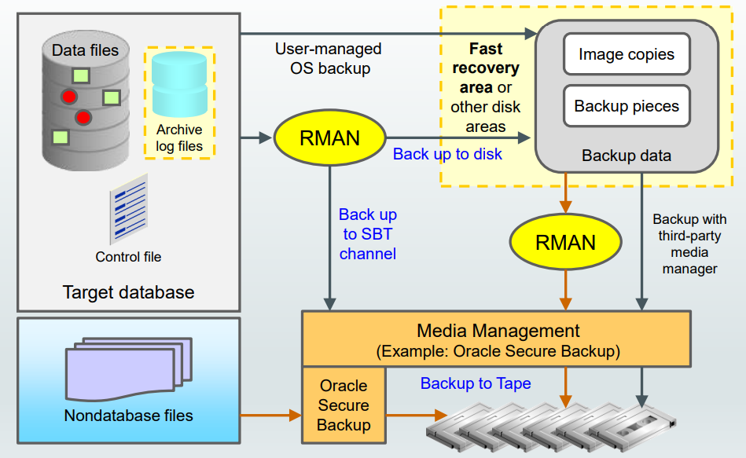

# DBA - Backup

[Back](../../index.md)

- [DBA - Backup](#dba---backup)
  - [Backup Strategies and Terminology](#backup-strategies-and-terminology)
    - [Backup Solutions](#backup-solutions)
  - [Backup Terminology](#backup-terminology)
  - [Balancing Backup and Restore Requirements](#balancing-backup-and-restore-requirements)
  - [Backup Strategies](#backup-strategies)
    - [Full and Incremental Backups](#full-and-incremental-backups)
    - [Incrementally Updated Disk Backups](#incrementally-updated-disk-backups)
    - [Offloading Backups to Physical Standby Database](#offloading-backups-to-physical-standby-database)
  - [Backing Up Read-Only Tablespaces](#backing-up-read-only-tablespaces)
    - [Data Warehouse Backup and Recovery: Best Practices](#data-warehouse-backup-and-recovery-best-practices)
  - [Backup Terminology](#backup-terminology-1)
  - [Whole Database Backup](#whole-database-backup)
  - [Full Backup VS Whole Backup](#full-backup-vs-whole-backup)
  - [Case Study 1: How to Protect an OLTP Database](#case-study-1-how-to-protect-an-oltp-database)
  - [Case Study 2: How to Protect a DSS Database](#case-study-2-how-to-protect-a-dss-database)
  - [Case Study 3: How to Protect the Recovery Catalog Database](#case-study-3-how-to-protect-the-recovery-catalog-database)

---

## Backup Strategies and Terminology

### Backup Solutions



- `Fast recovery area`

---

## Backup Terminology

- Backup strategy may include:

  - Entire database (**whole**)
  - Portion of the database (**partial**)

- Backup type may indicate inclusion of:
  - All data blocks within your chosen files (**full**)
  - Only information that has changed since a previous backup (**incremental**)
    - `Cumulative` (changes since last level 0)
    - `Differential` (changes since last incremental)
- Backup mode may be:
  - `Offline` (consistent, cold)
  - `Online` (inconsistent, hot)

---

## Balancing Backup and Restore Requirements

- **Incremental** Backup Strategy:

  - **Improves backup performance**, with trade-off in recovery performance
  - `Block change tracking` for **fast incremental backups**
  - `Cumulative` and `differential` incremental backups
  - “Incremental forever” **requires an initial full backup**.需要初始完整备份

- **Multiplexing**

  - Back up files in **parallel per channel** to improve performance.多通道并行
  - Multiplexing level = `min (FILESPERSET, MAXOPENFILES)`.
  - Set `MAXOPENFILES = 1` for SAME or ASM data files.
  - Set # of RMAN channels = # of tape drives.

- **Hardware/Network/Storage**
  - Assesses host resources, production disk I/O, HBA/network, tape drive throughput.
  - Minimum performing component of these will be a **performance bottleneck**.

---

## Backup Strategies

- `Full and Incremental Backups`:
  - Backup Factors:
    - **Fast** incremental backups
    - **Save space** with backup **compression**.
    - Cost-effective tape **storage**
  - Recovery Factors
    - `Full backup` restored **first** and **then** `incremental backups` and `archived logs`. 有顺序
    - Tape backups **read sequentially**有次序读取
- `Incrementally Updated Disk Backups`
  - Backup Factors:
    - `Incremental` + `roll forward` to create up-to-date copy
    - Requires 1x **production storage** for copy
  - Recovery Factors
    - Backups **read via random access** Restore-free recovery with `SWITCH` command
- `Backups to Physical Standby Database`
  - Backup Factors
    - Above benefits + primary database **free to handle more workloads**主 DB 不用负责 backup 的负载
    - Requires 1X **production hardware and storage** for standby database
  - Recovery Factors
    - Fast **failover to standby database** in the event of any failure
    - **Backups are last resort**, in the event of double site failure

---

### Full and Incremental Backups

- Use Case:

  - Databases that can tolerate **hours/days** `RTO`(goal = maximum length of time taken to restore)
  - Environments where **disk is premium**硬盘贵
  - **Low-medium change frequency** between backups (<20%)备份之间差距小

- Backup strategy:
  - **Weekly** `level 0` and **daily** `differential incremental backup` sets **to tape**, with optional backup compression
  - Enable `block change tracking` so that only changed blocks are read and written during incremental backup.只关注 bct
  - Back up archived logs and retain on-disk, as needed.

---

### Incrementally Updated Disk Backups

- Use Case:

  - Databases that can tolerate **no more than a few hours** RTO
  - Environments where **disk can be allocated** for 1x size of database or most critical tablespaces. 有硬盘可以分配

- Backup strategy:
  - Initial image copy to `FRA`, daily incremental backups
  - New on-disk copy by using `incrementals to roll forward` copy
  - `Full backup` archived to **tape** as needed
  - `Archived logs` backed up and retained **on-disk** as needed
  - `Fast recovery` from disk or SWITCH to use image copies

---

### Offloading Backups to Physical Standby Database

- Use Case:

  - Databases that require **no more than several minutes** of recovery time in the event of any failure
  - Environments that can preferably allocate **symmetric hardware and storage** for **physical standby database**有后备实例资源
  - Environments with **tape infrastructure that can be shared** between primary and standby database sites.磁带可共享

- Backup strategy:
  - `Full` and `incremental` backups offloaded to **physical standby database**后备实例负责备份
  - Fast incremental backup on standby with `Active Data Guard`(can backup and query, read-only; `Data Guard`: backup only, no query)
  - Backups **restored to primary or standby** database
  - Backups taken **at each database** for optimal local protection 分布式备份

---

## Backing Up Read-Only Tablespaces

- Considerations for backing up `read-only tablespaces`:

  - Backup optimization causes RMAN to back up read-only tablespaces only **when no backup exists that satisfies the** `retention policy`.只在政策不满足情况下.
  - If you change the tablespace to read/write, back it up immediately.一旦非只读, 马上被备份
  - You can use the `SKIP READONLY` option of the `RMAN BACKUP` command to skip readonly tablespaces or data files. 可以跳过.

- 只读 tbsp 原因是分配的磁盘空间已经占满 full
  - 即一旦 full -> read-only -> can skip `SKIP READONLY`

---

### Data Warehouse Backup and Recovery: Best Practices

- Exploit partitioning and read-only tablespaces:
  - Older partitions can be moved to `read-only tablespaces`.旧分区转移到只读, 可以 skip
  - Back up `read-only tablespaces` **once** and then **periodically** depending on tape retention policy. 只读策略:一次+定期
- Divide full backup workload across multiple days
- Leverage database and backup **compression**
- Save time with **tablespace-level backups**
  - Back up `index tablespaces` **less frequently** than data tablespaces.
  - Back up **scarcely used** tablespaces **less frequently**.
  - Reduce restore time for most critical tablespaces, by **grouping them together in separate backup sets**.分组以减少恢复时间
- Take incremental backup when `NOLOGGING` operations finish to ensure recoverability
  - normally when loading a big tb, db will take redo log / archive log
  - nologging 可以提高效率, 但有丢失风险,因为没有 logging
  - 所以在 nologging 执行后, 马上备份, 以减少风险.

---

## Backup Terminology

- `Image copies`:

  - the same as datafiles
  - An image copy of the datafile is the copy of this datafile
  - Duplicate data and log files in OS format
  - advantages:
    - used by RMAN to check the content of the datafile for corruption.可以被 RMAN 使用作检查用途
    - used to quickly switch to a datafile copy without having to actually restore the copy to the expected location of a datafile.可以快速转换
  - disadvantage:
    - occupies much space and does not skip unused data blocks.占用空间
    - can be written **only to disk**.

```sql
# command is to create a physical copy of the specified datafile
BACKUP AS COPY DATAFILE '/ORADATA/users_01_db01.dbf';
# to create physical copies of archivelogs that match the specified pattern.
BACKUP AS COPY ARCHIVELOG LIKE '/arch%';
```

- `Backup sets`
  - Binary files in Oracle proprietary format
  - a RMAN specific format in which RMAN backs up the datafiles, control file, archived log files, and server parameter files
    - only created and accessed through RMAN
    - the only form in which RMAN can write backups to media managers such as tape drives and tape libraries.
  - Default
  - compress, no empty block

```sql
# perform a backup of a specific tablespace
BACKUP AS BACKUPSET
FORMAT '/BACKUP/df_%d_%s_%p.bus'
TABLESPACE hr_data;

# default backup type, which is a backup set.
# 等效
BACKUP
FORMAT '/BACKUP/df_%d_%s_%p.bus'
TABLESPACE hr_data;
```

---

## Whole Database Backup

- `whole database backup`
  - back up all datafiles and control files.

```sql
# perform a complete database backup, including both datafiles and archived redo logs.
BACKUP DATABASE PLUS ARCHIVELOG;
# DATABASE: backup of the entire database
#  all datafiles, control files, and the server parameter file
```

---

## Full Backup VS Whole Backup

- `Whole backup`

  - includes backups of the current `control file` along with all `datafiles`.
  - Backs up **all database files**.
  - this backup **is not cataloged**, which means that you **cannot use it as a reference** backup for an `incremental backup` with RMAN.

```sql
# backs up all datafiles, control files, and the server parameter file.
BACKUP DATABASE

# if the database is in ARCHIVELOG mode
BACKUP DATABASE PLUS ARCHIVELOG;
# The backup is typically stored in the Fast Recovery Area (FRA) or another designated location.
```

- `Full backup`

  - all datafile blocks are backed up
  - can **use this backup as a reference backup** for an `incremental backup` with RMAN.

- A `level 0 incremental backup` is physically identical to a `full backup`.
  - The only difference is that the `level 0 backup` is **recorded** as an `incremental backup` in the RMAN repository. 记录不同,实际上一样.
  - can be used as the parent for a level 1 backup.

```sql
# perform a Level 0 backup
BACKUP LEVEL 0 DATABASE;

# perform a Level 1 backup
BACKUP INCREMENTAL LEVEL 1 DATABASE;
```

---

## Case Study 1: How to Protect an OLTP Database

- The first case is an online transaction processing (OLTP) database, handling a large number of transactions per day. The business requirements are **no data loss, with minimal downtime**. The time to restore and recover **must be less than an hour**. The database is 300 GB. Several **TB of disk space** is available for backups. All the available disks have the same properties (size, I/O rate, and latency). Tape backup is available.
  - Standy Instance

---

## Case Study 2: How to Protect a DSS Database

- The database is a Decision Support System (DSS). Data is loaded via SQL\*Loader files **each night** from several transaction databases. The database DSS keeps data for 10 years. The transaction databases keep only one year worth of data. The data is updated only in the transaction databases and is replaced in the DSS database. **Only new and updated records are transferred to the DSS database.** The DSS database is **10 TB**. Separate tablespaces are used to hold the data by year. There are approximately 200 tablespaces.
  - Full + incremental

---

## Case Study 3: How to Protect the Recovery Catalog Database

- The database is a `recovery catalog`, holding the RMAN catalog information for more than 20 databases in the company. Backups and restore operations may be going on **at any time**. The databases are **mission critical**.
  - Incrementally Updated Disk Backups

---

[TOP](#dba---backup)
