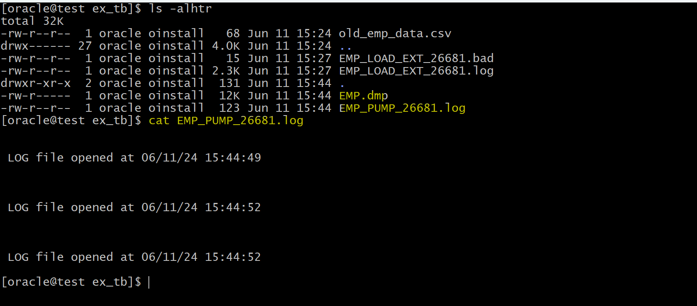

# DBA - External Table

[Back](../index.md)

- [DBA - External Table](#dba---external-table)
  - [External Table](#external-table)
  - [Lab: Create External Table with SQL\*Loader](#lab-create-external-table-with-sqlloader)
  - [Lab: Create External Table with SQL\*Pump](#lab-create-external-table-with-sqlpump)
  - [Lab: Patitioning](#lab-patitioning)
  - [Lab: External Table with Partitioning](#lab-external-table-with-partitioning)

---

## External Table

- `External Table`

  - a complement 补足物 to existing SQL\*Loader functionality.
    - enables to **access data in external sources** as if it were in a table in the database.
  - **read only table** whose `metadata` is **stored in the Db** but whose **data** is **stored outside the db**.

- no DML allowed
- no indexes can be created on external tables
- can access the data with 2 methods:

  - `oracle loader`
  - `oracle datapump`

- To read external data, first you need to **create directory** in the database
  - To create DIRECTORY you need `create any DIRECTORY` privilege

```sql
-- example
conn sqlplus sys as sysdba
alter session set container=orclpdb;

grant create any DIRECTORY to hr;
```

---

## Lab: Create External Table with SQL\*Loader

- Grant hr privilege

```sql
sqlplus / as sysdba
alter session set container=orclpdb;
show con_name

grant create any DIRECTORY to hr;
```

- place csv file in path

```sh
mkdir /home/oracle/ex_tb
touch /home/oracle/ex_tb/old_emp_data.csv

vi /home/oracle/ex_tb/old_emp_data.csv
# 1,khaled,ali
# 2,lana,diaz
# 3,lord, king
# 4,meme, moon
```

- connect as hr

```sql
sqlplus hr@orclpdb
show user
show con_name

-- create directory
CREATE OR REPLACE DIRECTORY EMP_DIR
AS '/home/oracle/ex_tb';

-- verify
SELECT * FROM ALL_DIRECTORIES
WHERE DIRECTORY_NAME='EMP_DIR';
-- SYS	EMP_DIR	/home/oracle/ex_tb	3
```

> - all the directories belong to sys

- Create external table

```sql
-- create ex tb
CREATE TABLE EMP_LOAD_ext
    (
        EMPLOYEE_NUMBER      NUMBER,
        FNAME   VARCHAR2(100),
        LNAME   VARCHAR2(100)
    )
    ORGANIZATION EXTERNAL   -- specify external table
      (
        TYPE ORACLE_LOADER      -- specifies the type of external table,
        DEFAULT DIRECTORY EMP_DIR   -- specifies the default directory
        ACCESS PARAMETERS       -- give instruction how to read this tb
        (
            RECORDS DELIMITED BY NEWLINE    -- each line contains one record
            FIELDS TERMINATED BY ','        -- delimited
        )
      LOCATION ('old_emp_data.csv')     -- specifies the data files for the external table.
     )
   reject limit unlimited;    -- read the file even if it contains unlimited errors.

-- query to verify
SELECT * FROM EMP_LOAD_EXT;
--1	khaled	ali
--2	lana	diaz
--3	lord	 king
--4	meme	 moon
```

> - Note: the creation of table only creates the meta data in Oracle.
> - A log file will be created in the directory like the SQL\*Loader.

- DML is not supported

```sql
DELETE EMP_LOAD_EXT;
--Error report -
--SQL Error: ORA-30657: operation not supported on external organized table
--30657.0000 -  "operation not supported on external organized table"
--*Cause:    User attempted on operation on an external table which is
--           not supported.
--*Action:   Don't do that!
```

- Any changes of the data must be done on the OS level, not in the database.

```sh
# add one line to the end
vi /home/oracle/ex_tb/old_emp_data.csv

# 200, dana,ford
```

```sql
-- query to confirm
SELECT * FROM EMP_LOAD_EXT;
--1	khaled	ali
--2	lana	diaz
--3	lord	 king
--4	meme	 moon
--200	 dana	ford
```

- If the value of data does not match the definition of the table

```sh
# change the first id
vi /home/oracle/ex_tb/old_emp_data.csv

# xxx	khaled	ali
```

- Error record will not show.
  - Errors are log in the bad file.

```sql
-- query to confirm
SELECT * FROM EMP_LOAD_EXT;
--2	lana	diaz
--3	lord	 king
--4	meme	 moon
--200	 dana	ford
```

---

## Lab: Create External Table with SQL\*Pump

- Method

```sql
sqlplus hr@orclpdb
show user;
--USER is "HR"
show con_name;
--CON_NAME
--------------------------------
--ORCLPDB
```

- Method 1:
  - create external table that create `.dmp` file from select statement

```sql
CREATE TABLE EMP_pump
    (
        EMPLOYEE_NUMBER,
        FNAME ,
        LNAME
    )
    ORGANIZATION EXTERNAL       -- specify to create external tb
        (
            TYPE ORACLE_DATAPUMP        -- specify the type of external tb
            DEFAULT DIRECTORY EMP_DIR   -- specify the directory
            LOCATION ('EMP.dmp')        -- specify the location of the dump file
        )
    AS
    SELECT EMPLOYEE_ID, FIRST_NAME,LAST_NAME
    FROM EMPLOYEES;

-- verify
SELECT * FROM EMP_PUMP;
-- return rows as query


```

> - The creation does not need to specify the data type.
> - The query will create a dump file which is the source of the external tb.
> - A dmp file and a log file are created in the direcotry.
>   - The data in the dmp file cannot be changed.



---

- Method 2:
  - create external table that read existing .dmp file

```sql
-- create ex tb with existing dmp file.
--drop table EMP_PUMP_READ;
CREATE TABLE EMP_PUMP_READ
    (
        EMPLOYEE_NUMBER NUMBER ,
        FNAME   VARCHAR2(100),
        LNAME  VARCHAR2(100)
    )
    ORGANIZATION EXTERNAL
    (
        TYPE ORACLE_DATAPUMP
        DEFAULT DIRECTORY EMP_DIR
        LOCATION ('EMP.dmp')
    );

-- query to verify
SELECT * FROM EMP_PUMP_READ;
```

---

## Lab: Patitioning

- Patitioning

```sql
-- connect with orcl hr
sqlplus hr@orclpdb

CREATE TABLE sales_by_country
(
  trans_id number,
  trans_amount number,
  country varchar2(3)
)
PARTITION BY LIST (country)
(
  PARTITION c1 VALUES ('USA'),
  PARTITION c2 VALUES ('JOR')
);

-- query partitions
SELECT *
FROM user_tab_partitions
WHERE TABLE_NAME='SALES_BY_COUNTRY'
ORDER BY table_name, partition_name;
--SALES_BY_COUNTRY	NO	C1	0	'USA'	5	1	USERS	10		1	255
--SALES_BY_COUNTRY	NO	C2	0	'JOR'	5	2	USERS	10		1	255

-- insert rows and commit
insert into sales_by_country values (1,500,'USA');
insert into sales_by_country values (2,600,'USA');
insert into sales_by_country values (3,400,'USA');
insert into sales_by_country values (4,500,'JOR');
insert into sales_by_country values (5,600,'JOR');
insert into sales_by_country values (6,400,'JOR');
COMMIT;
```

- Insert a row into a non-existing partition

```sql
-- NOW DO THIS
insert into sales_by_country values (7,3500,'UAE');
-- Error report -
-- ORA-14400: inserted partition key does not map to any partition

-- count by country
SELECT country, COUNT(1) FROM sales_by_country
GROUP BY country;
-- USA	3
-- JOR	3

-- query based on partition
SELECT COUNT(1) FROM sales_by_country PARTITION  (c1); -- 3
SELECT COUNT(1) FROM sales_by_country PARTITION  (c2); -- 3
```

- Add new partition

```sql
ALTER TABLE sales_by_country
ADD PARTITION C3 VALUES('UAE');

insert into sales_by_country values (7,3500, 'UAE');
COMMIT;

SELECT COUNT(1) FROM sales_by_country PARTITION  (c3);
-- 1

SELECT *
FROM   user_tab_partitions
WHERE TABLE_NAME='SALES_BY_COUNTRY'
ORDER BY table_name, partition_name;
--SALES_BY_COUNTRY	NO	C1	0	'USA'	5	1	USERS	10		1	255	8388608	1048576	1	2147483645	2147483645				YES	DISABLED										DEFAULT	DEFAULT	DEFAULT	NO	NO	NO		NO	YES	ON	NO	DISABLED								DISABLED	DISABLED
--SALES_BY_COUNTRY	NO	C2	0	'JOR'	5	2	USERS	10		1	255	8388608	1048576	1	2147483645	2147483645				YES	DISABLED										DEFAULT	DEFAULT	DEFAULT	NO	NO	NO		NO	YES	ON	NO	DISABLED								DISABLED	DISABLED
--SALES_BY_COUNTRY	NO	C3	0	'UAE'	5	3	USERS	10		1	255	8388608	1048576	1	2147483645	2147483645				YES	DISABLED										DEFAULT	DEFAULT	DEFAULT	NO	NO	NO		NO	YES	ON	NO	DISABLED								DISABLED	DISABLED

SELECT *
FROM sales_by_country;
--1	500	USA
--2	600	USA
--3	400	USA
--4	500	JOR
--5	600	JOR
--6	400	JOR
--7	3500	UAE
```

---

## Lab: External Table with Partitioning

- Verify directory

```sql
SELECT *
FROM ALL_DIRECTORIES
WHERE DIRECTORY_NAME='EMP_DIR';
-- SYS	EMP_DIR	/home/oracle/ex_tb	3
```

- Create external files

```sh
mkdir /home/oracle/ex_tb
touch /home/oracle/ex_tb/USA.dat
# 1,500,USA
# 2,600,USA
# 3,400,USA
touch /home/oracle/ex_tb/JOR.dat
# 4,500,JOR
# 5,600,JOR
# 6,400,JOR
touch /home/oracle/ex_tb/UAE.dat
# 7,3500,UAE
```

- Create external table with partitions

```sql
CREATE TABLE  sales_by_country_ext
(
    trans_id number,
    trans_amount number,
    country varchar2(3)
)
ORGANIZATION EXTERNAL
(
    TYPE ORACLE_LOADER
    DEFAULT DIRECTORY EMP_DIR
    ACCESS PARAMETERS
    (
        RECORDS DELIMITED BY NEWLINE
        FIELDS TERMINATED BY ','
    )
)
reject limit unlimited
PARTITION BY LIST (country)
(
    PARTITION c1 VALUES ('USA') LOCATION ('USA.dat'), -- specify parition with dat file
    PARTITION c2 VALUES ('JOR') LOCATION ('JOR.dat'),
    PARTITION c3 VALUES ('UAE') LOCATION ('UAE.dat')
);
```

- query

```sql
SELECT * 
FROM sales_by_country_ext;
--1	500	USA
--2	600	USA
--3	400	USA
--5	600	JOR
--6	400	JOR
--7	3500	UAE

-- query parition location
SELECT table_name, partition_name, location, directory_name
FROM all_XTERNAL_LOC_PARTITIONS
where table_name='SALES_BY_COUNTRY_EXT';
--SALES_BY_COUNTRY_EXT	C1	USA.dat	
--SALES_BY_COUNTRY_EXT	C2	JOR.dat	
--SALES_BY_COUNTRY_EXT	C3	UAE.dat	
```
