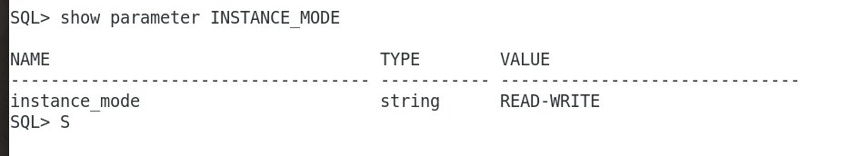

# DBA - Database Instance

[Back](../../index.md)

- [DBA - Database Instance](#dba---database-instance)
  - [Oracle Database Instance](#oracle-database-instance)
  - [Database Instance Structure](#database-instance-structure)
    - [Main components](#main-components)
  - [Read/Write and Read-Only Instances](#readwrite-and-read-only-instances)
  - [Duration of a Database Instance](#duration-of-a-database-instance)
  - [Identification of a Database Instance](#identification-of-a-database-instance)
    - [Oracle Base Directory](#oracle-base-directory)
    - [Oracle Home Directory](#oracle-home-directory)
    - [Oracle System Identifier (SID)](#oracle-system-identifier-sid)
  - [Database Mode: `read/write` \& `read-only`](#database-mode-readwrite--read-only)
  - [Database Instance](#database-instance)
    - [Connecting](#connecting)
  - [Lab: Login Oracle Database](#lab-login-oracle-database)
    - [Database File Checks](#database-file-checks)

---

## Oracle Database Instance

- **Physical level:**

  - A `CDB`:

    - **a set of files on disk** created by the `CREATE DATABASE` statement.
    - contains one or more **user-created** `PDBs`.

  - A `PDB`
    - contains its own set of `data files` within the overall set of `data files` that **belongs to the CDB**.

- `Database Instance`

  - a **set of memory structures** that manage **database files**.
    - can exist independently of database files.
  - manages the data associated with the `CDB` and its `PDBs` and serves their users.
    - Every **running** `CDB` is **associated with at least one** Oracle `database instance`.
  - consists of

    - a **shared memory area**, `system global area (SGA)`,
    - a set of b`ackground processes`.

  - Running 即在内存中的实例

- `Instance` vs `Database`
  - an `instance` exists **in memory**. an instance can exist without a database
  - a `database` (in the narrowest sense of term) is a **set of files on disk**. a database can exist without an instance.

---

## Database Instance Structure

- Database instance consists of

  - a **shared memory area**, `system global area (SGA)`,
  - a set of b`ackground processes`.

- `System Global Area (SGA)`

  - a **shared memory region** to manage data and control structures.
  - **shared** by all server and background processes associated with a particular instance.

- When an instance is started, instance allocates a memory area for `SGA` and starts **background processes**.

- Purpose of SGA:

  - Maintaining **internal data structures** that many processes and threads access concurrently
  - **Caching** `data blocks` read from disk
  - **Buffering** `redo data` **before writing** it to the `online redo log files`
  - **Storing** `SQL execution plans`

- A database instance includes `background processes`.

- `Server processes`, and the process memory allocated in these processes.
  - The instance continues to function when server processes terminate.

---

### Main components


---

## Read/Write and Read-Only Instances

- Every database instance is **either** `read/write` **or** `read-only`.

- `read/write` database instance:

  - default
  - can process **DML** and supports **direct connections** from client applications.

- `read-only` database instance:

  - process **queries**,
  - but does **not** support modification **DML** (UPDATE, DELETE, INSERT, and MERGE) or **direct client connections**.
  - characteristics:
    - Can only open a **database that has already been opened** by a `read/write` instance. 自己不能打开
    - Disable many background processes, including the checkpoint and archiver processes, which are not necessary. 关闭 chpt, arch 进程
    - Can mount a disabled redo thread or a thread without any online redo log

- `read-only` and `read/write` instances can **coexist** within a single database.

- **Configuration**:
  - `INSTANCE_MODE` initialization parameter:
    - `READ_WRITE`: default value, `read/write` instance
    - `READ_ONLY`: `read-only` instance

```sql
show parameter INSTANCE_MODE;
```



---

## Duration of a Database Instance

- A database instance **begins** when it is created with the `STARTUP` command and **ends** when it is **terminated**.

- During this period, a `database instance` can

  - **associate** itself with **one and only one** `database`.
  - **mount** a database **only once**,
  - **close** it **only once**
  - **open** it **only once**.

- After a database has been closed or shut down, you **must start a different** `instance` to mount and open this database.关闭后必须开启不同的实例.

```SQl
SELECT instance_name, startup_time FROM v$instance;
```


---

## Identification of a Database Instance

- **Multiple** `database instances` can reside on a **single host**.

- `Oracle Optimal Flexible Architecture (OFA)` rules
  - a set of configuration guidelines created to **ensure well-organized Oracle installations**.

---

### Oracle Base Directory

- `Oracle base directory`

  - **stores the binaries** for Oracle products.
  - the **database home directory** for Oracle Database **installation owners**.
    - There can be **many** Oracle Database installations on a host, and many Oracle Database software installation owners.

- Example:

```sh
# /u01/:  the mount point,
# /u01/app/: the subtree for application software.
/u01/app/oracle
```

- **Environment variable**: `ORACLE_BASE`


---

### Oracle Home Directory

- `Oracle home`
  - the **software location** for an Oracle database.
  - must specify a new Oracle home directory for each new installation of Oracle Database software.
- By default:

  - the `Oracle home directory` is a **descendent** within the `Oracle base (ORACLE_BASE) directory` tree.

- can install this release, or earlier releases of the database software, **more than once** on the same host, in **different** Oracle `home directories` within a **single** `Oracle base`. 单一 base 下的不同 home

  - Multiple databases, of different versions and owned by different user accounts, can **coexist** concurrently.

- Example:

```sh
# full path names of three different Oracle homes
# all within the same Oracle base directory of /u01/app/oracle/
# includes:
#     the product release number: 12.1.0, 18.0.0
#     Oracle home relative directory: dbhome_1, dbhome_2
/u01/app/oracle/product/12.1.0/dbhome_1
/u01/app/oracle/product/12.1.0/dbhome_2
/u01/app/oracle/product/18.0.0/dbhome_1
```

- **Environment variable**: `ORACLE_HOME`


---

### Oracle System Identifier (SID)

- `system identifier (SID)`

  - a **unique name** for an Oracle `database instance` on a specific host.

- Usage:

  - used with `Oracle home values` to create a key to **shared memory**.
  - used to locate the `initialization parameter file`

- **Environment variable**: `ORACLE_SID`


---

## Database Mode: `read/write` & `read-only`

- `read/write` mode:

  - Default mode when opens.
  - users can **make changes to the data**, generating **redo** in the online redo log.

- `read-only` mode:

  - the mode to prevent data modification by user transactions.
    - **restricts database access** to read-only transactions, which **cannot write**
      - to `data files` or
      - to `online redo log files`.
    - the database can perform **recovery** or operations that change the database state **without generating redo**.
  - the default mode of a physical **standby** database opens

- Use Case of `read-only`:
  - `Data files` can be **taken offline and online**. However, you cannot take permanent tablespaces offline.
  - Offline `data files` and `tablespaces` can be **recovered**.
  - The `control file` remains available for updates about the state of the database.
  - Temporary tablespaces created with the `CREATE TEMPORARY TABLESPACE` statement are `read/write`. 在 db 只读的模式下, 临时 tbsp 可以读写
  - Writes to operating system **audit trails**, **trace files**, and **alert logs** can continue.

---

## Database Instance

- `database instance`

  - a set of **memory structures that manage database files**.
  - provides user access to a database.
  - **manages the data** associated with the CDB and its PDBs and serves their users.

- **vs `database`**

  - an `instance` **exists in memory**
  - `database` that is **a set of files** on disk.

- an `instance` can exist **without** a `database`(nomount stage).
- a `database` can exist **without** an `instance`(physical files exists without memory).

- Every **running** `CDB` is associated with **at least one** Oracle `database instance`.

  - In Oracle Multitenant Architecture, a Container Database (CDB) can indeed be associated with multiple instances.(Oracle Real Application Clusters (RAC))
  - 因为是 running, 所以必须有 instance; 因为 CDB 是多租户架构, 所以是至少一个.

---

- A database instance **cannot be shared**.

  - Each database instance is associated with **only one database**.

    - If there are **multiple databases** on the same server, then there is **a separate and distinct database instance for each** database. Instance 专属一个 db.
    - An `Oracle Real Applications Cluster (RAC)` database usually has **multiple instances** on separate servers **for the same shared database**. RAC:共享 DB 可以对多个 instance.


- In this model, the same database is associated with each RAC instance, which meets the requirement that, at most, only one database is associated with an instance.
- 以上都遵循不共享 instance 原则.
  - local: 一对一
  - clustered: db 共享, instance 专属.

---

### Connecting


- `Connection`:

  - a **communication pathway** between a `user process` and an Oracle `Database instance`.
  - A communication pathway is established by **using** available _interprocess communication mechanisms_ (on a computer that runs both the user process and Oracle Database) or _network software_ (when different computers run the database application and Oracle Database and communicate through a network).

- `Session`:

  - **Specific connection** of a user to an instance through a user process
  - A session represents **the state of a current user login to the database instance**.

    - For example, when a user starts SQL\*Plus, the user must provide a valid username and password, and then a session is established for that user.

  - A session **lasts** from the time _a user connects_ until _the user disconnects or exits_ the database application.

  - **Multiple sessions** can be created and exist **concurrently** for a single Oracle database user by **using the same username**.
    - For example, a user with the username/password of HR/HR can connect to the same Oracle Database instance several times.

---

---

## Lab: Login Oracle Database

- `sqlplus`
  - launch SQL\*Plus, which is the command-line interface for Oracle Database.
- Authentication Prompt:

  - prompt to enter username and password to connect to the Oracle Database.

- `sqlplus sys as sysdba`:

  - connect as the `SYS` user with `SYSDBA` privileges.

- Password:

  - `SYSDBA` indicates the use of operating system authentication that is granted access without providing a password. Thus press enter is fine.

- `Connected to an idle instance.`:
  - successfully connected to the Oracle Database, but the database instance is currently in an idle state.
  - Many reasons:
    - the instance is shut down.


---

---

### Database File Checks

- If any of the `data files` or `redo log files` are not present when the instance attempts to open the database, or if the files are present but **fail consistency tests**, then the database **returns an error**.
  - Media recovery may be required.

---

---

[top](#dba---database-instance)
