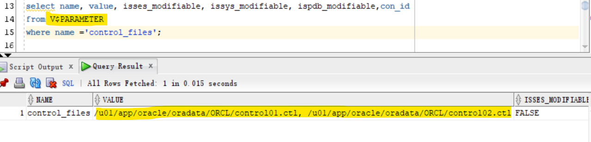
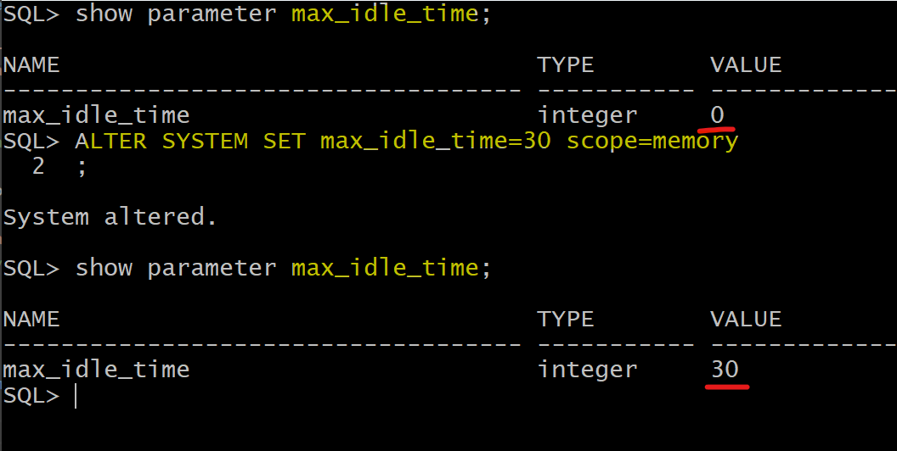

# DBA - Instance: Parameter

[Back](../../index.md)

- [DBA - Instance: Parameter](#dba---instance-parameter)
  - [Initialization Parameters](#initialization-parameters)
    - [Types of Initialization Parameters](#types-of-initialization-parameters)
  - [`V$PARAMETER` \& `V$PARAMETER2`](#vparameter--vparameter2)
    - [Lab: `V$PARAMETER`](#lab-vparameter)
    - [Lab: `V$PARAMETER` \& `V$PARAMETER2`](#lab-vparameter--vparameter2)
  - [`V$SYSTEM_PARAMETER` vs `V$SYSTEM_PARAMETER2`](#vsystem_parameter-vs-vsystem_parameter2)
    - [Lab: `V$SYSTEM_PARAMETER`](#lab-vsystem_parameter)
    - [Lab: `V$SYSTEM_PARAMETER` \& `V$SYSTEM_PARAMETER2`](#lab-vsystem_parameter--vsystem_parameter2)
    - [Lab: `V$SYSTEM_PARAMETER` vs `V$PARAMETER`](#lab-vsystem_parameter-vs-vparameter)
  - [Session-level Paramters](#session-level-paramters)
    - [Lab: Alter Session Parameter](#lab-alter-session-parameter)
  - [System Parameter](#system-parameter)
    - [`SCOPE`](#scope)
    - [Default Scope](#default-scope)
    - [Lab: Alter System parameter with scope of memory](#lab-alter-system-parameter-with-scope-of-memory)
    - [Lab: Alter system parameter with scope of spfile](#lab-alter-system-parameter-with-scope-of-spfile)
    - [Lab: Alter System parameter with scope of Both](#lab-alter-system-parameter-with-scope-of-both)
    - [Lab: Reset the parameter](#lab-reset-the-parameter)
    - [Lab: Defaul Scope for SPFile](#lab-defaul-scope-for-spfile)
    - [Lab: Default Scope for pfile](#lab-default-scope-for-pfile)
  - [Pluggable Paramter](#pluggable-paramter)
    - [Lab: Alter pluggable parameter](#lab-alter-pluggable-parameter)

---

## Initialization Parameters

- `Initialization parameters`

  - the configuration **parameters** that **affect the basic operation** of an instance.
  - The instance reads `initialization parameters` from a file **at startup.**

- Only a few of parameters **must be explicitly set** because the default values are usually adequate.

  - Note: All initialization parameters are optional. Oracle has a default value for each parameter. 所有参数都有默认值.

- initialization parameters are used to **optimize performance** by **adjusting memory structures**. 实际上参数作用于内存结构.

---

### Types of Initialization Parameters

- Most initialization parameters belong to one of the following groups: 功能上

  - Parameters that **name entities** such as files or directories

  - Parameters that **set limits** for a process, database resource, or the database itself

  - `variable parameters`:
    - Parameters that **affect capacity**, such as the size of the SGA

---

- Initialization parameters are divided into two groups: **basic** and **advanced**.性能上

- Typically, only the approximately **30** `basic parameters` to obtain **reasonable performance**.

  - The basic parameters **set characteristics** such as the database name, locations of the control files, database block size, and undo tablespace.

- modification to the `advanced parameter`s may be required for **optimal performance**.

---

- `Derived parameters`:

  - their values are calculated from the values of other parameters.其他参数计算的结果
  - e.g., sessions Derived from processes: `sessions = (1.5 \* PROCESSES) + 22`

- `Operating System-Dependent Parameters`
  - e.g., DB_BLOCK_SIZE

---

## `V$PARAMETER` & `V$PARAMETER2`

- `V$PARAMETER`:

  - displays information about the `initialization parameters` that are currently **in effect for the session**.

- `V$PARAMETER2`:

  - same as `V$PARAMETER`, but more readable

- Key Column

  - `ISSES_MODIFIABLE`
  - `ISSYS_MODIFIABLE`
  - `ISPDB_MODIFIABLE`

---

### Lab: `V$PARAMETER`

- Query in root
  - return con_id is 1, because the current session is in root.

```sql
# current in root
show con_name

select name, open_mode from v$pdbs;

alter pluggable database all open;

select name,value,isses_modifiable , issys_modifiable , ispdb_modifiable ,con_id
from V$PARAMETER
order by name;

```


---

### Lab: `V$PARAMETER` & `V$PARAMETER2`

```sql
select name, value, isses_modifiable, issys_modifiable, ispdb_modifiable,con_id
from V$PARAMETER
where name ='control_files';
```




---

## `V$SYSTEM_PARAMETER` vs `V$SYSTEM_PARAMETER2`

- `V$SYSTEM_PARAMETER`
  - displays the initialization parameters that are **currently in effect for the instance**.
  - A new session inherits parameter values from the instance-wide values.
- `V$SYSTEM_PARAMETER2`

  - same as `V$SYSTEM_PARAMETER`, but more readable

- Key columns:
  - `ISDEFAULT`:
    - Indicates whether the parameter is **set to the default value (`TRUE`)**. Otherwise, the parameter value was **specified in the parameter file (spfile or pfile) (`FALSE`)**
    - Only a few parameters need to be configured in the parameter file since most of parameters use the default values.

---

### Lab: `V$SYSTEM_PARAMETER`

- Query
  - con_id is 0, because it is the instance level.

```sql
select name, value, con_id, ISDEFAULT, isses_modifiable, issys_modifiable, ispdb_modifiable
from V$SYSTEM_PARAMETER
order by name;
```


- `ISDEFAULT` for `audit_file_dest` is fault
  - its value is not a default value, but use the value defined in the parameter file.


---

- query all parameter defined in the parameter file.

```sql
select name, value, ISDEFAULT, con_id, isses_modifiable, issys_modifiable, ispdb_modifiable
from V$SYSTEM_PARAMETER
where ISDEFAULT='FALSE'
AND CON_ID=0
order by name;
```


---

### Lab: `V$SYSTEM_PARAMETER` & `V$SYSTEM_PARAMETER2`

```sql
select name,value,isses_modifiable , issys_modifiable , ispdb_modifiable ,con_id
from V$SYSTEM_PARAMETER
where name ='control_files';

select name,value,isses_modifiable , issys_modifiable , ispdb_modifiable ,con_id
from V$SYSTEM_PARAMETER2
where name ='control_files';
```


---

### Lab: `V$SYSTEM_PARAMETER` vs `V$PARAMETER`

- Alter session parameter only change the value in the `V$PARAMETER`, not in the `V$SYSTEM_PARAMETER`

```sql
# Query instance level parameter
select name,value,isses_modifiable , issys_modifiable , ispdb_modifiable ,ISDEFAULT,con_id
from V$SYSTEM_PARAMETER
where name='nls_date_format';
#nls_date_format		TRUE	FALSE	TRUE	TRUE	0

# alter session parameter
alter session set nls_date_format='dd-mm-yyyy';

# Query instance level parameter
# value not changed, null
select name,value,isses_modifiable , issys_modifiable , ispdb_modifiable ,con_id
from V$SYSTEM_PARAMETER
where name='nls_date_format';
# nls_date_format		TRUE	FALSE	TRUE	0

# Query session level parameter
# value change
select name,value,isses_modifiable , issys_modifiable , ispdb_modifiable ,con_id
from V$PARAMETER
where name='nls_date_format';
# nls_date_format	dd-mm-yyyy	TRUE	FALSE	TRUE	1
```

---

## Session-level Paramters

- When the `isses_modifiable=True`, this session parameter can be changed in the session; Otherwise, it cannnot be changed.

- When the current session is terminated, the setting will not be available for the new session.

- Alter:

```sql
ALTER SESSION SET parameter=value;
```

- **Shortcut**:
  - return all session level parameters

```sql
--can you query all the para that we can change it on session level
select name,value, isses_modifiable, issys_modifiable, ispdb_modifiable
from V$PARAMETER
where isses_modifiable='TRUE'
```

---

### Lab: Alter Session Parameter

```sql
# query parameters
select name,value from V$PARAMETER
order by name;

# query a parameter with modifiable details
select name,value,isses_modifiable , issys_modifiable , ispdb_modifiable
from V$PARAMETER
where name ='nls_date_format';
```


- Alter session parameter

```sql
# query before alter
select sysdate from dual;
#28-Feb-2024

# alter parameter
alter session set nls_date_format='dd-mm-yyyy';

# confirm new value of parameter
select name,value,isses_modifiable , issys_modifiable , ispdb_modifiable
from V$PARAMETER
where name ='nls_date_format';

# confirm after alter
select sysdate from dual;
#28-02-2024

```


---

## System Parameter

- values in `issys_modifiable`:

| `issys_modifiable` | Description                                              |
| ------------------ | -------------------------------------------------------- |
| `FALSE`            | could be changed, in `Spfile` **only**, need **restart** |
| `IMMEDIATE`        | changes can take **effect IMMEDIATE**                    |
| `DEFERRED`         | take effect for **future sessions**                      |

- Syntax:

```sql
ALTER SYSTEM SET parameter=value;
```

- **Shortcut**:
  - query all parameter defined in the parameter file.

```sql
select name, value, ISDEFAULT, con_id, isses_modifiable, issys_modifiable, ispdb_modifiable
from V$SYSTEM_PARAMETER
where ISDEFAULT='FALSE'
AND CON_ID=0
order by name;
```

---

### `SCOPE`

| value of scope | current session | restart  | future session |
| -------------- | --------------- | -------- | -------------- |
| `MEMORY`       | Yes             | -        | No             |
| `SPFILE`       | No              | required | Yes            |
| `BOTH`         | Yes             | -        | Yes            |
| `DEFERRED`     | No              | -        | Yes            |

---

### Default Scope

- Default scope of `Alter system set parameter=value`

| Startup with | Defautl  | Equivalent                                      |
| ------------ | -------- | ----------------------------------------------- |
| spfile       | `BOTH`   | `Alter system set parameter=value scope=both`   |
| pfile        | `MEMORY` | `Alter system set parameter=value scope=memory` |

> DB can read but cannot write a pfile.

---

### Lab: Alter System parameter with scope of memory

- `scope=memory`: changes only effects the instance, not the spfile.

```sql
show parameter max_idle_time;
# 0

ALTER SYSTEM SET max_idle_time=30 scope=memory;

show parameter max_idle_time;
# 30
```



- Query from v$parameter and v$system_parameter
  - Both 30
  - means new value is in effiect for the current session and for the new session.

```sql
SELECT value FROM v$parameter WHERE name='max_idle_time';
# 30
SELECT value FROM v$system_parameter WHERE name='max_idle_time';
# 30

```


- Shutdown
- startup without specific pfile
- query parameter
  - value is 0, means that value only effect in memory, not spfile.


---

### Lab: Alter system parameter with scope of spfile

- alter parameter only for spfile
  - value will not be in effect for the current session
  - only for the next startup
- query system parameter
  - value not change, means value not effect in the memory.

```sql
ALTER SYSTEM SET max_idle_time=50 scope=spfile;

SELECT value FROM v$system_parameter WHERE name='max_idle_time';
# 0
```


- Check spfile
  - new value was written to spfile


- Shutdown and startup
- query instance level parameter
  - the new value will be inherit in the new session.


---

### Lab: Alter System parameter with scope of Both

- Alter parameter both in memory and spfile

```sql
ALTER SYSTEM SET max_idle_time=20 scope=both;

SELECT value FROM v$system_parameter WHERE name='max_idle_time';
```


- The value in spfile is updated.


---

### Lab: Reset the parameter

```sql
ALTER SYSTEM RESET max_idle_time scope=both;

SELECT value FROM v$system_parameter WHERE name='max_idle_time';
```


- parameter will be removed from the spfile.

---

### Lab: Defaul Scope for SPFile

- Query v$parameter

  - issys_modifiable is IMMEDIATE
  - this system parameter can be changed in the memory level and effect immediagtely.

- Query v$system_PARAMETER

  - ISDEFAULT shows FALSE
  - this parameter is given in the spfile.

- Query spfile
  - confirm the instance was started using a spfile.

```sql
show con_name;
# CON_NAME
# ------------------------------
# CDB$ROOT

select name,value,isses_modifiable , issys_modifiable , ispdb_modifiable ,con_id
from V$PARAMETER
where name='open_cursors';
# open_cursors	300	FALSE	IMMEDIATE	TRUE	1

select name,value,isses_modifiable , issys_modifiable , ispdb_modifiable ,ISDEFAULT,con_id
from V$system_PARAMETER
where name='open_cursors';
# open_cursors	300	FALSE	IMMEDIATE	TRUE	FALSE	0

show parameter spfile;
# NAME   TYPE VALUE
# ------ ------ ----------------------------------------------------------
# spfile string /u01/app/oracle/product/19.0.0/dbhome_1/dbs/spfileorcl.ora
```

- Alter system using default scope

  - because a spfile is used, defualt scope is BOTH.

- Query confirm the value in the memory has been changed.

```sql
alter system set open_cursors=301;

select name,value,isses_modifiable , issys_modifiable , ispdb_modifiable ,ISDEFAULT,con_id
from V$system_PARAMETER
where name='open_cursors';
# open_cursors	301	FALSE	IMMEDIATE	TRUE	FALSE	0
```

- Confirm the spfile is changed.


---

### Lab: Default Scope for pfile

- shutdown the instance
- restart instance using pfile
- Query parameter to confirm starting instance with pfile.

```sql
startup pfile=/u01/app/oracle/product/19.0.0/dbhome_1/dbs/test.ora

show parameter spfile;
```


- Try to alter system with scope of spfile
  - error: because DB can read but cannot write a pfile.

```sql
ALTER system SET open_cursors=301 scope=spfile;
```


---

- query before altering
- alter with default scope
- query after altering

```sql
SELECT value FROM v$parameter WHERE name='open_cursors';

SELECT value FROM v$system_parameter WHERE name='open_cursors';

ALTER system SET open_cursors=302;

SELECT value FROM v$parameter WHERE name='open_cursors';

SELECT value FROM v$system_parameter WHERE name='open_cursors';

```


- check pfile
  - no change


---

## Pluggable Paramter

- When the `ispdb_modifiable=FALSE`, this session parameter cannot be changed in PDB.

- `Inheritance`

  - PDBs **inherit** initialization parameter values **from the root**.
  - When the value of a parameter is changed in the root level, the values of parameters in pluggable databases will be affected.

- A PDB can **override** the root's setting for the parameters whose`ISPDB_MODIFIABLE` is TRUE.

  - when the PDB override the root's setting , a new record will be added to `V$system_PARAMETER`

- Override:

  - By default, `CONTAINER = CURRENT`

| current | CONTAINER           | apply to   | Description                   |
| ------- | ------------------- | ---------- | ----------------------------- |
| `root`  | `CONTAINER=ALL`     | root + pdb | includ pdb's customized value |
| `root`  | `CONTAINER=CURRENT` | root + pdb | except pdb's customized value |
| `pdb`   | `CONTAINER=CURRENT` | pdb        |                               |

---

### Lab: Alter pluggable parameter

- Confirm instance start by a spfile
- confirm in the root
- query open_cursors parameter
  - it is a parameter inherited from the root in PDB.

```sql
alter system register;    # register service in listener.

show con_name;
# CON_NAME
# ------------------------------
# CDB$ROOT

select name, value, isses_modifiable, issys_modifiable, ispdb_modifiable,ISDEFAULT, con_id
from V$system_PARAMETER
where name='open_cursors';
# open_cursors	301	FALSE	IMMEDIATE	TRUE	FALSE	0

```

- Alter parameter in the root
  - it will override both in root and in pdb, even its container is current.
  - it will be overriden in pdb, because it has not been overriden in the pdb before.

```sql
alter system set open_cursors=400 container=current;

# Query in the root
select name,value,isses_modifiable , issys_modifiable , ispdb_modifiable ,ISDEFAULT,con_id
from V$system_PARAMETER
where name='open_cursors';
# open_cursors	400	FALSE	IMMEDIATE	TRUE	FALSE	0

```

---

- Move to PDB
- confirm container
- query parameter in the pdb.
- Try to make change, container = all
  - error
- Make change, container = current
- Query to confirm

```sql
alter session set container=orclpdb;
show con_name
# CON_NAME
# ------------------------------
# ORCLPDB


select name,value,isses_modifiable , issys_modifiable , ispdb_modifiable ,ISDEFAULT,con_id
from V$system_PARAMETER
where name='open_cursors';
# open_cursors	400	FALSE	IMMEDIATE	TRUE	FALSE	0

alter system set open_cursors=500 container=all;
# Error report -
# ORA-65050: Common DDLs only allowed in root.
# 65050. 00000 -  "Common DDLs only allowed in root."
# *Cause:    An attempt was made to issue a common DDL in a pluggable database.
# *Action:   Switch to CDB$ROOT or application root and issue the common DDL.

alter system set open_cursors=500 container=current;
select name,value,isses_modifiable , issys_modifiable , ispdb_modifiable ,ISDEFAULT,con_id
from V$system_PARAMETER
where name='open_cursors';
# open_cursors	500	FALSE	IMMEDIATE	TRUE	FALSE	3
```

---

- move to root
- query parameter
  - 2 paramters with different con_id.

```sql
alter session set container=cdb$root;

select name,value,isses_modifiable , issys_modifiable , ispdb_modifiable ,ISDEFAULT,con_id
from V$system_PARAMETER
where name='open_cursors';
# open_cursors	400	FALSE	IMMEDIATE	TRUE	FALSE	0
# open_cursors	500	FALSE	IMMEDIATE	TRUE	FALSE	3
```

---

- Alter parameter in the root, container = current
- Query parameter
  - the costomized value stay untouched
  - all the rest will be changed.

```sql
alter system set open_cursors=410 container=current;

select name,value,isses_modifiable , issys_modifiable , ispdb_modifiable ,ISDEFAULT,con_id
from V$system_PARAMETER
where name='open_cursors';
# open_cursors	410	FALSE	IMMEDIATE	TRUE	FALSE	0
# open_cursors	500	FALSE	IMMEDIATE	TRUE	FALSE	3

```

- stay in root
- alter parameter, container=all
- query parameter
  - only one record
  - customized parameter is reset

```sql
alter system set open_cursors=410 container=all;

select name,value,isses_modifiable , issys_modifiable , ispdb_modifiable ,ISDEFAULT,con_id
from V$system_PARAMETER
where name='open_cursors';
# open_cursors	410	FALSE	IMMEDIATE	TRUE	FALSE	0
```

---

[TOP](#dba---instance-parameter)
