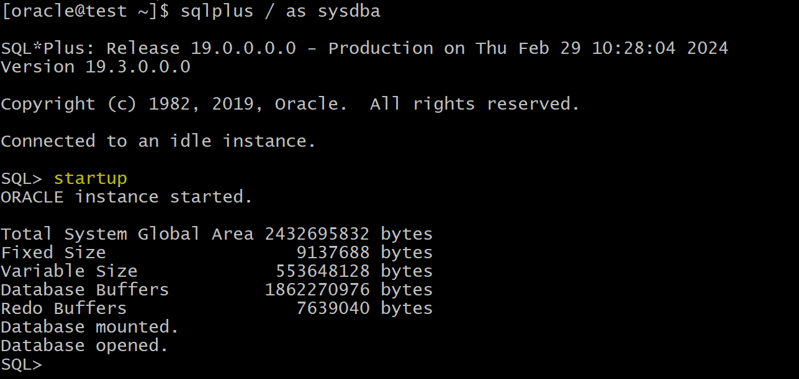

# DBA - Instance: Parameter File

[Back](../../index.md)

- [DBA - Instance: Parameter File](#dba---instance-parameter-file)
  - [Parameter File](#parameter-file)
    - [Server Parameter Files](#server-parameter-files)
    - [Text Initialization Parameter Files](#text-initialization-parameter-files)
  - [`V$SPPARAMETER`](#vspparameter)
    - [Lab: `V$SPPARAMETER`](#lab-vspparameter)
  - [Lab: Explore PFile and SPFile](#lab-explore-pfile-and-spfile)
  - [Lab: Startup without parameter file](#lab-startup-without-parameter-file)
  - [Lab: Create PFile from SPFile](#lab-create-pfile-from-spfile)
  - [Lab: Startup with PFile](#lab-startup-with-pfile)
  - [Lab: Whether instance start with PFile or SPfile](#lab-whether-instance-start-with-pfile-or-spfile)
  - [Lab: Startup with a specific pfile](#lab-startup-with-a-specific-pfile)

---

## Parameter File

- To start a database instance, Oracle Database **must read**:二选一

  - either a `server parameter file`, which is recommended,
  - or a `text initialization parameter file`, which is a legacy implementation.

- Without theses file, instance cannot start.

- `parameter file`:

  - the files contain a list of configuration parameters.

- files location: `$ORACLE_HOME/dbs`


- **Automatically search order** for a paramter file when an instance is started up: 自动寻找顺序

  - 1. `spfile<sid>.ora`
  - 2. `spfile.ora`
  - 3. `init<sid>.ora`

- can create pfile from spfile but you should name it `Init<sid>.ora` in order the instance can use it **automatically** incase the spfile not available.自动寻找时, 需要命名.

- If you name it another name, then you have to **specify** it during startup: `Startup pfile=pfilename`否则必须使用参数 pfile

---

### Server Parameter Files

- `server parameter file`

  - a **repository** for initialization parameters.

- characteristics:

  - the preferred choice
  - **Only Oracle Database reads and writes** to the server parameter file.只能由 DB 读写
  - **Only one** `server parameter file` exists for a database. This file must **reside on the database host**.必须在 DB 服务器上
  - The server parameter file is **binary** and **cannot be modified by a text editor**.二进制文件
  - Initialization **parameters** stored in the server parameter file **are persistent**. Any **changes** made to the parameters while a database instance is running **can persist** across instance shutdown and startup.改变将持续有效
  - can use `alter system` command for changing Parameters

- Creation:

  - initially built from a text initialization parameter file using the `CREATE SPFILE` statement.
  - can also be created directly by the `Database Configuration Assistant`.
    - automatically created by `DBCA` when you create CDB.

- **Default name** for spfile: `spfile<sid>.ora`

  - e.g., spfileorcl.ora

---

### Text Initialization Parameter Files

- `text initialization parameter file`

  - a **text file** that contains a list of initialization parameters.
  - contains a series of `key=value` pairs, one per line.

- characteristics:

  - When starting up or shutting down a database, the text initialization parameter file must **reside on the same host as the client application** that connects to the database.在连接 db 的客户端上.
  - **text-based, not binary.**
  - Oracle Database **can read but not write** to the text initialization parameter file. DB 只能读取, 不能改写
    - To change the parameter values you must manually alter the file with a text editor.只能通过文本编辑器改写, 再由 DB 读取.
  - Changes to initialization parameter values by `ALTER SYSTEM` are **only in effect for the current instance**.
    - must **manually update** the text initialization parameter file and **restart** the instance for the changes to be known.手动修改并重启实例

- Sample pfile **name** : `init.ora`


> 注意 pfile 是在连接 DB 的客户端上, spfile 是在 DB 服务器上.

---

## `V$SPPARAMETER`

- `V$SPPARAMETER`:

  - displays information about the contents of the **server parameter file**.

- If a `server parameter file` was not used to start the instance, then each row of the view will contain `FALSE` in the `ISSPECIFIED` column.

- Used to view the parameters in the spfile within the Oracle.无需退出 oracle, 即可查阅 spfile.

- - Shortcut:
  - list all parameters in the spfile

```sql
SELECT *
FROM v$spparameter
WHERE isspecified='TRUE';
```

---

### Lab: `V$SPPARAMETER`

- Shutdown and restartup instance with spfile

```sql
show con_name;
# CON_NAME
# ------------------------------
# CDB$ROOT

select name,value,isses_modifiable , issys_modifiable , ispdb_modifiable ,ISDEFAULT,con_id
from V$system_PARAMETER
where name='open_cursors';
# open_cursors	410	FALSE	IMMEDIATE	TRUE	FALSE	0
# ISDEFAULT indicates the value is coming from the spfile.

alter system set open_cursors=310 container=all scope=memory;
# open_cursors	310	FALSE	IMMEDIATE	TRUE	FALSE	0
# only in memory, not in the spfile

select * from V$SPPARAMETER
where name='open_cursors';
# *	open_cursors	integer	410	410	TRUE	1		1
# ISSPECIFIED is true, indicating the 410 is specified in the spfile.
```

- Shortcut:
  - list all parameters in the spfile

```sql
SELECT *
FROM v$spparameter
WHERE isspecified='TRUE';
```


---

## Lab: Explore PFile and SPFile

- path to PFile


- PFile: key-value pair


- SPFile:


---

## Lab: Startup without parameter file

- Rename the spfile


- If the instance is running, shutdown.
- Try to startup instance
  - error:
    - `ORA-01078: failure in processing system parameters`
    - `LRM-00109: could not open parameter file '/u01/app/oracle/product/19.0.0/dbhome_1/dbs/initorcl.ora'`


- Rename spfile
- Startup
  - instance is started as usual.




---

## Lab: Create PFile from SPFile

- Create PFile

```sql
CREATE PFILE='initorcl.ora' FROM SPFILE;
```


- A file is created in the dir `$ORACLE_HOME/dbs`


---

## Lab: Startup with PFile

- rename the spfile
- shutdown and startup instance
  - DB search for the spfileorcl.ora, then spfile.ora, then initorcl.ora.
  - instance starts as usual


---

## Lab: Whether instance start with PFile or SPfile

- if parameter spfile is empty, it means the current instance starts with PFile.

```sql
show parameter spfile;
```


- rename spfile


- restart instance
- Query parameter
  - When both spfile and pfile exist, instance search for spfile first and use it to start.


---

## Lab: Startup with a specific pfile

- create a pfile from spfile
  - A file is created in the dir `$ORACLE_HOME/dbs`

```sql
CREATE PFILE='test.ora' FROM SPFILE;
```

- Edit pfile
  - add parameter

```config
*.max_idle_time=10
```


- Shutdown the instance
- Startup instance with this pfile
  - path is required, otherwise, error.
- Query parameter spfile
  - value is empty, meaning that instance is started without the spfile.
- Query parameter max_idle_time
  - instance acquires value from pfile.

```sql
startup pfile=/u01/app/oracle/product/19.0.0/dbhome_1/dbs/test.ora

show parameter spfile

show parameter max_idle_time
```


---

[TOP](#dba---instance-parameter-file)
