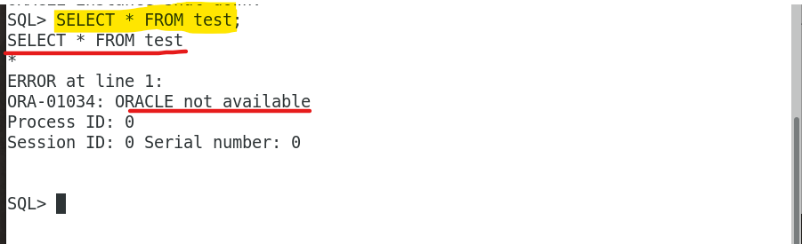

# DBA Lab: Shutdown

[Back](../../index.md)

- [DBA Lab: Shutdown](#dba-lab-shutdown)
  - [Lab: `SHUTDOWN NORMAL`](#lab-shutdown-normal)
  - [Lab: `SHUTDOWN TRANSACTIONAL`](#lab-shutdown-transactional)
  - [Lab: `SHUTDOWN IMMEDIATE`](#lab-shutdown-immediate)

---

## Lab: `SHUTDOWN NORMAL`

- Terminal A:

```sql
sqlplus
/* login as sys as sysdba */

```

- Create another terminal B while the terminal A is running.

```sql
sqlplus
/* login as sys as sysdba */

# Sho container name
show con_name
# CDB$ROOT

# for practise, create a table within the root databse.
CREATE TABLE test (n number);

# insert into test value
INSERT INTO test VALUE (1);

```


---

- Try to shutdown normal in the terminal A
  - nothing happen because normal mode will wait for the current session to be closed

```sql
# Terminal A
shutdown normal
```


---

- Terminal B commmit transaction.
  - The transaction finishes.
- The shutdown command in Terminal A will be not executed.
  - Because it waits until the session closed.


---

- Terminal B exits.
  - The session is closed.
- Terminal A shutdown command executes.
  - It will take some time.
    - DB Close.
    - DB dismounted.
    - instance shut down.


---

## Lab: `SHUTDOWN TRANSACTIONAL`

- Terminal A:

  - log in using sys as sysdba;
  - Startup instance

- Terminal B:
  - log in using sys as sysdba;
  - insert row

```sql
# Terminal A
sqlplus
sys as sysdba
startup

# Terminal B
sqlplus
sys as sysdba

INSERT INTO test VALUES (3);
```


---

- Terminal A input transactional shutdown
  - Command will execute because SHUTDOWN TRANSACTIONAL will wait until the transaction finish.
  - Terminal B insert a row, but not commit or roll back.

```sql
# Terminal A
SHUTDOWN TRANSACTIONAL
```


---

- Terminal B commit
- Terminal A's command execute
  - because `SHUTDOWN TRANSACTIONAL` waits the transaction to finish, not waits the session to exit.

```sql
# Terminal B
commit;
```


---

- Terminal B insert a new row
- Terminal A shutdown transactional
  - shutdown will not be executed.
- Terminal B close session

  - shutdown will be executed.

- => close session == transaction automaticall commit;

  - new value is available when re-open the database.

- Different from the `SHUTDOWN IMMEDIATE`
  - `SHUTDOWN IMMEDIATE`: uncommitted transaction will roll back.


- ***

## Lab: `SHUTDOWN IMMEDIATE`

- Terminal A:
  - startup isntance
  - connect using sys as sysdba
- Terminal B:
  - connect using sys as sysdba

```sql
# Terminal A
sqlplus
sys as sysdba


# Terminal B
sys as sysdba
```

---

- Terminal B:
  - insert a row without commit
- Terminal A:
  - `SHUTDOWN IMMEDIATE`
    - Command execute without waiting
    - because IMMEDIATE mode close session and transaction.

```sql
# Terminal B
INSERT INTO test VALUES (3);

# Terminal A
SHUTDOWN IMMEDIATE
```


---

- Terminal A:
  - try to query the test tb
  - wil have error due to closure of DB

```sql
# Terminal A
SELECT * FROM test;
# ORA-01034: ORACLE not available
```



- Terminal A:
  - startup instance
  - query the test tb
    - the last insert not change the tb
    - In IMMEDIATE mode, all uncommited transaction will roll back.


---

[TOP](#dba-lab-shutdown)
