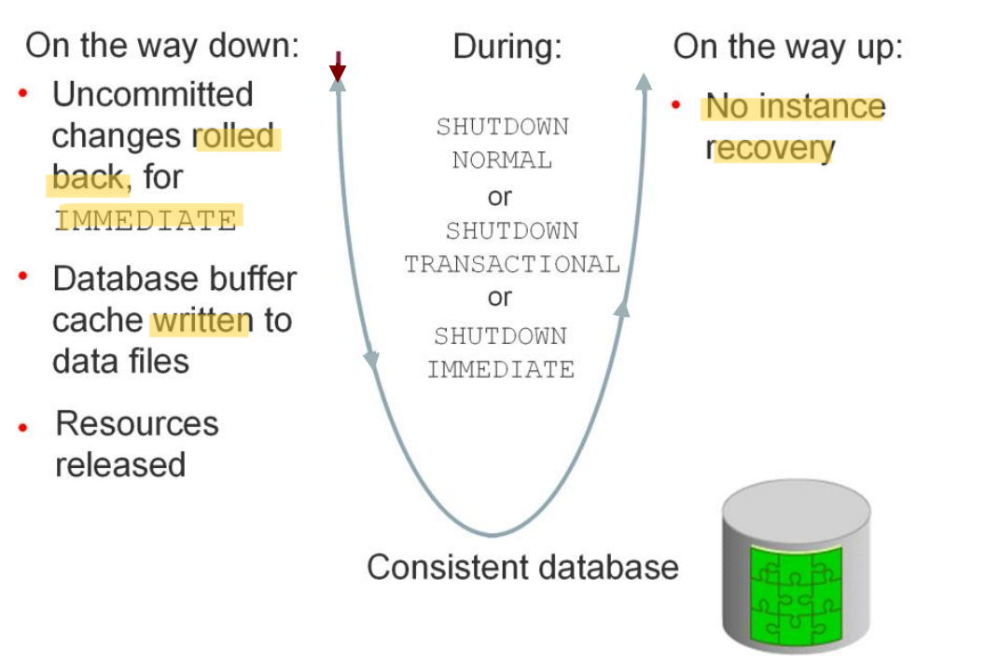

# DBA: Instance - Shutdown

[Back](../../index.md)

- [DBA: Instance - Shutdown](#dba-instance---shutdown)
  - [Instance and Database Shutdown](#instance-and-database-shutdown)
  - [Phase](#phase)
    - [`Close`](#close)
    - [`Unmounted`](#unmounted)
    - [`Shut Down`](#shut-down)
  - [Shutdown Modes](#shutdown-modes)
    - [`SHUTDOWN ABORT`](#shutdown-abort)
      - [Save Shutdown - `IMMEDIATE`, `TRANSACTIONAL`, `NORMAL`,](#save-shutdown---immediate-transactional-normal)
      - [Abnormal Shutdown - `ABORT` + `STARTUP FORCE`](#abnormal-shutdown---abort--startup-force)
    - [`SHUTDOWN IMMEDIATE`: force a checkpoint](#shutdown-immediate-force-a-checkpoint)
    - [`SHUTDOWN TRANSACTIONAL`: wait for current tran](#shutdown-transactional-wait-for-current-tran)
    - [`SHUTDOWN NORMAL` / `SHUTDOWN`: wait for current session](#shutdown-normal--shutdown-wait-for-current-session)
  - [Unusual circumstances of shutdown](#unusual-circumstances-of-shutdown)

---

## Instance and Database Shutdown

- Tools:

  - `SQL*Plus` SHUTDOWN command
  - `Enterprise Manager`

- **Required** privileges of connection:

  - `SYSDBA`
  - `SYSOPER`

- Use Case:
  - Change a static parameter
  - Patch the database server
  - perform maintenance or other adminstrative tasks.

- Steps in instance shutdown

| Phase | Database / Instance          | Files to close                    |
| ----- | ---------------------------- | --------------------------------- |
| 1     | **CLOSE**: mounted           | online data files, redo log files |
| 2     | **NOMOUNT**: unmounted       | control file                      |
| 3     | **SHUTDOWN**: instance close |                                   |

---

## Phase

### `Close`

- The database close operation is implicit in a database shutdown. The nature of the operation depends on whether the database shutdown is normal or abnormal.

---

### `Unmounted`

- perform:

  - **unmounted** database: **disassociate** database from the instance, after the database is closed.
  - **closes** the `control files` of the database.

- At this point, the database **instance remains in memory**.

---

### `Shut Down`

- Perform:

  - the `SGA` **ceases to occupy memory**
  - **terminate** the background processes.

---

## Shutdown Modes

| Database Behavior | new user | Waits sessions end | Waits transactions end | checkpoint and closes open files |
| ----------------- | -------- | ------------------ | ---------------------- | -------------------------------- |
| `ABORT`           | -        | -                  | -                      | -                                |
| `IMMEDIATE`       | -        | -                  | -                      | Y                                |
| `TRANSACTIONAL`   | -        | -                  | Y                      | Y                                |
| `NORMAL`          | -        | Y                  | Y                      | Y                                |

---

### `SHUTDOWN ABORT`

- the **fastest** shutdown mode
- does **not checkpoint** the open data files

  - a subsequent open of this database may **take substantially longer**
  - **instance recovery** must be performed to make the `data files` **consistent** before the database can reopen.
  - Could **lose** data.

- **Use Case:**

  - emergency situations
    - when no other form of shutdown is successful.

- In a `CDB`, issuing `SHUTDOWN ABORT` on a `PDB` == issuing `SHUTDOWN IMMEDIATE` on a `non-CDB`.

---

|                            | `ABORT`+`STARTUP FORCE` | Other mode                         |
| -------------------------- | ----------------------- | ---------------------------------- |
| Checkpoint                 | not                     | yes                                |
| Databsae                   | **inconsistent**        | stay **consistent**                |
| subsequent startup Recover | Required                | not required                       |
| shutdown speed             | Fast                    | IMMEDIATE < TRANSACTIONAL < NORMAL |

---

#### Save Shutdown - `IMMEDIATE`, `TRANSACTIONAL`, `NORMAL`,

- other than `ABORT` mode
- Oracle Database:

  - writes data in the `SGA` to
    - `online data files`
    - `online redo log files`.
  - closes
    - `online data files`
    - `online redo log files`.

- At this stage, the database is **closed** and **inaccessible** for normal operations.
- The control files remain open after a database is closed.

- `offline tablespaces`
  - Any `offline data files` of offline tablespaces have been **closed** already.
  - When the database reopens, any tablespace that **was offline remains offline**.

---

#### Abnormal Shutdown - `ABORT` + `STARTUP FORCE`

- the **instance** of an open database **closes** and **shuts down** the **database** instantaneously, if

  - a `SHUTDOWN ABORT`
  - **abnormal** termination

- Oracle Database does **not write data** in the buffers of the SGA, the modified buffer, to

  - `data files`
  - `redo log files`.

- Uncommited changes not rolled back.

- **Auto instance recovery** is required during the subsequent reopening of the database.

---

### `SHUTDOWN IMMEDIATE`: force a checkpoint

- the fastest mode next to `SHUTDOWN ABORT`.
- **force** a `checkpoint` and **terminates** any executing SQL statements
  - Active transactions are **terminated**
  - **uncommitted** changes are **rolled back**
  - close files
- **disconnects** users.

---

### `SHUTDOWN TRANSACTIONAL`: wait for current tran

- take a significant amount of **time** depending on the nature of the current transactions.
- **prevents** users from **starting new transactions**,
- **waits for all current transactions to complete** before shutting down.

---

### `SHUTDOWN NORMAL` / `SHUTDOWN`: wait for current session

- default mode of shutdown.
- The database **waits for all connected users to disconnect** before shutting down.

---

## Unusual circumstances of shutdown

- **unusual circumstances**: shutdown of a database instance may not occur cleanly.

  - Memory structures may **not be removed from memory**
  - one of the background processes may **not be terminated**

- a subsequent instance **startup may fail** because **remnants** of a previous instance exist.
  - Solution:
    - **force the new instance to start** by **removing the remnants** of the previous instance and then **starting a new** instance,
    - by issuing a `SHUTDOWN ABORT` statement.

---

- In some cases, process cleanup itself can **encounter errors**, which can result in the termination of `process monitor (PMON)` or the instance.
  - The dynamic initialization parameter `INSTANCE_ABORT_DELAY_TIME` specifies how many seconds to delay an internally generated instance failure. This delay gives you a chance to respond.
  - The database writes a message to the alert log when the delayed termination is initiated.
- In some circumstances, by allowing certain database resources to be quarantined, the instance can avoid termination.

---

[TOP](#dba-instance---shutdown)
