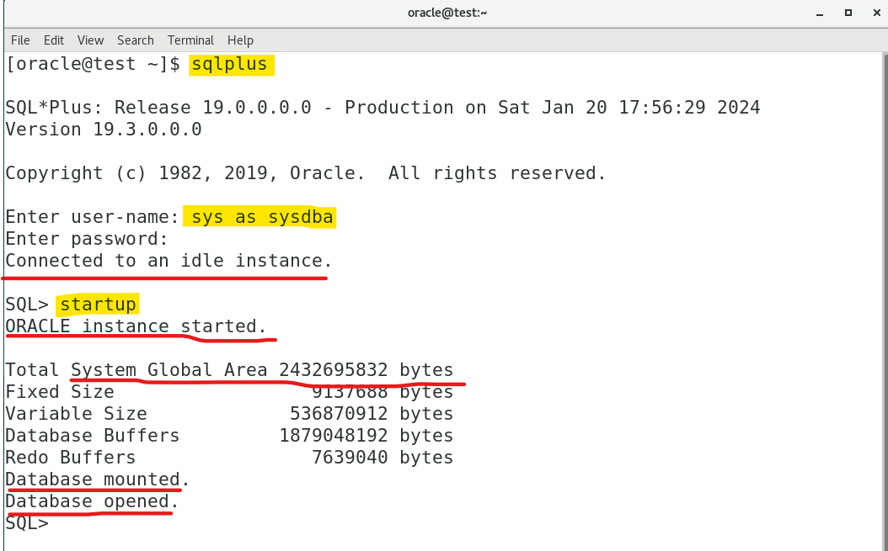
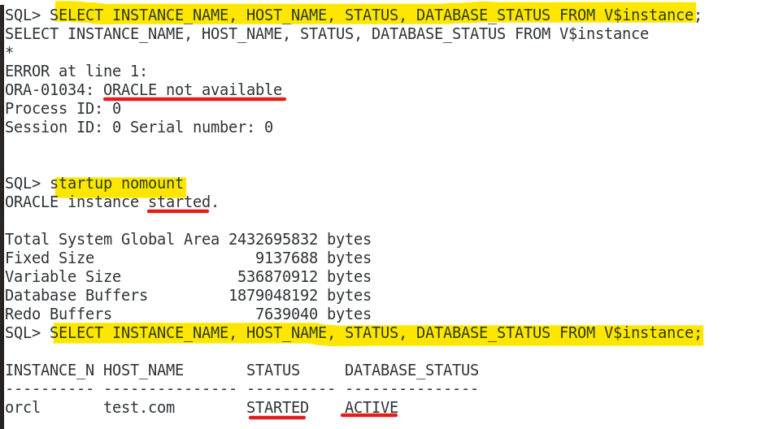
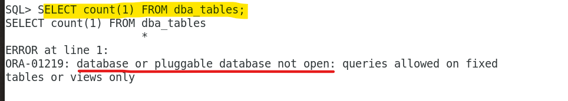
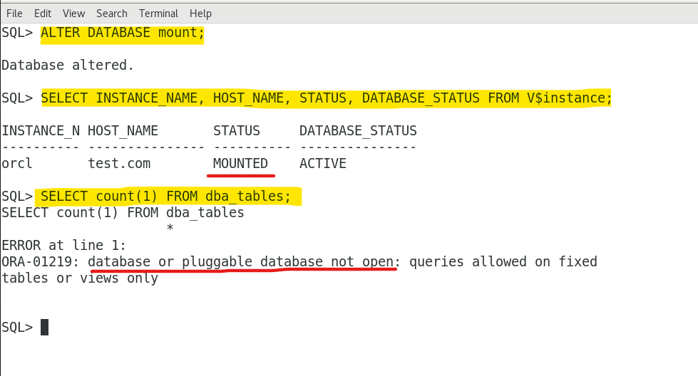
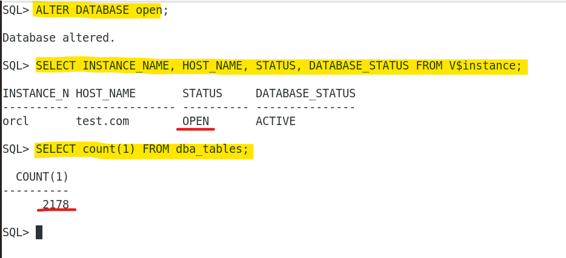
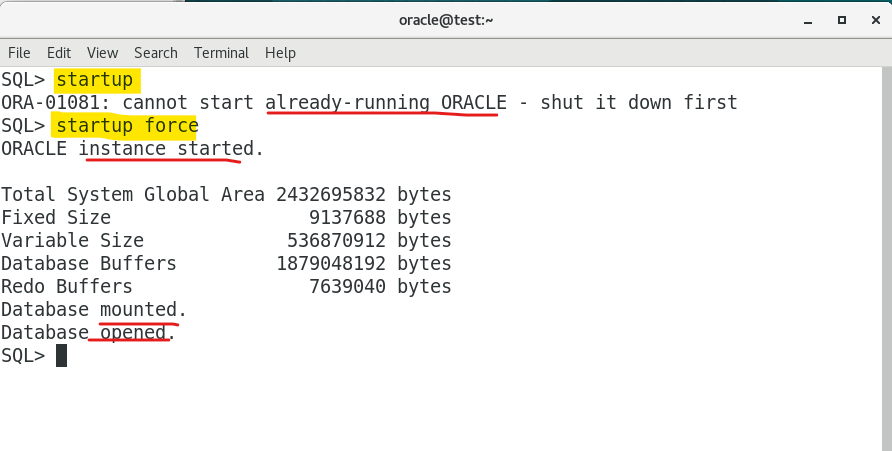

# DBA Lab: Startup

[Back](../../index.md)

- [DBA Lab: Startup](#dba-lab-startup)
  - [Lab: Default Startup](#lab-default-startup)
  - [Lab: Explore Startup Phases](#lab-explore-startup-phases)
  - [Lab: `FORCE`](#lab-force)

---

## Lab: Default Startup

- Restart the virtual machine and login using terminal

  - `sqlplus`: invoke the SQLPlus command-line tool.
  - `sys as sysdba`:
    - connect to an Oracle Database Instance using `sys` user with elevated privileges `sysdba`
    - "connect to the database" = "connect to the instance"

- `Connected to an idle instance.`:

  - have successfully connected to the Oracle instance
  - but the database is down.

- `startup`:
  - start the Oracle Database instance.
  - initiate the process of starting the database.
    - start the instance
    - read PFILE for parameter, allocate memory and display information
    - mount the datasebase, that is, associated instance with the database by reading the control file
    - open the database, by opening the data file.



---

## Lab: Explore Startup Phases

- Shut down instance

```sql
######## Instance is down ########
# Get the instance info before startup
SELECT INSTANCE_NAME, HOST_NAME, STATUS, DATABASE_STATUS FROM V$instance;
# Return error, due to instance is down.
/* SELECT INSTANCE_NAME, HOST_NAME, STATUS, DATABASE_STATUS FROM V$instance
*
ERROR at line 1:
ORA-01034: ORACLE not available
Process ID: 0
Session ID: 0 Serial number: 0 */


######## nomount ########
startup nomount
# Startup instance but not is associated to database.
/* ORACLE instance started.

Total System Global Area 2432695832 bytes
Fixed Size		    9137688 bytes
Variable Size		  536870912 bytes
Database Buffers	 1879048192 bytes
Redo Buffers		    7639040 bytes */


# Get info of the instance
SELECT INSTANCE_NAME, HOST_NAME, STATUS, DATABASE_STATUS FROM V$instance;
/* INSTANCE_N HOST_NAME	   STATUS     DATABASE_STATUS
---------- --------------- ---------- ---------------
orcl	   test.com	   STARTED    ACTIVE */


# Count the number of tables in the Oracle Database.
SELECT count(1) FROM dba_tables;
# Error due to no database is associated.
/* SELECT count(1) FROM dba_tables
                     *
ERROR at line 1:
ORA-01219: database or pluggable database not open: queries allowed on fixed
tables or views only */
```





---

```sql


######## mount ########
# Mount database, associated to database
ALTER DATABASE mount;

# Get info of the instance
SELECT INSTANCE_NAME, HOST_NAME, STATUS, DATABASE_STATUS FROM V$instance;
# Count the number of tables in the Oracle Database.
SELECT count(1) FROM dba_tables;
# Error due to data file not accessible.
/* SELECT count(1) FROM dba_tables
                     *
ERROR at line 1:
ORA-01219: database or pluggable database not open: queries allowed on fixed
tables or views only */
```



---

```sql
######## open ########
# Open database, open data file
ALTER DATABASE open;

# Get info of the instance
SELECT INSTANCE_NAME, HOST_NAME, STATUS, DATABASE_STATUS FROM V$instance;

# Count the number of tables in the Oracle Database.
SELECT count(1) FROM dba_tables;
# Error due to data file not accessible.
```



---

## Lab: `FORCE`

- `STARUP FORCE`:
  - If the database is open, then `FORCE` **shuts down** the database with a `SHUTDOWN ABORT` statement before re-opening it.
  - If the database is closed, then FORCE opens the database.

```sql
startup
-- ORA-01081: cannot start already-running ORACLE - shut it down first

startup force
--ORACLE instance started.
--
--Total System Global Area 2432695832 bytes
--Fixed Size		    9137688 bytes
--Variable Size		  536870912 bytes
--Database Buffers	 1879048192 bytes
--Redo Buffers		    7639040 bytes
--Database mounted.
--Database opened.

```



---

[TOP](#dba-lab-startup)
