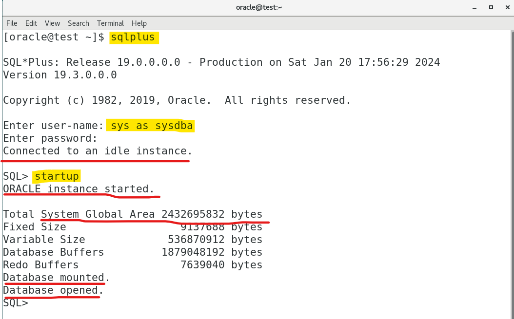
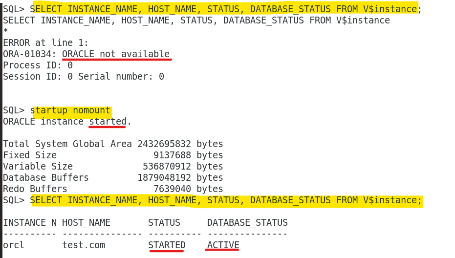
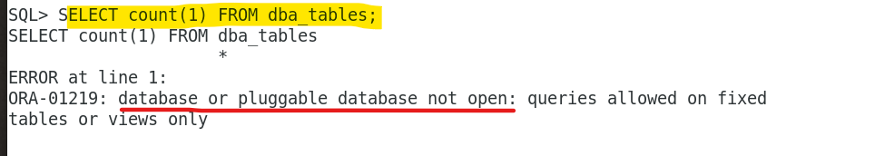
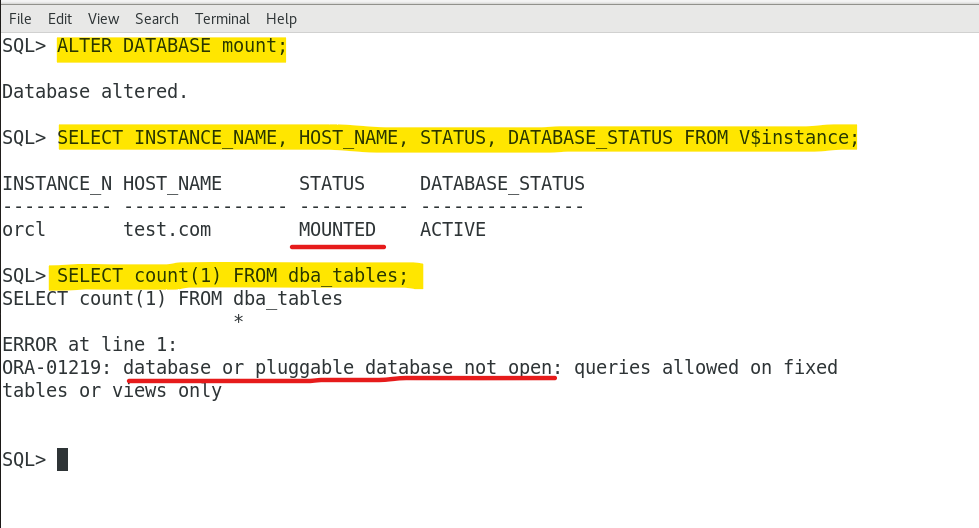
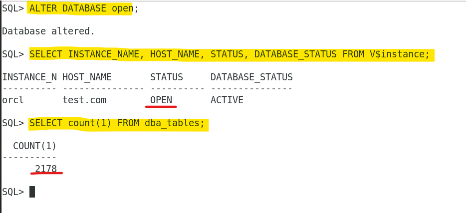

# DBA: Instance - Startup

[Back](../../index.md)

- [DBA: Instance - Startup](#dba-instance---startup)
  - [Instance and Database Startup](#instance-and-database-startup)
    - [Phase: `No mount`](#phase-no-mount)
    - [Phase: `Mounted`](#phase-mounted)
    - [Phase: `Open`](#phase-open)
  - [Connection with Administrator Privileges](#connection-with-administrator-privileges)
  - [Commands to alter status](#commands-to-alter-status)
  - [Lab: Default Startup](#lab-default-startup)
  - [Lab: Explore Startup Phases](#lab-explore-startup-phases)

---

## Instance and Database Startup

- `start an instance`:

  - **start** an instance from a shutdown state, and then **mount** and **open** the database, making it available for users.

- **Methods 方法:**

  - the `SQL*Plus STARTUP` command,
  - `Oracle Enterprise Manager` (Enterprise Manager),
  - the `SRVCTL` utility.

- **Prerequisites**:

  - The database is statically 静态地 **registered** with an `Oracle Net listener`.
  - Client is connected to the database with the `SYSDBA` **privilege**.

- The `listener` creates a **dedicated server**, which can start the database instance.
  - listener 是前提: lsnr -> server -> database instance


- Steps in instance startup

|     | Database                        | Files          | User       | sqlplus Command   | Use Case            |
| --- | ------------------------------- | -------------- | ---------- | ----------------- | ------------------- |
| 1   | **NOMOUNT**: not yet associated | parameter file | N/A        | `STARTUP NOMOUNT` | Create DB/BK/REC    |
| 2   | **MOUNTED**: associated         | control file   | closed     | `STARTUP MOUNTED` | Full REC/Maintaince |
| 3   | **OPEN**: associated,accessible | data file      | accessible | `STARTUP OPEN`    | Normal operation    |

---

### Phase: `No mount`

- `No mount`:

  - instance is **started** but **not associated with a database**.
  - the memory **is up but not associated** with any database.

- The instance performs: 搜索 SPF/PF>读取初始化参数>加载内存+背景进程>打开 alert log+trace file

  - **Searches** for a `server parameter file(SPFILE)` that contains database's parameters, such as the SGA size, in a platform-specific default location.
    - if not found, for a `text initialization parameter file(PFILE)`
    - specifying `STARTUP` with the `SPFILE` or `PFILE` parameters **overrides** the default behavior
  - **Reads** the parameter file to determine the **values of initialization parameters**
  - **Allocates** the `SGA` based on the initialization parameter settings.
  - Start the **background process**.
  - Starts the **Oracle background processes**
  - **Opens** the alert file (`alert log`) and the trace file `trace files` and **writes** all _explicit parameter settings_ to the alert log in valid parameter syntax

- **Use case:**
  - **database creation**
  - certain **backup** and **recovery** operations.

---

### Phase: `Mounted`

- `Mounted`

  - The instance is started and **associated with the database** by **reading** its `control file`.
  - The database is closed to normal user and only accessible only to DBA.
  - The database is not available for normal operations.

- The instance performs: 联系之前的实例>获取 cf 名>读取 cf 文件>获取 df+redo log

  - associates the database (`CDB`) with the previously started database instance
  - obtains the **names** of the `database control files` specified in the `CONTROL_FILES` **initialization parameter** and opens the files.
  - read the `control files` to find:

    - the **names** of the `data files`
    - the `online redo log files` that it will attempt to access when opening the database.
    - No checks, however, are performed to **verify the existence** of the `data files` and `online redo log files` at this time. 只获取,不验证.

- **Use case:**
  - complete **specific maintenance operations**.
  - such as **renaming data files** and performing **full database recoveries**.

---

- If Oracle Database allows multiple instances to **mount the same database concurrently**, then the `CLUSTER_DATABASE` **initialization parameter setting** can make the database available to multiple instances. Database behavior depends on the setting:
  - If `CLUSTER_DATABASE` is `false` (default) for the **first instance** that mounts a database, then only this instance can mount the database.
  - If `CLUSTER_DATABASE` is `true` for the **first instance**, then other instances can mount the database if their `CLUSTER_DATABASE` parameter settings are set to `true`.
  - The **number** of instances that can mount the database is subject to a predetermined **maximum** specified when creating the database.

---

### Phase: `Open`

- `Open`:

  - the instance is **started** and **assosicated** with an **open** database.
  - the database is **available** for normal database operation.
    - The **data** contained in the data files **is accessible** to valid users.
  - By default, the `CBD` is started, but`PDBs` are not when you open the database.

- The instance performs: 打开 DF>获取 undo tbsp> 打开 redo log

  - **Opens** the `online data files` in **tablespaces** other than undo tablespaces
    - If a **tablespace was offline** when the database was previously shut down, then the tablespace and its corresponding `data files` **will be offline** when the database reopens.
  - **Acquires** an `undo tablespace`

    - If multiple undo tablespaces exists, then the `UNDO_TABLESPACE` initialization parameter designates the undo tablespace to use.
    - If this parameter is not set, then the **first** available undo tablespace is chosen.

  - **Opens** the `online redo log files`

---

- **Database File Checks**
  - the database **returns an error**
    - If any of the `data files` or `redo log` files are **not present** when the instance attempts to open the database, 文件不存在
    - or if the files are present but **fail consistency tests**, 不一致
  - `Media recovery` may be required.

---

## Connection with Administrator Privileges

- Database startup and shutdown are **restricted to users** who connect to Oracle Database with `administrator privileges`.

- Depending on the operating system, one of the following conditions **establishes administrator privileges for a user**:

  - The **operating system privileges** of the user enable him or her to connect using administrator privileges. 操作系统权限
  - The user is **granted** `special system privileges`, and the database **uses password files to authenticate** database administrators over the network.授权+密码文件认证

- The following **`special system privileges`** enable access to a database instance **even when the database is not open**: 即使 DB 未打开也可以 access

  - the authentication happened **using the password file**, **not through the database.**

| privilege                                   | Description                                                                                      | Schema |
| ------------------------------------------- | ------------------------------------------------------------------------------------------------ | ------ |
| **`SYSDBA`(System Database Administrator)** | full control over the Oracle Database instance                                                   | `SYS`  |
| **`SYSOPER`(System Operator)**              | a subset of SYSDBA privileges, can perform basic operational tasks, **cannot look as user data** | `SYS`  |
| **`SYSBACKUP`**                             | can perform backup and recovery operations.                                                      |        |
| **`SYSDG`(System Data Guard)**              | can perform operations related to Data Guard                                                     |        |
| **`SYSKM`(System Key Management)**          | can manage encryption keys used for TDE(Transparent Data Encryption)                             |        |

- `SYS`:

  - the **administrative account** automatically created when a database is created.
  - the account that can **perform all** database adminstrative functions
  - **`SYS` schema** stored the base tables and vies for the data dictionary.

- Command `CONNECT sys as sysdba`:
  - connect with the highest privilege.

---

## Commands to alter status

| SQL                     | Description                                                                       |
| ----------------------- | --------------------------------------------------------------------------------- |
| `ALTER DATABASE MOUNT;` | associate the database instance with a specific database without fully opening it |
| `ALTER DATABASE OPEN;`  | open a previously mounted database.                                               |

- Command to get the status of the instance

  - `SELECT INSTANCE_NAME, HOST_NAME, STATUS, DATABASE_STATUS FROM V$instance;`:
    - retrieve name of the instance, host machine name, current status of the database instance, and Additional status information about the database
    - current status of the database instance: `OPEN, MOUNTED, NOMOUNT`
    - status information about the database: `ACTIVE, INACTIVE)`

---

## Lab: Default Startup

- Restart the virtual machine and login using terminal

  - `sqlplus`: invoke the SQLPlus command-line tool.
  - `sys as sysdba`:
    - connect to an Oracle Database Instance using `sys` user with elevated privileges `sysdba`
    - "connect to the database" = "connect to the instance"

- `Connected to an idle instance.`:

  - have successfully connected to the Oracle instance
  - but the database is down.

- `startup`:
  - start the Oracle Database instance.
  - initiate the process of starting the database.
    - start the instance
    - read PFILE for parameter, allocate memory and display information
    - mount the datasebase, that is, associated instance with the database by reading the control file
    - open the database, by opening the data file.



---

## Lab: Explore Startup Phases

- Shut down instance

```sql
######## Instance is down ########
# Get the instance info before startup
SELECT INSTANCE_NAME, HOST_NAME, STATUS, DATABASE_STATUS FROM V$instance;
# Return error, due to instance is down.
/* SELECT INSTANCE_NAME, HOST_NAME, STATUS, DATABASE_STATUS FROM V$instance
*
ERROR at line 1:
ORA-01034: ORACLE not available
Process ID: 0
Session ID: 0 Serial number: 0 */


######## nomount ########
startup nomount
# Startup instance but not is associated to database.
/* ORACLE instance started.

Total System Global Area 2432695832 bytes
Fixed Size		    9137688 bytes
Variable Size		  536870912 bytes
Database Buffers	 1879048192 bytes
Redo Buffers		    7639040 bytes */


# Get info of the instance
SELECT INSTANCE_NAME, HOST_NAME, STATUS, DATABASE_STATUS FROM V$instance;
/* INSTANCE_N HOST_NAME	   STATUS     DATABASE_STATUS
---------- --------------- ---------- ---------------
orcl	   test.com	   STARTED    ACTIVE */


# Count the number of tables in the Oracle Database.
SELECT count(1) FROM dba_tables;
# Error due to no database is associated.
/* SELECT count(1) FROM dba_tables
                     *
ERROR at line 1:
ORA-01219: database or pluggable database not open: queries allowed on fixed
tables or views only */
```





---

```sql


######## mount ########
# Mount database, associated to database
ALTER DATABASE mount;

# Get info of the instance
SELECT INSTANCE_NAME, HOST_NAME, STATUS, DATABASE_STATUS FROM V$instance;
# Count the number of tables in the Oracle Database.
SELECT count(1) FROM dba_tables;
# Error due to data file not accessible.
/* SELECT count(1) FROM dba_tables
                     *
ERROR at line 1:
ORA-01219: database or pluggable database not open: queries allowed on fixed
tables or views only */
```



---

```sql
######## open ########
# Open database, open data file
ALTER DATABASE open;

# Get info of the instance
SELECT INSTANCE_NAME, HOST_NAME, STATUS, DATABASE_STATUS FROM V$instance;

# Count the number of tables in the Oracle Database.
SELECT count(1) FROM dba_tables;
# Error due to data file not accessible.
```



---

[TOP](#dba-instance---startup)
