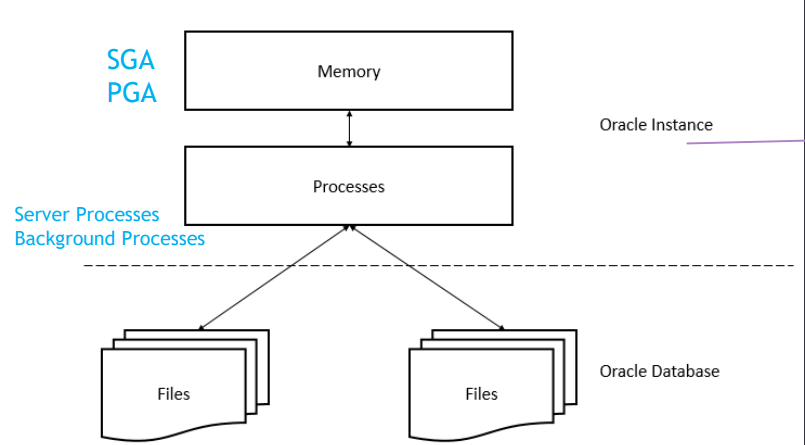
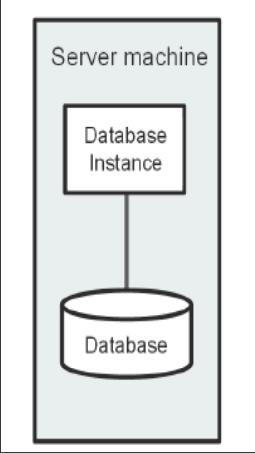
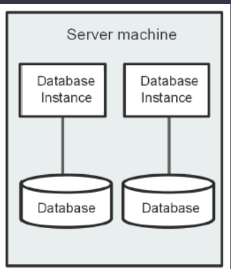
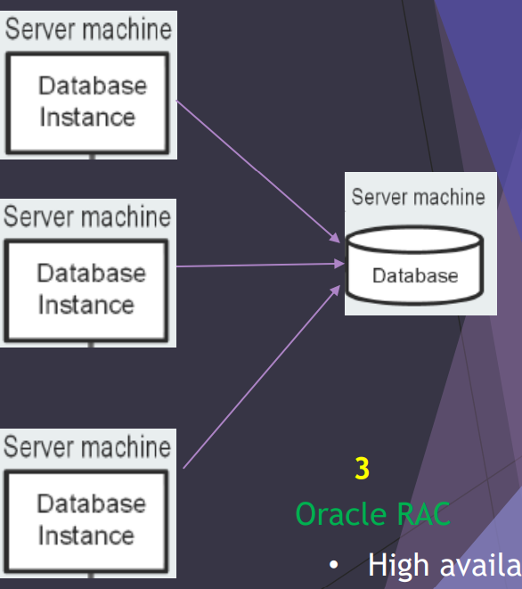

# Oracle DBA - Intro

[Back](../index.md)

- [Oracle DBA - Intro](#oracle-dba---intro)
  - [Terminology](#terminology)
  - [Editions](#editions)
    - [Lab: Check the version of Oracle Database](#lab-check-the-version-of-oracle-database)
  - [Database VS Database Instance](#database-vs-database-instance)
    - [Database](#database)
    - [Database Instance](#database-instance)
  - [Oracle DB Server architecture](#oracle-db-server-architecture)
  - [Common Oracle DBA Tasks](#common-oracle-dba-tasks)
  - [Tools for Administering the Database](#tools-for-administering-the-database)

---

## Terminology

- `Data`

  - facts or figures ,Pieces of information. (Unprocessed , Unorganized)

- `Database`

  - an organized collection of information.

- `Application`

  - interface between users and DB

- `DBMS` / `Database management system`

  - a system to store and retrieve and modify data in the database.

- `Relational database`

  - a database stores data in a set of simple relations.

- `RDBMS` / `Relational database management system`

  - Oracle is relational database
  - It is a system to manage data in the relational database.
  - The purpose of Oracle Database is to store , organize, and retrieve data for your applications

- `Table`

  - the **basic storage unit** of an RDBMS ( it is **logical** unit , **not physical** )
  - The table consists of rows and columns

- `SQL`

  - structure query language used to access database

- Types of SQL statement

  - `DML` / `Data manipulation language`

    - `SELECT`, `INSERT`,`UPDATE`,`DELETE`,`MERGE`

  - `DDL` / `Data definition language`

    - `CREATE`, `ALTER`,`DROP`,`RENAME`,`TRUNCATE`,`COMMENT`

  - `DCL` / `Data control language`

    - `GRANT`, `REVOKE`

  - `TCL` / `Transaction control language`
    - `COMMIT`, `ROLLBACK`,`SAVEPOINT`

- `PL/SQL`

  - the procedural extension to SQL with design features of programming languages.
  - DML and DQL are included within procedural units of code.

- `Normalization`

  - a database design technique which organizes tables in a manner that **reduces redundancy and dependency** of data.
  - It **divides** larger tables to smaller tables and **links** them using relationships.

- Problems Without Normalization
  - Extra **memory space**
  - Difficult to **handle and update** the database
  - Data **Inconsistency**

---

## Editions

- **Oracle Database _Personal_ Edition (PE)**

  - supports **single-user development**, includes all of the components that are included with Enterprise Edition ,
  - no Oracle RAC , no Oracle Management Packs

- **Oracle Database _Standard_ Edition 2 (SE2) starting from Release 1 (12.1.0.2)**.

  - includes all the features necessary to develop workgroup and Web applications.
  - Support RAC, no parallel execution, no Data guard, no management pack, no cloud control , **only one pluggable database** allowed
  - Note: before SE2, we have SE and SE1 and both no RAC option

- **Oracle Database _Enterprise_ Edition (EE)**

  - Oracle Database Enterprise Edition provides performance, availability, scalability, and security for developing applications such as high-volume online transaction processing (**OLTP**) applications, queryintensive data **warehouses**, and demanding Internet applications. Oracle Database Enterprise Edition contains all of the components of Oracle Database

- **Oracle Database _Express_ Edition ( XE)**
  - **Free** but limited , use 1 CPU, 1 GB memory

---

### Lab: Check the version of Oracle Database

```sql
SELECT * FROM v$version;
# BANNER
# BANNER_FULL
# BANNER_LEGACY
# CON_ID
# ----------------------------------------------------------------------
# Oracle Database 19c Enterprise Edition Release 19.0.0.0.0 - Production
# Oracle Database 19c Enterprise Edition Release 19.0.0.0.0 - Production
# Oracle Database 19c Enterprise Edition Release 19.0.0.0.0 - Production
# 0
# Version 19.3.0.0.
# 0
```

---

## Database VS Database Instance

- Oracle DB consists of 2 major components
  - The Database storage
  - The Oracle Instance

---

### Database

- `Database`:

  - Organized collection of information.
  - It contains collection of **database files** stored in disk storage. (physical)

- Database files:
  - Datafiles
  - control files
  - Redo Log Files
  - Databae Backups
  - Archived Redo Logs
  - Parameter File
  - Password file
  - Alter Log File
  - Trace Files

---

### Database Instance

- `database instance`

  - a set of **memory structures and processes** that manage database files
  - The Oracle program, or binary, loaded into the server RAM
    - Note: A database instance **exists only in memory**
  - created by Oracle every time you start up your database
  - reading from memory is a lot faster compared to reading from disk

- Every **running Oracle database** is associated with at least **one Oracle database instance**.

- **An instance can exist without a database** and **a database can exist without an instance**

  - Because **an instance exists in memory** and **a database exists on disk**,
  - Losing instance no issue
  - losing data files for example = losing the database

- Another simple way to understand DB and instance:
  - Microsoft word: instance
  - Microsoft document: database



---

## Oracle DB Server architecture

- Single-instance DB



- Multi Single-instance DBs On same server



- Oracle Real Application Clusters (RAC)
  - High availability
  - Scalability
  - High performance



---

## Common Oracle DBA Tasks

- Installing Oracle software
- Creating Oracle databases
- Performing upgrades of the database and software to new release levels
- Starting and shutting down the database instance
- Managing the storage structures of the database
- Managing users and security
- Managing database objects, such as tables, indexes, and views
- Backing up the database and performing recovery operations when necessary
- Monitoring the state of the database
- Monitoring and tuning database performance
- reporting critical errors to Oracle Support Services

---

## Tools for Administering the Database

- Oracle Universal Installer

  - is a utility that **installs your Oracle software** and options. It can automatically start Oracle Database Configuration
  - Assistant to **install a database**.

- Oracle Database Configuration Assistant

  - (DBCA) is a utility that **creates a database from templates** that are supplied by Oracle

- Database Upgrade Assistant

  - (DBUA) is a tool that guides you through the **upgrade** of your existing database to a new Oracle Database release

- Net Configuration Assistant

  - is a utility that enables you to **configure listeners and naming methods**, which are critical components of the Oracle
  - Database network.

- Oracle Enterprise Manager Database Express

  - The primary product for **managing your database**, a **Web-based** interface
  - EM Express used to manage your database in very simple ways like simple wizard

- Oracle SQL Developer
  - SQL Developer provides another GUI for **accessing your Oracle database**. SQL Developer supports **development** in both the SQL and PL/SQL languages

---

[TOP](#oracle-dba---intro)
