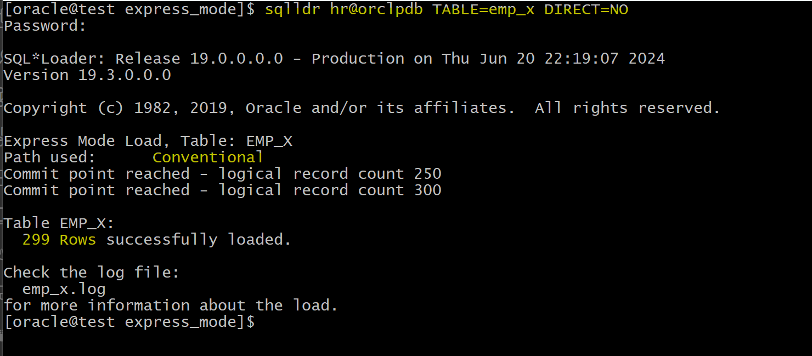

# DBA - SQL\*Loader

[Back](../index.md)

- [DBA - SQL\*Loader](#dba---sqlloader)
  - [SQL\*Loader](#sqlloader)
    - [Lab: import data from csv file](#lab-import-data-from-csv-file)
  - [Discard File](#discard-file)
    - [Lab: Discard File](#lab-discard-file)
      - [Filter Records](#filter-records)
      - [Generate Discard file](#generate-discard-file)
  - [Data Loading Methods](#data-loading-methods)
    - [Conventional Load](#conventional-load)
    - [Lab: Conventional Load](#lab-conventional-load)
      - [Load Valid Data](#load-valid-data)
      - [Load Data Violating Constraints](#load-data-violating-constraints)
      - [Load Data with Null value](#load-data-with-null-value)
      - [Load Data violating PK](#load-data-violating-pk)
      - [Load Data controling commit](#load-data-controling-commit)
    - [Direct Path Load](#direct-path-load)
    - [Lab: Direct Path Load](#lab-direct-path-load)
      - [Load Valid Data](#load-valid-data-1)
      - [Load Data violating FK and Check constraints](#load-data-violating-fk-and-check-constraints)
      - [Load Data violating PK, Unique, and NOT NULL constraints](#load-data-violating-pk-unique-and-not-null-constraints)
      - [Summary](#summary)
  - [Express Mode](#express-mode)
    - [Lab: Express Mode](#lab-express-mode)
      - [Load Valid Data](#load-valid-data-2)
      - [Load Valid Data without external tb](#load-valid-data-without-external-tb)
      - [Load Valid Data with direct load](#load-valid-data-with-direct-load)
      - [Load Data violating PK](#load-data-violating-pk-1)
      - [Load Data violating unique constraint](#load-data-violating-unique-constraint)
      - [Load Data violating length of column](#load-data-violating-length-of-column)
      - [](#)

---

## SQL\*Loader

- `SQL*Loader`
  - a bulk loader utility used to load data **from external files into tables** of an Oracle database. 用于导入

---

### Lab: import data from csv file

- place csv file in the path:

```sh
scp emp.csv oracle@test.com:/home/oracle/sqlloader/emp.csv
```

- Connect with HR user

```sql
-- drop tb if exists
DROP TABLE EMP_LOAD;

-- create tb
CREATE TABLE EMP_LOAD
(EMPNO NUMBER ,
FNAME VARCHAR2(100),
LNAME VARCHAR2(100)
);

-- query before load
SELECT * FROM EMP_LOAD;
```

---

- Create a control file `emp.ctl`

```sh
# create a new file
touch /home/oracle/sqlloader/emp.ctl

# edit control file
vi /home/oracle/sqlloader/emp.ctl

# Load Data
# INFILE '/home/oracle/sqlloader/emp.csv'
# APPEND
# INTO Table emp_load
# FIELDS TERMINATED BY ','
# (
#     empno,
#     fname,
#     lname
# )

# load data
sqlldr control=/home/oracle/sqlloader/emp.ctl log=/home/oracle/sqlloader/emp.log
```


- log:


- Query tb to verify

```sql
SELECT * FROM EMP_LOAD;
```

---

- Truncate

```sql
truncate table  EMP_LOAD;
```

- make some id to be characters, which will create bad records, leading to bad file.

```sh
vi /home/oracle/sqlloader/emp.csv
```


- load data

```sh
sqlldr control=/home/oracle/sqlloader/emp.ctl log=/home/oracle/sqlloader/emp.log
```

- check log


- Check bad file


---

## Discard File

- SQL\*Loader `Discard File`:
  - a file created when SQL\*Loader **filters** some records out of the load.
- A `discard file` is created **only when it is needed**, and **only if** you have specified that a discard file should be **enabled**.
- The `discard file` contains **records that were filtered out of the load** because they did not match any **record-selection criteria** specified in the control file.

- Because the `discard file` contains record filtered out of the load, the contents of the discard file are records that were **not inserted into any table** in thedatabase.
  - Data **written to** any database table is **not written** to the `discard file`.
- You **can specify the maximum number** of such records that the discard file can accept.

---

- Vs `Bad File`
  - Both are the records do not load into the database.
  - Discard file contains only the filtered out records that do not match the record-selection criteria.
  - Bad file contains the records that have errors, such as integiry constraints, oversize of the conlumn length

---

### Lab: Discard File

#### Filter Records

- Create table

```sql
sqlplus hr@orclpdb
show user;
show con_name;

-- create tb
DROP TABLE EMP_LOAD;
CREATE TABLE EMP_LOAD
(
  EMPNO NUMBER ,
  FNAME VARCHAR2(100),
  LNAME VARCHAR2(100)
);

SELECT * FROM EMP_LOAD;
-- return none
```

- locate csv file

```sh
# create dir for lab to place csv
mkdir /home/oracle/sqlloader/discard_file
# copy the emp.csv file to this dir
```

- Create control file emp.ctl

```sh
touch /home/oracle/sqlloader/discard_file/emp.ctl
vi /home/oracle/sqlloader/discard_file/emp.ctl

# note: we will not load empno='1008'
# using when clause to filter
Load Data
INFILE '/home/oracle/sqlloader/discard_file/emp.csv'
APPEND
INTO Table emp_load
WHEN empno <> '1008'
FIELDS TERMINATED BY ','
(
  empno,
  fname,
  lname
)
```

- Load data

```sh
sqlldr control=/home/oracle/sqlloader/discard_file/emp.ctl log=/home/oracle/sqlloader/discard_file/emp.log
```


- Log


> - this example shows both error and filter
> - this did not generate the discard file due to ignorance of the option.

- Verify data in the table

```sql
sqlplus hr@orclpdb

SELECT count(*) FROM EMP_LOAD;
--  16120
```

---

#### Generate Discard file

- Truncate tb

```sql
truncate table EMP_LOAD;
```

- Load data specifying discard file

```sh
sqlldr control=/home/oracle/sqlloader/discard_file/emp.ctl log=/home/oracle/sqlloader/discard_file/emp.log DISCARD=emp.dsc
```


---

## Data Loading Methods

- SQL\*Loader can load data by using either a `convention path load`, or a `direct path load`.

- `conventional path load`:
  - runs SQL `INSERT` statements to populate tables in Oracle Database.
- `direct path load`:

  - **eliminates** much of the Oracle Database **overhead** by **formatting** Oracle `data blocks`, and then **writing** the `data blocks` directly to the database files.
  - A `direct load` does **not compete with other users** for database resources, so it can usually load data **at near disk speed**.

- SQL\*Loader **never creates** `tables`.

  - The `tables` that you want to be loaded **must already exist** in the database.
  - It loads existing tables that either already contain data, or that are empty.

- The following **privileges** are required for a load:
  - You must have `INSERT` privileges on the table to be loaded.
  - You must have `DELETE` privileges on the table that you want to be loaded, when using the `REPLACE` or `TRUNCATE` option **to empty old data** from the table before loading the new data in its place.

---

### Conventional Load

- Always generates `redo` entries
- Enforces all **constraints**
- Can load into **clustered tables**
- Fires `INSERT` triggers
- **Allows** other users to **modify** tables during load operation
- Uses `COMMIT`
  - The insertion of an array of records is followed by a `COMMIT` operation.
  - It is not necessary to make a commit after each record.
  - Oracle will save after 64 records or 250.
- Each data load may involve **several transactions**.

---

### Lab: Conventional Load

- Create tb with constraints

```sql

show  user;
--USER is "HR"
show con_name;
--CON_NAME
--------------------------------
--ORCLPDB

drop table emp_x;
drop table dept_x;

-- create tb with constraint
create table dept_x
(
    deptno number,
    dname varchar2(100),
    constraint dept_x primary key (deptno)
 );

insert into dept_x values (1, 'sales');
commit;

select * from dept_x;
-- 1	sales

-- create tb with constraints, including fk
create table emp_x
(
    empid number,
    name varchar2(10) not null,
    gender varchar(1),
    deptno number,
    address varchar2(100),
    constraint emp_x_pk primary key (empid),
    constraint emp_x_uk1 unique  (name),
    constraint emp_x_fk1 foreign key (deptno) references dept_x(deptno),
    constraint emp_x_chq1 check ( gender in ('M','F') )
);

select * from emp_x;
-- return none
```

- Query constraints

```sql
select * from user_constraints
where table_name='EMP_X';
```


---

#### Load Valid Data

- Note: In this scenario, all data in the csv file match the DDL of the tb, exspecially the deptno is 1, matching the data in dept table.

- Create dir and place csv file

```sh
# create dir to place EMPLOYEES.csv
mkdir /home/oracle/sqlloader/con_load
```

- Create control file
  - using conventional load path

```sh
touch /home/oracle/sqlloader/con_load/EMPLOYEES.ctl
vi /home/oracle/sqlloader/con_load/EMPLOYEES.ctl

# Load Data
# INFILE '/home/oracle/sqlloader/con_load/EMPLOYEES.csv'
# APPEND
# INTO Table emp_x
# FIELDS TERMINATED BY ','
# (
#   empid,
#   name,
#   gender,
#   deptno,
#   address
# )
```

- Load data

```sh
sqlldr control=/home/oracle/sqlloader/con_load/EMPLOYEES.ctl log=/home/oracle/sqlloader/con_load/EMPLOYEES.log
```


> - It shows every 250 records, oracle commits the records.

- Log:


- Query to verify

```sql
select count(*) from emp_x;
--300
```

---

#### Load Data Violating Constraints

```sql
-- truncate tb
truncate table emp_x
```

- Update the data in csv
  - violate the length of column
  - violate the check constraint
  - violate the fk

```sh
vi /home/oracle/sqlloader/con_load/EMPLOYEES.csv

# 257,khaledalkhudari,M,1,NA
# 258,KH258,x,1,NA
# 259,KH259,M,2,NA
```


- Import Data

```sh
sqlldr control=/home/oracle/sqlloader/con_load/EMPLOYEES.ctl log=/home/oracle/sqlloader/con_load/EMPLOYEES.log
```


> - only 297 rows imported.

- Bad file


- Log


> - This shows that when importing with conventional path load, oracle checks constraints.

---

#### Load Data with Null value

```sql
-- truncate tb
truncate table emp_x
```

- Update the csv file with null value

```sh
vi /home/oracle/sqlloader/con_load/EMPLOYEES.csv
# keep the change in the previous test
# 260,,M,1,NA
```


- Import Data

```sh
sqlldr control=/home/oracle/sqlloader/con_load/EMPLOYEES.ctl log=/home/oracle/sqlloader/con_load/EMPLOYEES.log
```


- Bad file


- Log File


> - load check the not null constraint.

---

#### Load Data violating PK

```sql
-- truncate tb
truncate table emp_x;
```

- Update the csv file with null value

```sh
vi /home/oracle/sqlloader/con_load/EMPLOYEES.csv
# keep the change in the previous tests
# make the id 280 = 1
```


- Import Data

```sh
sqlldr control=/home/oracle/sqlloader/con_load/EMPLOYEES.ctl log=/home/oracle/sqlloader/con_load/EMPLOYEES.log
```


- Bad file


- Log file


---

#### Load Data controling commit

```sql
truncate table emp_x;
```

- Load data

```sh
# instruct loader to commit each 50 records.
sqlldr control=/home/oracle/sqlloader/con_load/EMPLOYEES.ctl log=/home/oracle/sqlloader/con_load/EMPLOYEES.log ROWS=50
```


---

### Direct Path Load

- Insert the data after the watermark
  - It means it will not search for any empty blocks in the segements.
  - It will go to the end of the watermark and insert to the end of the tables, skipping a lot of database and buffer operations.
- Uses `data saves` (faster operation)
  - It write the data directly to the database files.
- Generates `redo` **only under specific conditions**
- Enforces **only** `PRIMARY KEY`, `UNIQUE`, and `NOT NULL`
- Does **not** fire `INSERT` triggers
- Does **not** load into **clusters**
- **Prevents** other users from making **changes** to tables during load operation
- Using `DIRECT=TRUE` clause

---

### Lab: Direct Path Load

- setup env

```sql
show  user;
-- USER is "HR"
show con_name;
--CON_NAME
--------------------------------
--ORCLPDB


drop table emp_x;
drop table dept_x;
-- create tb with pk
create table dept_x
(deptno number,
 dname varchar2(100),
 constraint dept_x primary key (deptno)
 );

insert into dept_x values (1, 'sales');
commit;

select * from dept_x;
-- 1	sales

-- create tb with constraints
create table emp_x
(
    empid number,
    name varchar2(10) not null,
    gender varchar(1),
    deptno number,
    address varchar2(100),
    constraint emp_x_pk primary key (empid),
    constraint emp_x_uk1 unique  (name),
    constraint emp_x_fk1 foreign key (deptno) references dept_x(deptno),
    constraint emp_x_chq1  check ( gender in ('M','F') )
);


select * from emp_x;
-- return none
```

---

#### Load Valid Data

- Place the csv in a dir

```sh
mkdir /home/oracle/sqlloader/direct_load
# place EMPLOYEES.csv in this dir
```

- Create control file

```sh
touch /home/oracle/sqlloader/direct_load/EMPLOYEES.ctl
vi /home/oracle/sqlloader/direct_load/EMPLOYEES.ctl

Load Data
INFILE '/home/oracle/sqlloader/direct_load/EMPLOYEES.csv'
APPEND
INTO Table emp_x
FIELDS TERMINATED BY ','
(
  empid,
  name,
  gender,
  deptno,
  address
)
```

- Load Data with direct path load

```sh
# using DIRECT=TRUE clause
sqlldr control=/home/oracle/sqlloader/direct_load/EMPLOYEES.ctl log=/home/oracle/sqlloader/direct_load/EMPLOYEES.log DIRECT=TRUE
```


- Log


- Query tb to verify

```sql
select count(*) from emp_x;
-- 300
```


- Query constrants

```sql
select * from user_constraints
where table_name='EMP_X';
```


> - only the not null, unique and pk constraints are enabled after loading.

- Enable the constraints after loading.

```sql
ALTER TABLE emp_x ENABLE CONSTRAINT EMP_X_CHQ1;
ALTER TABLE emp_x ENABLE CONSTRAINT EMP_X_FK1;

-- verify
select * from user_constraints
where table_name='EMP_X';
```


- Query index

```sql
select * from user_indexes
where table_name='EMP_X';
-- the status is valid
```

---

#### Load Data violating FK and Check constraints

```sql
truncate table emp_x;
```

- Make some changes in csv file

```sh
vi /home/oracle/sqlloader/direct_load/EMPLOYEES.csv

# 287,KH287,x,1,NA
# 288,KH288,M,2,NA
```


- Load data

```sh
# using DIRECT=TRUE clause
sqlldr control=/home/oracle/sqlloader/direct_load/EMPLOYEES.ctl log=/home/oracle/sqlloader/direct_load/EMPLOYEES.log DIRECT=TRUE
```


> - all data are loaded without any issues because direct path load disables the check and fk constraints.

- Try to enable constraints after loading
  - it will raise error, because the values are violating contraints.

```sql
select constraint_name, constraint_type, search_condition, status
from user_constraints
where table_name='EMP_X';
--SYS_C007811	C	"NAME" IS NOT NULL	ENABLED
--EMP_X_PK	P		ENABLED
--EMP_X_UK1	U		ENABLED
--EMP_X_FK1	R		DISABLED
--EMP_X_CHQ1	C	 gender in ('M','F') 	DISABLED

ALTER TABLE emp_x ENABLE CONSTRAINT EMP_X_CHQ1;
--Error starting at line : 110 in command -
--ALTER TABLE emp_x ENABLE CONSTRAINT EMP_X_CHQ1
--Error report -
--ORA-02293: cannot validate (HR.EMP_X_CHQ1) - check constraint violated
--02293. 00000 - "cannot validate (%s.%s) - check constraint violated"
--*Cause:    an alter table operation tried to validate a check constraint to
--           populated table that had nocomplying values.
--*Action:   Obvious

ALTER TABLE emp_x ENABLE CONSTRAINT EMP_X_FK1;
--Error starting at line : 120 in command -
--ALTER TABLE emp_x ENABLE CONSTRAINT EMP_X_FK1
--Error report -
--ORA-02298: cannot validate (HR.EMP_X_FK1) - parent keys not found
--02298. 00000 - "cannot validate (%s.%s) - parent keys not found"
--*Cause:    an alter table validating constraint failed because the table has
--           child records.
--*Action:   Obvious
```

---

#### Load Data violating PK, Unique, and NOT NULL constraints

- When violating `PK` and `Unique`, Oracle will disalbe the constraint and insert data.
  - No bad records will be generated.
- When violating the `not null`, Oracle will reject and put it in a bad file.
  - In direct path load, the only record which will be rejected is the `not null` constraint.
- In the `log file`, all PK, Not Null, and unique constraints will display.
- In the `bad file/rejected data`, only the not null records can be found.

```sql
-- truncate tb
truncate table emp_x;

-- enable constraints
ALTER TABLE emp_x ENABLE CONSTRAINT EMP_X_CHQ1;
ALTER TABLE emp_x ENABLE CONSTRAINT EMP_X_FK1;
```

- Make some changes in csv file

```sh
vi /home/oracle/sqlloader/direct_load/EMPLOYEES.csv

# MAKE THE ID 289=1
# 290,,M,1,NA
# 291,KH1,M,1,NA
```


- Load data

```sh
# using DIRECT=TRUE clause
sqlldr control=/home/oracle/sqlloader/direct_load/EMPLOYEES.ctl log=/home/oracle/sqlloader/direct_load/EMPLOYEES.log DIRECT=TRUE
```


> - one record was rejected.

- Bad file


> - the rejected record in bad file is the one violating the not null constraint.

- Log


> - When violating the PK and unique constraints, Oracle disable them but insert the record.
> - When violating the not null constraint, Oracle reject the record.

- Query data
  - only the not null constraint remain enabled.
  - PK constraint is violated.
  - Unique constraint is violated.

```sql
-- query constraints
select constraint_name, constraint_type, search_condition, status
from user_constraints
where table_name='EMP_X';
--SYS_C007811	C	"NAME" IS NOT NULL	ENABLED
--EMP_X_FK1	R		DISABLED
--EMP_X_CHQ1	C	 gender in ('M','F') 	DISABLED
--EMP_X_PK	P		DISABLED
--EMP_X_UK1	U		DISABLED

SELECT * FROM emp_x
ORDER BY  1;
-- note 2 record with pk equal to 1
--1	KH289	M	1	"NA"
--1	KH1	M	1	"NA"

SELECT * FROM emp_x
ORDER BY  2;
-- note 2 records with the same name
--1	KH1	M	1	"NA"
--291	KH1	M	1	"NA"
```

---

#### Summary

- Scenario to use direct path load?
  - all the data are clean and no constraint is violated.
- Scenario to use conventional path load:
  - data might violate the constraint and need to keep the constraint enabled.

---

## Express Mode

- SQL\*Loader `express mode`

  - lets you quickly perform a load by **specifying only a table name** when the table columns are all character, number, or datetime data types, and the input data files contain only delimited character data.

- In `express mode`, a SQL\*Loader `control file` is **not used**. I

  - Instead, SQL\*Loader **uses the table column definitions** found in the `ALL_TAB_COLUMNS` view to determine the input field order and data types.
  - For most other settings, it **assumes default values** which you can override with command-line parameters.

- The main **benefit**:
  - the savings for time and effort that results from not needing to write and test a SQL\*Loader `control file`.
    - Instead, you specify a single SQL\*Loader command with a few **parameters** and the load starts.
  - it will try to use the fastest mechanism for loading data files.外表+并行
    - `external tables` using **parallel inserts** with the `append hint`.
    - The `append hint` on an `insert` statement tells the database to use `direct path` for loading table data.
    - Executing the **insert in parallel** means that **multiple processes** can load data from the data file at once, reducing the elapsed time for the load.

---

### Lab: Express Mode

- Setup Env

```sql

show  user;
--USER is "HR"
show con_name;
--CON_NAME
--------------------------------
--ORCLPDB

drop table emp_x;
drop table dept_x;

-- create tb with pk
create table dept_x
(
    deptno number,
    dname varchar2(100),
    constraint dept_x primary key (deptno)
 );

insert into dept_x values (1, 'sales');
commit;

select * from dept_x;
-- 1	sales

create table emp_x
(
    empid number,
    name varchar2(10) not null,
    gender varchar(1),
    deptno number,
    address varchar2(100),
    constraint emp_x_pk primary key (empid),
    constraint emp_x_uk1 unique  (name),
    constraint emp_x_fk1 foreign key (deptno) references dept_x(deptno),
    constraint emp_x_chq1  check ( gender in ('M','F') )
);


select * from emp_x;
-- return none
```

---

#### Load Valid Data

- Place dat file

```sh
mkdir /home/oracle/sqlloader/express_mode
# place dat file
```

> - The csv file needs to change the extention with .dat.

- Load data

```sh
cd /home/oracle/sqlloader/express_mode

sqlldr hr@orclpdb TABLE=emp_x
```

> - SQL\*Loader first created a **temporary** `external table`, used the `external table` to load the content of the **external data file** into the table, and finally dropped the temporary `external table`.
> - The command will generate the log file and `.log_xt` file

- Log file


- Confirm

```sql
select count(*) from emp_x;
-- 300
```

#### Load Valid Data without external tb

- without external tb = conventional load

```sql
-- existing data
delete from emp_x;
commit;
```

```sh
sqlldr hr@orclpdb TABLE=emp_x DIRECT=NO
```



---

#### Load Valid Data with direct load

```sh
sqlldr hr@orclpdb TABLE=emp_x DIRECT=YES
```


> Loader uses direct path
> the constraints are disabled all valid rows are inserted.

- verify

```sql
SELECT count(*) FROM emp_x
ORDER BY 1;
-- 598

select constraint_type, status
from user_constraints
where table_name='EMP_X';
--C	ENABLED
--R	DISABLED
--C	DISABLED
--P	DISABLED
--U	DISABLED
```

---

#### Load Data violating PK

- Clear existing data

```sql
delete from emp_x;
commit;
```

- change and load data

```sh
vi /home/oracle/sqlloader/express_mode/emp_x.dat
# 1,KH280,M,1,NA

sqlldr hr@orclpdb TABLE=emp_x
```


> If any of the constraint has been violated, Oracle will not continue the loading.

---

#### Load Data violating unique constraint

- Change

```sh
vi /home/oracle/sqlloader/express_mode/emp_x.dat
# 280,KH1,M,1,NA

sqlldr hr@orclpdb TABLE=emp_x
```


> If any of the constraint has been violated, Oracle will not continue the loading.

---

#### Load Data violating length of column

```sql
-- existing data
delete from emp_x;
commit;
```

- Change data

```sh
vi /home/oracle/sqlloader/express_mode/emp_x.dat
# 280,KH28888888888888888888888888888,M,1,NA

sqlldr hr@orclpdb TABLE=emp_x
```


> If a row violate the length of a colum, this row will not insert.
> A bad file will be created.

- verify

```sql
select count(*)
from emp_x;
-- 299
```

---

#### 


---

[TOP](#dba---sqlloader)
