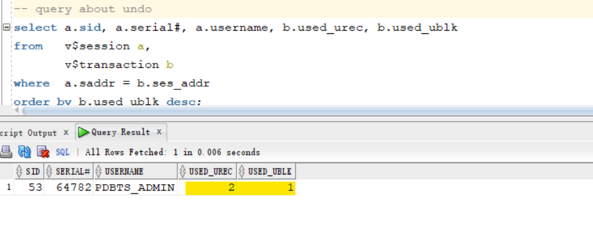

# DBA - Data Blocks, Extents, Segments

[Back](../../index.md)

- [Data Blocks, Extents, Segments](#data-blocks-extents-segments)

---

## How Table Data is stored?


- `tablespace` is the logical container for `segments`, which are table A and table b.
- `Table` is the **basic storage unit** for the **relational database management system**. 表管理系统的基本单位.
- Table B contains rows and columns.


- `extent` contains continuous blocks.
- `row piece`

  - the place where a row of data is stored in `data block`.

- a `data block` can contain **mutilple** `row piece`. 可以有多个
- A `data block` only contains data for `8K`. 有大小限制.

- `one row piece`:

  - A `data block` **usually** contains **only one** `row piece` for each row.
  - when a row's data can be inserted into a **single** `data block`

- `multiple row pieces`:

  - Oracle **chained across multiple blocks**.
  - when a row's data **cannot** be inserted into a **single** `data block`
  - when an update to an existing row causes the row to **outgrow** its `data block`
  - Scenarios:
    - the size of a data row is **big**.
    - the table contains **more than 255 columns**.

- 多片段:
  - 大于 255 列
  - 行数据太大
  - 读取时, chained

---

### Database block content

- `Block Header`:

  - Contains

    - the **segment type** ( table or index )
    - the The **block address**
    - the **Row directory**

  - The block header **grows downward from the top**

- `Free Space`:

  - Enable the block header and the row data to **grow**

- `Row data`:
  - It is the **actual data** for the rows
  - Row data **grows upward from the bottom**


---

## Managing Storage Space

- Space is **automatically managed** by the `Oracle Database server`.

  - It generates alerts about potential problems and recommends possible solutions.

- Techniques to manage storage:

  - `Oracle Managed Files (OMF)`

    - ref: https://oracle-base.com/articles/9i/oracle-managed-files#google_vignette
    - No need to bother about the **file names** and **storage requirements**.
    - Oracle provides a **unique file name**.
    - Eliminates the need for the DBA to directly **manage OS files**. 负责管理 OS 文件
    - Allows operations to be specified **in terms of objects** and not files.
    - Reduces the chance of overwriting a file. 避免文件被覆盖
      - Avoids accidental corruption of data files. 与备份连结

  - **Free-space management** with `bitmaps` (“locally managed”)

    - ref: https://oracle-base.com/articles/9i/automatic-segment-free-space-management#google_vignette
    - This is known as `Automatic Segment Space Management(ASSM)`

      - e.g., the following statement creates tablespace **mytbs1** with automatic segment-space management:

      ```sql
      CREATE TABLESPACE mytbs1
      DATAFILE '/u01/oracle/data/mytbs01.dbf' SIZE 500M
      EXTENT MANAGEMENT LOCAL   -- indicate Oracle to use bitmap to manage space
      SEGMENT SPACE MANAGEMENT AUTO;  -- instruct oracle to use ASSM
      ```

      > by default, data block is 8k. If the row is removed, the data block is free and can be reused. ASSM will find these free data blocks for the new data. It let Oracle to discover free blocks.

  - **Automatic data file extension**
    - So the files can **grow automatically** based on the amount of data in the files.
  - **Proactive 主动的 space management**
    - default thresholds and server-generated alerts
    - When the tbsp is almost full, alert will be show to take action to create a new table space by add new files and resize datafile.

---

## Space Management in Data Blocks

### Optimization of Free Space in Data Blocks

#### Optimization by Increasing Free Space

本节着重于在数据块层面如何优化和重用空闲空间

- Two types of statements can **release space** of one or more `data blocks`: 可以释放空闲空间的语句.
  - 1. `DELETE` statements 移除数据
  - 2. `UPDATE` statements that update existing values to smaller values 更新较小的数据

重用释放空间

- The released space from these types of statements is available for subsequent `INSERT` statements under the following conditions:
  - If the `INSERT` statement is in the **same transaction** and **subsequent to** the statement that frees space, then the `INSERT` statement can use the space made available.当前交易: 后来的 insert 可以重用空间
  - If the `INSERT` statement is in a **separate transaction** from the statement that frees space (perhaps run by another user), and if space is **needed**, then the statement can use the space made available, but only **after** the other transaction **commits**.不同交易: 只能等到提交后才能重用.

---

#### Optimization by Coalescing Fragmented Space

合并碎片空间

- Released space may or may **not be contiguous** with the main area of free space in a data block.
- `fragmented space`: Noncontiguous free space


> - figure shows a data block with noncontiguous free space:
>   - The block is depicted as containing 7 rows of slabs 厚片 of different shades. The 3rd and 6th row contain white slabs, which indicate **free space**.

- Oracle Database automatically and transparently **coalesces the free space 合并空闲空间** of a data block only when the following conditions are true: 合并空闲空间的条件(需要同时符合), 即总体空闲空间足够, 但碎片不连续.合并后成为连续的片来存储数据.

  - An `INSERT` or `UPDATE` statement attempts to use a block that contains **sufficient free space** to contain a new row piece. 当前块有足够空间来存储新行.
  - The free space is **fragmented** so that the row piece **cannot** be inserted in a **contiguous section** of the block. 空闲空间分散以至于连续节不够

- Oracle Database performs coalescing only in the preceding situations because otherwise **performance would decrease** because of the continuous coalescing of the free space in data blocks. 只在满足要求才会执行合并, 因为有性能原因

- After coalescing, the **amount of free space** is **identical** to the amount **before** the operation, but the space is now **contiguous**.


> - shows a data block after space has been coalesced.
>   - Underneath the data block header, the block has 6 stacked slabs of different shades. The top slab is clear, indicating free space.

---

## Lab: Segments, Extent, and Blocks

- Goal:
  - Observe and understand the relationship: tbsp-segment-extent-block

### Create Tablespace with default value

- Create a new tbsp with default value
  - Observe the default block_size, extent

```sql
show user
--USER is "PDBTS_ADMIN"
show con_name
--CON_NAME
--------------------------------
--PDBTS

create tablespace ts1;


SELECT DBMS_METADATA.GET_DDL('TABLESPACE','TS1') FROM dual;
--"CREATE TABLESPACE "TS1" DATAFILE
--  SIZE 104857600
--  AUTOEXTEND ON NEXT 104857600 MAXSIZE 32767M
--  LOGGING ONLINE PERMANENT BLOCKSIZE 8192
--  EXTENT MANAGEMENT LOCAL AUTOALLOCATE DEFAULT
-- NOCOMPRESS  SEGMENT SPACE MANAGEMENT AUTO"

-- verify
select * from dba_tablespaces
where tablespace_name='TS1';
--TS1	8192	65536		1	2147483645	2147483645		65536	ONLINE	PERMANENT	LOGGING	NO	LOCAL	SYSTEM	NO	AUTO	DISABLED	NOT APPLY	NO	HOST	NO		DISABLED					SHARED	DISABLED					OFF	N

```

> - Default values:
>   - PERMANENT tbsp
>   - Size of tbsp: 100M
>   - Auto extend next: 100M
>   - Max size: 31.99G
>   - block size: 8k
>     - initially gives 8\*block_size for initial extent, that is 65536.
>   - using `bitmaps`/`Automatic Segment Space Management(ASSM)` to manage free space
>   - no compression
>   - enable logging

---

- Create user with the new tbsp
  - Observe the user's default tbsp

```sql
-- create user with tbsp
CREATE USER alex identified by alex
default tablespace ts1;

-- grant privileges
grant create session, create table, unlimited tablespace to alex;

-- verify user
select * from dba_users
where username='ALEX';
--ALEX	119		OPEN		03-Dec-2024	TS1	TEMP	TEMP	06-Jun-2024	DEFAULT	DEFAULT_CONSUMER_GROUP		11G 12C 	N	PASSWORD	N	NO		N	NO	USING_NLS_COMP	NO	NO	06-Jun-2024
```

> - default tbsp is ts1
>   - any object created without any option under this user will store directly to ts1 tbsp.

---

- Create a tb with the user

```sql
-- create a tb with user
CREATE TABLE ALEX.EMP
(
    EMP_ID NUMBER,
    NAME VARCHAR2(100),
    NOTE VARCHAR2(1000)
);

-- verify
SELECT * FROM DBA_TABLES
WHERE TABLE_NAME='EMP'
AND OWNER='ALEX';
-- ALEX	EMP	TS1			VALID	10		1	255								YES	N									         1	         1	    N	ENABLED			NO		N	N	NO	DEFAULT	DEFAULT	DEFAULT	DISABLED	NO	NO		DISABLED	YES		DISABLED	DISABLED		NO	NO	NO	DEFAULT	NO			NO	NO	DISABLED					USING_NLS_COMP	N	N	NO	NO		NO	NO	NO	NO			NO	DISABLED	DISABLED	NO	NO	NO	ENABLED
```

> - the tbsp name of the tb is ts1.

---

### Segment and Extent

- Query the segment
  - `Segment`: Any **object** in the database that needs storage. 数据库中需要存储的对象, 如 tb, index

```sql
-- query segments in the tb
SELECT * FROM DBA_SEGMENTS
WHERE OWNER='ALEX'
AND SEGMENT_NAME='EMP';
-- return zero rows
--   because no rows in the tb.
--   TB with no inserted data does not need storage, so Oracle does not create any segment.

-- insert and commmit a row
INSERT INTO ALEX.EMP
VALUES (1,'KHALED','the best teacher ever : )');
commit;
-- note: even not commit, a segment will be created.

-- query segment in the tb after commit
SELECT * FROM DBA_SEGMENTS
WHERE OWNER='ALEX'
AND SEGMENT_NAME='EMP';
--ALEX	EMP		TABLE	ASSM	TS1	131	130	65536	8	1	65536	1048576	1	2147483645	2147483645						131	DEFAULT	DEFAULT	DEFAULT	DISABLED
```

> - Table does not have any segment until inserting data.
>   - Segment is created once the first row is inserted, even if it is committted.
> - segment name: table name
> - segment type: table
> - segment subtype: ASSM
>   - using ASSM to manage free space
> - tbsp: ts1
> - contains 8 block, 1 extents


---

- Query extent

```sql
-- query extents in the tb
select * from dba_extents
where owner='ALEX'
and  SEGMENT_NAME='EMP';
--ALEX	EMP		TABLE	TS1	0	131	128	65536	8	131
```

> - Currently, this tb contain only one extent, because the extent ID is 0
>   - This extent has 8 blocks.
>   - extent size: 65536
>   - related to file no.:131


---

- Insert 1000 rows

```sql
begin
 for i in 1..1000
 loop
 insert into ALEX.EMP values (i,'just test name', 'just test comments');
 end loop;
 commit;
end;
/
```

- Query segment and extent

```sql
-- query segment after 1000 inserted rows
SELECT * FROM DBA_SEGMENTS
WHERE OWNER='ALEX'
AND SEGMENT_NAME='EMP';
-- ALEX	EMP		TABLE	ASSM	TS1	131	130	131072	16	2	65536	1048576	1	2147483645	2147483645						131	DEFAULT	DEFAULT	DEFAULT	DISABLED

-- query extents after 1000 rows
select * from dba_extents
where owner='ALEX'
and  SEGMENT_NAME='EMP';
--ALEX	EMP		TABLE	TS1	0	131	128	65536	8	131
--ALEX	EMP		TABLE	TS1	1	131	136	65536	8	131
```


> - After inserting 1000 rows, tb has 2 extents with 16 blocks

---

- insert 1000000 rows
  - observe the change of segment and extent

```sql
begin
 for i in 1..1000000
 loop
 insert into ALEX.EMP values (i,'just test name', 'just test comments');
 end loop;
 commit;
end;
/
```

- Query segment and extent

```sql
-- query segment after 1000000 rows
SELECT * FROM DBA_SEGMENTS
WHERE OWNER='ALEX'
AND SEGMENT_NAME='EMP';
--ALEX	EMP		TABLE	ASSM	TS1	131	130	51380224	6272	64	65536	1048576	1	2147483645	2147483645


-- query extent after 1000000 rows
select * from dba_extents
where owner='ALEX'
and  SEGMENT_NAME='EMP';
--ALEX	EMP		TABLE	TS1	0	131	128	65536	8	131
--ALEX	EMP		TABLE	TS1	1	131	136	65536	8	131
-- ...
--ALEX	EMP		TABLE	TS1	62	131	6144	1048576	128	131
--ALEX	EMP		TABLE	TS1	63	131	6272	1048576	128	131
```

> - the tb has 64 extents with 6272 blocks.
> - tb size: 51380224 bytes = 49 MB
> - Oracle change the extent size, from 8 blocks to 128 blocks.
>   - Because of the use of `ASSM`


---

### RowID

- Oracle used the row id to retrieve a row of data.

```sql
select rowid,emp_id,name,note
from ALEX.emp
where emp_id=1000000;
-- AAAR03ACDAAABjeABJ	1000000	just test name	just test comments
```

> - ROWID is a `pseudocolumn`
>   - `pseudocolumn`: behaves like a table column, but is not actually stored in the table.
> - ROWID is the physical location of a row.
>   - Consequently it is the fastest way of locating a row, faster even than a primary key lookup.
>   - Contains 18 digits: OOOOOOFFFBBBBBBRRR
>     - OOOOOO **object number**
>     - FFF **Relative File Number**
>     - BBBBBB The **data block number**
>     - RRR The **row number**

---

### Delete and Truncate

- Remove all data from the tb
  - Observe the change of segment

```sql
-- delete all data
delete from ALEX.EMP;
commit;

SELECT * FROM DBA_SEGMENTS
WHERE OWNER='ALEX'
AND SEGMENT_NAME='EMP';
--ALEX	EMP		TABLE	ASSM	TS1	131	130	51380224	6272	64	65536	1048576	1	2147483645	2147483645

select * from dba_extents
where owner='ALEX'
and  SEGMENT_NAME='EMP';
```

> - the size of segment, blocks, and extents are not changed.
>   - But data can be inserted into these blocks due to ASSM


---

- Truncate
  - to reset the size and free the tb

```sql
truncate table ALEX.EMP;

SELECT * FROM DBA_SEGMENTS
WHERE OWNER='ALEX'
AND SEGMENT_NAME='EMP';
--ALEX	EMP		TABLE	ASSM	TS1	131	130	65536	8	1	65536	1048576	1	2147483645	2147483645						131	DEFAULT	DEFAULT	DEFAULT	DISABLED

select * from dba_extents
where owner='ALEX'
and  SEGMENT_NAME='EMP';
-- ALEX	EMP		TABLE	TS1	0	131	128	65536	8	131
```

> the size is reset after truncate statement.


---

## Chained and Migrated Rows

- Oracle Database uses `chaining` and `migration` to **manage rows that are too large to fit into a single block**.

- Note:A chained row in a standard table is different from a row chain in a `blockchain table`. Oracle Database uses different technology to manage rows in a `blockchain table`.

---

- `row chaining`:

  - happens when the row is **too large** to fit into one data block when it is **first inserted**. 首次插入时,行数据大于块.
    - `row chaining` in this case is **unavoidable**.不可避免
  - Oracle Database stores the data for the row **in a chain of one or more `data blocks`** reserved for the segment. 连锁块来存储行.
  - most often occurs with **large rows**.

    - Examples include rows that contain a column of data type `LONG` or `LONG RAW` , or a row with a huge number of **columns**.


> - depicts the insertion of a large row in a data block.
>   - The row is too large for the left block, so the database chains the row by placing the first `row piece` in the **left** block and the second `row piece` in the **right** block.

- A row has **more than 255** columns.
  - Oracle Database can only store 255 columns in a row piece. Thus, if you insert a row into a table that has 1000 columns, then the database creates 4 `row pieces`, typically **chained** over multiple blocks.多于 255 列, 也会连锁块

---

- `row migration`:
  - happens when a row that **originally fit** into **one `data block`** is **updated** so that the overall row length increases, but **insufficient free space** exists to hold the updated row.原来单一块可存储, 更新后空间不足
  - Oracle Database **moves the entire row** to a **new** data block, assuming the row can fit in a new block.移动整行到新块
    - The **original** `row piece` of a migrated row **contains a pointer or "forwarding address"** to the new block containing the migrated row.
    - The **rowid** of a migrated row does not change. 行 ID 不变, 但原有行会包含一个指针.


> - the **left** block contains a row that is **updated** so that the row is now too large for the block. T
> - he database **moves** the entire row to the **right** block and leaves a pointer to the migrated row in the left block.

---

- Performance:
  - When a row is **chained** or **migrated**, the `I/O` needed to retrieve the data **increases**. 增加读取压力
    - This situation results because Oracle Database **must scan multiple blocks** to retrieve the information for the row.
    - For example, if the database performs one I/O to read an index and one I/O to read a nonmigrated table row, **then** an additional I/O is required to obtain the data for a migrated row.
  - The `Segment Advisor`, which can be run both manually and automatically, is an Oracle Database component that **identifies segments** that have space available for **reclamation**.
  - The advisor can offer advice about objects that have significant free space or too many chained rows.

---

## Segments

- `segment`:

  - a set of `extents` that contains all the data **for a logical storage structure** within a tablespace.

- The different **types** of segments include: 一共有 10 种, 该处只围绕 4 种.
  - **Table and cluster**
    - For example, Oracle Database allocates one or more **extents** to form the `data segment` **for a table**.
    - Note: For a `partitioned table`, each **partition** has a `data segment`
  - **Index**
    - For example, The database also allocates one or more **extents** to form the `index segment` **for an index on a table**.
    - Note: For a `partitioned index`, each **partition** has an `index segment`.
  - **Undo**
    - `undo data`: used to maintains records of the actions of transactions and to reverse changes made to the database.
    - used to rollback.
    - `Undo` is stored in `undo segments` in an `undo tablespace`
  - **Temporary**
    - A temporary segment is **created** by the Oracle Database server when a SQL statement **needs a temporary database area** to complete execution.
      - e.g., order by, group by
    - When the statement **finishes** execution, the `extents` in the `temporary segment` are **returned** to the system for future use. 完成后自动归还

---

## Lab: Type of Segment

### Setup env

```sql
show user
show con_name

-- create tb
create table dept
(
  deptno NUMBER(2),
  dept_name varchar2(100)
);

-- confirm
select * from dba_tables
where table_name='DEPT';
```

---

### Data Segment and Index Segment

- insert data
  - segment type is table

```sql
-- query user segment
SELECT * FROM USER_SEGMENTS
WHERE SEGMENT_NAME='DEPT';
-- return no row, due to no data.

INSERT into dept
values (1, 'IT Dept');

INSERT into dept
values (2, 'FINANCE');

commit;

-- query user segment
SELECT * FROM USER_SEGMENTS
WHERE SEGMENT_NAME='DEPT';
--DEPT		TABLE	ASSM	USERS	65536	8	1	65536	1048576	1	2147483645	2147483645						DEFAULT	DEFAULT	DEFAULT	DISABLED
```


> - segment type: table

- Create index

```sql
-- create index
create unique index dept_inx
on DEPT(deptno);

-- query
SELECT * FROM USER_SEGMENTS;
-- DEPT		TABLE	ASSM	USERS	65536	8	1	65536	1048576	1	2147483645	2147483645						DEFAULT	DEFAULT	DEFAULT	DISABLED
-- DEPT_INX		INDEX	ASSM	USERS	65536	8	1	65536	1048576	1	2147483645	2147483645						DEFAULT	DEFAULT	DEFAULT	DISABLED
```


> - Segment types: table and index

---

### Undo Segment

- Update tb without commit or rollback
  - the old version of rows is inserted into undo tbsp

```sql

update dept
set dept_name='XXXX';

-- query segment
SELECT * FROM dba_SEGMENTS
where owner='PDBTS_ADMIN';
-- will not show any undo segment

-- query about undo
select a.sid, a.serial#, a.username, b.used_urec, b.used_ublk
from   v$session a,
       v$transaction b
where  a.saddr = b.ses_addr
order by b.used_ublk desc;
-- 53	64782	PDBTS_ADMIN	2	1
--USED_UREC: Number of undo records used
--USED_UBLK: Number of undo blocks used
```



> - undo segment includes 2 records within 1 block.

- Rollback
  - the data is taken back to the tb after rollback.

```sql
ROLLBACK;

-- query undo after rollback
select a.sid, a.serial#, a.username, b.used_urec, b.used_ublk
from   v$session a,
       v$transaction b
where  a.saddr = b.ses_addr
order by b.used_ublk desc;
-- return no rows
```

---

## Segment Creation on Demand / Deferred Segment Creation

- `Segment creation on demand` / `deferred segment creation`

  - a **space saving feature** of Oracle Database 11g Release 2.
  - When non-partitioned tables are created, **none** of the associated segments (table, implicit index and LOB segments) are **created until rows are inserted** into the table.
  - For systems with lots of empty tables, this can represent a large space saving.

- `DEFERRED_SEGMENT_CREATION` initialization parameter

  - specifies the semantics of `deferred segment creation`.
  - default:
    - `TRUE`: segments for tables and their dependent objects (LOBs, indexes) will not be created until the first row is inserted into the table.

```sql
show parameter DEFERRED_SEGMENT_CREATION

ALTER SYSTEM SET DEFERRED_SEGMENT_CREATION=[TRUE | FALSE];
```

- Deferred segment is the **default** for **tables**, **indexes**, and **partitions**.

---

## Lab:Deferred Segment Creation

```sql
show user;
show con_name;

show parameter DEFERRED_SEGMENT_CREATION
--NAME                      TYPE    VALUE
--------------------------- ------- -----
--deferred_segment_creation boolean TRUE
```

> - TRUE: the segment will created for the table after
>   - you crate the table using DDL statement (create table)
>   - and you insert one record (DML)

---

- Create tb
  - query segment show no rows due of empty tb
  - insert a row
  - query segment, it return a row

```sql
create table country
(
  id number,
  name varchar2(100)
);

select *
from user_segments
where segment_name=upper('country');
-- return no rows

insert into country values (1,'Jordan');

select * from user_segments
where segment_name= upper('country');
-- COUNTRY		TABLE	ASSM	USERS	65536	8	1	65536	1048576	1	2147483645	2147483645						DEFAULT	DEFAULT	DEFAULT	DISABLED
```


> - type is table
> - segment is created only after the insert of the first row.

---

### Disable Deferred Segment Creation

- Alter parameter

```sql
--this will create the segment immidiate for the current session
alter session set DEFERRED_SEGMENT_CREATION=false;

show parameter DEFERRED_SEGMENT_CREATION
--NAME                      TYPE    VALUE
----------------------- ------- -----
--deferred_segment_creation boolean FALSE
```

- Create a tb
  - query segment after the creation of a tb and before inserting data.

```sql
create table jobs
(
  id number,
  title varchar2(100)
);

select *
from user_segments
where segment_name=upper('jobs');
-- JOBS		TABLE	ASSM	USERS	65536	8	1	65536	1048576	1	2147483645	2147483645						DEFAULT	DEFAULT	DEFAULT	DISABLED
```

---

### Disable Deferred Segment Creation at tb Level

```sql
-- reset parameter for the current session
alter session set DEFERRED_SEGMENT_CREATION=true;
-- confirm
show parameter DEFERRED_SEGMENT_CREATION

-- disable at tb level
create table test
(
  n number
)
SEGMENT CREATION IMMEDIATE; -- create the segment when tb is created

-- query right after the creation of tb
select * from user_segments
where segment_name= upper('test');
-- TEST		TABLE	ASSM	USERS	65536	8	1	65536	1048576	1	2147483645	2147483645						DEFAULT	DEFAULT	DEFAULT	DISABLED

```

- Enable deferred segment creation at tb level

```sql
create table test10 ( n number )
SEGMENT CREATION DEFERRED;    -- enable deferred segment creation

select * from user_segments
where segment_name= upper('test10');
-- return no rows
```

---

## Lab: `Unusable` index: Space saving feature

- Setup Env

```sql
show user;
show con_name;

drop table employees purge;

-- verify enabling deferred segement creation
show parameter DEFERRED_SEGMENT_CREATION
--NAME                      TYPE    VALUE
--------------------------- ------- -----
--deferred_segment_creation boolean TRUE

create table employees
(
    emp_id number,
    fname varchar2(100),
    lname varchar2(100),
    constraint employees_pk primary key (emp_id) -- pk, create automatically a unique index
 );

select * from user_tables
where table_name='EMPLOYEES';
-- EMPLOYEES	USERS			VALID	10		1	255								YES	N									         1	         1	    N	ENABLED			NO		N	N	NO	DEFAULT	DEFAULT	DEFAULT	DISABLED	NO	NO		DISABLED	YES		DISABLED	DISABLED		NO	NO	NO	DEFAULT	NO			NO	NO	DISABLED					USING_NLS_COMP	N	N	NO	NO		NO	NO	NO	NO			NO	DISABLED	DISABLED	NO	NO	NO	ENABLED
-- pct_free: 10
--  means the percentage free for the block, 10% are free from the size of the block
```

- Query index

```sql
-- query index
SELECT * FROM USER_INDEXES;
-- EMPLOYEES_PK	NORMAL	PDBTS_ADMIN	EMPLOYEES	TABLE	UNIQUE	DISABLED		USERS	2	255										10	YES							VALID				1	1	NO	N	N	N	DEFAULT	DEFAULT	DEFAULT	NO						NO				NO	NO	NO	VISIBLE		NO	NO	FULL	NO	YES

select * from user_segments
where segment_name IN ( 'EMPLOYEES','EMPLOYEES_PK' );
-- return no row
```


> - By default, pk is unique index.

- Insert a row of data and query segment

```sql

insert into employees values (1,'khaled','alkhudari');
commit;

select * from employees;


select * from user_segments
where segment_name IN ( 'EMPLOYEES','EMPLOYEES_PK' );
--EMPLOYEES		TABLE	ASSM	USERS	65536	8	1	65536	1048576	1	2147483645	2147483645						DEFAULT	DEFAULT	DEFAULT	DISABLED
--EMPLOYEES_PK		INDEX	ASSM	USERS	65536	8	1	65536	1048576	1	2147483645	2147483645						DEFAULT	DEFAULT	DEFAULT	DISABLED
```


- Create a new index

```sql
create index fname_index on EMPLOYEES(fname);

select * from user_segments
where segment_name IN ( 'EMPLOYEES','EMPLOYEES_PK' ,'FNAME_INDEX');
-- EMPLOYEES		TABLE	ASSM	USERS	65536	8	1	65536	1048576	1	2147483645	2147483645						DEFAULT	DEFAULT	DEFAULT	DISABLED
-- EMPLOYEES_PK		INDEX	ASSM	USERS	65536	8	1	65536	1048576	1	2147483645	2147483645						DEFAULT	DEFAULT	DEFAULT	DISABLED
-- FNAME_INDEX		INDEX	ASSM	USERS	65536	8	1	65536	1048576	1	2147483645	2147483645						DEFAULT	DEFAULT	DEFAULT	DISABLED
```


> - When a tb contains data and a new index is created
>   - new segment will be created as well.

---

- Create index with unusable
  - this index is only in a structure and exists in the dictionary.
  - Oracle will not create segment.

```sql
create index lname_index
on EMPLOYEES(lname)
UNUSABLE;

select *
from user_segments
where segment_name IN ( 'EMPLOYEES','EMPLOYEES_PK' ,'FNAME_INDEX','LNAME_INDEX');
--EMPLOYEES		TABLE	ASSM	USERS	65536	8	1	65536	1048576	1	2147483645	2147483645						DEFAULT	DEFAULT	DEFAULT	DISABLED
--EMPLOYEES_PK		INDEX	ASSM	USERS	65536	8	1	65536	1048576	1	2147483645	2147483645						DEFAULT	DEFAULT	DEFAULT	DISABLED
--FNAME_INDEX		INDEX	ASSM	USERS	65536	8	1	65536	1048576	1	2147483645	2147483645						DEFAULT	DEFAULT	DEFAULT	DISABLED
```

> - no segment is created for the new unusable index.

- Rebuild index to set it usable
  - segment is created
  - So `unusable` save free space

```sql
alter index LNAME_INDEX REBUILD;

select * from user_segments
where segment_name IN ( 'EMPLOYEES','EMPLOYEES_PK' ,'FNAME_INDEX','LNAME_INDEX');
--EMPLOYEES		TABLE	ASSM	USERS	65536	8	1	65536	1048576	1	2147483645	2147483645						DEFAULT	DEFAULT	DEFAULT	DISABLED
--EMPLOYEES_PK		INDEX	ASSM	USERS	65536	8	1	65536	1048576	1	2147483645	2147483645						DEFAULT	DEFAULT	DEFAULT	DISABLED
--FNAME_INDEX		INDEX	ASSM	USERS	65536	8	1	65536	1048576	1	2147483645	2147483645						DEFAULT	DEFAULT	DEFAULT	DISABLED
--LNAME_INDEX		INDEX	ASSM	USERS	65536	8	1	65536	1048576	1	2147483645	2147483645						DEFAULT	DEFAULT	DEFAULT	DISABLED
```

---

[TOP](#dba---data-blocks-extents-segments)
