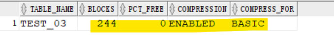
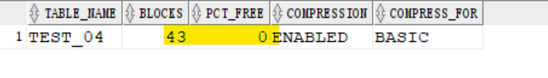
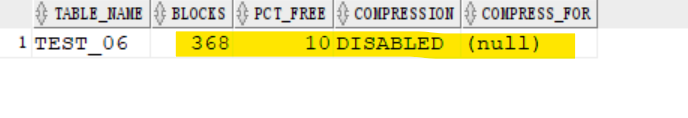
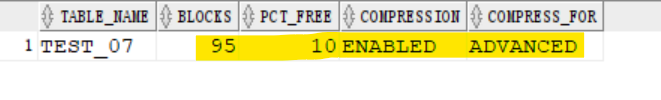
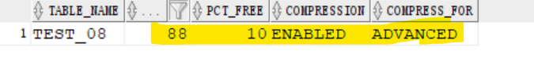

# DBA - Logical Storage Structures

[Back](../../index.md)

- [DBA - Logical Storage Structures](#dba---logical-storage-structures)
  - [Logical Storage Structures](#logical-storage-structures)
  - [Logical vs Physical](#logical-vs-physical)
  - [Compression](#compression)
    - [Basic Compression](#basic-compression)
      - [Lab: Compression](#lab-compression)
        - [Table without Compression](#table-without-compression)
        - [Create TB with basic compression](#create-tb-with-basic-compression)
        - [Normal Insert into a Basic Compression Table](#normal-insert-into-a-basic-compression-table)
        - [Direct path insert into a Basic Compressed Table](#direct-path-insert-into-a-basic-compressed-table)
        - [Alter no compressed table into basic compressed](#alter-no-compressed-table-into-basic-compressed)
        - [Summary](#summary)
    - [Advanced Row Compression](#advanced-row-compression)
        - [Lab: Advanced row compression](#lab-advanced-row-compression)

---

## Logical Storage Structures

- Oracle Database **allocates** `logical space` for all data in the database.

- The **logical units** of database space allocation:

  - data blocks,
  - extents,
  - segments,
  - and tablespaces.

- At a **physical** level, the data is stored in `data files` on disk.
  - The data in the `data files` is stored **in operating system blocks**.


---

## Logical vs Physical

- Physical Storage:

  - Storage objects that can be seen by eyes
  - objects are stored in a storage system, such as SAN, NFS, NAS, and ASM.

- Logical Storage:

  - `Data Block`: rows

    - Oracle **data stored in `DB blocks`**
    - 1 Block= `8K` by default
    - A **single** Oracle **Data Block** contains **one or more rows**.

  - `Extent`: continuous rows

    - a set of **contiguous** Oracle `Data Blocks`
    - it is much more **efficient**, when **allocating space**

  - `Segment`: tb, index

    - a set of `Extents`, one or more `Extents`, allocated for certain logical structures inside the database
    - e.g., table, index

  - `Tablespaces`: df

    - logical storage groups that can be used to store logical database constructs, such as tables and indexes
    - **logical container** for `segments`.
    - Logically it stores the database files


---

## Compression

### Basic Compression

- With basic compression, the Oracle Database server **compresses data** at the time of **performing bulk load** using operations such as direct loads or `CREATE TABLE AS SELECT`
- is recommended for bulk loading **data warehouses**

---

#### Lab: Compression

```sql
show user;
-- USER is "PDBTS_ADMIN"
show con_name;
--CON_NAME
--------------------------------
--PDBTS

--  use dba_objects for practice
select * from dba_objects
where rownum<10000;
```

---

##### Table without Compression

- Create table without compression

```sql
-- create tb with no compression
create table test_01
as
select * from dba_objects where rownum <= 10000;

-- query ddl
SELECT DBMS_METADATA.GET_DDL('TABLE','TEST_01') FROM dual;
--"
--  CREATE TABLE "PDBTS_ADMIN"."TEST_01"
--   (	"OWNER" VARCHAR2(128),
--	"OBJECT_NAME" VARCHAR2(128),
--	"SUBOBJECT_NAME" VARCHAR2(128),
--	"OBJECT_ID" NUMBER,
--	"DATA_OBJECT_ID" NUMBER,
--	"OBJECT_TYPE" VARCHAR2(23),
--	"CREATED" DATE,
--	"LAST_DDL_TIME" DATE,
--	"TIMESTAMP" VARCHAR2(19),
--	"STATUS" VARCHAR2(7),
--	"TEMPORARY" VARCHAR2(1),
--	"GENERATED" VARCHAR2(1),
--	"SECONDARY" VARCHAR2(1),
--	"NAMESPACE" NUMBER,
--	"EDITION_NAME" VARCHAR2(128),
--	"SHARING" VARCHAR2(18),
--	"EDITIONABLE" VARCHAR2(1),
--	"ORACLE_MAINTAINED" VARCHAR2(1),
--	"APPLICATION" VARCHAR2(1),
--	"DEFAULT_COLLATION" VARCHAR2(100),
--	"DUPLICATED" VARCHAR2(1),
--	"SHARDED" VARCHAR2(1),
--	"CREATED_APPID" NUMBER,
--	"CREATED_VSNID" NUMBER,
--	"MODIFIED_APPID" NUMBER,
--	"MODIFIED_VSNID" NUMBER
--   ) SEGMENT CREATION IMMEDIATE
--  PCTFREE 10 PCTUSED 40 INITRANS 1 MAXTRANS 255
-- NOCOMPRESS LOGGING
--  STORAGE(INITIAL 65536 NEXT 1048576 MINEXTENTS 1 MAXEXTENTS 2147483645
--  PCTINCREASE 0 FREELISTS 1 FREELIST GROUPS 1
--  BUFFER_POOL DEFAULT FLASH_CACHE DEFAULT CELL_FLASH_CACHE DEFAULT)
--  TABLESPACE "USERS" "
```

> - By default, percentage of free space is 10% and without compression.

- query blocks
  - tb has 186 block.

```sql
-- collect statistices about the tb
ANALYZE TABLE TEST_01 COMPUTE statistics;

-- query tb's properties regarding compression
select  table_name, blocks, pct_free , compression, compress_for
from    user_tables
where   table_name = 'TEST_01';
-- TEST_01	186	10	DISABLED
```


---

##### Create TB with basic compression

- Enable basic compression

```sql
-- create tb with basice compression
create table test_02 compress basic
as
select * from dba_objects where rownum <= 10000;

-- collect statistics
ANALYZE TABLE TEST_02 COMPUTE statistics;

select  table_name, blocks, pct_free , compression, compress_for
from    user_tables
where   table_name = 'TEST_02';
-- TEST_02	43	0	ENABLED	BASIC

```


> - less number of blocks
> - percentage of free space is 0.

---

##### Normal Insert into a Basic Compression Table

- Normal insert into empty table defined as compress basic (no effects)

```sql
-- create an empty tb
create table test_03 compress basic
as
select * from dba_objects where 1=2; -- created table contains no row due to a false WHERE clause.

select * from test_03;
-- no return

-- insert data into basic compressiong tb
-- make a normal insert
insert into test_03
select * from dba_objects
where rownum <= 10000;
commit;

ANALYZE TABLE TEST_03 COMPUTE statistics;

select  table_name, blocks, pct_free , compression, compress_for
from    user_tables
where   table_name = 'TEST_03';
-- TEST_03	244	0	ENABLED	BASIC
```



> - normal insert data into a basic compressed tb has no effects.
> - it will not affect the old data

---

##### Direct path insert into a Basic Compressed Table

- `APPEND` clause:
  - tells the optimizer to perform a **direct-path insert**, which **improves the performance** of `INSERT .. SELECT` operations for a number of reasons:
  - Data is **appended** to the end of the table, rather than attempting to use existing free space within the table.
  - Data is written **directly to the data files**, **by-passing** the `buffer cache`.

```sql
-- create an empty tb
create table TEST_04 compress basic
as
select * from dba_objects where rownum = 0;

select * from TEST_04;
-- return no row

-- insert data
insert /*+ append */ into TEST_04 select * from dba_objects where rownum <= 10000;

ANALYZE TABLE TEST_04 COMPUTE statistics;

select  table_name, blocks, pct_free , compression, compress_for
from    user_tables
where   table_name = 'TEST_04';
-- TEST_04	43	0	ENABLED	BASIC
```



---

##### Alter no compressed table into basic compressed

- Create tb without compression, then change to compressed
  - `alter table ... compress basic;`: the new inserted data, but not the old inserted data, will be compressed.
  - `alter table ... move;`: compress the old data

```sql
-- create tb with no compression
create table test_05
as
select * from dba_objects where rownum <= 10000;

ANALYZE TABLE TEST_05 COMPUTE statistics;

select  table_name, blocks, pct_free , compression, compress_for
from    user_tables
where   table_name = 'TEST_05';
-- TEST_05	186	10	DISABLED

-- compress tb
alter table test_05 compress basic;

select  table_name, blocks, pct_free , compression, compress_for
from    user_tables
where   table_name = 'TEST_05';
-- TEST_05	186	10	ENABLED	BASIC
```


> - `alter table test_05 compress basic;`: the old data would be compressed. So the block number is the same.

```sql
-- compress the old data
alter table test_05 move;

ANALYZE TABLE TEST_05 COMPUTE statistics;

select  table_name, blocks, pct_free , compression, compress_for
from    user_tables
where   table_name = 'TEST_05';
-- TEST_05	43	0	ENABLED	BASIC
```


> - `alter table test_05 move;`: Compress old data. Then the block number descreases.

---

##### Summary

| Compress                   | Block | free space % |
| -------------------------- | ----- | ------------ |
| No                         | 186   | 10           |
| Basic                      | 43    | 0            |
| Basic + New Insert         | 244   | 0            |
| Basic + Direct-Path Insert | 43    | 0            |
| No to Basic                | 43    | 0            |

---

### Advanced Row Compression

- `Advanced row compression`:

  - Rows inserted with or without using direct-path insert and updated rows are **compressed** using `advanced row compression`.
  - Is recommended for active `OLTP` environments
  - duplicate values in the rows and columns in a data block are **stored once** at the beginning of the block. 重复值会存储一次

- `CREATE TABLE ... ROW STORE COMPRESS ADVANCED`:

  - enabled Advanced row compression

- `ROW STORE COMPRESS ADVANCED` and `COMPRESS BASIC` are **not supported** for tables with more than 255 columns.
- You **cannot drop a column** from a table that is compressed for **direct-load operations**, although you can set such a column as **unused**. 列不能删除

---

##### Lab: Advanced row compression

- Create tb without compression as baseline.

```sql
show con_name
--CON_NAME
--------------------------------
--PDBTS
show user
--USER is "PDBTS_ADMIN"

-- create tb without compression
create table test_06
as
select * from dba_objects where rownum <= 20000;

ANALYZE TABLE test_06 COMPUTE statistics;

select  table_name, blocks, pct_free , compression, compress_for
from    user_tables
where   table_name = 'TEST_06';
-- TEST_06	368	10	DISABLED
```



---

- Advanced row compress

```sql
-- create tb using advanced row compression
create table test_07 ROW STORE COMPRESS ADVANCED
as
select * from dba_objects where rownum <= 20000;

ANALYZE TABLE test_07 COMPUTE statistics;

select  table_name, blocks, pct_free , compression, compress_for
from    user_tables
where   table_name = 'TEST_07';
-- TEST_07	95	10	ENABLED	ADVANCED
```



> - Compare with no compressed, the block size descreases.

---

- Normal insert

```sql
-- create empty tb using advanced row compression
create table test_08 ROW STORE COMPRESS ADVANCED
as
select * from dba_objects where rownum = 0;

select * from test_08;
-- return no row

-- execute normal insert
insert into test_08
select * from dba_objects where rownum <= 20000;
commit;

ANALYZE TABLE test_08 COMPUTE statistics;

select  table_name, blocks, pct_free , compression, compress_for
from    user_tables
where   table_name = 'TEST_08';
-- TEST_08	88	10	ENABLED	ADVANCED
```



> - Compared with Basic Compression, normal insert is compressed.

---

[TOP](#dba---logical-storage-structures)
