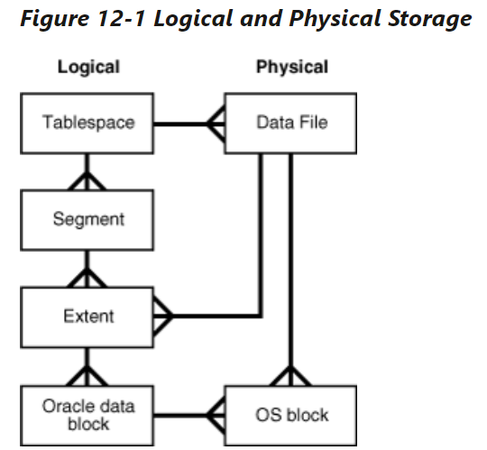
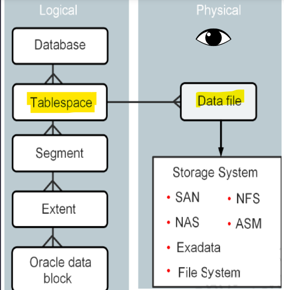
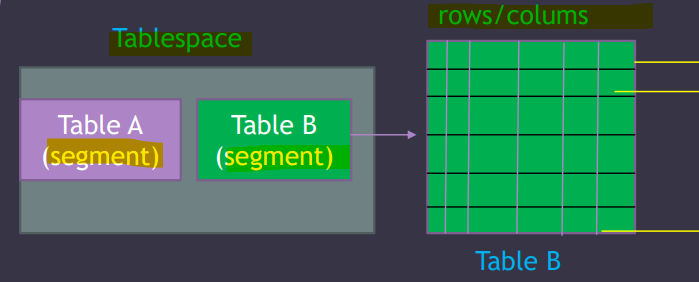
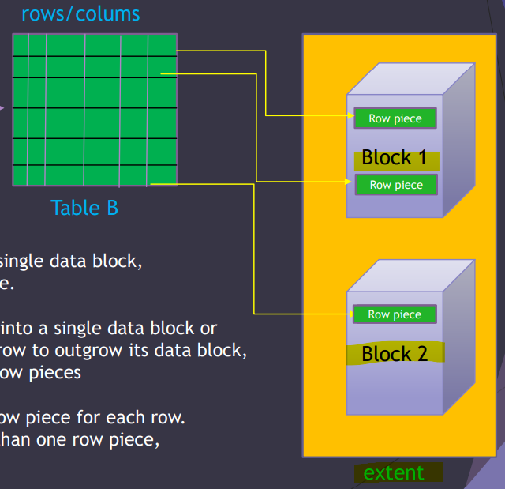
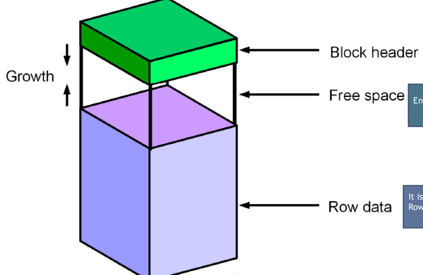

# DBA - Logical Storage Structures

[Back](../../index.md)

- [DBA - Logical Storage Structures](#dba---logical-storage-structures)
  - [Logical Storage Structures](#logical-storage-structures)
  - [Logical vs Physical](#logical-vs-physical)
  - [How Table Data is stored?](#how-table-data-is-stored)
    - [Database block content](#database-block-content)

---

## Logical Storage Structures

- Oracle Database **allocates** `logical space` for all data in the database.

- The **logical units** of database space allocation:

  - data blocks,
  - extents,
  - segments,
  - and tablespaces.

- At a **physical** level, the data is stored in `data files` on disk.
  - The data in the `data files` is stored **in operating system blocks**.

---

## Logical vs Physical

- Physical Storage:

  - Storage objects that can be seen by eyes
  - objects are stored in a storage system, such as SAN, NFS, NAS, and ASM.

- Logical Storage:

  - `Data Block`: rows

    - Oracle **data stored in `DB blocks`**
    - 1 Block= `8K` by default
    - A **single** Oracle **Data Block** contains **one or more rows**.

  - `Extent`: continuous rows

    - a set of **contiguous** Oracle `Data Blocks`
    - it is much more **efficient**, when **allocating space**

  - `Segment`: tb, index

    - a set of `Extents`, one or more `Extents`, allocated for certain logical structures inside the database
    - e.g., table, index

  - `Tablespaces`: df

    - logical storage groups that can be used to store logical database constructs, such as tables and indexes
    - **logical container** for `segments`.
    - Logically it stores the database files

---

## How Table Data is stored?

- `tablespace` is the logical container for `segments`, which are table A and table b.
- `Table` is the **basic storage unit** for the **relational database management system**. 表管理系统的基本单位.
- Table B contains rows and columns.

- `extent` contains continuous blocks.
- `row piece`

  - the place where a row of data is stored in `data block`.

- a `data block` can contain **mutilple** `row piece`. 可以有多个
- A `data block` only contains data for `8K`. 有大小限制.

- `one row piece`:

  - A `data block` **usually** contains **only one** `row piece` for each row.
  - when a row's data can be inserted into a **single** `data block`

- `multiple row pieces`:

  - Oracle **chained across multiple blocks**.
  - when a row's data **cannot** be inserted into a **single** `data block`
  - when an update to an existing row causes the row to **outgrow** its `data block`
  - Scenarios:
    - the size of a data row is **big**.
    - the table contains **more than 255 columns**.

- 多片段:
  - 大于 255 列
  - 行数据太大
  - 读取时, chained

---

### Database block content

- `Block Header`:

  - Contains

    - the **segment type** ( table or index )
    - the The **block address**
    - the **Row directory**

  - The block header **grows downward from the top**

- `Free Space`:

  - Enable the block header and the row data to **grow**

- `Row data`:
  - It is the **actual data** for the rows
  - Row data **grows upward from the bottom**

---

[TOP](#dba---logical-storage-structures)
