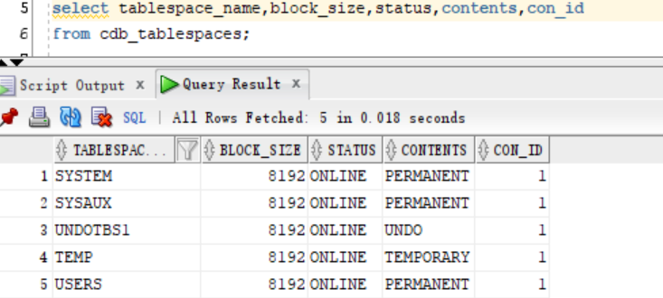
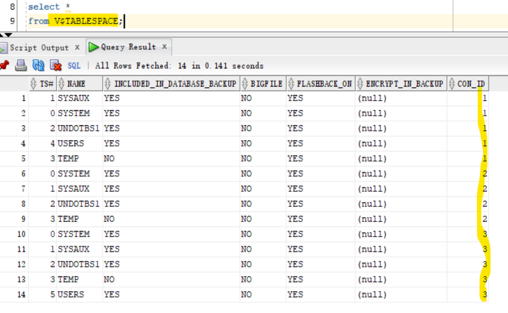
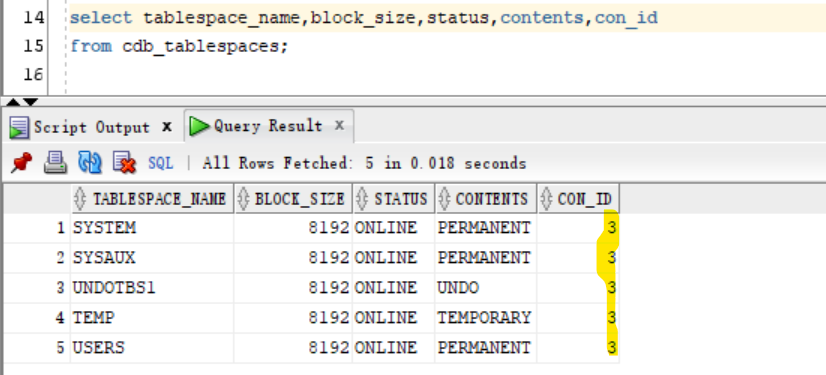
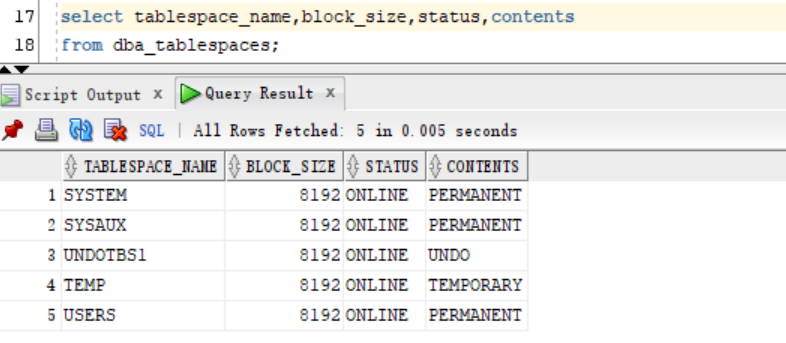
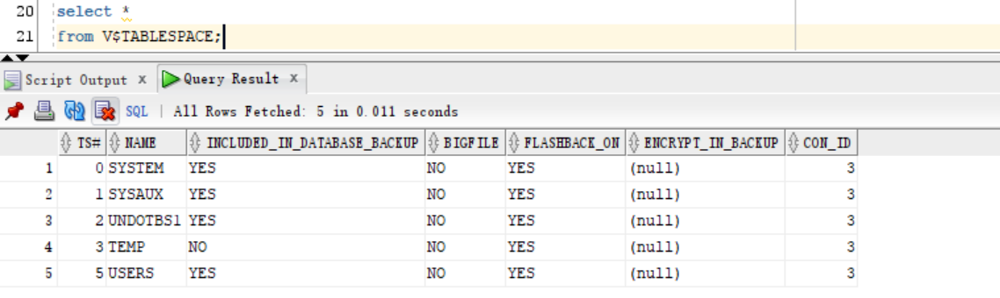

# DBA - Logical Storage: Tablespace

[Back](../../index.md)

- [DBA - Logical Storage: Tablespace](#dba---logical-storage-tablespace)
  - [Lab: Query tbsp](#lab-query-tbsp)

---

## Lab: Query tbsp

- Connet to root
- Open pdb

```sql
show con_name

alter pluggable database orclpdb open;
```

- Query tbsp using `cdb_`
  - return only the openned tbsp

```sql
select tablespace_name,block_size,status,contents,con_id
from cdb_tablespace
```



- Query using v$tablespace
  - return all tbsp, including the closed database.

```sql
select *
from V$TABLESPACE;
```



---

- Change sessoin
- Query using `cdb_` and `dba_`
  - onlu return the tbsp in the current pdb.

```sql
select tablespace_name,block_size,status,contents,con_id
from cdb_tablespaces;

select tablespace_name,block_size,status,contents
from dba_tablespaces;
```





- Query using `v$tablespace`
  - onlu return the tbsp in the current pdb.



---

[TOP](#dba---logical-storage-tablespace)
