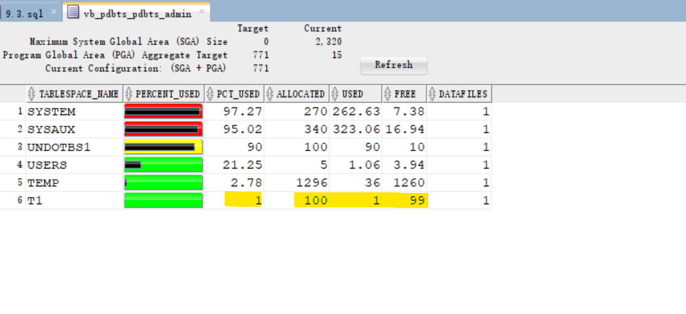

# DBA - Logical Storage: Tablespace

[Back](../../index.md)

- [DBA - Logical Storage: Tablespace](#dba---logical-storage-tablespace)
  - [`Tablespaces` Overview](#tablespaces-overview)
  - [Tablespaces in a Multitenant Environment](#tablespaces-in-a-multitenant-environment)
  - [Default Tablespace](#default-tablespace)
    - [`SYSTEM` tablespace](#system-tablespace)
    - [`SYSAUX` tablespace](#sysaux-tablespace)
    - [`TEMP` tablespace](#temp-tablespace)
    - [`UNDO` tablespace](#undo-tablespace)
    - [`USERS` tablespace](#users-tablespace)
  - [Views](#views)
    - [Lab: Query Tablespace](#lab-query-tablespace)
      - [`CDB_TABLESPACES`: Including all open pdb](#cdb_tablespaces-including-all-open-pdb)
      - [`DBA_TABLESPACES`: Current Container](#dba_tablespaces-current-container)
      - [`USER_TABLESPACES`: For current user and container](#user_tablespaces-for-current-user-and-container)
      - [`V$TABLESPACE`: including the closed database.](#vtablespace-including-the-closed-database)
  - [Create Tablespace](#create-tablespace)
    - [`CREATE TABLESPACE` clause](#create-tablespace-clause)
    - [File name and size](#file-name-and-size)
    - [Availability](#availability)
    - [Block size](#block-size)
    - [Logging](#logging)
    - [Extent Management](#extent-management)
    - [Segment management](#segment-management)
    - [Sata Segment Compression](#sata-segment-compression)
    - [Lab: Create and configure a PDB for practise](#lab-create-and-configure-a-pdb-for-practise)
      - [Create a PDB using DBCA](#create-a-pdb-using-dbca)
      - [Grant privileges to PDB's admin](#grant-privileges-to-pdbs-admin)
      - [Create a tnsname for PDB](#create-a-tnsname-for-pdb)
      - [Test Connection as PDB admin](#test-connection-as-pdb-admin)
    - [Lab: Query Current Database Properties](#lab-query-current-database-properties)
    - [Lab: Defaut Tablespace and Temp Tablespace](#lab-defaut-tablespace-and-temp-tablespace)
      - [Query Tablespace on an Object](#query-tablespace-on-an-object)
    - [Lab: Privilege on Tablespace: `UNLIMITED TABLESPACE`](#lab-privilege-on-tablespace-unlimited-tablespace)
    - [Lab: Query Tablespace's Properties](#lab-query-tablespaces-properties)
      - [View data file related to tbsp](#view-data-file-related-to-tbsp)
      - [Query info of temp file](#query-info-of-temp-file)
  - [Oracle Managed Files](#oracle-managed-files)
    - [Lab: Create TBSP](#lab-create-tbsp)
      - [Managing tbsp using SQL Developer](#managing-tbsp-using-sql-developer)
    - [Lab: Alter tbsp](#lab-alter-tbsp)
      - [Setup lab env](#setup-lab-env)
      - [Alter tbsp mode:`READ ONLY` \& `READ WRITE`](#alter-tbsp-moderead-only--read-write)
      - [Resize the Datafile](#resize-the-datafile)
      - [Add Datafile](#add-datafile)
    - [Lab: Moving and Renaming Online Data Files](#lab-moving-and-renaming-online-data-files)
      - [Setup Lab Env](#setup-lab-env-1)
      - [Rename Datafile](#rename-datafile)
      - [Move Datafile](#move-datafile)
  - [Monitoring Tablespace Space Usage](#monitoring-tablespace-space-usage)
    - [DBMS\_SERVER\_ALERT Package](#dbms_server_alert-package)
    - [Lab: `DBMS_SERVER_ALERT` Package](#lab-dbms_server_alert-package)
      - [Resolving Space Usage Issues](#resolving-space-usage-issues)
  - [Reclaiming Wasted Space](#reclaiming-wasted-space)
    - [Segment Advisor](#segment-advisor)
    - [Lab: Segment Advisor and Shrink](#lab-segment-advisor-and-shrink)
  - [Managing Resumable Space Allocation](#managing-resumable-space-allocation)
    - [Lab: Managing Resumable Space Allocation](#lab-managing-resumable-space-allocation)

---

## `Tablespaces` Overview

- `tablespace`:

  - a **logical storage container** for **segments**.

- `Segments` are **database objects**, such as tables and indexes, that **consume storage space**.
- At the **physical level**, a `tablespace` stores **data** in one or more `data files` or `temp files`.

- **Tablespaces in a Multitenant Environment**
- **Permanent Tablespaces**
- **Temporary Tablespaces**
- **Tablespace Modes**
- **Tablespace File Size**

---

## Tablespaces in a Multitenant Environment

- In a `CDB`, each `PDB` and **application root** has **its own** set of `tablespaces`.

- Every `CDB root`, `PDB`, and **application root** **must** have the `SYSTEM` and `SYSAUX` tablespaces.必须由 system 和 sysaux


> the tablespaces in a typical container.

A CDB contains the following:

- One `control file`
- One `online redo log`
- One or more undo `tablespaces`
  - Only a `common user` who has the appropriate **privileges** and whose current container is the `CDB root` can create an `undo tablespace`.
  - At any given time, a CDB is either in either of the following `undo modes`:
    - **Local undo mode**
      - By default, `Database Configuration Assistant (DBCA)` creates new CDBs with `local undo enabled`.默认模式
      - In this case, each `PDB` has its **own** `undo tablespace`. pdb 各自有其 undo
      - If a `CDB` is using `local undo mode`, then the database **automatically creates** an `undo tablespace` in **every** `PDB`.
      - `Local undo` provides advantages such as the ability to perform a **hot clone** of a PDB, and **relocate** PDBs quickly. 便于克隆
      - `local undo` provides level of **isolation** and enables **faster unplug** and **point-in-time recovery** operations. 有利于隔离, 快速拔出和时点恢复
      - A `local undo tablespace` is required for **each node** in an `Oracle Real Application Clusters (RAC)` cluster in which the `PDB` is **open**. 每个 node 有其 undo
        - e.g., if you move a PDB from a two-node cluster to a four-node cluster, and if the PDB is open in all nodes, then the database automatically creates the additional required undo tablespaces. If you move the PDB back again, then you can drop the redundant undo tablespaces.
    - **Shared undo mode**
      - In a single-instance CDB, **only one active** `undo tablespace` exists.
      - For an `Oracle RAC` CDB, **one active** `undo tablespace` exists for **every instance**.
      - All `undo tablespaces` are visible in the `data dictionaries` and related views of all containers.

---

## Default Tablespace

- Note: all default tablespaces exits in the container database and also the pluggable databases .
  - 默认 tbsp 存在 root 和 pdb

---

### `SYSTEM` tablespace

- `SYSTEM` tablespace

  - Used for **core functionality**.
  - Stores the `data dictionary` ( belong to `sys` schema).

- Oracle **create** system tablespace **automatically** when the **database is created**.

- you **cannot rename or drop** the `SYSTEM` tablespace
- **User objects** should not be created in `SYSTEM` tbsp.

---

### `SYSAUX` tablespace

- `SYSAUX` tablespace

  - an **auxiliary(辅助的) tablespace** to the `SYSTEM` tablespace.
  - It **reduces the load** on the `SYSTEM` tablespace.

- Oracle **create it automatically** when the **database is created**
- you **cannot rename or drop** the SYSAUX tablespace.

---

### `TEMP` tablespace

- `TEMP` tablespace

  - used to manage space for database **sort** and **joining** operations and for **storing global temporary** tables.

- Other **SQL operations** that might **require disk sorting** are:

  - `CREATE INDEX`,
  - `ANALYZE`,
  - `SELECT DISTINCT`,
  - `ORDER BY`,
  - `GROUP BY` ,
  - `UNION`,
  - `INTERSECT`,
  - `MINUS`

- can help in improving performance.

---

### `UNDO` tablespace

- `UNDO` tablespace

  - used to **roll back**, or **undo**, changes to the database.
  - **Recover** the database
  - Provide **read consistency**

- `Roll back` transactions when a `ROLLBACK` statement is issued

- When user makes an uncommitted update statment, the data will be stored in the `UNDO` tbsp.

---

### `USERS` tablespace

- `USERS` tablespace

  - Stores **users** objects and data
  - When making statements of create table, insert data, alter, drop, create indexes, and so on, these are done in the `USERS` tbsp.
    - e.g., when developing an application, application's object are developed in the `USERS` tbsp, or in a specified tbsp.

- every database should have a tablespace for **permanent user data** that is assigned to users. 应该有专门的 tbsp
  - Otherwise, user objects will be created in the `SYSTEM` tablespace, which is not good practice.否则在 system
- In the preconfigured database, `USERS` is designated as the **default tablespace for all new users**.默认

---

## Views

| Views              | Description                                               |
| ------------------ | --------------------------------------------------------- |
| `CDB_TABLESPACES`  | describes all tablespaces in the database.                |
| `DBA_TABLESPACES`  | describes all tablespaces in the database.                |
| `USER_TABLESPACES` | describes the tablespaces accessible to the current user. |
| `V$TABLESPACE`     | displays tablespace information from the control file.    |

---

### Lab: Query Tablespace

#### `CDB_TABLESPACES`: Including all open pdb

- Connet to root
- Query tbsp using `cdb_`
  - return only the openned tbsp

```sql
show con_name;
--CDB$ROOT
show user;
--USER is "SYS"

ALTER pluggable database all open;

SELECT
    con_id
    , tablespace_name
    , block_size
    , status
    , contents
    , logging
    , extent_management
    , segment_space_management
    , compress_for
FROM cdb_tablespaces
ORDER BY 1, 2;
```


```sql
ALTER session SET container=pdbts;
show con_name;
--PDBTS
SELECT
    con_id
    , tablespace_name
    , block_size
    , status
    , contents
    , logging
    , extent_management
    , segment_space_management
    , compress_for
FROM cdb_tablespaces
ORDER BY 1, 2;
```


---

#### `DBA_TABLESPACES`: Current Container

```sql
-- dba_tablespace
show con_name;
--CDB$ROOT
show user;
--USER is "SYS"

ALTER pluggable database all open;

SELECT
     tablespace_name
    , block_size
    , status
    , contents
    , logging
    , extent_management
    , segment_space_management
    , compress_for
FROM DBA_TABLESPACES
ORDER BY 1, 2;

ALTER session SET container=pdbts;
show con_name;
--PDBTS

SELECT
     tablespace_name
    , block_size
    , status
    , contents
    , logging
    , extent_management
    , segment_space_management
    , compress_for
FROM DBA_TABLESPACES
ORDER BY 1, 2;
```


---

#### `USER_TABLESPACES`: For current user and container

- Connect as sys
- move to pdb

```sql
-- USER_TABLESPACES
show con_name;
--CDB$ROOT
show user;
--USER is "SYS"

ALTER pluggable database all open;

SELECT
     tablespace_name
    , block_size
    , status
    , contents
    , logging
    , extent_management
    , segment_space_management
    , compress_for
FROM USER_TABLESPACES
ORDER BY 1, 2;

ALTER session SET container=pdbts;

show con_name;
--PDBTS

SELECT
     tablespace_name
    , block_size
    , status
    , contents
    , logging
    , extent_management
    , segment_space_management
    , compress_for
FROM USER_TABLESPACES
ORDER BY 1, 2;

```


---

#### `V$TABLESPACE`: including the closed database.

- Query using v$tablespace
  - return all tbsp, including the closed database.

```sql
show con_name;
--CDB$ROOT
show user;
--USER is "SYS"

ALTER pluggable database all open;

SELECT
     con_id
    , ts#
    , name
    , included_in_database_backup
FROM V$TABLESPACE
ORDER BY 1, 2;
```


```sql
ALTER session SET container=pdbts;

show con_name;
--PDBTS

SELECT
     con_id
    , ts#
    , name
    , included_in_database_backup
FROM V$TABLESPACE
ORDER BY 1, 2;
```


---

## Create Tablespace

- `Creating tablespace`

  - an **allocation of space** in the DB that can contain **schema objects**.为对象分配存储空间

- by

  - **SQL statement**`create tablespace`
  - **EM express**.

- We can create 3 types of tablespaces:

  - `Permanent tablespace`:
    - Contains **persistent** schema objects.
    - Objects in permanent tablespaces are **stored in data files**.
    - e.g., `SYSTEM`, `USERS`, `SYSAUX`
  - `Undo tablespace`:
    - a type of permanent tablespace used by Oracle Database to **manage undo data**.
  - `Temporary tablespace`:
    - Contains schema objects **only for the duration of a session**.

- **Prerequisites**:
  - the DB must be **opened**
  - must have create tablespace system **privilege**.
    - to create `sysaux` tablespace you must have `SYSDBA` system **privilege**

---

### `CREATE TABLESPACE` clause

- Document ref:
  - https://docs.oracle.com/en/database/oracle/oracle-database/23/sqlrf/CREATE-TABLESPACE.html#GUID-51F07BF5-EFAF-4910-9040-C473B86A8BF9

---

### File name and size

- **File: required**

  - A tablespace must **have at least one** `data file` or `temp file`.
  - must specify `DATAFILE` or `TEMPFILE` clause when you create a tablespace, to specify the **name** and the **location** of the `data file` or the `temp file`.

- **Size: required**

  - **must** also specify **initial file size**.
  - **can** include `AUTOEXTEND ON` clause to **automatically extend** the file when it is full.

    - need to specify **increment amount** + **max size**

- **Override Types: optional**

  - can include `bigfile` or `smallfile` clause to **override the default tablespace type**.

  - `bigfile tablespace`

    - contains **only one** `data file` or `temp file`, which can contain up to approximately **4 billion blocks**

  - `smallfile tablespace`
    - a traditional Oracle tablespace, which can contain **1022** `data files` or `temp files`, each of which can contain up to approximately **4 million blocks**.

---

### Availability

- Default Availability: `online`
- can also include the `online` or `offline` clause **to make the tablespace available or not available**
- `DBA_tablespaces`View:
  - indicates whether each tablespace online or offline .
- `online` or `offline` clause can **not be used** with `temporary tablespace` .
- `offline`:
  - the tablespace cannot be used.

---

### Block size

- The default block size: `8kB`

- Nonstandard Block Size:

  - Prerequisite:
    - the `DB_CACHE_SIZE` and at least one `DB_nK_CACHE_SIZE` parameter must be set
      - the integer specified in this clause must correspond with the setting of one `DB_nK_CACHE_SIZE` parameter setting.
  - include the `BLOCKSIZE` **to specify nonstandard** block size.

- You cannot specify nonstandard block sizes for a `temporary tablespace` or if you intend to **assign** this tablespace as the `temporary tablespace` for any users

- 基础知识会考, 但实操中少用到.

---

### Logging

- **default** and Oracle recommend: `LOGGING`.
- specify whether **creation of a database object** will be **logged** in the` redo log file` (`LOGGING`) or not (`NOLOGGING`).

  - Specify the default `logging attributes` of all tables, indexes, materialized views, materialized view logs,and partitions within the tablespace.
  - 对象的创建是否会被记录

- Valid for permanent tbsp:
  - This clause is not valid for a `temporary` or `undo` tablespace.

---

### Extent Management

- default:

  - `UNIFORM` for `temporary tablespaces`
  - `AUTOALLOCATE` for all other types of tablespaces

- can include `EXTENT MANAGEMENT` clause **to specify how the extents of the tablespace will be managed**.

- `AUTOALLOCATE`

  - specifies that the tablespace is **system managed**.
  - Users cannot specify an extent size.
  - **cannot** specify `AUTOALLOCATE` for a `temporary tablespace`.

- `UNIFORM`
  - specifies that the tablespace is **managed with uniform extents of `SIZE` bytes**.
  - The **default** `SIZE` is `1mb`.
  - All extents of `temporary tablespaces` are of **uniform size**
  - must specify `UNIFORM` in order to specify SIZE.
  - **cannot** specify `UNIFORM` for an `undo tablespace`.

---

### Segment management

- Default: `AUTO`
- to specify whether Oracle Database should **track the used and free space** in the segments in the tablespace using `free lists` or `bitmaps`.
- **not valid** for a `temporary tablespace`.
- Keywords:
  `AUTO` : to **manage the free space of segments** in the tablespace using a `bitmap`.
  `MANUAL`: to **manage the free space of segments** in the tablespace using `free lists`

---

### Sata Segment Compression

( it is disabled by default )

---

- When you create a tablespace, it is **initially** a **read/write** tablespace

- Use the `ALTER TABLESPACE` statement to take a tablespace **offline or online**, **add** data files or temp files to it, or make it a **read-only** tablespace.

- A tablespace can be in one of three different statuses or states:
  - `Read Write` default
  - `Read Only`
  - `Offline` with one of the following options:
    - Normal
    - Temporary
    - Immediate
- System tablespaces may **not** be taken **offline**.

- **Add space** to an existing tablespace by either **adding** `data files` to the tablespace or **changing the size** of an existing data file.
- Use the `DROP TABLESPACE` statement to **drop** a tablespace and its contents from the database if you no longer need its content.

---

### Lab: Create and configure a PDB for practise

#### Create a PDB using DBCA

- Create a PDB for this lab using DBCA


---

#### Grant privileges to PDB's admin

- Connect sqlplus as sys
- Grant dba privilegs to pdb admin

```sql
show con_name;
--CON_NAME
----------------------------
--CDB$ROOT

show user;
--USER is "SYS"

-- confirm pdbs has been created and open
SELECT con_id, name, open_mode from v$pdbs;
--2	PDB$SEED	READ ONLY
--3	ORCLPDB	READ WRITE
--4	PDB1	READ WRITE
--5	PDBTEST1	READ WRITE
--6	PROD1	READ WRITE
--7	PROD2	READ WRITE
--8	PDB10	READ WRITE
--9	PDBTS	READ WRITE

-- move to pdbts
ALTER session
SET container=pdbts;

show con_name;
--CON_NAME
------------------------------
--PDBTS

-- confirm admin has been created
SELECT
    username
    , account_status
    , created
    , common
    , authentication_type
    , default_tablespace
    , temporary_tablespace
    , profile
FROM cdb_users
WHERE username = UPPER('pdbts_admin');
--PDBTS_ADMIN	OPEN	14-Mar-2024	NO	PASSWORD	USERS	TEMP	DEFAULT

-- Give privileges to pdb admin
GRANT create session, dba TO pdbts_admin;

SELECT *
FROM dba_sys_privs
WHERE grantee=UPPER('pdbts_admin');
--PDBTS_ADMIN	UNLIMITED TABLESPACE	NO	NO	NO
--PDBTS_ADMIN	CREATE SESSION	NO	NO	NO
```

---

#### Create a tnsname for PDB

- Add new tns entry in tnsname.ora

```conf
PDBTS =
  (DESCRIPTION =
    (ADDRESS_LIST =
      (ADDRESS = (PROTOCOL = TCP)(HOST = test.com)(PORT = 1521))
    )
    (CONNECT_DATA =
      (SERVER = DEDICATED)
      (SERVICE_NAME = pdbts.com)
    )
  )

```


- Test using tnsping


- Login using tnsname


---

#### Test Connection as PDB admin

- Create connection in sql developer


```sql
show con_name;
--CON_NAME
--------------------------------
--PDBTS
show user;
--USER is "PDBTS_ADMIN"

-- list all privileges
SELECT * FROM session_privs;
-- 237 privileges: dba
```

---

### Lab: Query Current Database Properties

- View `DATABASE_PROPERTIES`:

  - lists permanent database properties.

- Connect as sys

```sql
show user;
--USER is "PDBTS_ADMIN"

show con_name;
--PDBTS

-- query all properties
select * from database_properties;
--PROPERTY_NAME                 PROPERTY_VALUE                      DESCRIPTION
--NO_USERID_VERIFIER_SALT_COPY  B1C8F128459F84EA6068906C6368712F    Copy of NO_USERID_VERIFIER_SALT used for administrative connections
--MAX_PDB_SNAPSHOTS             8                                   maximum number of snapshots for a given PDB
--DICTIONARY_ENDIAN_TYPE        LITTLE	                            Endian type of the data dictionary
--LOCAL_UNDO_ENABLED	        TRUE                                true if local undo is enabled
--OLS_OID_STATUS                0                                   OLS OID Status used for Label Security
--GLOBAL_DB_NAME                PDBTS.COM                           Global database name
--MAX_STRING_SIZE               STANDARD                            MAX_STRING_SIZE parameter used for dictionary metadata
--MAX_SHARED_TEMP_SIZE          UNLIMITED                           Maximum Space Usage in Shared Temporary Tablespace
--MAX_PDB_STORAGE               UNLIMITED                           Maximum Space Usage of Datafiles and Local Tempfiles in Container
--NO_USERID_VERIFIER_SALT       B1C8F128459F84EA6068906C6368712F    Per database random key for computing faux salt
--WORKLOAD_REPLAY_MODE                                              PREPARE implies external replay clients can connect; REPLAY implies workload replay is in progress
--WORKLOAD_CAPTURE_MODE                                             CAPTURE implies workload capture is in progress
--NLS_RDBMS_VERSION             19.0.0.0.0                          RDBMS version for NLS parameters
--NLS_NCHAR_CONV_EXCP           FALSE                               NLS conversion exception
--NLS_LENGTH_SEMANTICS          BYTE                                NLS length semantics
--NLS_COMP                      BINARY                              NLS comparison
--NLS_DUAL_CURRENCY             $                                   Dual currency symbol
--NLS_TIMESTAMP_TZ_FORMAT       DD-MON-RR HH.MI.SSXFF AM TZR        Timestamp with timezone format
--NLS_TIME_TZ_FORMAT            HH.MI.SSXFF AM TZR                  Time with timezone format
--NLS_TIMESTAMP_FORMAT          DD-MON-RR HH.MI.SSXFF AM            Time stamp format
--NLS_TIME_FORMAT               HH.MI.SSXFF AM                      Time format
--NLS_SORT                      BINARY                              Linguistic definition
--NLS_DATE_LANGUAGE             AMERICAN                            Date language
--NLS_DATE_FORMAT               DD-MON-RR                           Date format
--NLS_CALENDAR                  GREGORIAN                           Calendar system
--NLS_NUMERIC_CHARACTERS        .,                                  Numeric characters
--NLS_NCHAR_CHARACTERSET        AL16UTF16                           NCHAR Character set
--NLS_CHARACTERSET              AL32UTF8                            Character set
--NLS_ISO_CURRENCY              AMERICA                             ISO currency
--NLS_CURRENCY                  $                                   Local currency
--NLS_TERRITORY                 AMERICA                             Territory
--NLS_LANGUAGE                  AMERICAN                            Language
--DEFAULT_TBS_TYPE              SMALLFILE                           Default tablespace type
--DST_SECONDARY_TT_VERSION      0                                   Version of secondary timezone data file
--DST_PRIMARY_TT_VERSION        32                                  Version of primary timezone data file
--DST_UPGRADE_STATE             NONE                                State of Day Light Saving Time Upgrade
--DBTIMEZONE                    +00:00                              DB time zone
--TDE_MASTER_KEY_ID
--EXPORT_VIEWS_VERSION          8                                   Export views revision #
--Flashback Timestamp           TimeZone                            GMT	Flashback timestamp created in GMT
--DEFAULT_EDITION               ORA$BASE                            Name of the database default edition
--DEFAULT_PERMANENT_TABLESPACE  USERS                               Name of default permanent tablespace
--DEFAULT_TEMP_TABLESPACE       TEMP                                Name of default temporary tablespace
--DICT.BASE                     2                                   dictionary base tables version #

-- query db nae and tbsp
SELECT
    property_name
    , property_value
FROM database_properties
WHERE PROPERTY_NAME in ('GLOBAL_DB_NAME','DEFAULT_PERMANENT_TABLESPACE', 'DEFAULT_TEMP_TABLESPACE');
--GLOBAL_DB_NAME                PDBTS.COM
--DEFAULT_PERMANENT_TABLESPACE  USERS
--DEFAULT_TEMP_TABLESPACE       TEMP
```

---

### Lab: Defaut Tablespace and Temp Tablespace

- Connect as pdb admin

```sql

show user;
--USER is "PDBTS_ADMIN"

show con_name;
--PDBTS

-- Create a local user without specifying any tbsp
create user hrms identified by hrms;
```

- Query the DDL using package and function
  - the Default and temp tbsp are used.

```sql
-- DBMS_METADATA package
-- GET_DDL: return the DDL statement of an object
SELECT DBMS_METADATA.GET_DDL('USER','HRMS') FROM dual;
--CREATE USER "HRMS" IDENTIFIED BY VALUES 'S:4FABE661944B338CFC474F57BECE9D9055487262CC98DE2A70568173C480;T:B18CE1DD4C834D180078BC01139D28F8A5DD09E024DD4C0127AF0537FB658EF0E2975908644658D962FBC9D090EA0D10947DBC811499065B00BF694316C3FAA370ED2A549A297B4B9EC4701F3ABD1A4B'
--  DEFAULT     TABLESPACE  "USERS"
--  TEMPORARY   TABLESPACE  "TEMP"
```

---

#### Query Tablespace on an Object

```sql
SELECT
    table_name
    , owner
    , tablespace_name
FROM dba_tables
WHERE owner='HRMS';
--EMP	HRMS	USERS
```

---

### Lab: Privilege on Tablespace: `UNLIMITED TABLESPACE`

- Create a table object
  - user can create an object
- Try to insert a row
  - return error
  - because the user hrms is not granted any privilege on tbsp
  - **注意, 该处不是没有 insert 的权限, 而是 tbsp 的额度限制.**

```sql
CREATE TABLE HRMS.EMP ( EMP_ID NUMBER, ENAME VARCHAR2(100));
INSERT INTO   HRMS.EMP VALUES (1,'ford');
--Error starting at line : 86 in command -
--INSERT INTO   HRMS.EMP VALUES (1,'ford')
--Error report -
--ORA-01950: no privileges on tablespace 'USERS'
```

- Grant privilege
- insert and commit

```sql
GRANT UNLIMITED TABLESPACE TO hrms;

INSERT INTO   HRMS.EMP VALUES (1,'ford');
INSERT INTO   HRMS.EMP VALUES (2,'sami');
COMMIT;


SELECT * FROM hrms.emp;
--1	ford
--2	sami
```

---

### Lab: Query Tablespace's Properties

- use `dba_tablespaces`

- View to query tbsp info in current pdb

```sql
desc dba_tablespaces;
-- TABLESPACE_NAME           NOT NULL VARCHAR2(30)
-- BLOCK_SIZE                NOT NULL NUMBER
-- INITIAL_EXTENT                     NUMBER
-- NEXT_EXTENT                        NUMBER
-- MIN_EXTENTS               NOT NULL NUMBER
-- MAX_EXTENTS                        NUMBER
-- MAX_SIZE                           NUMBER
-- PCT_INCREASE                       NUMBER
-- MIN_EXTLEN                         NUMBER
-- STATUS                             VARCHAR2(9)
-- CONTENTS                           VARCHAR2(21)
-- LOGGING                            VARCHAR2(9)
-- FORCE_LOGGING                      VARCHAR2(3)
-- EXTENT_MANAGEMENT                  VARCHAR2(10)
-- ALLOCATION_TYPE                    VARCHAR2(9)
-- PLUGGED_IN                         VARCHAR2(3)
-- SEGMENT_SPACE_MANAGEMENT           VARCHAR2(6)
-- DEF_TAB_COMPRESSION                VARCHAR2(8)
-- RETENTION                          VARCHAR2(11)
-- BIGFILE                            VARCHAR2(3)
-- PREDICATE_EVALUATION               VARCHAR2(7)
-- ENCRYPTED                          VARCHAR2(3)
-- COMPRESS_FOR                       VARCHAR2(30)
-- DEF_INMEMORY                       VARCHAR2(8)
-- DEF_INMEMORY_PRIORITY              VARCHAR2(8)
-- DEF_INMEMORY_DISTRIBUTE            VARCHAR2(15)
-- DEF_INMEMORY_COMPRESSION           VARCHAR2(17)
-- DEF_INMEMORY_DUPLICATE             VARCHAR2(13)
-- SHARED                             VARCHAR2(13)
-- DEF_INDEX_COMPRESSION              VARCHAR2(8)
-- INDEX_COMPRESS_FOR                 VARCHAR2(13)
-- DEF_CELLMEMORY                     VARCHAR2(14)
-- DEF_INMEMORY_SERVICE               VARCHAR2(12)
-- DEF_INMEMORY_SERVICE_NAME          VARCHAR2(1000)
-- LOST_WRITE_PROTECT                 VARCHAR2(7)
-- CHUNK_TABLESPACE                   VARCHAR2(1)
```

- Query key properties

```sql
SELECT
    tablespace_name
    , block_size -- default 8k
    , status    -- online/offline
    , contents    -- types: permanent/undo/temporary
    , logging     -- log in redo log
--    , segement_space_management
    , compress_for    -- null
FROM dba_tablespaces;
-- SYSTEM        8192    ONLINE  PERMANENT   LOGGING
-- SYSAUX        8192    ONLINE  PERMANENT   LOGGING
-- UNDOTBS1      8192    ONLINE  UNDO        LOGGING
-- TEMP          8192    ONLINE  TEMPORARY   NOLOGGING
-- USERS         8192    ONLINE  PERMANENT   LOGGING
```

---

- Use `v$tablespace`
  - note: temp is not included in the backup.
  - by default:
    - tbsp is not a bigfile
    - tbsp is on flashback
    - is no encrypt

```sql
SELECT * FROM v$tablespace;
-- 0   SYSTEM    YES   NO   YES        6
-- 1   SYSAUX    YES   NO   YES        6
-- 2   UNDOTBS1  YES   NO   YES        6
-- 3   TEMP      NO    NO   YES        6
-- 5   USERS     YES   NO   YES        6
```

---

- View to query tbsp info of all pdb

```sql
CONNECT sys@orcl as sysdba

show con_name;
--CDB$ROOT
show user;
--USER is "SYS"

SELECT
    con_id
    , tablespace_name
    , block_size
    , status
    , contents
    , logging
--    , segement_space_management
    , compress_for
FROM cdb_tablespaces
ORDER BY 1;
-- 1    TEMP      8192    ONLINE    TEMPORARY    NOLOGGING
-- 1    USERS     8192    ONLINE    PERMANENT    LOGGING
-- 1    SYSTEM    8192    ONLINE    PERMANENT    LOGGING
-- 1    UNDOTBS1  8192    ONLINE    UNDO         LOGGING
-- 1    SYSAUX    8192    ONLINE    PERMANENT    LOGGING
-- 3    UNDOTBS1  8192    ONLINE    UNDO         LOGGING
-- 3    SYSAUX    8192    ONLINE    PERMANENT    LOGGING
-- 3    SYSTEM    8192    ONLINE    PERMANENT    LOGGING
-- 3    TEMP      8192    ONLINE    TEMPORARY    NOLOGGING
-- 3    BCTBS     8192    ONLINE    PERMANENT    LOGGING
-- 3    USERS     8192    ONLINE    PERMANENT    LOGGING
-- 4    SYSTEM    8192    ONLINE    PERMANENT    LOGGING
-- 4    SYSAUX    8192    ONLINE    PERMANENT    LOGGING
-- 4    UNDOTBS1  8192    ONLINE    UNDO         LOGGING
-- 4    USERS     8192    ONLINE    PERMANENT    LOGGING
-- 4    TEMP      8192    ONLINE    TEMPORARY    NOLOGGING
-- 4    BARTBS    8192    ONLINE    PERMANENT    LOGGING
-- 5    SYSTEM    8192    ONLINE    PERMANENT    LOGGING
-- 5    SYSAUX    8192    ONLINE    PERMANENT    LOGGING
-- 5    UNDOTBS1  8192    ONLINE    UNDO         LOGGING
-- 5    TEMP      8192    ONLINE    TEMPORARY    NOLOGGING
-- 5    USERS     8192    ONLINE    PERMANENT    LOGGING
-- 5    RCAT_TS   8192    ONLINE    PERMANENT    LOGGING
-- 6    SYSTEM    8192    ONLINE    PERMANENT    LOGGING
-- 6    SYSAUX    8192    ONLINE    PERMANENT    LOGGING
-- 6    UNDOTBS1  8192    ONLINE    UNDO         LOGGING
-- 6    TEMP      8192    ONLINE    TEMPORARY    NOLOGGING
-- 6    USERS     8192    ONLINE    PERMANENT    LOGGING
```

- Use `v$tablespace` in cdb

```sql
CONNECT sys@orcl as sysdba

show con_name;
--CDB$ROOT
show user;
--USER is "SYS"

SELECT * FROM v$tablespace;
-- 0   SYSTEM    YES   NO   YES        1
-- 1   SYSAUX    YES   NO   YES        1
-- 2   UNDOTBS1  YES   NO   YES        1
-- 3   TEMP      NO    NO   YES        1
-- 4   USERS     YES   NO   YES        1
-- 0   SYSTEM    YES   NO   YES        2
-- 1   SYSAUX    YES   NO   YES        2
-- 2   UNDOTBS1  YES   NO   YES        2
-- 3   TEMP      NO    NO   YES        2
-- 0   SYSTEM    YES   NO   YES        3
-- 1   SYSAUX    YES   NO   YES        3
-- 2   UNDOTBS1  YES   NO   YES        3
-- 3   TEMP      NO    NO   YES        3
-- 5   USERS     YES   NO   YES        3
-- 7   BCTBS     YES   NO   YES        3
-- 0   SYSTEM    YES   NO   YES        4
-- 1   SYSAUX    YES   NO   YES        4
-- 2   UNDOTBS1  YES   NO   YES        4
-- 3   TEMP      NO    NO   YES        4
-- 5   USERS     YES   NO   YES        4
-- 6   BARTBS    YES   NO   YES        4
-- 0   SYSTEM    YES   NO   YES        5
-- 1   SYSAUX    YES   NO   YES        5
-- 2   UNDOTBS1  YES   NO   YES        5
-- 3   TEMP      NO    NO   YES        5
-- 5   USERS     YES   NO   YES        5
-- 6   RCAT_TS   YES   NO   YES        5
-- 0   SYSTEM    YES   NO   YES        6
-- 1   SYSAUX    YES   NO   YES        6
-- 2   UNDOTBS1  YES   NO   YES        6
-- 3   TEMP      NO    NO   YES        6
-- 5   USERS     YES   NO   YES        6
```

---

#### View data file related to tbsp

- Query tbsp in current pdb
  - the autoextensible is YES
  - USER_BYTES = BYTES - metadata

```sql
SELECT * FROM dba_data_files;
--BYTES Size of the file in bytes
--BLOCKS Size of the file in Oracle blocks
--MAXBYTES Maximum file size in bytes
--MAXBLOCKS Maximum file size in blocks
--INCREMENT_BY Number of tablespace blocks used as autoextension increment
--USER_BYTES The size of the file available for user data.
--USER_BLOCKS Number of blocks which can be used by the data
--https://docs.oracle.com/database/121/REFRN/GUID-0FA17297-73ED-4B5D-B511-103993C003D3.htm#REFRN23049

-- /u01/app/oracle/oradata/ORCL/ORCL/19F2BDD5869F2196E0632500A8C06F18/datafile/o1_mf_system_m5t4xm8z_.dbf    122    SYSTEM    283115520    34560    AVAILABLE    1    YES    34359721984    4194302    1280    282066944    34432    SYSTEM    OFF
-- /u01/app/oracle/oradata/ORCL/ORCL/19F2BDD5869F2196E0632500A8C06F18/datafile/o1_mf_sysaux_m5t4xm93_.dbf    123    SYSAUX    356515840    43520    AVAILABLE    4    YES    34359721984    4194302    1280    355467264    43392    ONLINE    OFF
-- /u01/app/oracle/oradata/ORCL/ORCL/19F2BDD5869F2196E0632500A8C06F18/datafile/o1_mf_undotbs1_m5t4xm94_.dbf    124    UNDOTBS1    104857600    12800    AVAILABLE    9    YES    34359721984    4194302    640    103809024    12672    ONLINE    OFF
-- /u01/app/oracle/oradata/ORCL/ORCL/19F2BDD5869F2196E0632500A8C06F18/datafile/o1_mf_users_m5t4xt27_.dbf    125    USERS    5242880    640    AVAILABLE    125    YES    34359721984    4194302    160    4194304    512    ONLINE    OFF
```

- User `v$tablespace`

```sql
SELECT * FROM V$DATAFILE;
-- 122    9067033    02-Jun-2024    0    1    SYSTEM    READ WRITE    9069051    02-Jun-2024    0                9069036    9069051    02-Jun-2024    283115520    34560    283115520    8192    /u01/app/oracle/oradata/ORCL/ORCL/19F2BDD5869F2196E0632500A8C06F18/datafile/o1_mf_system_m5t4xm8z_.dbf    0    8192    NONE    0        0    0        NO    0    0        6
-- 123    9067039    02-Jun-2024    1    4    ONLINE    READ WRITE    9069051    02-Jun-2024    0                9069036    9069051    02-Jun-2024    356515840    43520    346030080    8192    /u01/app/oracle/oradata/ORCL/ORCL/19F2BDD5869F2196E0632500A8C06F18/datafile/o1_mf_sysaux_m5t4xm93_.dbf    0    8192    NONE    0        0    0        NO    0    0        6
-- 124    9067044    02-Jun-2024    2    9    ONLINE    READ WRITE    9069051    02-Jun-2024    0                9069036    9069051    02-Jun-2024    104857600    12800    104857600    8192    /u01/app/oracle/oradata/ORCL/ORCL/19F2BDD5869F2196E0632500A8C06F18/datafile/o1_mf_undotbs1_m5t4xm94_.dbf    0    8192    NONE    0        0    0        NO    0    0        6
-- 125    9067983    02-Jun-2024    5    125    ONLINE    READ WRITE    9069051    02-Jun-2024    0                9069036    9069051    02-Jun-2024    5242880    640    5242880    8192    /u01/app/oracle/oradata/ORCL/ORCL/19F2BDD5869F2196E0632500A8C06F18/datafile/o1_mf_users_m5t4xt27_.dbf    0    8192    NONE    0        0    0        NO    0    0        6
```

---

- query all datafile in cdb

```sql
SELECT * FROM cdb_data_files;
-- /u01/app/oracle/oradata/ORCL/users01.dbf    7    USERS    5242880    640    AVAILABLE    7    YES    34359721984    4194302    160    4194304    512    ONLINE    OFF    1
-- /u01/app/oracle/oradata/ORCL/undotbs01.dbf    4    UNDOTBS1    356515840    43520    AVAILABLE    4    YES    34359721984    4194302    640    355467264    43392    ONLINE    OFF    1
-- /u01/app/oracle/oradata/ORCL/system01.dbf    1    SYSTEM    964689920    117760    AVAILABLE    1    YES    34359721984    4194302    1280    963641344    117632    SYSTEM    OFF    1
-- /u01/app/oracle/oradata/ORCL/sysaux01.dbf    3    SYSAUX    1006632960    122880    AVAILABLE    3    YES    34359721984    4194302    1280    1005584384    122752    ONLINE    OFF    1
-- /u01/app/oracle/oradata/ORCL/pdb1/system01.dbf    13    SYSTEM    293601280    35840    AVAILABLE    1    YES    34359721984    4194302    1280    292552704    35712    SYSTEM    OFF    4
-- /u01/app/oracle/oradata/ORCL/pdb1/sysaux01.dbf    14    SYSAUX    387973120    47360    AVAILABLE    4    YES    34359721984    4194302    1280    386924544    47232    ONLINE    OFF    4
-- /u01/app/oracle/oradata/ORCL/pdb1/undotbs01.dbf    15    UNDOTBS1    131072000    16000    AVAILABLE    9    YES    34359721984    4194302    640    130023424    15872    ONLINE    OFF    4
-- /u01/app/oracle/oradata/ORCL/pdb1/users01.dbf    16    USERS    262144000    32000    AVAILABLE    16    YES    34359721984    4194302    1    261095424    31872    ONLINE    OFF    4
-- /u01/app/oracle/oradata/ORCL/pdb1/bartbs.dbf    59    BARTBS    10485760    1280    AVAILABLE    59    NO    0    0    0    9437184    1152    ONLINE    OFF    4
-- /u01/app/oracle/oradata/ORCL/ORCL/19F2BDD5869F2196E0632500A8C06F18/datafile/o1_mf_system_m5t4xm8z_.dbf    122    SYSTEM    283115520    34560    AVAILABLE    1    YES    34359721984    4194302    1280    282066944    34432    SYSTEM    OFF    6
-- /u01/app/oracle/oradata/ORCL/ORCL/19F2BDD5869F2196E0632500A8C06F18/datafile/o1_mf_sysaux_m5t4xm93_.dbf    123    SYSAUX    356515840    43520    AVAILABLE    4    YES    34359721984    4194302    1280    355467264    43392    ONLINE    OFF    6
-- /u01/app/oracle/oradata/ORCL/ORCL/19F2BDD5869F2196E0632500A8C06F18/datafile/o1_mf_undotbs1_m5t4xm94_.dbf    124    UNDOTBS1    104857600    12800    AVAILABLE    9    YES    34359721984    4194302    640    103809024    12672    ONLINE    OFF    6
-- /u01/app/oracle/oradata/ORCL/ORCL/19F2BDD5869F2196E0632500A8C06F18/datafile/o1_mf_users_m5t4xt27_.dbf    125    USERS    5242880    640    AVAILABLE    125    YES    34359721984    4194302    160    4194304    512    ONLINE    OFF    6
-- /u01/app/oracle/oradata/ORCL/orclpdb/undotbs01.dbf    100    UNDOTBS1    104857600    12800    AVAILABLE    9    YES    34359721984    4194302    640    103809024    12672    ONLINE    OFF    3
-- /u01/app/oracle/oradata/ORCL/orclpdb/sysaux01.dbf    99    SYSAUX    398458880    48640    AVAILABLE    4    YES    34359721984    4194302    1280    397410304    48512    ONLINE    OFF    3
-- /u01/app/oracle/oradata/ORCL/orclpdb/system01.dbf    98    SYSTEM    293601280    35840    AVAILABLE    1    YES    34359721984    4194302    1280    292552704    35712    SYSTEM    OFF    3
-- /u01/app/oracle/oradata/ORCL/orclpdb/users01.dbf    101    USERS    262144000    32000    AVAILABLE    101    YES    34359721984    4194302    1    261095424

```

- use `V$DATAFILE`

```sql
SELECT * FROM V$DATAFILE;
```

---

#### Query info of temp file

```sql
select * from dba_temp_files;
-- /u01/app/oracle/oradata/ORCL/ORCL/19F2BDD5869F2196E0632500A8C06F18/datafile/o1_mf_temp_m5t4xm94_.dbf	6	TEMP	37748736	4608	ONLINE	1	YES	34359721984	4194302	80	36700160	4480	SHARED

select * from v$tempfile;
-- 6	9067034	02-Jun-2024	3	1	ONLINE	READ WRITE	37748736	4608	37748736	8192	/u01/app/oracle/oradata/ORCL/ORCL/19F2BDD5869F2196E0632500A8C06F18/datafile/o1_mf_temp_m5t4xm94_.dbf	6
```

---

## Oracle Managed Files

- Oracle managed the datafile's name.

  - activated by the paramter

- When **creating** a tablespace, either a `permanent tablespace` or an `undo tablespace`, the `DATAFILE` clause is optional.
  - When including the `DATAFILE` clause, the file name is optional.
  - When **not** including the `DATAFILE` clause, then the following rules apply:
    - If the `DB_CREATE_FILE_DEST` **initialization parameter** is **specified**, then an Oracle managed data file is created in the location specified by the parameter.
    - If the `DB_CREATE_FILE_DEST` **initialization parameter** is **not** specified, then the statement creating the data file **fails**

### Lab: Create TBSP

- Try to create tbsp without datafile clause
  - raise error

```sql
SHOW USER
-- USER is "PDBTS_ADMIN"
SHOW CON_NAME
--CON_NAME
--------------------------------
--PDBTS

create tablespace t1
--Error starting at line : 5 in command -
--create tablespace t1
--
--
--/*
--Oracle Managed Files
--When creating a tablespace, either a permanent tablespace or an undo tablespace,
--the DATAFILE clause is optional.
--When you include the DATAFILE clause, the file name is optional.
--If the DATAFILE clause or file name is not provided, then the following rules
--apply:
--? If the DB_CREATE_FILE_DEST initialization parameter is specified, then an Oracle
--managed data file is created in the location specified by the parameter.
--? If the DB_CREATE_FILE_DEST initialization parameter is not specified, then the
--statement creating the data file fails
--*/
```

- Set parameter

```sql
-- query parameter
show parameter DB_CREATE_FILE_DEST

-- set parameter
alter system set DB_CREATE_FILE_DEST='/u01/app/oracle/oradata/ORCL/pdbts';

-- confirm
show parameter DB_CREATE_FILE_DEST
-- NAME                TYPE   VALUE
-- ------------------- ------ ----------------------------------
-- db_create_file_dest string /u01/app/oracle/oradata/ORCL/pdbts
```

- Create tbsp again
  - default size is 100M

```sql
create tablespace t1;
-- Tablespace T1 created.

-- check the full ddl
SELECT DBMS_METADATA.GET_DDL('TABLESPACE','T1') FROM dual;
--"CREATE TABLESPACE "T1" DATAFILE
--  SIZE 104857600
--  AUTOEXTEND ON NEXT 104857600 MAXSIZE 32767M
--  LOGGING ONLINE PERMANENT BLOCKSIZE 8192
--  EXTENT MANAGEMENT LOCAL AUTOALLOCATE DEFAULT
-- NOCOMPRESS  SEGMENT SPACE MANAGEMENT AUTO"
```

---

- Query tbsp info

```sql

select TABLESPACE_NAME,BLOCK_SIZE,STATUS,CONTENTS,LOGGING,SEGMENT_SPACE_MANAGEMENt,COMPRESS_FOR
from dba_tablespaces;
-- ...
-- T1        8192    ONLINE    PERMANENT    LOGGING    AUTO

select * from v$tablespace;
-- ...
-- 6   T1        YES   NO   YES        6

select * from dba_data_files;
-- ...
-- /u01/app/oracle/oradata/ORCL/pdbts/ORCL/19F2BDD5869F2196E0632500A8C06F18/datafile/o1_mf_t1_m5tcl666_.dbf	126	T1	104857600	12800	AVAILABLE	126	YES	34359721984	4194302	12800	103809024	12672	ONLINE	OFF
```

---

- Use TBSP
  - create a user using tbsp

```sql
-- create user using t1 as default tbsp
create user hrms2 identified by hrms2
default tablespace t1;

-- query ddl of creating user
SELECT DBMS_METADATA.GET_DDL('USER','HRMS2') FROM dual;
--"CREATE USER "HRMS2" IDENTIFIED BY VALUES 'S:2B69D50A3D726B11CB19DE8419FE0FA74E038E12268069D1728513755238;T:94B3C0B49B79FCFAFDF52C1412369134A769C30A0388EBEC1D68384E939F7EEDA0D566CB00EB2376F4BB8E21518055B3A8BE5998987B713C99B6C15AD10D3FC5BFAC163285E6CCF397646DD1568FEFF6'
--      DEFAULT TABLESPACE "T1"
--      TEMPORARY TABLESPACE "TEMP""
```

- create an table object under the new user

```sql
-- create table
CREATE TABLE HRMS2.TEST123 (N NUMBER);
```

- Query object's tbsp info

```sql
-- query object's tbsp info
select
    table_name
    , owner
    , tablespace_name
from dba_tables
where owner='HRMS2';
-- TEST123	HRMS2	T1
```

---

#### Managing tbsp using SQL Developer

- View info of all tbsp in a pdb




- View using DBA pannel
  - View > DBA


- Create new tbsp
  - Actions > Create New
  - in this case, it is not auto extensible but a fixed size.


---

- Create user using tbsp

```sql
-- create user with new tbsp
create user x1 identified by x1
default tablespace ts2;

-- grant privilege
grant create session to x1;
grant create table to x1;
grant UNLIMITED tablespace to x1;
```

- Create tb and confirm

```sql
-- creating tb
create table x1.test(n number);

-- query info of tb
select owner, table_name, tablespace_name from dba_tables
where owner='X1';
-- X1	TEST	TS2
```

- Drop tbsp

```sql
-- try to drop tbsp without INCLUDING CONTENTS;
DROP TABLESPACE TS2;
--Error starting at line : 19 in command -
--DROP TABLESPACE TS2
--Error report -
--ORA-01549: tablespace not empty, use INCLUDING CONTENTS option
--01549. 00000 -  "tablespace not empty, use INCLUDING CONTENTS option"
--*Cause:    Tried to drop a non-empty tablespace
--*Action:   To drop all the objects in the tablespace, use the INCLUDING
--           CONTENTS option

-- drop tbsp
DROP TABLESPACE TS2 INCLUDING CONTENTS;
-- note, the user and object are dropped, but the datafile will keep
--  to remove the physical data file, using INCLUDING CONTENTS AND DATAFILES;
```


> physical datafile is not removed.

---

### Lab: Alter tbsp

#### Setup lab env

```sql
show user;
-- USER is "PDBTS_ADMIN"
show con_name;
--CON_NAME
--------------------------------
--PDBTS

-- create tbsp
create tablespace t3;

-- query ddl of new tbsp
SELECT DBMS_METADATA.GET_DDL('TABLESPACE','T3') FROM dual;
--"CREATE TABLESPACE "T3" DATAFILE
--  SIZE 104857600
--  AUTOEXTEND ON NEXT 104857600 MAXSIZE 32767M
--  LOGGING ONLINE PERMANENT BLOCKSIZE 8192
--  EXTENT MANAGEMENT LOCAL AUTOALLOCATE DEFAULT
-- NOCOMPRESS  SEGMENT SPACE MANAGEMENT AUTO"

-- confirm new tbsp
select TABLESPACE_NAME,BLOCK_SIZE,STATUS,CONTENTS,LOGGING,SEGMENT_SPACE_MANAGEMENt,COMPRESS_FOR
from dba_tablespaces;
-- T3	8192	ONLINE	PERMANENT	LOGGING	AUTO

-- confirm creation of new tbsp
select * from v$tablespace;
-- 8	T3	YES	NO	YES		6

-- confirm df
select * from v$datafile;
-- 128	9148152	03-Jun-2024	8	128	ONLINE	READ WRITE	9148153	03-Jun-2024	0				0	0		104857600	12800	104857600	8192	/u01/app/oracle/oradata/ORCL/ORCL/19F2BDD5869F2196E0632500A8C06F18/datafile/o1_mf_t3_m5wb58tm_.dbf	0	8192	NONE	0		0	0		NO	0	0		6

-- create new user using tbsp
CREATE USER khaled identified by khaled
default tablespace t3;

-- gran privileges
grant create session, create table, unlimited tablespace to khaled;

-- create tb with schema
create table khaled.emp( id number, name varchar2(200));

-- insert and commit data
insert into khaled.emp values (1,'ford');
insert into khaled.emp values (2,'sara');
insert into khaled.emp values (3,'ali');
commit;
```

---

#### Alter tbsp mode:`READ ONLY` & `READ WRITE`

```sql

-- alter tbsp in read only mode
ALTER TABLESPACE T3 READ ONLY;

-- try to insert row
insert into khaled.emp values (4,'DAVE');
--Error starting at line : 53 in command -
--insert into khaled.emp values (4,'DAVE')
--Error report -
--ORA-00372: file 128 cannot be modified at this time
--ORA-01110: data file 128: '/u01/app/oracle/oradata/ORCL/ORCL/19F2BDD5869F2196E0632500A8C06F18/datafile/o1_mf_t3_m5wb58tm_.dbf'

-- alter tbsp in read write mode
ALTER TABLESPACE T3 READ WRITE;

-- insert and commit a row
insert into khaled.emp values (4,'DAVE');
COMMIT;
```

---

#### Resize the Datafile

```sql
--LET US REZIE THE DATAFIE
select bytes, name from v$datafile
WHERE ts# = 8;

-- 2 methods to increase the size:
    -- resize
    -- add df

-- resize the datafile
ALTER DATABASE DATAFILE
'/u01/app/oracle/oradata/ORCL/ORCL/19F2BDD5869F2196E0632500A8C06F18/datafile/o1_mf_t3_m5wb58tm_.dbf'
   RESIZE 200M;

-- confirm the size
select bytes
    , name
from v$datafile
WHERE ts# = 8;
-- 209715200	/u01/app/oracle/oradata/ORCL/ORCL/19F2BDD5869F2196E0632500A8C06F18/datafile/o1_mf_t3_m5wb58tm_.dbf
```

---

#### Add Datafile

```sql
--  add a new df to tbsp
ALTER TABLESPACE T3
ADD DATAFILE '/u01/app/oracle/oradata/ORCL/pdbts/ORCL/T3_02.dbf'
SIZE 10M;


select * from v$datafile
where ts#=8;
-- 128	9148152	03-Jun-2024	8	128	ONLINE	READ WRITE	9149382	03-Jun-2024	0				9149289	9149377	03-Jun-2024	209715200	25600	104857600	8192	/u01/app/oracle/oradata/ORCL/ORCL/19F2BDD5869F2196E0632500A8C06F18/datafile/o1_mf_t3_m5wb58tm_.dbf	0	8192	NONE	0		0	0		NO	0	0		6
-- 129	9149533	03-Jun-2024	8	129	ONLINE	READ WRITE	9149534	03-Jun-2024	0				0	0		10485760	1280	10485760	8192	/u01/app/oracle/oradata/ORCL/pdbts/ORCL/T3_02.dbf	0	8192	NONE	0		0	0		NO	0	0		6
```


> Now there 2 datafiles for tbsp. Oracle manages how data are written into datafiles, therefore, we cannot know which objects are written in which files.

---

### Lab: Moving and Renaming Online Data Files

#### Setup Lab Env

```sql
--Moving and Renaming Online Data Files
show user
--USER is "PDBTS_ADMIN"

show con_name
--CON_NAME
--------------------------------
--PDBTS

-- create tbsp with datafile path
create tablespace t4
DATAFILE '/u01/app/oracle/oradata/ORCL/pdbts/t4_01.dbf'
size 5m;

-- query ddl of the new tbsp
SELECT DBMS_METADATA.GET_DDL('TABLESPACE','T4') FROM dual;
--"CREATE TABLESPACE "T4" DATAFILE
--  '/u01/app/oracle/oradata/ORCL/pdbts/t4_01.dbf' SIZE 5242880
--  LOGGING ONLINE PERMANENT BLOCKSIZE 8192
--  EXTENT MANAGEMENT LOCAL AUTOALLOCATE DEFAULT
-- NOCOMPRESS  SEGMENT SPACE MANAGEMENT AUTO"
```

---

#### Rename Datafile

```sql
-- rename datafile
ALTER DATABASE MOVE DATAFILE
'/u01/app/oracle/oradata/ORCL/pdbts/t4_01.dbf'
TO
'/u01/app/oracle/oradata/ORCL/pdbts/t4_001.dbf';
```


---

#### Move Datafile

```sql
--NOW LET MOVE t4_001.dbf TO ANOTHER LOCATION
--CREATE FOLDER TEST IN /u01/app/oracle/oradata/ORCL/pdbts/
-- mkdir /u01/app/oracle/oradata/ORCL/pdbts/test

ALTER DATABASE MOVE DATAFILE
'/u01/app/oracle/oradata/ORCL/pdbts/t4_001.dbf'
TO
'/u01/app/oracle/oradata/ORCL/pdbts/test/t4_001.dbf';
```


---

- **Queries**, `DML`, and `DDL` operations can be performed while the data file is being moved, for example:

  1. `SELECT` statements against tables and partitions
  2. **Creation** of `tables` and `indexes`
  3. **Rebuilding** of indexes

- If objects are compressed while the data file is moved, the compression remains the same.
- You do **not** have to **shut down** the database or take the `data file` **offline** while you move a data file to another location, disk, or storage system. 移动时不需要关机或离线
- You **can omit** the `TO` clause only when an Oracle-managed file is used.
  - In this case, the `DB_CREATE_FILE_DEST` initialization parameter should be set to indicate the new location. 只在使用参数情况下可以忽略 TO 语句
- If the `REUSE` option is specified, the `existing file` is **overwritten**.
  - The `REUSE` keyword indicates the **new file should be created** even if it already exists.强制新建, 原有的会被覆盖
- If the `KEEP` clause is specified, the **old file will be kept** after the move operation. 旧文件
  - The `KEEP` clause is **not allowed** if the source file is an **Oracle-managed file**.不能使用情况

---

## Monitoring Tablespace Space Usage

- The database server **tracks space utilization** while performing regular space management activities.
  - This information is aggregated by the `MMON` process.
- An **alert is triggered** when the **threshold** for a tablespace has been reached or cleared.
- The `DBMS_SERVER_ALERT` package enables you to **configure** the Oracle Database server to issue an alert when a threshold for a specified server metric has been violated.
- You can configure both **warning** and **critical thresholds** for a large number of predefined metrics.
- in this course we will focus on `tablespace_pct_full` metric
- If a **warning threshold** is reached, the server generates a severity **level 5 alert**.
- If a **critical threshold** is reached, the server generates a severity **level 1 alert**.


- `Read-only` and `offline` tablespaces:
  - **Do not** set up alerts.
- `Temporary` tablespace:
  - **Threshold** corresponds to **space currently used by sessions**.
- `Undo` tablespace:
  - **Threshold** corresponds to **space used by active and unexpired extents**.
- **Auto-extensible** files:
  - **Threshold** is based on the **maximum file size**.

---

### DBMS_SERVER_ALERT Package

Example: Using `DBMS_SERVER_ALERT.SET_THRESHOLD`

- ref: https://docs.oracle.com/database/121/ARPLS/d_server_alert.htm#ARPLS68004

- We have tablespace called TBSALERT
- We need to set warning at 55%
- We need to set critical at 70%

```sql
--  a pl/sql
begin
  DBMS_SERVER_ALERT.SET_THRESHOLD(
    -- set the threshold for a tbsp percentage full
    metrics_id => dbms_server_alert.tablespace_pct_full,
    -- set warning
    warning_operator =>DBMS_SERVER_ALERT.OPERATOR_GE,
    warning_value => '55',
    -- set critical
    critical_operator =>DBMS_SERVER_ALERT.OPERATOR_GE,
    critical_value => '70',
    observation_period => 1,
    consecutive_occurrences => 1,
    -- specify instance name
    instance_name => 'orcl',
    -- set object type is tbsp
    object_type =>DBMS_SERVER_ALERT.OBJECT_TYPE_TABLESPACE,
    -- set the object name
    object_name => 'TBSALERT');
end;
-- OPERATOR_GE:  A metric value greater than or equal to the threshold value is considered a violation.
```

---

### Lab: `DBMS_SERVER_ALERT` Package

- Goal:
  - set a thehold for tbsp

---

- setup env

```sql
show user;
-- USER is "PDBTS_ADMIN"
show con_name;
--CON_NAME
--------------------------------
--PDBTS

-- create tbsp without auto extend option
CREATE TABLESPACE tbsalert
DATAFILE '/u01/app/oracle/oradata/ORCL/pdbts/tbsalert.dbf'
SIZE 50M
LOGGING EXTENT MANAGEMENT LOCAL
SEGMENT SPACE MANAGEMENT AUTO;
```

---

- Query size

```sql
-- query the size of df
select * from dba_data_files
where TABLESPACE_NAME='TBSALERT';
--bytes: 52428800

-- query free space
select * from dba_free_space
where TABLESPACE_NAME='TBSALERT';--51380224
-- TBSALERT	132	128	51380224	6272	132

-- query tbsp usage
SELECT
    df.tablespace_name tablespace,
    fs.bytes free,
    df.bytes,
    fs.bytes*100/ df.bytes PCT_FREE
FROM dba_data_files df ,dba_free_space fs
WHERE df.tablespace_name = fs.tablespace_name
AND df.tablespace_name = 'TBSALERT';
-- TBSALERT	51380224	52428800	98
```

- Setup threhold

```sql
-- setup threhold
begin
    DBMS_SERVER_ALERT.SET_THRESHOLD(
        metrics_id => dbms_server_alert.tablespace_pct_full,
        warning_operator =>DBMS_SERVER_ALERT.OPERATOR_GE,
        warning_value => '55',
        critical_operator =>DBMS_SERVER_ALERT.OPERATOR_GE,
        critical_value => '70',
        observation_period => 1,
        consecutive_occurrences => 1,
        instance_name => 'orcl',
        object_type =>DBMS_SERVER_ALERT.OBJECT_TYPE_TABLESPACE,
        object_name => 'TBSALERT'
    );
end;
/
-- verify threhold
SELECT warning_value, critical_value
FROM dba_thresholds
WHERE object_name='TBSALERT';
-- 55	70

-- query alerts
SELECT * FROM dba_outstanding_alerts
 WHERE object_name='TBSALERT';
 -- return no row
```

- Create tb and insert data to consume space

```sql
-- create tb in tbsp
create table test100
(
    emp_id number,
    name varchar2(100)
)
tablespace TBSALERT;

 -- insert data
begin
    for i in 1..1000000
    loop
        insert into test100 values ( i, 'any dummy name' );
    end loop;
    commit;
end;
/
-- query tbsp usage
SELECT
    df.tablespace_name tablespace,
    fs.bytes free,
    df.bytes,
    fs.bytes*100/ df.bytes PCT_FREE
FROM dba_data_files df ,dba_free_space fs
WHERE df.tablespace_name = fs.tablespace_name
AND df.tablespace_name = 'TBSALERT';
-- TBSALERT	22020096	52428800	42
```

- Query alert

```sql
-- Wait a few minutes. 10-15
-- Wait until the mmon update the warning

-- query alerts
SELECT reason, message_type , message_level
FROM dba_outstanding_alerts
WHERE object_name='TBSALERT';
--Tablespace [TBSALERT@PDBTS] is [58 percent] full	Warning	5
```

---

#### Resolving Space Usage Issues


- Resolve space usage issue by:
  - Adding or resizing datafiles
  - Setting `AUTOEXTEND` to `ON`
  - Shrinking objects
  - Reducing `UNDO_RETENTION`
- Check for long-running queries in temporary tbsp.

---

## Reclaiming Wasted Space

- Over time, updates and deletes on objects within a tablespace can create pockets of **empty space** that individually are **not large enough to be reused for new data**.

  - This type of empty space is referred to as `fragmented free space`.

- Objects with `fragmented free space` can result in **much wasted space**, and can impact database **performance**.

  - because Oracle need to scan all these free spaces.

- The preferred way to **defragment and reclaim this space** is to perform an `online segment shrink`

- 2 Steps:
  - 1. `ALTER TABLE tb_name SHRINK SPACE COMPACT;`
  - 2. `ALTER TABLE tb_name SHRINK SPACE;`


> - a segment of tb employees has 7 blocks.
>   - 5 blocks with data.
>     - 2 blocks full
>     - 3 blocks with wasted space.
>   - 2 blocks unused
> - `High Water Mark`:
>   - used to flag the segment that insert the new data after the high water mark.
>   - the new data cannot be inserted into the first 5 blocks and must be inserted into the new block.
>     - the empty space in the used block cannot be used.
> - `ALTER TABLE tb_name SHRINK SPACE COMPACT;`:
>   - move the old data from used block to the third block until full.
>   - not adjust the water mark.
>   - DML operations and queries can be issued during the compaction.
>   - recommended in the working hours.
> - `ALTER TABLE tb_name SHRINK SPACE;`:
>   - adjust the high water mark
>   - DML operations are blocked when the HWM is adjusted.

- Because a shrink operation may cause `ROWIDs` to change in heap-organized segments, you must **enable row movement** on the corresponding segment before executing a shrink operation on that segment.
  - Row movement by **default** is **disabled** at segment level.

---

### Segment Advisor

- We use the `Segment Advisor` to identify segments that would benefit from `online segment shrink`.用来评估

  - Only segments in **locally managed tablespaces** with `automatic segment space management (ASSM)` are eligible.
  - `Segment Advisor` can be **automatic** or **manual**.
  - Running the `Segment Advisor` Manually with PL/SQL using package `DBMS_ADVISOR`

- ref:

  - https://docs.oracle.com/database/121/ARPLS/d_advis.htm#ARPLS350

- `DBMS_ADVISOR` package procedures relevant to the `Segment Advisor`:
  - 1. `CREATE_TASK`
  - 2. `CREATE_OBJECT`
  - 3. `SET_TASK_PARAMETER`
  - 4. `EXECUTE_TASK`

---

### Lab: Segment Advisor and Shrink

- Setup Env

```sql
show user;
--USER is "PDBTS_ADMIN"
show con_name;
--CON_NAME
--------------------------------
--PDBTS

-- remove existing tbsp
drop TABLESPACE tbsalert INCLUDING CONTENTS and DATAFILES;
```

- Create tbsp and query usage
  - using `EXTENT MANAGEMENT LOCAL` and `SEGMENT SPACE MANAGEMENT AUTO` to enable ASSM

```sql
-- create tbsp without autoextend
CREATE TABLESPACE tbsalert
DATAFILE '/u01/app/oracle/oradata/ORCL/pdbts/tbsalert.dbf'
SIZE 50M
LOGGING EXTENT MANAGEMENT LOCAL
SEGMENT SPACE MANAGEMENT AUTO;

-- query usage
SELECT
    df.tablespace_name tablespace,
    fs.bytes free,
    df.bytes,
    fs.bytes*100/ df.bytes PCT_FREE
FROM dba_data_files df ,dba_free_space fs
WHERE df.tablespace_name = fs.tablespace_name
AND df.tablespace_name = 'TBSALERT';
-- TBSALERT	51380224	52428800	98
```

- Create tb and insert

```sql
-- create tb in tbsp
create table test100
(
    emp_id number,
    name varchar2(100)
)
tablespace TBSALERT;

-- insert data
begin
    for i in 1..1000000
    loop
        insert into test100
        values(i,'any dummy name');
    end loop;
    commit;
end;
/

-- query usage after inserting
SELECT
    df.tablespace_name tablespace,
    fs.bytes free,
    df.bytes,
    fs.bytes*100/ df.bytes PCT_FREE
FROM dba_data_files df ,dba_free_space fs
WHERE df.tablespace_name = fs.tablespace_name
AND df.tablespace_name = 'TBSALERT';
-- TBSALERT	22020096	52428800	42
```

> - the free space is 42%

---

- Remove all data and query usage
  - usage did not change
  - it only remove the data from the block
  - the blocks are still available for future insert because these blocks are bfore the current HWM.

```sql
-- delete all data
delete from test100;
commit;

-- query after deletion
SELECT
    df.tablespace_name tablespace,
    fs.bytes free,
    df.bytes,
    fs.bytes*100/ df.bytes PCT_FREE
FROM dba_data_files df ,dba_free_space fs
WHERE df.tablespace_name = fs.tablespace_name
AND df.tablespace_name = 'TBSALERT';
-- TBSALERT	22020096	52428800	42
```

- Create segment Advisor Task
  - `select * from DBA_ADVISOR_DEFINITIONS;`: query all advisors.

```sql
--Create a Segment Advisor Task
DECLARE
    -- task name
    tname VARCHAR2(128) := 'my_seg_task3';
    -- task description
    tname_desc VARCHAR2(128) := 'Get shrink advice for segments in TBSALERT';
    task_id NUMBER;
    object_id NUMBER;
    objectname VARCHAR2(100);
    objecttype VARCHAR2(100);
BEGIN
    -- create task
    dbms_advisor.create_task('Segment Advisor', task_id,tname,tname_desc,NULL);---select * from DBA_ADVISOR_DEFINITIONS
    -- create object
    dbms_advisor.create_object(tname,'TABLESPACE','TBSALERT',' ',' ',NULL, ' ',object_id);
    -- set parameter
    dbms_advisor.set_task_parameter(tname,'RECOMMEND_ALL','TRUE');
END;
/

--Execute the task to get the advice from Oracle.
DECLARE
    tname VARCHAR2(128) := 'my_seg_task3';
BEGIN
    dbms_advisor.EXECUTE_TASK(tname);
END;
/

-- verify advisor task is completed
SELECT
    owner
    , task_name
    , DESCRIPTION
    , advisor_name
    , created
    , status
FROM dba_advisor_tasks
WHERE TASK_NAME='my_seg_task3';
-- PDBTS_ADMIN	my_seg_task3	Get shrink advice for segments in TBSALERT	Segment Advisor	08-Jun-2024	COMPLETED

-- query the advice based on the task.
SELECT attr1, attr2, message
FROM dba_advisor_findings f, dba_advisor_objects o
WHERE f.task_name = o.task_name
AND f.object_id = o.object_id
AND f.task_name = 'my_seg_task3';
-- PDBTS_ADMIN	TEST100	Enable row movement of the table PDBTS_ADMIN.TEST100 and perform shrink, estimated savings is 24140078 bytes.
```

> - message indicates it should enable row movement and perform shrink.
> - show estimated saving as well.

---

- Execute shrink space
  - query usage and the usage decreases.

```sql
-- enable row movement
alter table test100
enable row movement;

-- shrink space
ALTER TABLE test100
SHRINK SPACE;

-- query usage
SELECT
    df.tablespace_name tablespace,
    fs.bytes free,
    df.bytes,
    fs.bytes*100/ df.bytes PCT_FREE
FROM dba_data_files df ,dba_free_space fs
WHERE df.tablespace_name = fs.tablespace_name
AND df.tablespace_name = 'TBSALERT';
-- TBSALERT	51314688	52428800	97.875
```

---

## Managing Resumable Space Allocation

- A resumable statement:

  - 1. Enables you to suspend large operations instead of receiving an error
  - 2. Gives you a chance to fix the problem while the operation is suspended, rather than starting over
  - 3. Is suspended for the following conditions:
    - Out of space
    - Maximum extents reached
    - Space quota exceeded
  - 4. Can be suspended and resumed multiple times

- A statement executes in `resumable mode` only if its session has been enabled by one of the following actions:

  - 1. The `RESUMABLE_TIMEOUT` initialization parameter is set to a nonzero value.
    - By default: `0`
  - 2. An `ALTER SESSION ENABLE RESUMABLE` statement is issued
    - If Oracle server runs a script that needs more size from the data file, it would not give the error but just suspend the statement until the issue is fix.

- Suspend duration:

  - the script will be suspend 7,200 seconds=2 hours.(default)
  - you can do `ALTER SESSION ENABLE RESUMABLE TIMEOUT 3600`
  - During suspention, oracle will not give us any message that this script has been suspend.
    - but we can see it as DBA.

- Solution:
  - open new session and increase size.

---

### Lab: Managing Resumable Space Allocation

- Setup Env

```sql
show user;
-- USER is "PDBTS_ADMIN"
show con_name;
--CON_NAME
--------------------------------
--PDBTS

-- drop tbsp
drop TABLESPACE tbsalert
INCLUDING CONTENTS and DATAFILES;

-- create tbsp with fixed size enable ASSM
CREATE TABLESPACE tbsalert
DATAFILE '/u01/app/oracle/oradata/ORCL/pdbts/tbsalert.dbf'
SIZE 10M
LOGGING EXTENT MANAGEMENT LOCAL
SEGMENT SPACE MANAGEMENT AUTO;

-- create tb in tbsp
create table test100
(
    emp_id number,
    name varchar2(100)
)
tablespace TBSALERT;
```

- Insert a large amount of data
  - fails due to not enough size

```sql
-- insert data
-- fails
begin
    for i in 1..400000
    loop
        insert into test100 values ( i, 'any dummy name' );
        commit;
    end loop;
end;
--Error report -
--ORA-01653: unable to extend table PDBTS_ADMIN.TEST100 by 128 in tablespace TBSALERT
--ORA-06512: at line 4
--01653. 00000 -  "unable to extend table %s.%s by %s in tablespace %s"
--*Cause:    Failed to allocate an extent of the required number of blocks for
--           a table segment in the tablespace indicated.
--*Action:   Use ALTER TABLESPACE ADD DATAFILE statement to add one or more
--           files to the tablespace indicated.
/

-- query tb
select * from test100;
-- return 326941 rows
```

---

- Enable resumable and insert data again

```sql

-- enable resumable
ALTER SESSION
ENABLE RESUMABLE;

-- truncate tb
truncate table test100;

-- insert data
begin
    for i in 1..400000
    loop
        insert into test100 values ( i, 'any dummy name' );
        commit;
    end loop;
end;
/
-- plsql statements will be suspended due to limit quota, and it will not give any error.
```

- Increase the size in a new session
  - open another sql developer
  - `DBA_RESUMABLE`:
    - lists all resumable statements executed in the system.

```sql
select * from dba_resumable;
-- 105	53	1			SUSPENDED	7200	06/08/24 20:43:52	06/08/24 20:43:52		User PDBTS_ADMIN(105), Session 53, Instance 1	INSERT INTO TEST100 VALUES ( :B1 , 'any dummy name' )	1653	PDBTS_ADMIN	TEST100	128	TBSALERT		ORA-01653: unable to extend table PDBTS_ADMIN.TEST100 by 128 in tablespace TBSALERT
-- ORA-01653: unable to extend table PDBTS_ADMIN.TEST100 by 128 in tablespace TBSALERT

-- query whether autoextensible
SELECT file_name, autoextensible
FROM dba_data_files
WHERE tablespace_name='TBSALERT';
-- /u01/app/oracle/oradata/ORCL/pdbts/tbsalert.dbf	NO

-- alter df to enable autoextensible
ALTER DATABASE DATAFILE
'/u01/app/oracle/oradata/ORCL/pdbts/tbsalert.dbf'
AUTOEXTEND ON MAXSIZE unlimited;

-- verify
SELECT file_name, autoextensible FROM dba_data_files WHERE
tablespace_name='TBSALERT';

--Note the status is normal
select * from dba_resumable;
-- 105	53	1			NORMAL	7200			06/08/24 22:26:39	User PDBTS_ADMIN(105), Session 53, Instance 1		0

select count(1) from test100;
-- 400000
```

> - the new session enable the tbsp autoextensible, the suspended plsql resumed and completed.
> - Finally, 400000 rows are insert into the tb.

---

[TOP](#dba---logical-storage-tablespace)
