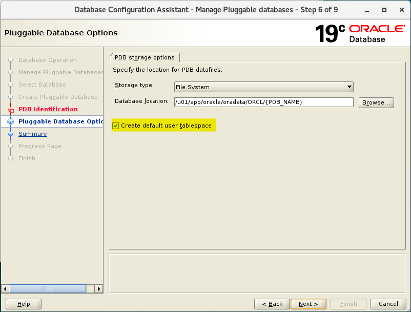

# DBA - Logical Storage: Tablespace

[Back](../../index.md)

- [DBA - Logical Storage: Tablespace](#dba---logical-storage-tablespace)
  - [Views](#views)
  - [Lab: Query Tablespace](#lab-query-tablespace)
    - [`CDB_TABLESPACES`: Including all open pdb](#cdb_tablespaces-including-all-open-pdb)
    - [`DBA_TABLESPACES`: Current Container](#dba_tablespaces-current-container)
    - [`USER_TABLESPACES`: For current user and container](#user_tablespaces-for-current-user-and-container)
    - [`V$TABLESPACE`: including the closed database.](#vtablespace-including-the-closed-database)
  - [Default Tablespace](#default-tablespace)
    - [`SYSTEM` tablespace](#system-tablespace)
    - [`SYSAUX` tablespace](#sysaux-tablespace)
    - [`TEMP` tablespace](#temp-tablespace)
    - [`UNDO` tablespace](#undo-tablespace)
    - [`USERS` tablespace](#users-tablespace)
  - [Create Tablespace](#create-tablespace)
    - [`CREATE TABLESPACE` clause](#create-tablespace-clause)
    - [File name and size](#file-name-and-size)
    - [Availability](#availability)
    - [Block size](#block-size)
    - [Logging](#logging)
    - [Extent Management](#extent-management)
    - [Segment management](#segment-management)
    - [Sata Segment Compression](#sata-segment-compression)
  - [Lab: Create and configure a PDB for practise](#lab-create-and-configure-a-pdb-for-practise)
    - [Create a PDB using DBCA](#create-a-pdb-using-dbca)
    - [Grant privileges to PDB's admin](#grant-privileges-to-pdbs-admin)
    - [Create a tnsname for PDB](#create-a-tnsname-for-pdb)
    - [Test Connection as PDB admin](#test-connection-as-pdb-admin)
  - [Lab: Query Current Database Properties](#lab-query-current-database-properties)
  - [Lab: Defaut Tablespace and Temp Tablespace](#lab-defaut-tablespace-and-temp-tablespace)
  - [Lab: Privilege on Tablespace](#lab-privilege-on-tablespace)
  - [Lab: Query Tablespace on an Object](#lab-query-tablespace-on-an-object)
  - [Lab: Data File and Temp File](#lab-data-file-and-temp-file)

---

## Views

| Views              | Description                                               |
| ------------------ | --------------------------------------------------------- |
| `CDB_TABLESPACES`  | describes all tablespaces in the database.                |
| `DBA_TABLESPACES`  | describes all tablespaces in the database.                |
| `USER_TABLESPACES` | describes the tablespaces accessible to the current user. |
| `V$TABLESPACE`     | displays tablespace information from the control file.    |

---

## Lab: Query Tablespace

### `CDB_TABLESPACES`: Including all open pdb

- Connet to root
- Query tbsp using `cdb_`
  - return only the openned tbsp

```sql
show con_name;
--CDB$ROOT
show user;
--USER is "SYS"

ALTER pluggable database all open;

SELECT
    con_id
    , tablespace_name
    , block_size
    , status
    , contents
    , logging
    , extent_management
    , segment_space_management
    , compress_for
FROM cdb_tablespaces
ORDER BY 1, 2;
```


```sql
ALTER session SET container=pdbts;
show con_name;
--PDBTS
SELECT
    con_id
    , tablespace_name
    , block_size
    , status
    , contents
    , logging
    , extent_management
    , segment_space_management
    , compress_for
FROM cdb_tablespaces
ORDER BY 1, 2;
```


---

### `DBA_TABLESPACES`: Current Container

```sql
-- dba_tablespace
show con_name;
--CDB$ROOT
show user;
--USER is "SYS"

ALTER pluggable database all open;

SELECT
     tablespace_name
    , block_size
    , status
    , contents
    , logging
    , extent_management
    , segment_space_management
    , compress_for
FROM DBA_TABLESPACES
ORDER BY 1, 2;

ALTER session SET container=pdbts;
show con_name;
--PDBTS

SELECT
     tablespace_name
    , block_size
    , status
    , contents
    , logging
    , extent_management
    , segment_space_management
    , compress_for
FROM DBA_TABLESPACES
ORDER BY 1, 2;
```


---

### `USER_TABLESPACES`: For current user and container

- Connect as sys
- move to pdb

```sql
-- USER_TABLESPACES
show con_name;
--CDB$ROOT
show user;
--USER is "SYS"

ALTER pluggable database all open;

SELECT
     tablespace_name
    , block_size
    , status
    , contents
    , logging
    , extent_management
    , segment_space_management
    , compress_for
FROM USER_TABLESPACES
ORDER BY 1, 2;

ALTER session SET container=pdbts;

show con_name;
--PDBTS

SELECT
     tablespace_name
    , block_size
    , status
    , contents
    , logging
    , extent_management
    , segment_space_management
    , compress_for
FROM USER_TABLESPACES
ORDER BY 1, 2;

```


---

### `V$TABLESPACE`: including the closed database.

- Query using v$tablespace
  - return all tbsp, including the closed database.

```sql
show con_name;
--CDB$ROOT
show user;
--USER is "SYS"

ALTER pluggable database all open;

SELECT
     con_id
    , ts#
    , name
    , included_in_database_backup
FROM V$TABLESPACE
ORDER BY 1, 2;
```


```sql
ALTER session SET container=pdbts;

show con_name;
--PDBTS

SELECT
     con_id
    , ts#
    , name
    , included_in_database_backup
FROM V$TABLESPACE
ORDER BY 1, 2;
```


---

## Default Tablespace

- Note: all default tablespaces exits in the container database and also the pluggable databases .
  - 默认 tbsp 存在 root 和 pdb

---

### `SYSTEM` tablespace

- `SYSTEM` tablespace

  - Used for **core functionality**.
  - Stores the `data dictionary` ( belong to `sys` schema).

- Oracle **create** system tablespace **automatically** when the **database is created**.

- you **cannot rename or drop** the `SYSTEM` tablespace
- **User objects** should not be created in `SYSTEM` tbsp.

---

### `SYSAUX` tablespace

- `SYSAUX` tablespace

  - an **auxiliary(辅助的) tablespace** to the `SYSTEM` tablespace.
  - It **reduces the load** on the `SYSTEM` tablespace.

- Oracle **create it automatically** when the **database is created**
- you **cannot rename or drop** the SYSAUX tablespace.

---

### `TEMP` tablespace

- `TEMP` tablespace

  - used to manage space for database **sort** and **joining** operations and for **storing global temporary** tables.

- Other **SQL operations** that might **require disk sorting** are:

  - `CREATE INDEX`,
  - `ANALYZE`,
  - `SELECT DISTINCT`,
  - `ORDER BY`,
  - `GROUP BY` ,
  - `UNION`,
  - `INTERSECT`,
  - `MINUS`

- can help in improving performance.

---

### `UNDO` tablespace

- `UNDO` tablespace

  - used to **roll back**, or **undo**, changes to the database.
  - **Recover** the database
  - Provide **read consistency**

- `Roll back` transactions when a `ROLLBACK` statement is issued

- When user makes an uncommitted update statment, the data will be stored in the `UNDO` tbsp.

---

### `USERS` tablespace

- `USERS` tablespace

  - Stores **users** objects and data
  - When making statements of create table, insert data, alter, drop, create indexes, and so on, these are done in the `USERS` tbsp.
    - e.g., when developing an application, application's object are developed in the `USERS` tbsp, or in a specified tbsp.

- every database should have a tablespace for **permanent user data** that is assigned to users. 应该有专门的 tbsp
  - Otherwise, user objects will be created in the `SYSTEM` tablespace, which is not good practice.否则在 system
- In the preconfigured database, `USERS` is designated as the **default tablespace for all new users**.默认

---

## Create Tablespace

- `Creating tablespace`

  - an **allocation of space** in the DB that can contain **schema objects**.为对象分配存储空间

- by

  - **SQL statement**`create tablespace`
  - **EM express**.

- We can create 3 types of tablespaces:

  - `Permanent tablespace`:
    - Contains **persistent** schema objects.
    - Objects in permanent tablespaces are **stored in data files**.
    - e.g., `SYSTEM`, `USERS`, `SYSAUX`
  - `Undo tablespace`:
    - a type of permanent tablespace used by Oracle Database to **manage undo data**.
  - `Temporary tablespace`:
    - Contains schema objects **only for the duration of a session**.

- **Prerequisites**:
  - the DB must be **opened**
  - must have create tablespace system **privilege**.
    - to create `sysaux` tablespace you must have `SYSDBA` system **privilege**

---

### `CREATE TABLESPACE` clause

- Document ref:
  - https://docs.oracle.com/en/database/oracle/oracle-database/23/sqlrf/CREATE-TABLESPACE.html#GUID-51F07BF5-EFAF-4910-9040-C473B86A8BF9

---

### File name and size

- **File: required**

  - A tablespace must **have at least one** `data file` or `temp file`.
  - must specify `DATAFILE` or `TEMPFILE` clause when you create a tablespace, to specify the **name** and the **location** of the `data file` or the `temp file`.

- **Size: required**

  - **must** also specify **initial file size**.
  - **can** include `AUTOEXTEND ON` clause to **automatically extend** the file when it is full.

    - need to specify **increment amount** + **max size**

- **Override Types: optional**

  - can include `bigfile` or `smallfile` clause to **override the default tablespace type**.

  - `bigfile tablespace`

    - contains **only one** `data file` or `temp file`, which can contain up to approximately **4 billion blocks**

  - `smallfile tablespace`
    - a traditional Oracle tablespace, which can contain **1022** `data files` or `temp files`, each of which can contain up to approximately **4 million blocks**.

---

### Availability

- Default Availability: `online`
- can also include the `online` or `offline` clause **to make the tablespace available or not available**
- View:
  - `DBA_tablespaces`, indicates whether each tablespace online or offline .
- `online` or `offline` clause can **not be used** with `temporary tablespace` .
- `offline`:
  - the tablespace cannot be used.

---

### Block size

- The default block size: `8kB`

- Nonstandard Block Size:

  - Prerequisite:
    - the `DB_CACHE_SIZE` and at least one `DB_nK_CACHE_SIZE` parameter must be set
      - the integer specified in this clause must correspond with the setting of one `DB_nK_CACHE_SIZE` parameter setting.
  - include the `BLOCKSIZE` **to specify nonstandard** block size.

- You cannot specify nonstandard block sizes for a `temporary tablespace` or if you intend to **assign** this tablespace as the `temporary tablespace` for any users

- 基础知识会考, 但实操中少用到.

---

### Logging

- **default** and Oracle recommend: `LOGGING`.
- specify whether **creation of a database object** will be **logged** in the` redo log file` (`LOGGING`) or not (`NOLOGGING`).

  - Specify the default `logging attributes` of all tables, indexes, materialized views, materialized view logs,and partitions within the tablespace.
  - 对象的创建是否会被记录

- This clause is not valid for a `temporary` or `undo` tablespace.

---

### Extent Management

- default:

  - `UNIFORM` for `temporary tablespaces`
  - `AUTOALLOCATE` for all other types of tablespaces

- can include `EXTENT MANAGEMENT` clause **to specify how the extents of the tablespace will be managed**.

- `AUTOALLOCATE`

  - specifies that the tablespace is **system managed**.
  - Users cannot specify an extent size.
  - **cannot** specify `AUTOALLOCATE` for a `temporary tablespace`.

- `UNIFORM`
  - specifies that the tablespace is **managed with uniform extents of `SIZE` bytes**.
  - The **default** `SIZE` is `1mb`.
  - All extents of `temporary tablespaces` are of **uniform size**
  - must specify `UNIFORM` in order to specify SIZE.
  - **cannot** specify `UNIFORM` for an `undo tablespace`.

---

### Segment management

- Default: `AUTO`
- to specify whether Oracle Database should **track the used and free space** in the segments in the tablespace using `free lists` or `bitmaps`.
- **not valid** for a `temporary tablespace`.
- Keywords:
  `AUTO` : to **manage the free space of segments** in the tablespace using a `bitmap`.
  `MANUAL`: to **manage the free space of segments** in the tablespace using `free lists`

---

### Sata Segment Compression

( it is disabled by default )

---

## Lab: Create and configure a PDB for practise

### Create a PDB using DBCA

- Create a PDB for this lab using DBCA




---

### Grant privileges to PDB's admin

- Connect sqlplus as sys
- Grant dba privilegs to pdb admin

```sql
show con_name;
--CON_NAME
----------------------------
--CDB$ROOT

show user;
--USER is "SYS"

-- confirm pdbs has been created and open
SELECT con_id, name, open_mode from v$pdbs;
--2	PDB$SEED	READ ONLY
--3	ORCLPDB	READ WRITE
--4	PDB1	READ WRITE
--5	PDBTEST1	READ WRITE
--6	PROD1	READ WRITE
--7	PROD2	READ WRITE
--8	PDB10	READ WRITE
--9	PDBTS	READ WRITE

-- move to pdbts
ALTER session
SET container=pdbts;

show con_name;
--CON_NAME
------------------------------
--PDBTS

-- confirm admin has been created
SELECT
    username
    , account_status
    , created
    , common
    , authentication_type
    , default_tablespace
    , temporary_tablespace
    , profile
FROM cdb_users
WHERE username = UPPER('pdbts_admin');
--PDBTS_ADMIN	OPEN	14-Mar-2024	NO	PASSWORD	USERS	TEMP	DEFAULT

-- Give privileges to pdb admin
GRANT create session, dba TO pdbts_admin;

SELECT *
FROM dba_sys_privs
WHERE grantee=UPPER('pdbts_admin');
--PDBTS_ADMIN	UNLIMITED TABLESPACE	NO	NO	NO
--PDBTS_ADMIN	CREATE SESSION	NO	NO	NO
```

---

### Create a tnsname for PDB

- Add new tns entry in tnsname.ora

```conf
PDBTS =
  (DESCRIPTION =
    (ADDRESS_LIST =
      (ADDRESS = (PROTOCOL = TCP)(HOST = test.com)(PORT = 1521))
    )
    (CONNECT_DATA =
      (SERVER = DEDICATED)
      (SERVICE_NAME = pdbts.com)
    )
  )

```


- Test using tnsping


- Login using tnsname


---

### Test Connection as PDB admin

- Create connection in sql developer


```sql
show con_name;
--CON_NAME
--------------------------------
--PDBTS
show user;
--USER is "PDBTS_ADMIN"

-- list all privileges
SELECT * FROM session_privs;
-- 237 privileges: dba
```

---

## Lab: Query Current Database Properties

- View `DATABASE_PROPERTIES`:

  - lists permanent database properties.

- Connect as sys

```sql
show user;
--USER is "PDBTS_ADMIN"

show con_name;
--PDBTS

-- query all properties
select * from database_properties;
--PROPERTY_NAME                 PROPERTY_VALUE                      DESCRIPTION
--NO_USERID_VERIFIER_SALT_COPY  B1C8F128459F84EA6068906C6368712F    Copy of NO_USERID_VERIFIER_SALT used for administrative connections
--MAX_PDB_SNAPSHOTS             8                                   maximum number of snapshots for a given PDB
--DICTIONARY_ENDIAN_TYPE        LITTLE	                            Endian type of the data dictionary
--LOCAL_UNDO_ENABLED	        TRUE                                true if local undo is enabled
--OLS_OID_STATUS                0                                   OLS OID Status used for Label Security
--GLOBAL_DB_NAME                PDBTS.COM                           Global database name
--MAX_STRING_SIZE               STANDARD                            MAX_STRING_SIZE parameter used for dictionary metadata
--MAX_SHARED_TEMP_SIZE          UNLIMITED                           Maximum Space Usage in Shared Temporary Tablespace
--MAX_PDB_STORAGE               UNLIMITED                           Maximum Space Usage of Datafiles and Local Tempfiles in Container
--NO_USERID_VERIFIER_SALT       B1C8F128459F84EA6068906C6368712F    Per database random key for computing faux salt
--WORKLOAD_REPLAY_MODE                                              PREPARE implies external replay clients can connect; REPLAY implies workload replay is in progress
--WORKLOAD_CAPTURE_MODE                                             CAPTURE implies workload capture is in progress
--NLS_RDBMS_VERSION             19.0.0.0.0                          RDBMS version for NLS parameters
--NLS_NCHAR_CONV_EXCP           FALSE                               NLS conversion exception
--NLS_LENGTH_SEMANTICS          BYTE                                NLS length semantics
--NLS_COMP                      BINARY                              NLS comparison
--NLS_DUAL_CURRENCY             $                                   Dual currency symbol
--NLS_TIMESTAMP_TZ_FORMAT       DD-MON-RR HH.MI.SSXFF AM TZR        Timestamp with timezone format
--NLS_TIME_TZ_FORMAT            HH.MI.SSXFF AM TZR                  Time with timezone format
--NLS_TIMESTAMP_FORMAT          DD-MON-RR HH.MI.SSXFF AM            Time stamp format
--NLS_TIME_FORMAT               HH.MI.SSXFF AM                      Time format
--NLS_SORT                      BINARY                              Linguistic definition
--NLS_DATE_LANGUAGE             AMERICAN                            Date language
--NLS_DATE_FORMAT               DD-MON-RR                           Date format
--NLS_CALENDAR                  GREGORIAN                           Calendar system
--NLS_NUMERIC_CHARACTERS        .,                                  Numeric characters
--NLS_NCHAR_CHARACTERSET        AL16UTF16                           NCHAR Character set
--NLS_CHARACTERSET              AL32UTF8                            Character set
--NLS_ISO_CURRENCY              AMERICA                             ISO currency
--NLS_CURRENCY                  $                                   Local currency
--NLS_TERRITORY                 AMERICA                             Territory
--NLS_LANGUAGE                  AMERICAN                            Language
--DEFAULT_TBS_TYPE              SMALLFILE                           Default tablespace type
--DST_SECONDARY_TT_VERSION      0                                   Version of secondary timezone data file
--DST_PRIMARY_TT_VERSION        32                                  Version of primary timezone data file
--DST_UPGRADE_STATE             NONE                                State of Day Light Saving Time Upgrade
--DBTIMEZONE                    +00:00                              DB time zone
--TDE_MASTER_KEY_ID
--EXPORT_VIEWS_VERSION          8                                   Export views revision #
--Flashback Timestamp           TimeZone                            GMT	Flashback timestamp created in GMT
--DEFAULT_EDITION               ORA$BASE                            Name of the database default edition
--DEFAULT_PERMANENT_TABLESPACE  USERS                               Name of default permanent tablespace
--DEFAULT_TEMP_TABLESPACE       TEMP                                Name of default temporary tablespace
--DICT.BASE                     2                                   dictionary base tables version #

-- query db nae and tbsp
SELECT
    property_name
    , property_value
FROM database_properties
WHERE PROPERTY_NAME in ('GLOBAL_DB_NAME','DEFAULT_PERMANENT_TABLESPACE', 'DEFAULT_TEMP_TABLESPACE');
--GLOBAL_DB_NAME                PDBTS.COM
--DEFAULT_PERMANENT_TABLESPACE  USERS
--DEFAULT_TEMP_TABLESPACE       TEMP
```

---

## Lab: Defaut Tablespace and Temp Tablespace

- Connect as pdb admin

```sql

show user;
--USER is "PDBTS_ADMIN"

show con_name;
--PDBTS

-- Create a local user without specifying any tbsp
create user hrms identified by hrms;
```

- Query the DDL using package and function
  - the Default and temp tbsp are used.

```sql
-- DBMS_METADATA package
-- GET_DDL: return the DDL statement of an object
SELECT DBMS_METADATA.GET_DDL('USER','HRMS') FROM dual;
--CREATE USER "HRMS" IDENTIFIED BY VALUES 'S:4FABE661944B338CFC474F57BECE9D9055487262CC98DE2A70568173C480;T:B18CE1DD4C834D180078BC01139D28F8A5DD09E024DD4C0127AF0537FB658EF0E2975908644658D962FBC9D090EA0D10947DBC811499065B00BF694316C3FAA370ED2A549A297B4B9EC4701F3ABD1A4B'
--  DEFAULT     TABLESPACE  "USERS"
--  TEMPORARY   TABLESPACE  "TEMP"
```

---

## Lab: Privilege on Tablespace

- Create a table object
  - user can create an object
- Try to insert a row
  - return error
  - because the user hrms is not granted any privilege on tbsp
  - **注意, 该处不是没有 insert 的权限, 而是 tbsp 的额度限制.**

```sql
CREATE TABLE HRMS.EMP ( EMP_ID NUMBER, ENAME VARCHAR2(100));
INSERT INTO   HRMS.EMP VALUES (1,'ford');
--Error starting at line : 86 in command -
--INSERT INTO   HRMS.EMP VALUES (1,'ford')
--Error report -
--ORA-01950: no privileges on tablespace 'USERS'
```

- Grant privilege
- insert and commit

```sql
GRANT UNLIMITED TABLESPACE TO hrms;

INSERT INTO   HRMS.EMP VALUES (1,'ford');
INSERT INTO   HRMS.EMP VALUES (2,'sami');
COMMIT;


SELECT * FROM hrms.emp;
--1	ford
--2	sami
```

---

## Lab: Query Tablespace on an Object

```sql
SELECT
    table_name
    , tablespace_name
FROM dba_tables
WHERE owner='HRMS';
--EMP	USERS
```

---

## Lab: Data File and Temp File

```sql

```


---

[TOP](#dba---logical-storage-tablespace)
