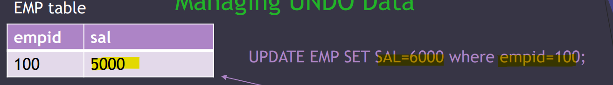
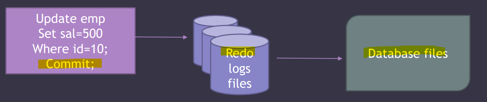
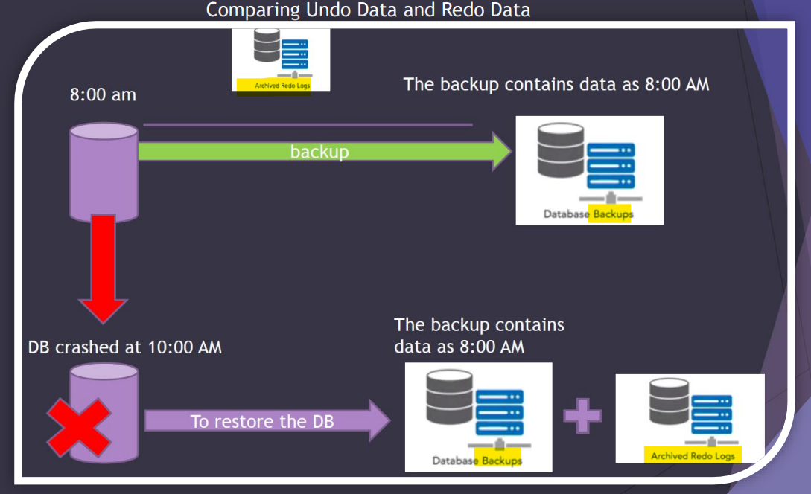
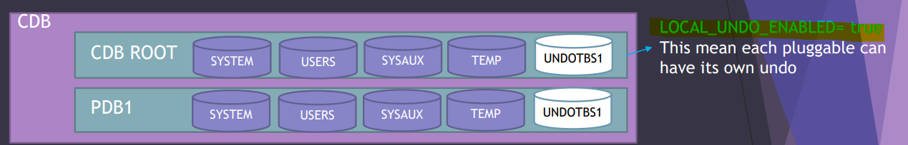
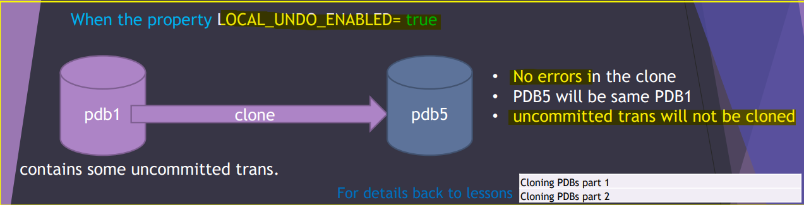
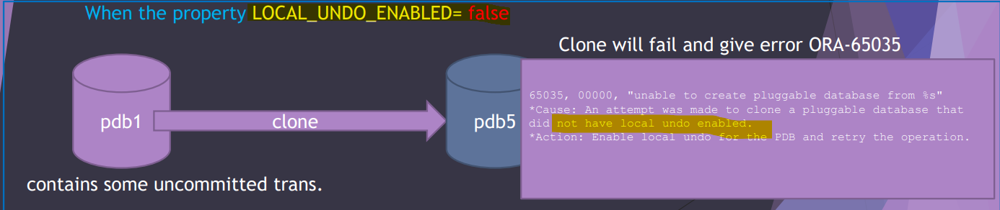

# DBA - Undo

[Back](../../index.md)

- [DBA - Undo](#dba---undo)
  - [`Undo`](#undo)
    - [Transactions and Undo Data](#transactions-and-undo-data)
    - [Categories of Undo](#categories-of-undo)
    - [Lab: Undo Data](#lab-undo-data)
      - [Commit Transaction](#commit-transaction)
      - [Rollback Transaction](#rollback-transaction)
      - [Implicitly Commit by DDL](#implicitly-commit-by-ddl)
    - [`Undo Data` VS `Redo Data`](#undo-data-vs-redo-data)
  - [`UNDO TABLESPACE`](#undo-tablespace)
    - [Lab: Undo TBSP](#lab-undo-tbsp)
      - [Manually Create undo tbsp](#manually-create-undo-tbsp)
      - [Error due to limited space](#error-due-to-limited-space)
  - [`Local Undo Mode` Versus `Shared Undo Mode`](#local-undo-mode-versus-shared-undo-mode)
    - [Lab: Shared Undo Mode and clone pdb](#lab-shared-undo-mode-and-clone-pdb)
  - [Automatic Undo Management](#automatic-undo-management)
  - [Flashback](#flashback)
    - [Lab: Flashback Table](#lab-flashback-table)
    - [Lab: Flashback Version Query](#lab-flashback-version-query)
  - [Undo Retention Period](#undo-retention-period)
    - [Automatic Tuning of Undo Retention](#automatic-tuning-of-undo-retention)
    - [Lab: Undo Retention](#lab-undo-retention)
  - [Retention Guarantee](#retention-guarantee)

---

## `Undo`

- `undo`:

  - records of the actions of transactions, primarily **before being committed**, that are used to roll back, or undo 撤消, changes to the database.

- `Undo records` are used to support:

  - **Rollback operation**
    - When a `ROLLBACK` statement is issued, `undo records` are used to **undo changes** that were made to the database by the **uncommitted transaction**.
  - **Recover** the database
    - During database **recovery**, `undo records` are used to **undo any uncommitted changes** applied from the `redo log` to the data files. (Roll forward + roll back)
  - `Oracle Flashback Query`, `Oracle Flashback Transaction`, and `Oracle Flashback Table`
  - **Read consistency queries**
    - `Undo records` provide read consistency by **maintaining** the `before image` of the data for users who are accessing the data at the same time that another user is changing it.

- `failed transaction`:
  - occurs when a `user session` **ends abnormally** (possibly because of network errors or a failure on the client computer) before the user decides to commit or roll back the transaction. 用户端
  - occurs when the **instance crashes** or you issue the `SHUTDOWN ABORT` command.服务器端
- `Undo data` can be used to recover from `failed transaction`

---

- Example:



- UserA update data but not commit.
  - UserA is the only one who can see updated value, 6000, because he did not commit yet.
  - Other user queries the tb, they see old value, 5000. This is `Read Consistency`.
- The old value, 5000, is the `undo data`, which is stored in `undo segment`.

---

- The Oracle Database server **saves** the **old value** (`undo data`) when a process **changes** data in a database.

  - It stores the data **as it exists before** modifications.如同未改变
  - **Retained** at least until the **transaction is ended**.保存直到交易结束.

- How the transaction ends?
  - User **undoes** a transaction using `ROLLBACK` clause. (transaction **rolls back**).
  - session **terminates abnormally** (transaction **rolls back**).
  - User **ends** a transaction (transaction **commit**).
  - User session terminates **normally** with an **exit** (transaction **commits**).
  - User executes a `DDL` statement, such as a `CREATE`, `DROP`, `RENAME`, or `ALTER` statement.(transaction implicitly **commits**)

---

### Transactions and Undo Data

- `Undo segments`

  - specialized segments that are **automatically created** by the database server as needed to support transactions.自动创建
  - are made up of `extents`, which, in turn, consist of `data blocks`.结构
  - **automatically grow and shrink** as needed, acting as a **circular storage buffer** for their assigned transactions.自动缩涨
  - 如果有太多交易没有提交, 则可能面临 undo 不够空间的情况. 解决方法是, 当交易达到某个数量, 如 loop 1000, 提交交易. 则交易完成, undo 会自动清理旧数据.

- `Undo segments` are automatically created and always **owned by** `SYS`.
- Because the `undo segments` act as a circular buffer, each segment has a **minimum of two** `extents`. 至少有两个

  - The default **maximum number** of extents **depends on the database block size** but is very high (32,765 for an 8 KB block size).

- `Undo segments` & Transactions:

  - Each transaction is assigned to **only one** `undo segment`. 每个交易只分配到一个 segment
  - An `undo segment` can service **more than one transaction at a time**. 一个 segment 可以同时服务多个交易
  - When a transaction **starts**, it is assigned to an `undo segment`.
    - **Throughout** the life of the transaction, when data is **changed**, the **original (before the change) values** are **copied** into the `undo segment`.一旦修改数据, 则原有值会被复制到 undo

- `V$TRANSACTION` view:

  - see which transactions are assigned to which `undo segments`

- `undo tablespace`:

  - a tbsp to store `undo segments` that contain `undo data`.
  - cannot create other segment types, such as tables, in the `undo tablespace`

- `Undo tablespaces` are **permanent**, `locally managed tablespaces` with `automatic extent allocation`. ASSM
  - They are **automatically managed** by the database.
- Because `undo data` is required to recover from `failed transactions` (such as those that may occur when an instance crashes), `undo tablespaces` can be **recovered** only while the instance is in the `MOUNT` state.

---

- The `Database Configuration Assistant (DBCA)` **automatically** creates a `smallfile undo tablespace`.默认小文件
  - You can also create a `bigfile undo tablespace`.
- However, in a **high-volume** `online transaction processing (OLTP)` environment with **many short concurrent transactions**, contention could occur on the `file header`. 并发会在文件头产生资源争夺.
  - An `undo tablespace`, stored in **multiple** `datafiles`, can **resolve** this potential issue.解决方法: 多个 DF
  - Although a database may have **many** `undo tablespaces`, **only one** of them at a time can be designated as the `current undo tablespace` for any instance in the database.可以有多个 undo TBSP,只有一个 tbsp 能被分配.

---

### Categories of Undo

- `Active Undo data`:

  - the **uncommitted** undo information
  - required if a user wants to **roll back** or if the transaction has **failed**.
  - **Uncommitted** undo information is **never overwritten**. 与保留期无关, 不会被覆盖.

- `Unexpired Undo data`:

  - **Committed** undo information
  - Old undo information with an **age that is less than** the current `undo retention period`
  - retained for `consistent read` and `Oracle Flashback` operations

- `Expired Undo data`:
  - **Expired** undo information
  - Old (committed) undo information that is **older** than the current `undo retention period`
  - its space is **available to be overwritten** by new transactions. 可以被覆盖.

---

### Lab: Undo Data

#### Commit Transaction

- Setup env

```sql
show user;
-- USER is "PDBTS_ADMIN"
show con_name;
--CON_NAME
----------------------------
--PDBTS

-- create tb
create table emp
(
    n number,
    sal number
);
```

- insert transactions

```sql

-- insert data
insert into emp values (1,500);
insert into emp values (2,400 );

-- query transaction within current session
select a.sid, a.serial#, a.username, b.used_urec, b.used_ublk
from   v$session a,
       v$transaction b
where  a.saddr = b.ses_addr
order by b.used_ublk desc;
-- 43	19457	PDBTS_ADMIN	2	1
--USED_UBLK = Number of undo blocks used
--USED_UREC = Number of undo records used
```

> - the number of undo records is the number of transaction made.

- make one additional transaction
  - the number of undo records updated.

```sql
insert into emp values (3,700);

select a.sid, a.serial#, a.username, b.used_urec, b.used_ublk
from   v$session a,
       v$transaction b
where  a.saddr = b.ses_addr
order by b.used_ublk desc;
--43	19457	PDBTS_ADMIN	3	1
-- one more undo record
```

- Commit transaction and query undo records

```sql
commit; --this mean end of transaction

select a.sid, a.serial#, a.username, b.used_urec, b.used_ublk
from   v$session a,
       v$transaction b
where  a.saddr = b.ses_addr
order by b.used_ublk desc;
-- return no row
-- undo data will be removed when transaction ends.
```

---

#### Rollback Transaction

```sql
insert into emp values (1,500);
insert into emp values (2,400 );

select s.sid, s.serial#, s.username, t.used_urec, t.used_ublk
from   v$session s,
       v$transaction t
where  s.saddr = t.ses_addr
order by t.used_ublk desc;
-- 43	19457	PDBTS_ADMIN	2	1

rollback;

select s.sid, s.serial#, s.username, t.used_urec, t.used_ublk
from   v$session s,
       v$transaction t
where  s.saddr = t.ses_addr
order by t.used_ublk desc;
-- return no row
```

---

#### Implicitly Commit by DDL

- Change before DDL
  - 2 uncommited record in undo.

```sql
-- DDL

SELECT count(*)
FROM emp;
-- 3

insert into emp values (1,500);
insert into emp values (2,400);

select s.sid, s.serial#, s.username, t.used_urec, t.used_ublk
from   v$session s,
       v$transaction t
where  s.saddr = t.ses_addr
order by t.used_ublk desc;
-- 43	19457	PDBTS_ADMIN	2	1
```

- Issue DDL by rename
  - undo data are removed
  - change committed

```sql
-- DDL
ALTER TABLE emp
RENAME COLUMN sal TO sale;

select s.sid, s.serial#, s.username, t.used_urec, t.used_ublk
from   v$session s,
       v$transaction t
where  s.saddr = t.ses_addr
order by t.used_ublk desc;
-- return no row

SELECT count(*)
FROM emp;
-- 5
```

---

### `Undo Data` VS `Redo Data`

- `Redo log files`:
  - **stores changes** to the database as they occur and are used for data **recovery**.



> - When update and commit, the data will first go to the redo log files.
> - The data will move from redo log file to the database file.

|           | Undo                                  | Redo            |
| --------- | ------------------------------------- | --------------- |
| Used for  | Rollback, Read Consistency, Flashback | Rolling Forward |
| Stored in | Undo segments                         | Redo Log Files  |

- Redo log and backup



> - backup + archive redo log => Restore and Recovery

---

## `UNDO TABLESPACE`

### Lab: Undo TBSP

- Setup Env
  - Create a tbsp using dbca
  - name: pdbundo
  - admin: PDBUNDO_ADMIN

```sql
dbca

sqlplus /  as sysdba
show user
show con_name

-- move session to the pdbundo
alter session set container=pdbundo;
show con_name

-- grant pdb admin privileges
grant create session, dba to pdbundo_admin;

-- verify
connect pdbundo_admin@pdbundo as sysdba
show user
show con_name
```

---

#### Manually Create undo tbsp

```sql
show CON_NAME
--CON_NAME
--------------------------------
--PDBUNDO
show user
--USER is "PDBUNDO_ADMIN"

-- query tbsp in current pdb
SELECT TABLESPACE_NAME, BLOCK_SIZE, STATUS, CONTENTS, LOGGING, SEGMENT_SPACE_MANAGEMENT, COMPRESS_FOR
FROM dba_tablespaces;
--SYSTEM	8192	ONLINE	PERMANENT	LOGGING	    MANUAL
--SYSAUX	8192	ONLINE	PERMANENT	LOGGING	    AUTO
--UNDOTBS1	8192	ONLINE	UNDO	    LOGGING	    MANUAL
--TEMP	    8192	ONLINE	TEMPORARY	NOLOGGING	MANUAL
--USERS	    8192	ONLINE	PERMANENT	LOGGING	    AUTO
-- by default, oracle creates undo tbsp for a pdb.

-- ddl of default undo tbsp
-- note the autoextend
SELECT dbms_metadata.get_ddl('TABLESPACE','UNDOTBS1') FROM dual;
--"CREATE UNDO TABLESPACE "UNDOTBS1" DATAFILE
--  SIZE 104857600
--  AUTOEXTEND ON NEXT 5242880 MAXSIZE 32767M
--  BLOCKSIZE 8192
--  EXTENT MANAGEMENT LOCAL AUTOALLOCATE"

-- the database know which undo to be used from the parameter UNDO_TABLESPACE
SHOW PARAMETER undo_tablespace
--NAME            TYPE   VALUE
----------------- ------ --------
--undo_tablespace string UNDOTBS1
-- the current db uses UNDOTBS1

-- create undo tbsp
CREATE UNDO TABLESPACE undotbs_k
DATAFILE '/u01/app/oracle/oradata/ORCL/pdbundo/undotbs_k01.dbf'
SIZE 10M;

-- query ddl
SELECT dbms_metadata.get_ddl('TABLESPACE','UNDOTBS_K') FROM dual;
--"CREATE UNDO TABLESPACE "UNDOTBS_K" DATAFILE
--  '/u01/app/oracle/oradata/ORCL/pdbundo/undotbs_k01.dbf' SIZE 10485760
--  BLOCKSIZE 8192
--  EXTENT MANAGEMENT LOCAL AUTOALLOCATE"
--
```

> - note: undo tbsp is not autoextend

---

#### Error due to limited space

```sql
-- switch undo tbsp
ALTER SYSTEM SET undo_tablespace=undotbs_k SCOPE=BOTH;

-- show current undo tbsp
show parameter undo_tablespace
--NAME            TYPE   VALUE
----------------- ------ ---------
--undo_tablespace string UNDOTBS_K

-- create tb
CREATE TABLE test100
(
    emp_id number,
    name varchar2(100)
);

-- query ddl
SELECT dbms_metadata.get_ddl('TABLE','TEST100') FROM dual;
--"
--  CREATE TABLE "PDBUNDO_ADMIN"."TEST100"
--   (	"EMP_ID" NUMBER,
--	"NAME" VARCHAR2(100)
--   ) SEGMENT CREATION DEFERRED
--  PCTFREE 10 PCTUSED 40 INITRANS 1 MAXTRANS 255
-- NOCOMPRESS LOGGING
--  TABLESPACE "USERS" "

INSERT INTO test100
VALUES(1,400);

-- query undo
select s.sid, s.serial#, s.username, t.used_urec, t.used_ublk
from   v$session s,
       v$transaction t
where  s.saddr = t.ses_addr
order by t.used_ublk desc;
-- 42	46524	PDBUNDO_ADMIN	1	1
-- have one record

-- insert 400000 data
BEGIN
    FOR i IN 1..400000
    LOOP
        INSERT INTO test100 VALUES (i, 'any dummy name');
    END LOOP;
    -- note: commit after insert all data, leading to insufficient size of undo
    COMMIT;
END;
--Error report -
--ORA-30036: unable to extend segment by 8 in undo tablespace 'UNDOTBS_K'
--ORA-06512: at line 4
--30036. 00000 -  "unable to extend segment by %s in undo tablespace '%s'"
--*Cause:    the specified undo tablespace has no more space available.
--*Action:   Add more space to the undo tablespace before retrying
--           the operation. An alternative is to wait until active
--           transactions to commit.
/
```

---

## `Local Undo Mode` Versus `Shared Undo Mode`

- Two UNDO modes:

  - `SHARED`
  - `LOCAL`

- There is **only one** `shared UNDO tablespace` (in CDB root).

- There can be a `local UNDO tablespace` in **each PDB**
- You can set a CDB in `local UNDO mode` either at CDB **creation** or by **altering** the CDB property.
  - table: `DATABASE_PROPERTIES` property `LOCAL_UNDO_ENABLED=true`
  - note: it is `true` by **default** in release 18c



- Use case of local UNDO mode

  - Hot cloning
  - Near-zero downtime PDB relocation

- Command to enable local UNDO mode

```sql
STARTUP UPGRADE
ALTER DATABASE LOCAL UNDO ON;
```

- Clone when in local mode: Default



> - Uncommitted data will not be cloned since only the clean data and committed transactions are copied.

- Clone when in shared mode:



> - fails because in shared mode, database has only one shared undo tbsp. The clone of one pdb will affect other pdb.

---

### Lab: Shared Undo Mode and clone pdb

```sql
sqlplus / as sysdba

-- confirm in the root
show user
show con_name

-- query undo mode
select property_value
from database_properties
where property_name='LOCAL_UNDO_ENABLED';
-- PROPERTY_VALUE
-- ------------------------------------------------------------------------------
-- TRUE

-- set local undo mode to be false
shutdown immediate
startup upgrade;
alter database local undo off;
shutdown immediate;
startup

-- verify
select property_value from database_properties where property_name='LOCAL_UNDO_ENABLED';
-- PROPERTY_VALUE
-- ------------------------------------------------------------------------------
-- FALSE
```

---

- try to clone pdb in shared undo mode with uncommitted data

```sql
-- move to a pdb
show pdbs
alter session set container=orclpdb;
show con_name
-- CON_NAME
-- ----------------------------
-- ORCLPDB
alter pluggable database open;

-- create table then do uncommited trans
create table test (n number);
insert into test values (1);
```

- Open a new terminal

```sql
-- create path for dest pdb
mkdir /u01/app/oracle/oradata/ORCL/pdbkh1

sqlplus / as sysdba
show user
show con_name -- in root

-- clone pdb
create pluggable database pdbkh1 from orclpdb
create_file_dest = '/u01/app/oracle/oradata/ORCL/pdbkh1';
-- ERROR at line 1:
-- ORA-65035: unable to create pluggable database from ORCLPDB

-- get info of the error
host oerr ora 65035
-- 65035, 00000, "unable to create pluggable database from %s"
-- // *Cause:  An attempt was made to clone a pluggable database that did not have
-- //          local undo enabled.
-- // *Action: Enable local undo for the PDB and and retry the operation.
```

---

- Reset the local undo mode

```sql
shutdown immediate
startup upgrade;
alter database local undo on;
shutdown immediate;
startup

-- verify
select property_value from database_properties where property_name='LOCAL_UNDO_ENABLED';
-- TRUE

-- Now it can clone pdb.
create pluggable database pdbkh1 from orclpdb
create_file_dest = '/u01/app/oracle/oradata/ORCL/pdbkh1';  2
-- Pluggable database created.

-- clean up
DROP PLUGGABLE DATABASE pdbkh1 INCLUDING DATAFILES;
```

---

## Automatic Undo Management

- Oracle provides a fully **automated mechanism** for managing undo information and space.
- the database **manages** `undo segments` in an `undo tablespace`.
- `Automatic undo management`

  - the default mode for a newly installed database.

- An **auto-extending** `undo tablespace` named `UNDOTBS1` is **automatically created** when you create the database with `Database Configuration Assistant (DBCA)`.

- When the database instance **starts**, the database automatically **selects the first** available undo tablespace.

  - If **no** undo tablespace is available, then the instance starts **without** an undo tablespace and stores undo **records** in the `SYSTEM` tablespace.
    - This is not recommended, and an **alert message** is written to the `alert log file` to warn that the system is running without an undo tablespace.

- `UNDO_MANAGEMENT` parameter:

  - specifies which **undo space management mode** the system should use.
  - Values:
    - `AUTO`: Default, the instance starts in `automatic undo management mode`.
    - `MANUAL`: manual undo management mode, `undo space` is **allocated externally** as `rollback segments`.
      - Space management for `rollback segments` is complex. Oracle strongly recommends leaving the database in `automatic undo management mode`
  - Note:In a **CDB**, the `UNDO_MANAGEMENT` initialization parameter must be set to `AUTO`, and an `undo tablespace` is required to be created to manage the undo data.

- `UNDO_TABLESPACE` parameter:
  - specifies the `undo tablespace` to be **used** when an instance **starts**.
  - If this parameter is **specified** when the instance is in `manual undo management mode`, then an error will occur and **startup will fail**.

---

## Flashback

### Lab: Flashback Table

- Setup env
  - Connect with orclpdb using user hr

```sql
select * from employees;

-- create a tb copying from employees
create table emp_copy3
as
select * from employees;

select * from emp_copy3;
```

- Drop tb and query recyclebin

```sql
-- drop tb
--  DDL statement automatically committed
drop table emp_copy3;

select * from emp_copy3;
-- ORA-00942: table or view does not exist
-- 00942. 00000 -  "table or view does not exist"

-- query recyclebin
select * from recyclebin;
-- BIN$GouL2faYaDngYyUAqMBjcw==$0	EMP_COPY3	DROP	TABLE	USERS	2024-06-10:11:07:23	2024-06-10:11:10:14	11200544		YES	YES	73404	73404	73404	8
```

> - Note the DROPSCN: 11200544

- `SCN`:
  - an internal number maintained by the database management system to log changes made to a database.
- Whenever an application **commits** a transaction, the `log writer process (LGWR)` writes records from the `redo log buffers` in the `SGA` to the online `redo logs` on disk. 将记录从 buffer 写入 redo log
- `LGWR` also writes the transaction's SCN to the online `redo log file`. 同时将 SCN 写入.

- Flashback tb

```sql
flashback  table emp_copy3 to before drop;

-- verify
select * from emp_copy3;

-- query recyclebin
select * from recyclebin;
-- return no row

-- Command to empty the recycle bin
purge recyclebin
```

---

### Lab: Flashback Version Query

- `Oracle Flashback Version Query`:
  - used to retrieve the **different versions** of specific rows that existed **during a given time interval**.
- A **row version** is created whenever a `COMMIT` statement is executed.

---

- setup env

```sql
-- query before new row version
select salary from
employees
where employee_id=107;
-- 4200

-- update tb to create a new row version
update
employees
set salary=salary+100
where employee_id=107;
commit; -- thi will make new scn

-- query after new row version
select salary from
employees
where employee_id=107;
-- 4300
```

- Query version

```sql
-- query version
select
    versions_starttime
    , versions_endtime
    , salary
from employees
versions between scn minvalue and maxvalue  -- specify time interval
where employee_id=107;
--10-JUN-24 11.21.01.000000000 AM   (null)                          4300
--(null)                            10-JUN-24 11.21.01.000000000 AM	4200

-- create a new row version
update
employees
set salary=salary+100
where employee_id=107;
commit;

-- query version
select
    versions_starttime
    , versions_endtime
    , salary
from employees
versions between scn minvalue and maxvalue  -- specify time interval
where employee_id=107;
--10-JUN-24 11.27.51.000000000 AM	  (null)	                            4400
--10-JUN-24 11.21.01.000000000 AM   10-JUN-24 11.27.51.000000000 AM     4300
--(null)                            10-JUN-24 11.21.01.000000000 AM	    4200
```

- Question: until when i can see these records ???

  - This depend on many factors:
    - 1. Tablespace type (fixed or auto extend)
    - 2. The retention period `UNDO_RETENTION`
    - 3. Retention Guarantee

- Query after 15min

```sql
-- query after 15min
select
    versions_starttime
    , versions_endtime
    , salary
from employees
versions between scn minvalue and maxvalue
where employee_id=107;
-- (null)   (null)  4400
```

---

## Undo Retention Period

- `Undo retention period`

  - the minimum amount of time that Oracle Database attempts to retain old undo information before overwriting it.
  - Prerequisites:
    - when automatic undo management is enabled.

- **Ater** a transaction is **committed**, undo data is no longer needed for rollback or transaction recovery purpose. But for 2 reasons, old data are kept in undo:

  - For **consistent read** purposes, **long-running queries** my require this old undo information for producing older images of data blocks.为读取一致性
    - It is better to set undo retention longer than the longest-running query.
  - Furthermore, the success of several Oracle `Flashback` features can also depend upon the availability of older undo information. 为闪回


- `UNDO_RETENTION`:
  - pecifies (in seconds) the low threshold value of undo
  - default: 900s (15m)

---

### Automatic Tuning of Undo Retention

- Oracle Database **automatically tunes** the `undo retention period` based on how the `undo tablespace` is configured.

  - If the `undo tablespace` is configured with the `AUTOEXTEND` option,

    - the database dynamically tunes the `undo retention period` to be somewhat **longer than the longest-running active query** on the system. 一般保留期会长于最长的查询
    - However, this retention period may be **insufficient** to accommodate Oracle `Flashback` operations. 但可能不满足闪回
    - Oracle `Flashback` operations resulting in `snapshot too old` **errors** are the indicator that you must intervene to ensure that sufficient undo data is retained to support these operations.
    - To better accommodate Oracle Flashback features, you can either set the `UNDO_RETENTION` parameter to a value **equal to the longest** expected Oracle `Flashback` operation, or you can change the `undo tablespace` to **fixed size**. 保留期等于最长闪回, 或设置为固定大小

  - If the `undo tablespace` is **fixed size**,

    - It **ignore** the value of `undo_retention` Unless you enable `retention guarantee`.
    - the database dynamically tunes the `undo retention period` for the best possible retention for that **tablespace size** and the current **system load**. 如果是固定大小, 则保留期根据大小和载荷动态调优.

    - This best possible retention time is typically significantly **greater** than the duration of the **longest-running active query**.通常远大于最长查询

  - If you decide to **change** the `undo tablespace` to **fixed-size**,
    - you must choose a tablespace size that is **sufficiently large**. 变为固定大小, 则需要足够大空间
    - If you choose an `undo tablespace` size that is **too small**, the following two errors could occur: 可能引起两种错误
      - **DML could fail** because there is **not enough space** to accommodate undo for new transactions.
      - **Long-running queries could fail** with a `snapshot too old` **error**, which means that there was **insufficient** `undo data` for `read consistency`.

---

### Lab: Undo Retention

- Confirm
  - undo parameter
    - `undo_retention` is 900s
  - PDB undo tablespace is
    - noguarantee
    - autoextend

```sql
show user;
-- USER is "PDBTS_ADMIN"
show con_name;
--CON_NAME
--------------------------------
--PDBTS

-- query parameter
show parameter undo
--NAME              TYPE    VALUE
------------------- ------- --------
--temp_undo_enabled boolean FALSE
--undo_management   string  AUTO
--undo_retention    integer 900
--undo_tablespace   string  UNDOTBS1

-- query tbsp
-- note the retention: NOGUARANTEE
-- NOGUARANTEE:
select *
from DBA_TABLESPACES;
-- UNDOTBS1	8192	65536		1	2147483645	2147483645		65536	ONLINE	UNDO	LOGGING	NO	LOCAL	SYSTEM	NO	MANUAL	DISABLED	NOGUARANTEE	NO	HOST	NO		DISABLED					SHARED	DISABLED					OFF	N

-- query ddl
SELECT DBMS_METADATA.GET_DDL('TABLESPACE','UNDOTBS1') FROM dual;
--  CREATE UNDO TABLESPACE "UNDOTBS1" DATAFILE
--  SIZE 120586240
--  AUTOEXTEND ON NEXT 120586240 MAXSIZE 32767M
--  BLOCKSIZE 8192
--  EXTENT MANAGEMENT LOCAL AUTOALLOCATE
-- note: enable AUTOEXTEND
```

> - RETENTION: `NOGUARANTEE`
>   - Oracle will ignore the retention period. The old data can be overwritten more or less than 900, according to the size of undo tbsp.
> - UNDO Tablespace: enable `AUTOEXTEND`
>   - Oracle will adjust the undo_retention automaticlly (for active query)
>   - but flashback operations ( maybe or maybe not work )

---

- In Session A

```sql
-- change the retention
alter system set undo_retention=1;

-- create tb
create table xyz
(id number primary key, val number );

-- insert data
begin
for i in 1..500000
loop
insert into xyz values (i,500);
end loop;
commit;
end;
/

-- verify data
select * from xyz
order by 1;

--now do this without commit

-- update data
update xyz
set val=0
where id =500000;
-- data is in the undo tbsp
```

> - Change the parameter `undo_retention` to 1s.
> - The updated data is in the undo and only can be seen in the current session.

---

- Open a new session B

```sql
-- In session B

-- create tb
create table xyz_copy
(id number primary key, val number );

--this wil insert the data from xyz to xyz_copy
begin
for i in (select * from xyz)
loop
insert into xyz_copy values (i.id, i.val );
end loop;
commit;
end;
/
```

> - note: the value of id 500000 still 500 because the user did not commit

- While the plsql is executed in session B, commit the updated data in session A.

```sql
-- session A
commit
```

---

- Query data in session B

```sql
-- verify the data
select * from xyz_copy
where id=500000;
-- 500000	500
```

> - Oracle adjust the `undo retention` automatically when the undo tbsp is autoextend, and it ignore the paramter.
>   - In this example, `undo tablespace` is autoextend and `undo_retention` is set to be 1s.
>   - The Oracle ignores the `undo_retention` parameter.
> - The value in session B is the old version, 500, due to `read consistency`.
>   - The commit in session A is after the plsql in session B. To keep the read consistency in session B, the old version in undo is used.
>   - This also proves that the actual retention is automatically managed, ignoring the value in the paramter.

---

- Test Flashback

```sql
--flashback maybe or maybe not work

select versions_starttime,versions_endtime, val from
 xyz
versions between scn minvalue and maxvalue
where id=500000;
--10-JUN-24 12.46.22.000000000 PM		0
--	10-JUN-24 12.46.22.000000000 PM	500
```

> - Even flashback works for this case, it cannot work. It depends on the size of undo tbsp.

---

## Retention Guarantee

- To **guarantee** the success of **long-running queries** or **Oracle Flashback** operations, you can enable `retention guarantee`.

- If `retention guarantee` is enabled,
  - then the specified `minimum undo retention` is **guaranteed**;
  - the database **never overwrites** `unexpired undo data` even if it means that transactions fail due to lack of space in the undo tablespace.
- If `retention guarantee` is **not** enabled,

  - then the database can **overwrite** `unexpired undo` when space is low, thus lowering the undo retention for the system. This option is **disabled** by **default**.

- WARNING:

  - Enabling `retention guarantee` can cause multiple `DML` operations to **fail**. Use
    with caution.

- To enable `retention guarantee`

  - `RETENTION GUARANTEE` clause for the `undo tablespace` with
    - the `CREATE DATABASE` Or `CREATE UNDO TABLESPACE` statement.
    - an `ALTER TABLESPACE` statement.

- To disenable `retention guarantee`

  - `RETENTION NOGUARANTEE` clause.

- `RETENTION` column in `DBA_TABLESPACES` view:
  - determine the retention guarantee setting for the undo tablespace.
  - values: `GUARANTEE`, `NOGUARANTEE`, Or `NOT APPLY`, where `NOT APPLY` is used for tablespaces other than the undo tablespace.

---

[TOP](#dba---undo)
