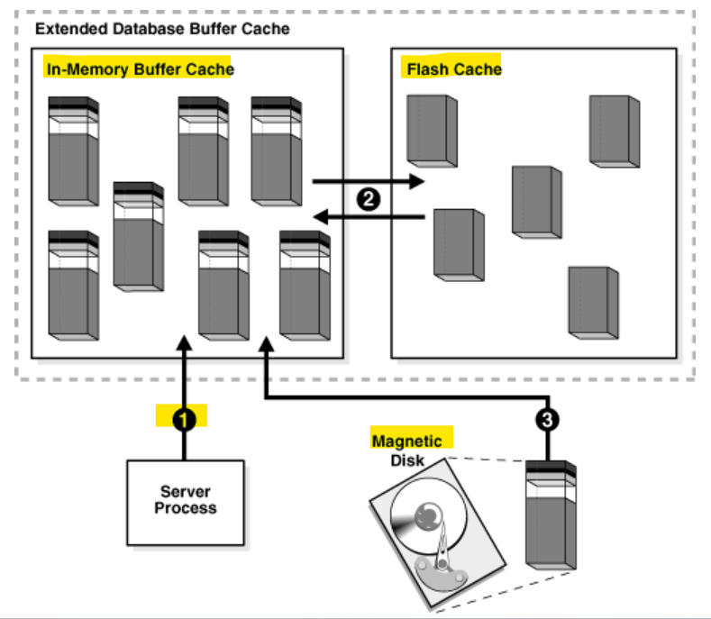
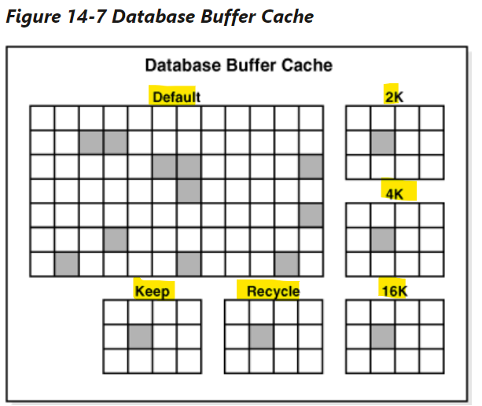

# DBA - SGA: Database Buffer Cache

[Back](../../index.md)

- [DBA - SGA: Database Buffer Cache](#dba---sga-database-buffer-cache)
  - [Database Buffer Cache](#database-buffer-cache)
  - [Buffer States](#buffer-states)
  - [Buffer Modes](#buffer-modes)
  - [Buffer I/O](#buffer-io)
    - [Buffer Replacement Algorithms](#buffer-replacement-algorithms)
    - [Buffer Writes](#buffer-writes)
    - [Buffer Reads](#buffer-reads)
    - [Buffer Touch Counts](#buffer-touch-counts)
  - [Buffer Pools](#buffer-pools)

---

## Database Buffer Cache

- `database buffer cache` / `buffer cache`

  - the memory area that **stores copies of data blocks** read from data files.

- `buffer`

  - a **main memory address** in which the buffer manager **temporarily caches a currently or recently used data block**.
  - All users **share access** to the buffer cache.

- Purpose
  - **Optimize** physical **I/O**
    - update data block -> store in `redo log buffer` -> write to `online redo log` -> `DBW` lazy write to data file. 不是马上写入,而是先缓存, 再由 DBW 写入.
    - 常考: when a transaction committed, the data will not be writen directly to the data file.
      - Transaction happens in the memory, the buffer cache.
  - **Keep** <u>frequently accessed blocks</u> in the buffer cache and **write** <u>infrequently accessed blocks</u> to disk

---

## Buffer States

- A buffer can be in any of the following **mutually exclusive states**: 以下状态之一, 不能同时.

  - `Unused`

    - it has never been used or is currently unused.
    - available for use
    - the easiest buffers for the database to use.

  - `Clean`

    - **was used** earlier and now **contains a read-consistent version of a block** as of a point in time.
    - The block contains data but does not need to be checkpointed.
    - The database can pin the block and reuse it.

  - `Dirty`
    - The buffer contain **modified data** that has **not yet been written** to disk.
    - The database **must checkpoint** the block before reusing it.

- `access mode`:
  - Every buffer has an `access mode`: **pinned** or **free (unpinned)**.
  - A buffer is "pinned" in the cache so that it does not age out of memory **while a user session accesses it**. 访问期间不会过期
  - Multiple sessions cannot modify a pinned buffer at the same time.但不能同时修改.

---

## Buffer Modes

- `Buffer Modes`

  - the mode of retrieved buffers from the buffer cache.
  - either `current mode `or `consistent mode`.

- `Current mode`
  - `current mode get` / `db block get`:
    - a retrieval of a block as it **currently appears** in the buffer cache.
      - e.g.: a current mode get retrieves the block with uncommitted rows.
    - The database uses db block gets most frequently **during modification statements**, which must **update only the current version** of the block.
  - `Consistent mode`
    - `consistent read get`
      - a retrieval of a **read-consistent version** of a block.
      - Typically, a query retrieves blocks in consistent mode.

---

## Buffer I/O

- `buffer I/O` / `logical I/O`

  - refer to **reads and writes of buffers** in the buffer cache.

- When a requested buffer is **not found** in memory,

  - the database performs a `physical I/O` to **copy** the buffer from either the flash cache or disk **into memory**.
  - The database then performs a `logical I/O` to **read** the cached buffer.

---

### Buffer Replacement Algorithms

- `Buffer Replacement Algorithms`

  - the algorithm to decide which buffers to cache **in memory**, and which to access **from disk**, to make buffer access efficient

- `LRU-based, block-level replacement algorithm`

  - default, algorithms
  - uses a `least recently used (LRU)` list that contains pointers to dirty and non-dirty buffers.

  - `LRU list`

    - has a hot end and cold end.

  - `cold buffer`

    - a buffer that has **not been recently used**.

  - `hot buffer`

    - **frequently** accessed and has been **recently used**.
    - There is only one `LRU`
      - but for **data concurrency** the database actually uses **several** `LRUs`.

- `Temperature-based, object-level replacement algorithm`
  - the `automatic big table caching` feature enables table **scans** to use a different algorithm in the following scenarios:
  - **Parallel queries**
    - single-instance + RAC
    - Enable when the `DB_BIG_TABLE_CACHE_PERCENT_TARGET` = nonzero value, and `PARALLEL_DEGREE_POLICY` = `auto` or `adaptive`.
  - **Serial queries**
    - single-instance only
    - Enable when `DB_BIG_TABLE_CACHE_PERCENT_TARGET` = nonzero value,

---

- When a table does **not fit in memory**, the database decides which buffers to cache **based on access patterns**.
  - e.g.: if only 95% fits in memory, then leave 5% of the **blocks** **on disk**
- When caching **multiple large objects**, the database considers **more popular tables hotter** and less popular tables cooler, which influences which blocks are cached.
  - The `DB_BIG_TABLE_CACHE_PERCENT_TARGET` initialization parameter **sets the percentage** of the buffer cache that uses this algorithm.
  - 该参数影响算法

---

### Buffer Writes

- `database writer (DBW) process` **periodically** writes _cold, dirty_ buffers to disk.

- DBW writes buffers to disk when:
  - Dirty buffer **threshold**, cannot find clean buffers for reading new blocks into the database buffer cache.
  - free buffer for some **operations is needed**
  - **shutdown** (normal, transactional, immediate)
    - if shutdown abort, the dirty buffer will not be writen to data files.
  - change the status for tbsp (e.g., read-onlye)
  - during a checkpoint.

---

### Buffer Reads

- When the number of **unused buffers** is **low**, the database must **remove buffers** from the buffer cache.

- The algorithm depends on whether the `flash cache` is enabled:

  - `Flash cache` **disabled**

    - The database **re-uses** each **clean** buffer as needed, overwriting it.
    - If the overwritten buffer is needed later, then the database must **read it from magnetic disk**.
    - 当需要重用缓存时, 覆盖缓存. 如果原缓存需要时, 从磁盘读取.

  - `Flash cache` **enabled**
    - DBW can **write** the body of a clean buffer to the `flash cache`, enabling reuse of its `in-memory buffer`.
    - The database **keeps the buffer header** in an LRU list in main memory to track the state and location of the buffer body in the flash cache.
    - If this buffer is needed later, then the database can **read it from the flash cache** instead of from magnetic disk.
    - 将缓存体写入闪存, 保留缓存头在缓存. 当原缓存需要时, 从闪存中读取而不是从磁盘读取.

- When a client process **requests** a buffer, the server process **searches** the buffer cache for the buffer.

- `cache hit`

  - when the proces **finds** the buffer in memory.

- `cache miss`

  - when the proces **does not find** the buffer in memory

- **Buffer Search order**:
  - 1. The server process searches for the **whole buffer** <u>in the buffer cache</u>.
    - If the process **finds** the whole buffer, then the database **performs a `logical read`** of this buffer.
  - 2. The server process searches for the **buffer header** <u>in the flash cache LRU list</u>.
    - If the process finds the buffer header, then the database performs an `optimized physical read` of the **buffer body** <u>from the flash cache into the in-memory cache</u>.
  - 3. If the process does not find the buffer in memory (a `cache miss`), then the server process performs the following steps:
    - 1. **Copies** the block <u>from a data file on disk</u> into <u>memory (a physical read)</u>
    - 2. Performs a `logical read` of the buffer that was read **into memory**

---

**Performance:**

- In general, accessing data through a `cache hit` is **faster** than through a `cache miss`.
- The `buffer cache hit ratio`: -** how often** the database **found a requested block** in the buffer cache without needing to read it from disk.

- `physical reads` can be performed from

  - either a `data file`
    - `Reads` from a data file are followed by `logical I/Os`.
    - 读取数据文件后是逻辑输入输出
  - or a `temp file`.
    - occur when **insufficient memory** forces the database write data to a `temporary table` and read it back later.
    - **bypass** the buffer cache and **do not incur** a `logical I/O`.
    - 仅当内存不足需要将数据写入临时表的情况. 绕过 buffer 从而不会发生逻辑 IO

---

### Buffer Touch Counts

- `touch count`

  - used to measures the frequency of access of buffers on the LRU list. 衡量使用 LRU 缓存的频率
  - enables the database to **increment a counter** when a buffer is pinned instead of constantly shuffling buffers on the LRU list.
  - 会影响 LRU 算法的因素, 3 秒法则.

- The database does **not physically move blocks in memory**.

  - The movement is the **change in location of a pointer** on a list.

- When a buffer is pinned, the database determines **when** its touch count was **last incremented**.
  - If the count was incremented **over three seconds** ago, then the count is **incremented**;
  - otherwise, the count stays the same.
- The `three-second rule` prevents a burst of pins on a buffer counting as many touches.

  - 不会因为暴涨的 pin 而影响 touch count, 从而影响 cold/hot, 影响算法.

- If a buffer is on the **cold end** of the LRU, but its `touch count` is **high**, then the buffer** moves to the hot end**.
  - If the `touch count` is **low**, then the buffer **ages out of the cache**.

---

## Buffer Pools

- `buffer pool`

  - a collection of buffers.

- The b`uffer cache` is **divided into one or more** `buffer pools`, which manage blocks in mostly the **same way**.

  - The pools do not have radically different algorithms for aging or caching blocks.

- DBA can **manually configure separate** `buffer pools` that either keep data in the buffer cache or make the buffers available for new data immediately after using the data blocks.

  - DBA can then **assign** _specific schema objects_ to the appropriate `buffer pool` to control how blocks age out of the cache.
  - e.g., can segregate segments into hot, warm, and cold buffer pools.
  - 可以手动分缓存池.

- **possible buffer pools**

  - `Default pool`

    - the location where blocks are **normally cached**.
    - Unless manually configure separate pools, the default pool is **the only** buffer pool.
    - The optional configuration of the other pools has no effect on the default pool.不受其他池影响

    - `big table cache`
      - an **optional section** of the `default pool` that uses a `temperature-based, object-level replacement algorithm`. 参见算法部分.

  - `Keep pool`

    - intended for blocks that were **accessed frequently**, but which **aged out** of the default pool because of **lack of space**.
    - The purpose of the keep buffer pool is to retain objects in memory, thus **avoiding I/O operations**.

  - `Recycle pool`
    - intended for blocks that are **used infrequently**.
    - A recycle pool prevent objects **from consuming unnecessary space** in the cache. 节省空间

---

- nondefault block size pool
  - a tablespace can be created with a **nondefault block size**
  - Each nondefault block size has its own pool.
  - the blocks in these pools are managed in the same way as in the default pool.

> multiple pools are used.
>
> - The cache contains `default`, `keep`, and `recycle` pools.
> - The default block size is 8 KB.
> - The cache contains separate pools for tablespaces that use the nonstandard block sizes of `2` KB, `4` KB, and `16` KB.

---

[TOP](#dba---sga-database-buffer-cache)
