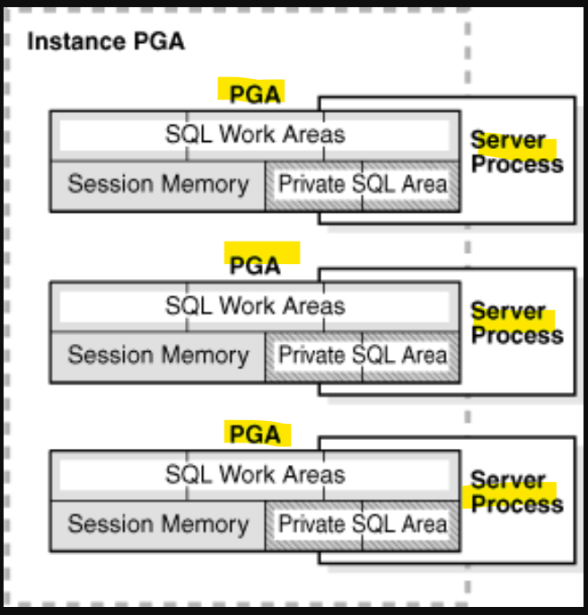
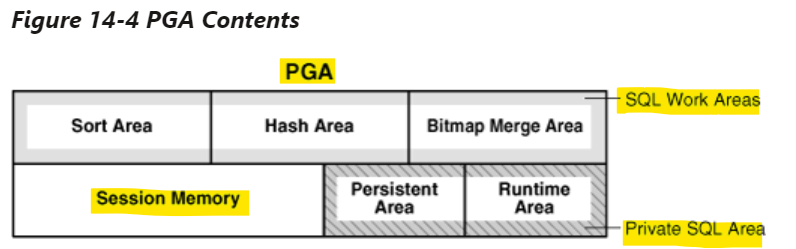
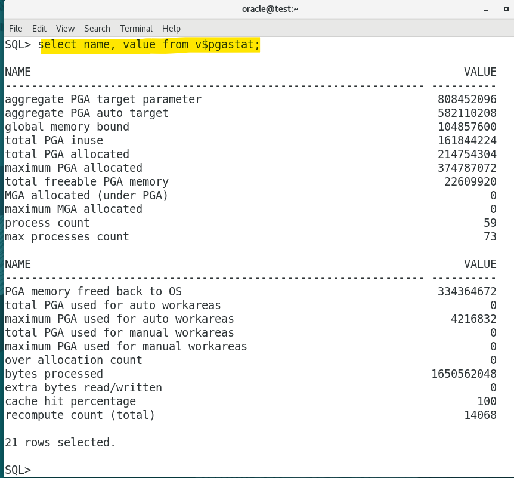
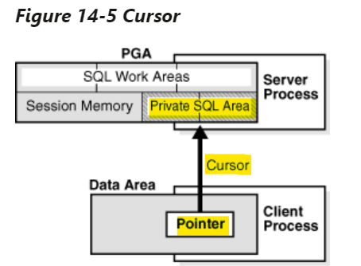
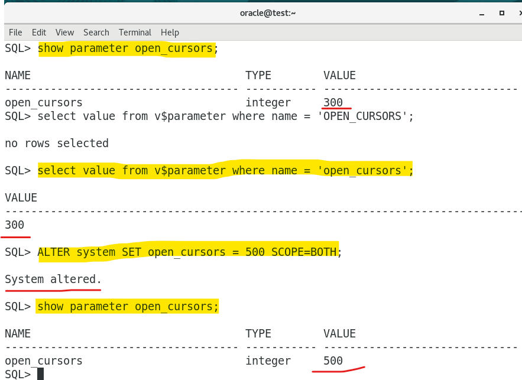

# DBA - Memory Structure: Program Global Area

[Back](../../index.md)

- [DBA - Memory Structure: Program Global Area](#dba---memory-structure-program-global-area)
  - [Program Global Area (PGA)](#program-global-area-pga)
    - [Contents of the PGA](#contents-of-the-pga)
    - [Memory allocation](#memory-allocation)
    - [`V$PGASTAT` - PGA statistics](#vpgastat---pga-statistics)
  - [`Private SQL Area` - `Cursor`](#private-sql-area---cursor)
    - [`run-time area`](#run-time-area)
    - [`persistent area`](#persistent-area)
    - [Cursor](#cursor)
    - [Example: `Private SQL area` \& `Cursor`](#example-private-sql-area--cursor)
  - [`SQL Work Areas`](#sql-work-areas)
    - [Example](#example)

---

## Program Global Area (PGA)

- `Program Global Area (PGA)`

  - a memory heap that **contains session-dependent variables** required by a dedicated or shared server process.
  - memory **specific to an operating process or thread** that is **not shared** by other processes or threads on the system.
  - Because the PGA is process-specific, it is never allocated in the SGA.
  - 存储进程需要的变量, 进程独享, 不在 SGA

- DBA can use an `initialization parameter` to set a **target maximum size** of the instance PGA.

  - Individual PGAs can grow as needed up to this target size.
  - 可以设置最大值
  - `PGA_aggregate_limit`: a limit on the aggregate PGA memory **consumed by the instance**. (hard limit)
  - `PGA_aggregate_target`: the target aggregate PGA memory available to **all server processes** attached to the instance.

- `instance PGA`
  - a collection of all PGAs
  - used for an instance that is **not** configured for **shared servers**.



---

```sql
show parameter pga_aggregate_limit
show parameter PGA_aggregate_target

select value from v$parameter where name = 'pga_aggregate_limit';
select value from v$parameter where name = 'PGA_aggregate_target';

ALTER SYSTEM SET pga_aggregate_limit = 2G SCOPE=both;
ALTER SYSTEM SET PGA_AGGREGATE_TARGET = 1024M SCOPE=both;
# SCOPE=both part ensures that the change takes effect immediately and is persistent across both the current session and future sessions.
```

---

### Contents of the PGA

- PGA Contents

  - Private SQL Area

    - Persistent Area
    - Runtime Area

  - SQL Work Area

    - Sort Area
    - Hash Area
    - Bitmap Merge Area

  - Session Memory



---

### Memory allocation

- PGA memory allocation depends on whether the database uses `dedicated` or `shared` server connections.

| Memory Area                                | Dedicated Server | Shared Server |
| ------------------------------------------ | ---------------- | ------------- |
| Nature of session memory                   | Private          | Shared        |
| `persistent area`                          | PGA              | **SGA**       |
| `run-time area` for DML and DDL statements | PGA              | **PGA**       |

- Dedicated mode:

  - `bind vairable` and `session` are not shared
    - `Session` is private.
    - `persistent area` in PGA.

- `Run-time area` always in PGA.

---

### `V$PGASTAT` - PGA statistics

- `V$PGASTAT`
  - a dynamic performance views to display PGA memory usage statistics

```sql
select name, value from v$pgastat;
```



---

## `Private SQL Area` - `Cursor`

- `Private SQL Area`

  - A private SQL area **holds information about a parsed SQL statement** and other **session-specific information** for processing.

- When a `server process` **executes** SQL or PL/SQL code, the process uses the `private SQL area` to **store** **bind variable values**, **query execution state** information, and **query execution work areas**.

---

- `Private SQL Area` vs `shared SQL area`

|                  | `Private SQL Area`                        | `shared SQL area`      |
| ---------------- | ----------------------------------------- | ---------------------- |
| Memory Structure | PGA                                       | SGA                    |
| Store Info       | a parsed SQL statement + session-specific | stores execution plans |

- **Multiple** `private SQL areas` in the same or different sessions can **point to a single** `execution plan` in the SGA.
- The `private SQL areas` for **each execution are not shared** and may contain **different** values and data.

---

### `run-time area`

- `run-time area`

  - One area in` private SQL area`

  - contains **query execution state information**.

    - e.g.: the run-time area tracks the _number of rows_ retrieved so far in a full table scan.

  - the first step of an execute request = the creation of `run-time area`.

    - For DML statements, the run-time area is freed when the SQL statement is closed.

---

### `persistent area`

- `persistent area`

  - contains `bind variable` values.

- `bind variable` value
  - supplied to a SQL statement at run time when the statement is executed.
  - The persistent area is **freed** only when the cursor **is closed**.

---

### Cursor

- `cursor`

  - a name or handle to a specific `private SQL area`.
  - a `cursor`
    - as a **pointer** on the **client side**
    - as a **state** on the **server side**.

- the terms are sometimes used interchangeably:
  - `cursor` = `private SQL areas `



- The **client process** is responsible for managing `private SQL areas`.

  - The **allocation** and **deallocation** of `private SQL areas` depends largely on the application

- In general, applications **should close all open cursors** that will not be used again to **free** the `persistent area` and to **minimize the memory** required for application users.

- **initialization parameter**: `OPEN_CURSORS`

  - The maximum number of private SQL areas that a client process can allocate.

```sql
SHOW PARAMETER OPEN_CURSORS;
SELECT value
FROM v$parameter
WHERE name = 'open_cursors';

ALTER SYSTEM SET OPEN_CURSORS = 500 SCOPE=both;
```



---

### Example: `Private SQL area` & `Cursor`

```sql
DECLARE
  CURSOR c_employee (dept_id NUMBER) IS
    SELECT employee_name
    FROM employees
    WHERE department_id = dept_id;
  v_employee_name VARCHAR2(50);
  v_department_id NUMBER := 10; -- Bind Variable
BEGIN
  OPEN c_employee(v_department_id); -- Bind variable value supplied at runtime
  LOOP
    FETCH c_employee INTO v_employee_name; -- Interacts with private SQL area (run-time area)
    EXIT WHEN c_employee%NOTFOUND;
    -- Process the current row (v_employee_name)
    DBMS_OUTPUT.PUT_LINE('Employee Name: ' || v_employee_name);
  END LOOP;
  CLOSE c_employee; -- Deallocates private SQL area (run-time area) and persistent area
END;
```

**Execution Details:**

- **Parse Phase**:

  - Oracle **parses** the PL/SQL block and **identifies the cursor declaration** `CURSOR c_employee`.

- **Compile Phase**:

  - Oracle **generates an execution plan** for the SQL statement associated with the cursor.
  - The execution plan includes considerations for the bind variable `dept_id`.

- **Bind Variable**:

  - `v_department_id` is a `bind variable` initialized with the value 10.
  - The `bind variable` **allows for dynamic customization** of the SQL statement.

- **Open Cursor**:

  - The `OPEN c_employee(v_department_id);` statement is executed.
  - A `private SQL area` (`run-time area`) is allocated at runtime to manage the SQL statement execution.
  - The `bind variable` value (10) is stored in the `persistent area`.

- **Fetch Loop**:

  - The `LOOP` begins, and the `FETCH c_employee INTO v_employee_name;` statement interacts with the `private SQL area (run-time area)`.
  - Each fetch operation uses the bind variable value stored in the persistent area and `runtime area` **to retrieve rows** dynamically.

- **Exit Loop**:

  - The loop continues fetching rows until the condition `EXIT WHEN c_employee%NOTFOUND;` is met.

- **Close Cursor**:
  - The `CLOSE c_employee;` statement is executed.
  - The `private SQL area (run-time area)` and the associated `persistent area` are **deallocated, freeing resources**.

---

## `SQL Work Areas`

- `SQL Work Areas`

  - a private allocation of PGA memory used for **memory-intensive operations**.
    - e.g.:
      - a **sort operator** uses the `sort area` to **sort** a set of rows.
      - a **hash join operator** uses a `hash area` to **build a hash table** from its left input
      - a **bitmap merge** uses the `bitmap merge area` to **merge** data retrieved from scans of multiple bitmap indexes.

- When **automatic PGA memory management** is enabled, DB **automatically tunes** work area sizes

  - Optional, manually control and tune the size of a work area.

- Performance:

  - Generally, **larger** `work areas` can significantly **improve performance** of an operator at the cost of **higher memory consumption**. 一般, 大 size 提高性能.
  - Optimally, the **size** of a `work area` is **sufficient** to accommodate the input data and auxiliary memory structures allocated by its associated SQL operator. 最优, 大小充分
  - If not, **response time increases**. 太小, 相应时间提高, 因为缓存到硬盘
    - because part of the input data must be **cached on disk**.
    - if too small, DB must **perform multiple passes** over the data pieces, dramatically increasing response time.

- Parameter:

| Parameter        | Desc                                               |
| ---------------- | -------------------------------------------------- |
| `SORT_AREA_SIZE` | size of the memory allocated for sorting operation |
| `HASH_AREA_SIZE` | size of the memory allocated for hashing operation |

```sql
# HASH_AREA_SIZE
SHOW PARAMETER HASH_AREA_SIZE;
SELECT value
FROM v$parameter
WHERE name = 'hash_area_size';
ALTER SYSTEM SET hash_area_size = <new_size> SCOPE=both;

SHOW PARAMETER SORT_AREA_SIZE;
SELECT value
FROM v$parameter
WHERE name = 'sort_area_size';
ALTER SYSTEM SET sort_area_size = <new_size> SCOPE=both;
```

---

### Example

```sql
SELECT *
FROM   employees e JOIN departments d
ON     e.department_id=d.department_id
ORDER BY last_name;

/* query plan */
--------------------------------------------------------------------------------
#| Id| Operation           | Name        | Rows  | Bytes | Cost (%CPU)| Time    |
--------------------------------------------------------------------------------
#| 0 | SELECT STATEMENT    |             |   106 |  9328 |    7  (29)| 00:00:01 |
#| 1 |  SORT ORDER BY      |             |   106 |  9328 |    7  (29)| 00:00:01 |
#|*2 |   HASH JOIN         |             |   106 |  9328 |    6  (17)| 00:00:01 |
#| 3 |    TABLE ACCESS FULL| DEPARTMENTS |    27 |   540 |    2   (0)| 00:00:01 |
#| 4 |    TABLE ACCESS FULL| EMPLOYEES   |   107 |  7276 |    3   (0)| 00:00:01 |
--------------------------------------------------------------------------------
```

- the `run-time area` tracks the progress of the full table scans.
- The session performs a **hash join** in the `hash are`a to match rows from the two tables.
- The `ORDER` BY **sort occurs** in the `sort area`.

---

[TOP](#dba---memory-structure-program-global-area)
