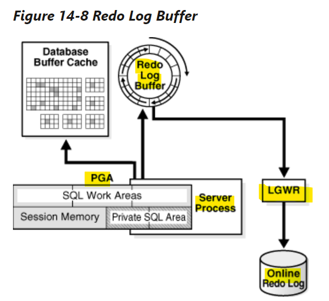
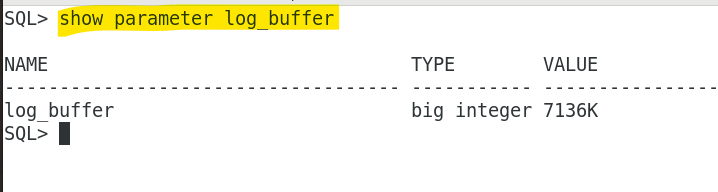

# DBA - SGA: Redo Log Buffer

[Back](../../index.md)

- [DBA - SGA: Redo Log Buffer](#dba---sga-redo-log-buffer)
  - [Redo Log Buffer](#redo-log-buffer)

---

## Redo Log Buffer

- `redo log buffer`

  - a **circular buffer** in the SGA that **stores redo entries** describing changes made to the database.

- `redo record`

  - a data structure that **contains the information necessary to reconstruct**, or **redo**, changes made to the database by DML or DDL operations.

- `Database recovery` applies `redo entries` to `data files` to **reconstruct** lost changes.

- The database processes **copy** `redo entries` from the <u>user memory space</u> to the <u>`redo log buffer`</u> in the SGA.

  - The `redo entries` take up **continuous, sequential space** in the buffer.

- The background process `log writer process (LGWR)` writes the `redo log buffer` to the `active online redo log group` on disk.

| Process    | From              | To                       |
| ---------- | ----------------- | ------------------------ |
| DB Process | user memory space | `redo log buffer`        |
| LGWR       | `redo log buffer` | `onlinve redo log group` |



---

- `DBW` vs `LGWR`对比

  - `DBW` performs **scattered** writes of data blocks to disk.
  - `LGWR` writes redo **sequentially** to disk

- **Scattered writes** tend to be much **slower** than **sequential writes**.

- parameter `LOG_BUFFER`:
  - specifies the **amount of memory** that Oracle Database uses when buffering redo entries.
  - Unlike other SGA components, the `redo log buffer` and `fixed SGA buffer` do not divide memory into granules.

```sql
SHOW PARAMETER LOG_BUFFER;
```



---

[TOP](#dba---sga-redo-log-buffer)
