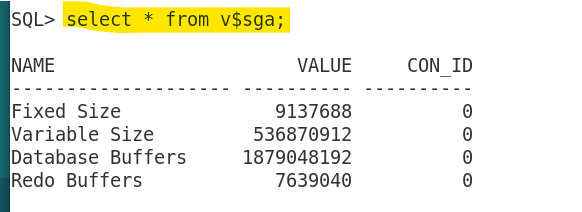
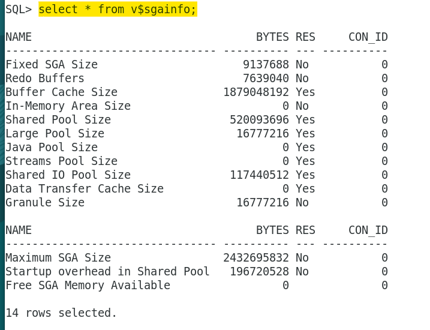
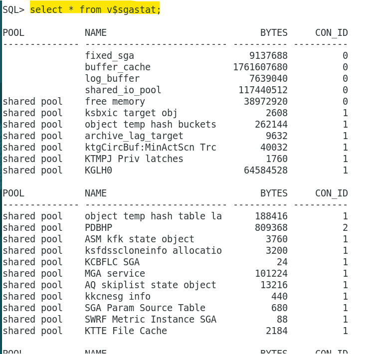

# DBA - Memory: SGA

[Back](../../index.md)

- [DBA - Memory: SGA](#dba---memory-sga)
  - [`System Global Area (SGA)`](#system-global-area-sga)
  - [Dynamic Performance views `v$`](#dynamic-performance-views-v)

---

## `System Global Area (SGA)`

- `SGA`

  - a read/write memory area
  - The `server` and `background processes` do **not reside** within the `SGA`, but exist in a separate memory space.

- `Granule`

  - units of **contiguous** memory in which all `SGA` components, **except** the `redo log buffer`, allocate and deallocate space.

- `Granule size` is platform-specific and is determined by `total SGA size`.

- vs `Database Instance`

  - SGA + BG processes
  - Each database `instance` has **its own** `SGA`.
  - Oracle Database **automatically allocates memory** for an SGA at instance **startup** and **reclaims the memory** at instance **shutdown**.

- vs processes
  - **All** `server processes` that execute <u>on behalf of users</u> can **read** information in the instance SGA.
  - **Several** processes **write** to the SGA during database operation.

---

## Dynamic Performance views `v$`

| Views       | Desc                     |
| ----------- | ------------------------ |
| `V$SGA`     | SGA summary information. |
| `V$SGAINFO` | size information         |
| `V$SGASTAT` | detailed information     |

---

[TOP](#dba---memory-sga)
