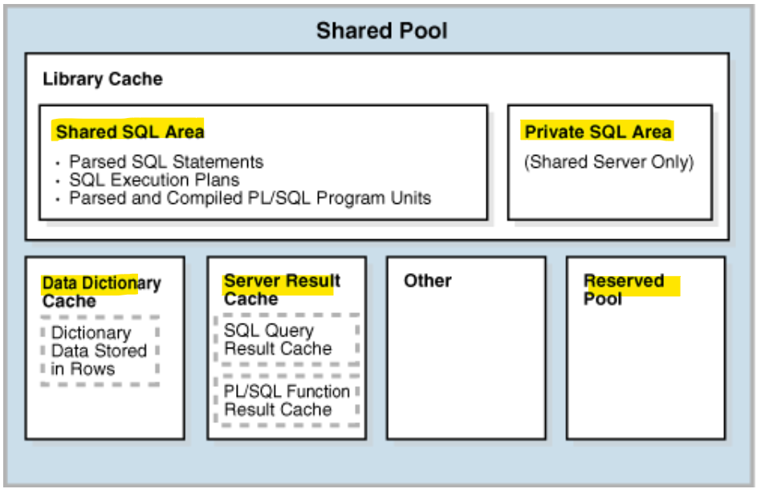
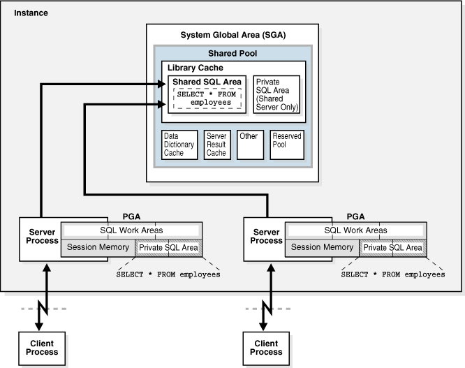

# DBA - SGA: Shared Pool

[Back](../../index.md)

- [DBA - SGA: Shared Pool](#dba---sga-shared-pool)
  - [Shared Pool](#shared-pool)
    - [Library Cache](#library-cache)
      - [Shared SQL Areas](#shared-sql-areas)
    - [Data Dictionary Cache](#data-dictionary-cache)
    - [Server Result Cache](#server-result-cache)
    - [Reserved Pool](#reserved-pool)

---

## Shared Pool

- `shared pool`

  - caches various types of **program data**.
  - e.g., stores parsed SQL, PL/SQL code, system parameters, and data dictionary information.
  - involved in **almost every operatio**n that occurs in the database.

---

### Library Cache

- `library cache`

  - a shared pool memory structure that **stores executable SQL and PL/SQL code**.
  - contains
    - the **shared SQL and PL/SQL areas**
    - **control structures** such as locks and library cache handles.

- In a **shared** server architecture, the library cache also contains `private SQL areas`.

- When a SQL statement is **executed**, the database attempts to **reuse previously executed code**.
  - `soft parse` / `library cache hit`
    - If a parsed representation of a SQL statement **exists** in the library cache and can be shared, then the database **reuses the code**.
  - `hard parse` / `library cache miss`
    - Otherwise, the database must **build a new executable version of the application code**.

---

#### Shared SQL Areas

- `shared SQL area`

  - used to **process the first occurrence** of a SQL statement.
  - accessible to all users
  - contains the `statement parse tree` and `execution plan`.

- SQL Statement vs area

  - **Only one** `shared SQL area` exists for a **unique statement**.
  - Each session issuing a **SQL statement** has a `private SQL area` in its `PGA`.

- `private sql area` vs `shared sql area`

  - Each user that submits the same statement has a `private SQL area` **pointing to** the same `shared SQL area`.
  - Thus, **many** `private SQL areas` in separate `PGAs` can be associated with the **same** `shared SQL area`.多对一

- **execution steps**:
  - 1. Checks the `shared pool` to see if a shared SQL area exists for a syntactically and semantically identical statement:
    - If an identical statement **exists**, then the database **uses** the shared SQL area for the execution of the subsequent new instances of the statement, thereby reducing memory consumption.
    - If an identical statement **does not exist**, then the database **allocates a new** `shared SQL area` in the shared pool. A statement with the same syntax but different semantics uses a child cursor.
    - In either case, the `private SQL area` for the user **points to** the `shared SQL area` that contains the statement and execution plan.
  - 2. **Allocates** a `private SQL area` on behalf of the session
    - The location of the `private SQL area` depends on the connection established for the session.与连接类型有关
      - If a session is connected through a **shared** server, then part of the `private SQL area` is kept in the `SGA`.

> a dedicated server architecture in which two sessions keep a copy of the same SQL statement in their own PGAs.
> In a shared server, this copy is in the UGA, which is in the large pool or in the shared pool when no large pool exists.

---

### Data Dictionary Cache

- `data dictionary`

  - a collection of **database tables and views** containing reference information about the **database**, its **structures**, and its **users**.

- Special memory locations are designated to hold dictionary data:

  - `Data dictionary cache` / `row cache`

    - holds information about **database objects**.

  - `Library cache`

- All `server processes` share these caches for access to `data dictionary` information.

---

### Server Result Cache

- `server result cache`
  - a memory pool within the shared pool.
  - holds **result sets** and **not data blocks**.
  - contains the `SQL query result cache` and `PL/SQL function result cache`, which share the same infrastructure.

---

### Reserved Pool

- `reserved pool`

  - a memory area in the shared pool that Oracle Database can use to **allocate large contiguous chunks of memory**.

- `Chunking`分块

  - allows large objects (over 5 KB) to be loaded into the cache without requiring a single contiguous area.
  - DB allocates memory from the shared pool **in chunks**.
    - DB reduces the possibility of **running out of contiguous memory** because of fragmentation.目的: 减少缺少连续内存的可能.

---

[TOP](#dba---sga-shared-pool)
