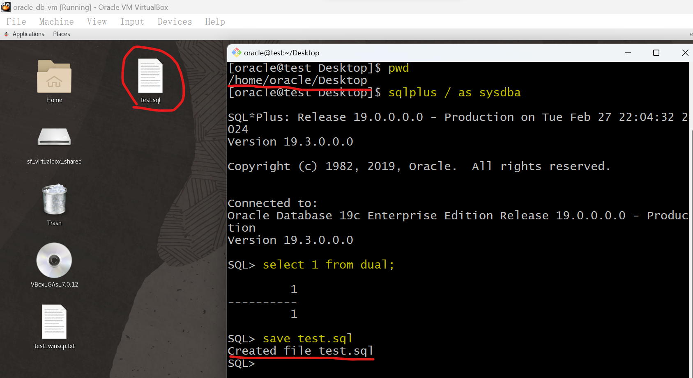
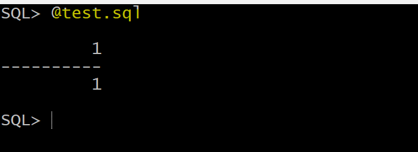
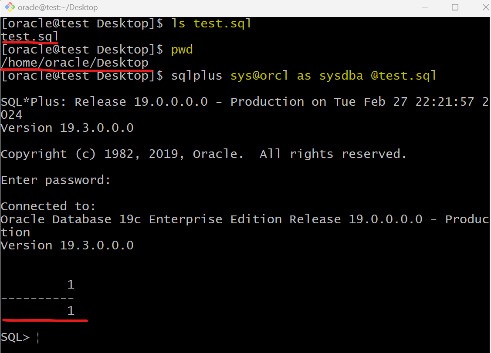

# DBA - Miscellaneous

[Back](../index.md)

- [DBA - Miscellaneous](#dba---miscellaneous)
  - [Run script in SQL\*PLUS](#run-script-in-sqlplus)

---

## Run script in SQL\*PLUS

- Save a line of command into a script.

```sql
select 1 from dual;         # any sql
save file_name              # the path will be thw pwd where login sqlplus.
```



---

- Run a script

```sql
@file_name
```



---

- Login and run script

```sh
cd target_path
sqlplus sys/pwd@tns_name file_name


# example
cd ~/Desktop
sqlplus sys@orcl @test.sql
```



---

[TOP](#dba---miscellaneous)
