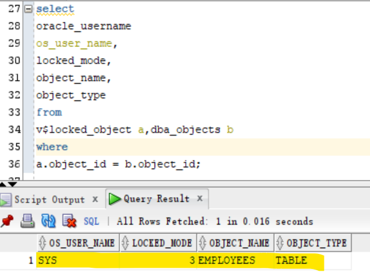

# DBA - Miscellaneous

[Back](../index.md)

- [DBA - Miscellaneous](#dba---miscellaneous)
  - [Run script in SQL\*PLUS](#run-script-in-sqlplus)
  - [Oracle Data Dictionary](#oracle-data-dictionary)
  - [Lab: Query Data Dictionary](#lab-query-data-dictionary)
  - [Dynamic Performance Views (v$ views)](#dynamic-performance-views-v-views)
    - [Lab: V$ view](#lab-v-view)
  - [Architecure](#architecure)
    - [Lab: Query the information about the database](#lab-query-the-information-about-the-database)
  - [Lab: V$CONTAINER](#lab-vcontainer)
  - [Lab: CDB\_PDBS](#lab-cdb_pdbs)

---

## Run script in SQL\*PLUS

- Save a line of command into a script.

```sql
select 1 from dual;         # any sql
save file_name              # the path will be thw pwd where login sqlplus.
```


---

- Run a script

```sql
@file_name
```


---

- Login and run script

```sh
cd target_path
sqlplus sys/pwd@tns_name file_name


# example
cd ~/Desktop
sqlplus sys@orcl @test.sql
```


---

## Oracle Data Dictionary

- `Oracle data dictionary`

  - the **metadata** about the database .
  - structured in tables and views.
  - maintained by oracle database server .
  - owned by SYS user.
  - Should never modified direct using SQL .

- Structure of Data Dictionary

| Data Dictionary | Objects                            | User          |
| --------------- | ---------------------------------- | ------------- |
| `CDB_`          | in the CDB **and** PDBs            | DBA account\* |
| `DBA_`          | in a container **or** PDB          | DBA account\* |
| `ALL_`          | **accessible** by the current user | any user      |
| `USER_`         | **owned** by current user          | any user      |

- DBA account\*:

  - sysdba privilege
  - select any dictionary privilege
  - SELECT_CATALOG_ROLE role

- If a PDB is close, the `CDB_` only returns objects in **opened PDBs**.
- If the current session is in a PDB, `CDB_` only returns the objects in the current `PDB`.
- 重点: 易错. `CDB_`, `DBA`与 session 有关.

  - session = root:
    - `CDB_`: root + **opened pdb**
    - `DBA_`: root
  - session = pdb:
    - `CDB_`: pdb
    - `DBA_`: pdb

- Not everthing contains `ALL_` or `USER_`.
  - e.g., `ALL_data_files` or `USER_data_files` does not exist. Because the user does not need to know the data file. only the dba does. So the `CDB_DATA_FILES` and `DBA_DATA_FILES` exist.

---

## Lab: Query Data Dictionary

- Connect as sys using SQL Developer
- Make sure the PDB is open;

```sql
show con_name
#CON_NAME
#------------------------------
#CDB$ROOT

select con_id,name,open_mode from v$pdbs;
#2	PDB$SEED	READ ONLY
#3	ORCLPDB	READ WRITE

--make sure that the pluggable database is open
alter pluggable database ORCLPDB open;
```

- Query `CDB_` Dict

```sql
--this will show all the tables in the CDB and PDBS
select owner,table_name,con_id from cdb_tables
order by 1,2;

--count of tables per container
SELECT con_id, COUNT(table_name)
FROM cdb_tables
GROUP BY con_id;

```

- Query `DBA_`

```sql
show con_name
-- root

-- return the current container
SELECT  COUNT(table_name)
FROM DBA_tables;

# change session to PDB
ALTER session set container=ORCLPDB;

show con_name
#CON_NAME
#------------------------------
#ORCLPDB

# return the PDB container
SELECT  COUNT(table_name)
FROM DBA_tables;

alter session set container=cdb$root;

show con_name

```

---

## Dynamic Performance Views (v$ views)

- `Dynamic Performance Views` / `v$ views`:

  - a set of underlying **views that are maintained by the server** and **accessible** to the database administrator user `SYS`.
  - **continuously updated** while a database **is open and in use**.
  - contents relate primarily to **performance**.

- Identified:

  - `Dynamic performance views` are **identified** by the prefix `V_$`.
  - **Public synonyms** for these views have the prefix `V$`.

- Availability:

  - Once the instance is **started**, the `V$` views that read **from memory** are **accessible**. 内存的, 实例启动即可
  - Views that read data **from disk** require that the database be **mounted**.磁盘的, 需要 mounted, 即读取 cf 之后.

- The dynamic performance views are used by `Enterprise Manager` and `Oracle Trace`, which is the primary interface for accessing information about system performance

---

### Lab: V$ view

- Connect using sql developer
- Change to PDB

```sql
show con_name

alter pluggable database orclpdb open;

alter session set container=orclpdb;

show con_name

```

- Query the locked object using v$ view
  - query use join
    - `v$locked_object` show the locked object
    - `dba_objects` shows details of the locked oject
  - no row returns

```sql

select
oracle_username
os_user_name,
locked_mode,
object_name,
object_type
from
v$locked_object a,dba_objects b
where
a.object_id = b.object_id
```

- Update a row but not commit
  - due to update, the uncommit rows is lock.
  - lock mode is 3, means a partial lock, the updated row is lock.

```sql
select * from hr.employees;

# update a row
update hr.employees
set salary=salary+1
where employee_id=100;

select
oracle_username
os_user_name,
locked_mode,
object_name,
object_type
from
v$locked_object a,dba_objects b
where
a.object_id = b.object_id;
```



---

- rollback change
  - due to roll back, the lock release.
  - no row returns.

```sql
rollback;

select
oracle_username
os_user_name,
locked_mode,
object_name,
object_type
from
v$locked_object a,dba_objects b
where
a.object_id = b.object_id
```

---

## Architecure

multi-tennant

---

### Lab: Query the information about the database

- Query DB name

```sql
select name,cdb,con_id ,OPEN_MODE
from V$DATABASE;

show parameter db_name;
```


---

- Query Oracle Database version

```sql
select banner from v$version;
```


---

- Query instance name

```sql
select *
from v$instance;

show parameter instance_name;
```


---

## Lab: V$CONTAINER

- V$CONTAINERS:
  - displays information about PDBs and the root associated with the current instance

---

- Query container information in root

```sql
show con_name;

select con_id,name,open_mode from V$CONTAINERS;
```


---

- Change session to pdb
- Query container information in pdb
  - only return the information in the current pdb.

```sql
alter session set container=orclpdb;

select con_id,name,open_mode from V$CONTAINERS;
```


---

## Lab: CDB_PDBS

- the status column
- some imprtant status:
  - NEW - The PDB has never been opened since it was created
  - NORMAL - The PDB is ready to be used.
  - UNPLUGGED - The PDB has been unplugged. The only operation that can be performed on it is DROP PLUGGABLE DATABASE.
  - RELOCATING: The PDB is in the process of being relocated to a different CDB.
  - RELOCATED: The PDB has been relocated to a different CDB.

---

- Query pdb infomation on root

```sql
show con_name

select pdb_id,pdb_name, status
from cdb_PDBS;
```


---

- Query pdb infomation on pdb

```sql
alter session set container=orclpdb;

show con_name;

select pdb_id,pdb_name, status
from cdb_PDBS;

```


---

[TOP](#dba---miscellaneous)
